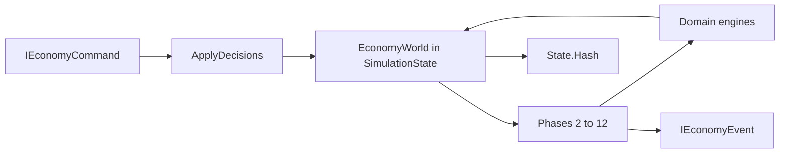

# Economy kernel (generic commerce base)

## Goal

Evolve [`novolis-economy`](d:\novolis\novolis-economy) from record-only stubs into a **working economic kernel**: firms hold cash and inventory, recipes produce goods, logistics moves lots, cohorts buy at posted prices, and accounting posts double-entry entries—all driven by the existing 12 hourly phases and command/event model.

**Locked preference (when tradeoffs appear):** general commerce / institutional economics vocabulary and conservation of money & goods over game-feel mechanics (no XP, morale meters, opaque multipliers, or quest loops).

**Out of scope this pass:** AI firm controllers, UI/host, workspaces, soft loans / bankruptcy drama, full general-equilibrium solver, food-only content packs (a **generic multi-stage chain fixture** is used in tests only).

## Architecture

Keep the package graph; put **mutable world state** on the simulation and **pure domain engines** in domain packages.



- [`Novolis.Economy`](d:\novolis\novolis-economy\src\Novolis.Economy) — IDs, values, commands/events, RNG (extend)
- Domain packages — catalogs + **stateless/services** that mutate world slices passed in
- [`Novolis.Economy.Simulation`](d:\novolis\novolis-economy\src\Novolis.Economy.Simulation) — `EconomyWorld`, phase wiring, hash over world fingerprint

## World model (`Simulation`)

Replace empty `SimulationState` with an owned `EconomyWorld`:

| Slice | Contents |
|-------|----------|
| Catalog | `ProductDefinition` map, process metadata |
| Agents | Firms (`FirmId`, name), facilities, operating units |
| Money | Per-firm cash + chart of accounts balances |
| Stock | Inventories keyed by `(FirmId, InventoryLocationId, ProductId)` as FIFO `ProductBatch` lots |
| Commerce | Posted retail prices, open purchase/sales orders, open invoices |
| Logistics | `FreightRoute`s + in-flight `Shipment`s (hours remaining) |
| Demand | `ConsumerCohort`s with budgets and `PreferenceProfile` |
| Market | Per-product last trade price/volume → feeds `MarketEstimate` |
| Policy | Optional wage rate, period length (hours), spoilage on/off |

Seed via `EconomyWorldBuilder` / `Scenario` factory (test + docs), not hard-coded food names in library APIs.

**Hashing:** extend FNV hash to include clock, RNG, cash totals, inventory totals (quantity+unit cost), open shipment count, posted price map, and event count—so identical seeds+commands stay bit-stable.

## Commands and events (core)

Keep `SetRetailPrice` / `RetailPriceChanged`. Add minimal command set applied in `ApplyDecisionsPhase`:

- `RegisterFirm` / `RegisterFacility` / `RegisterProduct` (or builder-only registration + runtime commands for prices/targets)
- `SetProductionPlan(Firm, Facility, Product, Quantity ratePerHour)`
- `PlaceProcurementOrder(Buyer, SellerOrExogenous, Product, Quantity, MaxUnitPrice)`
- `IssueShipment(Firm, Route, Product, Quantity)` (or auto from acquire/restock)
- `SetWageBill` / labor allocation targets if needed

Events for each material mutation: `InventoryTransferred`, `BatchProduced`, `GoodsSold`, `InvoicePosted`, `InvoiceSettled`, `WagesPaid`, `ShipmentDeparted` / `ShipmentDelivered`, `MarketTradeObserved`, `AccountingPeriodClosed`.

## Domain engines (real behavior)

### Production
- `ProductionEngine.TryProduce(world, firm, facility, product, hours, laborHours)`: consume recipe inputs from facility storage lots (FIFO), create output `ProductBatch` with unit cost = input costs (+ wage allocation if labor costed), respect operating-unit capacity and plan rate.
- Spoilage: if `ShelfLife` set, scrap expired lots at start of tick or in production/restock phase (deterministic by `ProducedAt` + clock).

### Logistics
- `LogisticsEngine`: create shipments from stock, decrement hours each Transport phase, on delivery merge into destination inventory.
- Routes are data; travel time in hours on `FreightRoute` (add field if missing).

### Markets
- Replace null-only intelligence with `ObservedMarketBook`: update on trades; `IMarketIntelligenceService` returns estimates from book (price, volume, simple trend, uncertainty ↓ with volume).
- No speculative AI; clearing is **posted-price / stock-constrained** retail against cohort demand (simple, auditable).

### Population
- `DemandEngine`: each cohort spends up to budget on preferred categories using preference weights × affordability (`price` vs willingness); buy from firms with posted retail stock; emit sales + reduce stock + raise invoices/cash.
- Prefer **budget + preferences** over satisfaction scores.

### Accounting
- Double-entry `Ledger` service: post inventory, COGS, sales revenue, cash, wages, AP/AR.
- `SettleInvoicesAndWagesPhase` pays due invoices and accrued wages when cash allows (partial pay OK, deterministic order by id).
- `CloseAccountingPeriod` when `Clock.HourIndex % PeriodHours == 0`: snapshot period totals event (full P&amp;L later).

### Labor (thin but real)
- `AllocateLaborPhase`: distribute available labor hours to manufacturing units proportional to plans / capacity; unused capacity reduces output. Wage accrual per allocated hour.

### Research / expectations (lightweight)
- `ApplyResearchProgress`: if firm has research budget line, accumulate process efficiency factor (bounded); default no-op when unset.
- `UpdateExpectations`: refresh market estimates from book.
- Avoid fake “tech trees”; treat as productivity coefficient only.

## Phase wiring

Refactor [`StubPhases.cs`](d:\novolis\novolis-economy\src\Novolis.Economy.Simulation\Phases\StubPhases.cs) so each phase calls the corresponding engine; keep `PhaseExecuted` diagnostics **optional** (tests can assert domain events instead).

`ApplyDecisionsPhase` must **apply** commands (not discard): e.g. `SetRetailPrice` writes price map + `RetailPriceChanged`.

## Scenario / tests

Add `tests/Novolis.Economy.Unit/Scenarios/CommodityChainScenario.cs` (generic names: Raw → Intermediate → Finished):

1. Build world: one producer firm, one retailer (or vertically integrated), one cohort, recipes, routes, initial cash/stock.
2. Advance N hours with production plans + prices set via commands.
3. Assert: stock moves through chain, cash conserved (firm+cohort+unsettled), ledger balances (assets = liabilities + equity), identical seed → identical `Hash`.
4. Keep existing phase-order / constructibility tests; update ones that assumed discard-only commands.

## Docs

Update [`docs/design.md`](d:\novolis\novolis-economy\docs\design.md) and [`docs/concept.md`](d:\novolis\novolis-economy\docs\concept.md): world model, phase responsibilities, determinism/hash fields, explicit non-goals (UI, AI, gamification). Add short getting-started snippet for builder + `AdvanceAsync`.

## Verification

```powershell
cd d:\novolis\novolis-economy
dotnet build Novolis.Economy.slnx -c Release
dotnet test --project tests/Novolis.Economy.Unit -c Release
dotnet pack Novolis.Economy.slnx -c Release -o artifacts/packages
```

Publish to GPR via existing merge workflow after push to `main` (nuget.org + github only).

