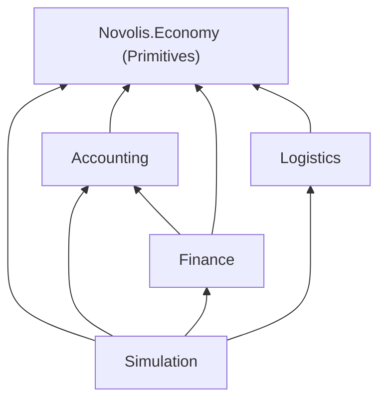

# Lift fundamentals into Economy Primitives

## Locked decisions

- **PackageId stays `Novolis.Economy`** (no `.Primitives` NuGet rename this pass). Brand it as the **Primitives** package in Description, READMEs, and design docs.
- **Namespace stays `Novolis.Economy`** for moved types (dogfood `using`s keep working).
- **Move into root:** `LegalEntity` / `LegalEntityKind`, `OwnershipClaim`, `TransportHubId` / `TransportCorridorId` / `VehicleClassId`.
- **Stay put:** `OwnershipEngine` (Accounting), loan/shipment models, `FacilityBinding`, engines, Simulation world/phases.
- NuGet-only publish + dogfood restore; no local feeds.

## 1. Move types into root package

**Party / claims**

- Move [`LegalEntity.cs`](novolis-economy/src/Novolis.Economy.Simulation/LegalEntity.cs) → [`src/Novolis.Economy/LegalEntity.cs`](novolis-economy/src/Novolis.Economy/LegalEntity.cs), namespace `Novolis.Economy`.
- Split [`OwnershipModels.cs`](novolis-economy/src/Novolis.Economy.Accounting/OwnershipModels.cs): move `OwnershipClaim` class to e.g. `src/Novolis.Economy/OwnershipClaim.cs`; leave `OwnershipEngine` in Accounting (update usings).
- Delete old Simulation `LegalEntity.cs`; fix Simulation/Accounting references (`EconomyWorld.Entities`, `DefaultConsequenceEngine`, `EnsureCivic`, tests).

**Logistics IDs**

- Append `TransportHubId`, `TransportCorridorId`, `VehicleClassId` to [`Identifiers.cs`](novolis-economy/src/Novolis.Economy/Identifiers.cs) (same `From`/`ToString` pattern as `FirmId`).
- Remove those structs from [`LogisticsModels.cs`](novolis-economy/src/Novolis.Economy.Logistics/LogisticsModels.cs); keep hub/corridor/vehicle **models** there (they already use `Novolis.Economy`).

## 2. Package metadata (Primitives branding)

Update each packable csproj `<Description>` to state layer role; root especially:

| Package | Description thrust |
|---------|-------------------|
| [`Novolis.Economy.csproj`](novolis-economy/src/Novolis.Economy/Novolis.Economy.csproj) | **Primitives:** IDs, money/qty/time, party (`LegalEntity`), ownership claims, command/event markers, RNG |
| Accounting | Ledgers, invoices, ownership *engine* (claims live in Primitives) |
| Finance / Markets / Production / Logistics / Population | Unchanged role; Logistics note “IDs in Primitives” |
| Simulation | World + phases; holds entity/claim collections, does not define those types |
| Agents | Unchanged |

## 3. Docs / READMEs

- [`docs/design.md`](novolis-economy/docs/design.md): package split table — rename conceptual row to **Primitives** (`Novolis.Economy` package); document party/claim/logistics IDs; DAG note Simulation is composition only.
- [`docs/release.md`](novolis-economy/docs/release.md): short “Primitives lift” bullet.
- Root [`README.md`](novolis-economy/README.md) package index + intro: call out Primitives package.
- Per-package READMEs under `src/*/README.md` — especially [`Novolis.Economy/README.md`](novolis-economy/src/Novolis.Economy/README.md), Accounting, Logistics, Simulation — one paragraph each on what lives where after the lift.

## 4. Tests, publish, dogfood

- `dotnet test` Economy unit suite (Ownership/Default, Finance, logistics scenarios).
- Commit/push `novolis-economy` → GPR `2026.1.*`.
- Dogfood: restore (types stay in `Novolis.Economy` namespace — NearSol/Tramp should compile with package bump only); quick headless smoke if NearSol builds; `verify-nuget-only.ps1`; push dogfood if any ref/doc touch needed.

## Out of scope

- PackageId rename to `Novolis.Economy.Primitives`
- Moving `LoanStatus` / shipment phase enums / `FacilityBinding` / C/E dump split
- Creating `Economy.Abstractions`

