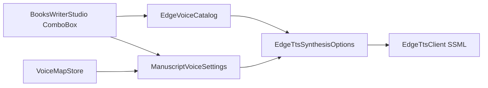

# EdgeTTS typesafe voices and profiles

## Defaults (clean break)

Match [`D:\repos\books\tools\audio\voice-map.yaml`](D:\repos\books\tools\audio\voice-map.yaml):

- Voice: `en-US-AvaNeural` → `EdgeVoice.EnUsAva`
- Rate: `-4`, Pitch: `0`, Volume: `0`
- Scene break: `1200` ms; max chunk: `2800` chars
- Replace `EdgeTtsConstants.DefaultVoice` / EmmaMultilingual as the package default

## Architecture



- **Closed set at compile time:** `EdgeVoice` enum + catalog metadata for dropdowns
- **Open set only at the wire:** `ShortName` / SSML full name formatted inside `EdgeTtsClient`
- **Keep** existing remote DTO [`EdgeVoiceInfo`](novolis-audio/src/Novolis.Audio.Voice.EdgeTts/EdgeVoiceInfo.cs) for `ListVoicesAsync`; curated rows are a separate type `EdgeVoiceEntry` (same pattern as `KokoroVoiceEntry`)

## 1. EdgeTts library types

In [`Novolis.Audio.Voice.EdgeTts`](novolis-audio/src/Novolis.Audio.Voice.EdgeTts/):

| Type | Role |
|------|------|
| `EdgeVoice` | Enum: `EnUsAva`, `EnUsJenny`, `EnUsAndrew`, `EnUsBrian`, `EnUsEmma`, `EnGbSonia`, `EnGbRyan`, `EnAuNatasha` |
| `ProsodyPercent` / `ProsodyHertz` | `readonly record struct` with `int Value`; `ToSsml()` → `±N%` / `±NHz` |
| `EdgeVoiceGender` | `Female` / `Male` |
| `EdgeVoiceEntry` | `Voice`, `ShortName`, `DisplayName`, `Locale`, `Gender` |
| `EdgeVoiceCatalog` | Static `All`, `Get`, `ToShortName`, `TryParse(shortName)` — seed from books `CommonVoices` |
| `EdgeVoiceProfile` | `Id`, `DisplayName`, `Voice`, rate/pitch/volume, `SceneBreakMs`, `PauseMs` |
| `EdgeVoiceProfiles` | Built-in `Narrator` (Ava/−4/1200); `All` list for preset dropdown later |

Change [`EdgeTtsSynthesisOptions`](novolis-audio/src/Novolis.Audio.Voice.EdgeTts/EdgeTtsSynthesisOptions.cs) to typed properties only (no public string Voice/Rate/Pitch/Volume). Client formats via catalog + `ToSsml()` when building SSML; drop regex `ValidateProsody` for the typed path.

Update [`EdgeTtsClient`](novolis-audio/src/Novolis.Audio.Voice.EdgeTts/EdgeTtsClient.cs), [`README.md`](novolis-audio/src/Novolis.Audio.Voice.EdgeTts/README.md), and unit tests.

## 2. Manuscript settings

Update [`ManuscriptVoiceSettings`](novolis-audio/src/Novolis.Audio.Voice.Manuscript/ManuscriptVoiceSettings.cs):

- `EdgeVoice Voice` (default `EnUsAva`)
- `ProsodyPercent` / `ProsodyHertz` for rate/volume/pitch (defaults −4 / 0 / 0)
- Add `MaxChunkChars` (default 2800); map into `ToSpeechOptions()` if planner already uses it
- `ToEdgeTtsOptions()` maps typed fields
- Factory: `ManuscriptVoiceSettings.FromProfile(EdgeVoiceProfiles.Narrator)` (+ pronunciation overlay)

## 3. VoiceMapStore — books nested YAML (required for clean break)

Today [`VoiceMapStore`](novolis-audio/src/Novolis.Audio.Voice.Manuscript/VoiceMapStore.cs) expects flat camelCase and **ignores** `narrator:` / `pauses:` / `generation:` — loading books YAML keeps Emma/+0% defaults.

Rewrite DTO to nested shape matching books tools:

```yaml
narrator:
  voice: en-US-AvaNeural   # short name in file
  rate: "-4%"
  pitch: "+0Hz"
  volume: "+0%"
pauses:
  scene_break_ms: 1200
generation:
  max_chunk_chars: 2800
pronunciation:
  Ixa: "Ick-sah"
```

- Load: parse nested sections; `EdgeVoiceCatalog.TryParse` short name → enum (unknown voice → throw clear error; no silent Emma fallback)
- Save: write nested books-compatible YAML; preserve pronunciation map; use snake_case keys books already uses
- Round-trip test against a fixture copied from books `voice-map.yaml` structure

## 4. BooksWriterStudio UI

In [`MainWindow.cs`](novolis-apps/src/BooksWriterStudio/MainWindow.cs) Voice tab:

- Replace free-text `_voiceId` with `ComboBox` bound to `EdgeVoiceCatalog.All` (`DisplayMemberBinding` / `DisplayName`)
- Rate / pitch / volume: integer fields (NumericUpDown or TextBox + int parse), same UX as books-writer sliders conceptually — not `"+-4%"` strings
- Optional small profile ComboBox seeded with `EdgeVoiceProfiles.All` (selecting Narrator resets knobs); working copy remains `ManuscriptVoiceSettings`
- Load/save through updated `VoiceMapStore` only

## 5. Tests and docs

- [`EdgeTtsClientTests`](novolis-audio/tests/Novolis.Audio.Unit/EdgeTtsClientTests.cs): Ava normalize; typed bad-rate impossible — test `ProsodyPercent.ToSsml` / catalog parse instead
- [`ManuscriptAudiobookTests`](novolis-audio/tests/Novolis.Audio.Unit/ManuscriptAudiobookTests.cs): typed settings + nested YAML round-trip; fixture with Ava/−4
- Update Manuscript / EdgeTts READMEs (drop Emma examples; document nested voice-map)

## Out of scope

- Enumerating the full remote Edge catalog
- Character cast / multi-speaker maps
- Changing `generate-audiobook.cs` in `D:\repos\books` (YAML stay compatible so both tools can share the file)

## Done check

- `dotnet test` on `Novolis.Audio.Unit` green
- Loading books-shaped YAML yields Ava / −4 / pronunciation
- Studio Voice tab is ComboBox + ints; save writes nested YAML
- `pwsh -File novolis-governance/scripts/verify-nuget-only.ps1` exit 0 (no local feeds)
