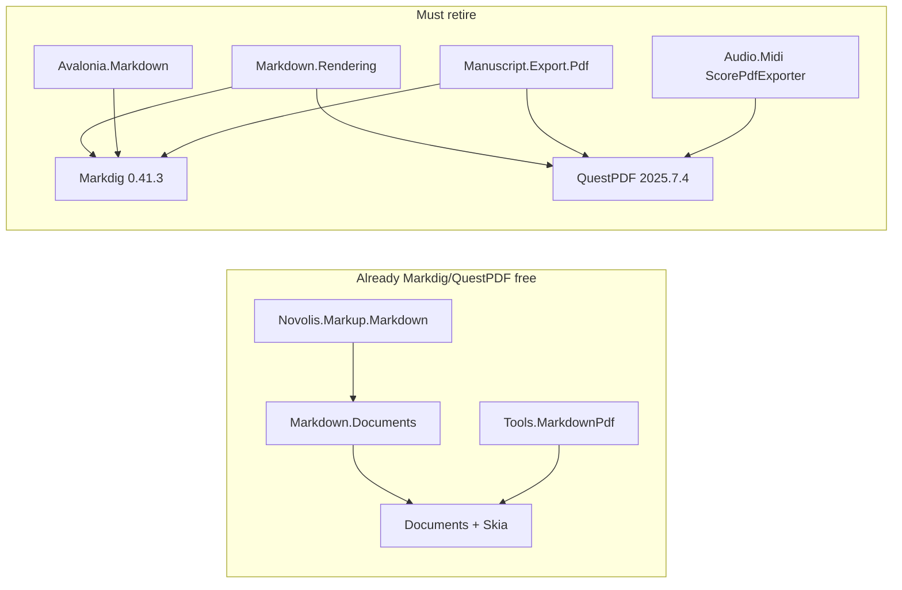
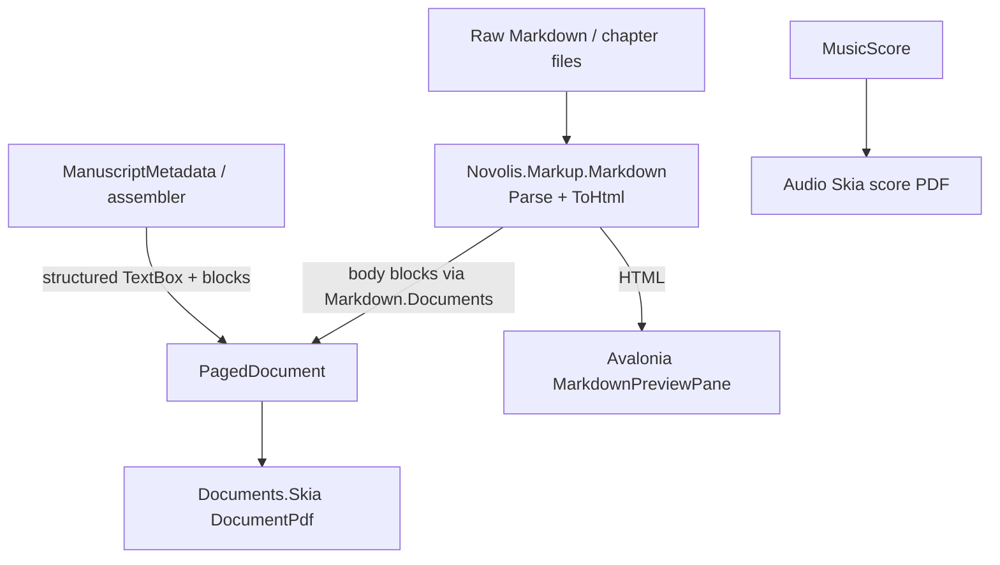
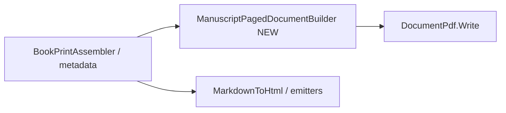

# End QuestPDF and Markdig across Novolis

## Definition of done

No `PackageReference` / `PackageVersion` for `QuestPDF` or `Markdig` remains under `d:\novolis`. No `using QuestPDF` / `using Markdig` in product or test code. CI and `verify-nuget-only` stay green. BooksWriterStudio, manuscript `print`, Avalonia markdown preview, `novolis-mdpdf`, and MIDI score PDF all run without those packages.

## Current dependency map

**Live producers today**

| Surface | Repo / project | Stack |
| --- | --- | --- |
| Books + reference PDF/HTML/TXT | [Novolis.Manuscript.Export.Pdf](d:\novolis\novolis-manuscript\src\Novolis.Manuscript.Export.Pdf) | Markdig AST + QuestPDF |
| Generic MD PDF/HTML | [Novolis.Markup.Markdown.Rendering](d:\novolis\novolis-markup\src\Novolis.Markup.Markdown.Rendering) | Markdig + QuestPDF |
| Studio GFM preview | [Novolis.Avalonia.Markdown](d:\novolis\novolis-avalonia\src\Novolis.Avalonia.Markdown) | Markdig HTML + Mermaid |
| Score PDF | [ScorePdfExporter.cs](d:\novolis\novolis-audio\src\Novolis.Audio.Midi\ScorePdfExporter.cs) | QuestPDF + SVG |
| Orphan ref | [MusicMakerLab.csproj](d:\novolis\novolis-dogfooding\apps\avalonia\MusicMakerLab\MusicMakerLab.csproj) | QuestPDF unused |

## Target architecture

**Ownership decisions (fixed)**

1. **All prose/report/book PDF** → `Novolis.Documents` + `.Layout` + `.Skia` only. Never reintroduce QuestPDF.
2. **Sole Markdown engine** → grow [`Novolis.Markup.Markdown`](d:\novolis\novolis-markup\src\Novolis.Markup.Markdown) (Parse AST + `MarkdownToHtmlConverter`). Markdig is not replaced by a different third-party parser.
3. **Manuscript print** maps **domain → `PagedDocument`** (metadata panels from `ManuscriptMetadata`, not Markdig `QuoteBlock` detection). Assembled reader `.md` may keep `> [!tag]` for human files, but PDF must not require Markdig quote merging.
4. **Score PDF** stays in `Novolis.Audio.Midi`, rewritten to **SkiaSharp `SKDocument`** (reuse existing SVG builders via Svg.Skia or draw with SKCanvas). Do **not** force scores through the one-column `PagedDocument` model.
5. **`MarkdownPdfExporter` (QuestPDF)** is deleted; callers use `MarkdownDocumentPdfExporter` / `novolis-mdpdf`.
6. **`Novolis.Markup.Markdown.Rendering`** becomes Markdig/QuestPDF-free HTML helpers over Novolis MD, or is folded into `Novolis.Markup.Markdown` / deleted once Avalonia and manuscript HTML move — end state: package either gone or thin and Markdig-free.

---

## Phase 0 — Guardrails (governance + inventory lock)

- Add a short policy note under [novolis-governance](d:\novolis\novolis-governance\docs) (or extend nuget/library docs): **QuestPDF and Markdig are forbidden**; PDF = Documents/Skia; Markdown = `Novolis.Markup.Markdown`.
- Optional analyzer / script check listing banned package IDs (same spirit as layer-boundary verify).
- Update [documents-vs-questpdf canvas](C:\Users\frank\.cursor\projects\d-novolis\canvases\documents-vs-questpdf.canvas.tsx) status as phases land (tracking only).

---

## Phase 1 — Quick kills (same week)

- Remove unused QuestPDF `PackageReference` from MusicMakerLab.
- Retarget any remaining samples/docs that advertise `MarkdownPdfExporter` to Documents / `novolis-mdpdf`.
- Delete or obsolete [`MarkdownPdfExporter.cs`](d:\novolis\novolis-markup\src\Novolis.Markup.Markdown.Rendering\MarkdownPdfExporter.cs) and its tests; drop QuestPDF from Markup.Rendering CPM once no other file in that package uses it.
- Strip redundant `QuestPDF.Settings` bootstrap from [BooksWriterStudio Program.cs](d:\novolis\novolis-apps\src\BooksWriterStudio\Program.cs) only after Export.Pdf no longer needs the package (Phase 3 end) — until then leave it.

**Exit:** Markup no longer references QuestPDF. Dogfood/tools already Documents-only.

---

## Phase 2 — Grow Novolis Markdown + Documents blocks

Work in [novolis-markup](d:\novolis\novolis-markup) and [novolis-documents](d:\novolis\novolis-documents).

**Parser / HTML (`Novolis.Markup.Markdown`)** — expand `MarkdownDocument.Parse` + HTML converter to cover what manuscript + Avalonia actually need:

- Fenced / indented code blocks
- Thematic breaks (`---`)
- Pipe tables (already partial) with stable cell model
- Nested lists depth used in books/reference
- Inline emphasis, code spans, links (AST runs — required for preview HTML; PDF may still flatten to plain until Documents gains inline runs)
- Callout / `> [!tag] value` as first-class nodes (not only mapper heuristics)
- Keep Mermaid as Avalonia HTML post-process (no Markdig required)

**Documents blocks** (close books/reference gaps from prior analysis):

- `CodeBlock` (mono + fill) in model + paginator + Skia
- First-class or improved list placement (hanging indent), not only `•` paragraphs
- Mapper updates in [MarkdownPagedDocumentMapper](d:\novolis\novolis-markup\src\Novolis.Markup.Markdown.Documents\MarkdownPagedDocumentMapper.cs)
- Themes in [MarkdownPdfThemes](d:\novolis\novolis-tools\src\Novolis.Tools.MarkdownPdf) pick up code/list styling

**Exit:** Golden tests: Calypso chapter-144 + a reference-manual fixture through `Markdown.Documents` match acceptance A1–A3 shape (cover/TOC/chapter breaks/footers/metadata TextBox/tables/code).

---

## Phase 3 — Manuscript off Markdig + QuestPDF

Work in [novolis-manuscript](d:\novolis\novolis-manuscript).

1. Add **`ManuscriptPagedDocumentBuilder`** in `Export.Pdf` (or sibling package) that builds `PagedDocument` from assembled chapters + `ManuscriptPrintSettings` (trim 6×9, cover, TOC, H1 breaks, footer `{page}`, metadata → `TextBoxBlock` from structured tags — port logic from [ChapterMetadata*](d:\novolis\novolis-manuscript\src\Novolis.Manuscript.Export.Pdf) / [QuestPdfBlockRenderer](d:\novolis\novolis-manuscript\src\Novolis.Manuscript.Export.Pdf\QuestPdfBlockRenderer.cs) without Markdig types).
2. Body markdown: `MarkdownDocument.Parse` → existing Documents mapper (not Markdig walk).
3. Dual-run behind env/CLI flag (`NOVOLIS_MANUSCRIPT_PDF=documents` or `--engine documents`) with QuestPDF default until goldens pass; then **flip default** to Documents; then **delete** `QuestPdfDocuments`, `QuestPdfBlockRenderer`, Markdig pipeline files, and PackageReferences.
4. Retarget HTML/TXT companions in [ManuscriptDocumentEmitters](d:\novolis\novolis-manuscript\src\Novolis.Manuscript.Export.Pdf\ManuscriptDocumentEmitters.cs) to Novolis MD HTML/plain (port `PlainTextRenderer` onto Novolis AST).
5. Rewrite unit tests that `Markdown.Parse` Markdig or assert QuestPDF-only branches; keep behavioral tests (PDF magic bytes, metadata in HTML, list/table TXT, page count smoke on Calypso folder).
6. [Export.Markdown](d:\novolis\novolis-manuscript\src\Novolis.Manuscript.Export.Markdown) stops depending on Markdig Rendering HTML; use Novolis `ToHtml`.

**Exit:** `Novolis.Manuscript.Export.Pdf` and unit tests have zero Markdig/QuestPDF refs. BooksWriterStudio + `manuscript-cli print` produce Documents PDFs.

---

## Phase 4 — Avalonia preview off Markdig

Work in [novolis-avalonia](d:\novolis\novolis-avalonia).

- Rewrite [MarkdownPreviewPipeline](d:\novolis\novolis-avalonia\src\Novolis.Avalonia.Markdown) to `MarkdownDocument.Parse` → `MarkdownToHtmlConverter` + existing Mermaid rewrite.
- Drop Markdig from Avalonia CPM / csproj.
- Adjust preview tests to Novolis HTML (GFM subset parity for tables/code/lists/headings used in studios).

**Exit:** `Novolis.Avalonia.Markdown` Markdig-free.

---

## Phase 5 — Score PDF off QuestPDF

Work in [novolis-audio](d:\novolis\novolis-audio).

- Replace QuestPDF page chrome in `ScorePdfExporter` with SkiaSharp PDF pages (landscape A4, header/footer, multi-page systems).
- Keep orchestral / piano-roll SVG generation; render via Svg.Skia into the PDF canvas (same approach Documents uses for SVG images).
- Remove QuestPDF from Audio.Midi + MusicMakerLab leftovers; drop `EnsureCommunityLicense`.
- Update audio unit tests for byte/file export.

**Exit:** No QuestPDF in novolis-audio / apps CPM.

---

## Phase 6 — Package retirement and org cleanup

- Delete or gut Markdig/QuestPDF surfaces in `Markdown.Rendering`; update [novolis-markup README](d:\novolis\novolis-markup\README.md) and package docs.
- Remove `PackageVersion` entries from: manuscript, markup, avalonia, audio, apps, dogfooding `Directory.Packages.props`.
- Grep gate: zero hits for `QuestPDF` / `Markdig` package IDs outside historical docs/plans (or mark plans superseded).
- Publish bumped packages via normal main push → GPR; consumers restore nuget.org + GitHub only.
- Run `pwsh -File d:\novolis\novolis-governance\scripts\verify-nuget-only.ps1` and platform ProjectRef build of affected slnx.

---

## Suggested execution order and ownership

| Phase | Primary repos | Unblocks |
| --- | --- | --- |
| 1 | markup, dogfooding | QuestPDF count ↓ |
| 2 | markup, documents, tools | Books-grade fidelity |
| 3 | manuscript, apps | Largest QuestPDF+Markdig surface |
| 4 | avalonia | Last Markdig product surface |
| 5 | audio | Last QuestPDF product surface |
| 6 | all CPM + docs | Definition of done |

Do **not** route books through the old Markup `MarkdownPdfExporter` at any step. Do **not** put book/domain flags into `Novolis.Documents` public API — keep manuscript chrome in manuscript builder + Documents primitives.

## Main risks (accept and mitigate)

- **Parser fidelity:** Novolis MD must reach “good enough GFM” for Calypso + studio preview or Phase 3/4 stall — invest in Phase 2 tests before flipping manuscript default.
- **Page reflow:** Documents line-breaks ≠ QuestPDF; freeze page-count / TOC goldens on a real Calypso tree before default flip.
- **Score rewrite:** Independent Skia work; schedule after books so license pressure drops first where Community eligibility matters most.
- **External books repo:** `D:\repos\books` only shells to manuscript-cli — no QuestPDF code there; regenerating prints after Phase 3 is the validation.

## Out of scope

- Becoming a QuestPDF-style constraint layout engine inside Documents.
- Replacing YamlDotNet or Mermaid.
- Pixel-identical PDFs vs historical QuestPDF output (behavioral + visual sign-off, not bitwise).

