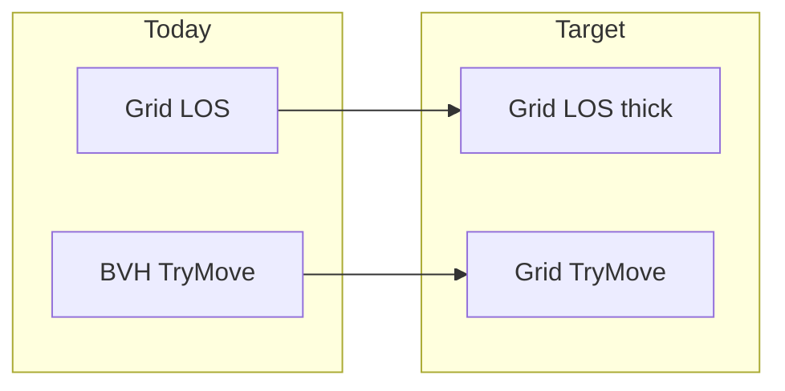

# Enemy wall respect (collision + LOS)

## Current state

[`EnemySystem.cs`](d:\novolis\novolis-dogfooding\apps\DoomLite3D\Game\EnemySystem.cs) already gates chase/melee/shots with `GridCollision2D.HasLineOfSight` and moves via `GridPhysicsMovement` (BVH) when [`DoomLiteGame`](d:\novolis\novolis-dogfooding\apps\DoomLite3D\Game\DoomLiteGame.cs) passes `_physicsWorld`.

That split is the likely gap:

| System | Player | Enemy |
|--------|--------|-------|
| Movement | BVH (`GridPhysicsMovement`) | BVH |
| LOS | — | Grid (`HasLineOfSight`) |

BVH meshes from [`RoomMeshBuilder`](d:\novolis\novolis-physics\src\Novolis.Physics.Collision.Simple\RoomMeshBuilder.cs) should align with the grid, but axis-separated sphere sweeps can slide differently than circle-vs-cell [`TryMove`](d:\novolis\novolis-math\src\Novolis.Math.Geometry\GridCollision2D.cs). LOS uses thin Bresenham lines, which can **cut corners** in 2-wide corridors (see through / shoot through wall tips).



## 1. Grid-only enemy movement

In [`EnemySystem.TryMoveEnemy`](d:\novolis\novolis-dogfooding\apps\DoomLite3D\Game\EnemySystem.cs):

- **Always** use `GridCollision2D.TryMove(level.Walls, ...)` (drop BVH branch for enemies).
- After move, **reject** if `GridCollision2D.OverlapsWall(level.Walls, next, EnemyRadius, CellSize)` — return previous position (safety net for spawn overlap or numeric edge cases).
- Remove `physicsWorld` from `TryMoveEnemy` signature; keep it on `Update` only if needed elsewhere, or remove from `Update` if unused.

Player keeps BVH movement unchanged.

## 2. Stronger grid LOS (novolis-math)

In [`GridCollision2D.cs`](d:\novolis\novolis-math\src\Novolis.Math.Geometry\GridCollision2D.cs):

**a) Supercover line traversal** — replace thin Bresenham with a line walk that visits every grid cell the segment touches (fixes diagonal corner peek).

**b) Optional clearance** — overload or parameter:

```csharp
public static bool HasLineOfSight(
    DenseGrid<byte> map, Vector2 from, Vector2 to,
    float cellSize = 1f, float clearanceRadius = 0f)
```

When `clearanceRadius > 0`, any blocked cell within that radius of the supercover path returns false (accounts for enemy/player body width in 2-cell halls).

**Tests** in [`GridCollision2DTests.cs`](d:\novolis\novolis-math\tests\Novolis.Math.Geometry.Tests\GridCollision2DTests.cs):

- Diagonal past L-corner stays blocked (existing test, may need tightening).
- New: thin gap between two wall cells — thin LOS false, thick clearance false.
- New: open 2-cell-wide corridor — LOS true with clearance &lt; 1 cell.

## 3. Enemy LOS call sites

In [`EnemySystem.cs`](d:\novolis\novolis-dogfooding\apps\DoomLite3D\Game\EnemySystem.cs):

| Use | From | To | Clearance |
|-----|------|-----|-----------|
| Chase / melee | `enemyXZ` | `playerXZ` (feet) | `EnemyRadius * 0.5f` |
| Player shot | `ray.Origin` XZ | `enemy.Position` XZ | `0` or small `0.2f` |

Chase only when `HasLineOfSight(..., clearance)`; melee same.

## 4. Safe enemy spawn

In [`MazeGenerator.PlaceEnemies`](d:\novolis\novolis-dogfooding\apps\DoomLite3D\Game\MazeGenerator.cs) **or** [`EnemySystem.Reset`](d:\novolis\novolis-dogfooding\apps\DoomLite3D\Game\EnemySystem.cs):

- Skip / don't place if `GridCollision2D.OverlapsWall(walls, cellCenterXZ, EnemyRadius, CellSize)`.
- Ensures enemies start in valid floor, not on wall edges after 2-wide rasterize.

## 5. Files touched

| File | Change |
|------|--------|
| [`GridCollision2D.cs`](d:\novolis\novolis-math\src\Novolis.Math.Geometry\GridCollision2D.cs) | Supercover LOS + clearance |
| [`GridCollision2DTests.cs`](d:\novolis\novolis-math\tests\Novolis.Math.Geometry.Tests\GridCollision2DTests.cs) | LOS clearance tests |
| [`EnemySystem.cs`](d:\novolis\novolis-dogfooding\apps\DoomLite3D\Game\EnemySystem.cs) | Grid-only move, post-validate, thick LOS |
| [`MazeGenerator.cs`](d:\novolis\novolis-dogfooding\apps\DoomLite3D\Game\MazeGenerator.cs) or `EnemySystem.Reset` | Spawn overlap filter |

No changes to maze layout or minimap.

## Verification

```bash
dotnet test novolis-math/tests/Novolis.Math.Geometry.Tests
dotnet build novolis-dogfooding/apps/DoomLite3D/DoomLite3D.csproj
dotnet run --project novolis-dogfooding/apps/DoomLite3D/DoomLite3D.csproj
```

Manual: enemy behind wall does not move or melee; cannot be shot through wall; around corners no peeking; enemies do not slide through wall corners in 2-wide halls.

