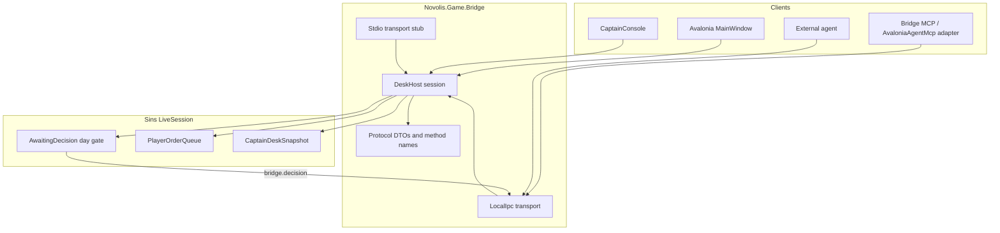

# Event-driven captain bridge protocol

## Why

Today, captain play is **opaque and UI-poll-only**:

- Travel is enqueue + day-gate + sim hours; failures land only in `LastDecision` text ([`PlayerTrampAgent.Travel`](novolis-apps/src/SinsOfACapitalismTycoon/Universe/Player/PlayerTrampAgent.cs)).
- Route highlight is optimistic UI state, independent of whether `PlanReposition` succeeded ([`MainWindow.ApplyRouteHighlight`](novolis-apps/src/SinsOfACapitalismTycoon/Ui/MainWindow.cs)).
- Tooling sees glass via Avalonia Agent (`ui.get` / click) over LocalIpc — **no push events**, no domain snapshot, no typed orders ([explore: Avalonia Agent / LocalIpc](novolis-avalonia)).
- Decision pauses are in-process `AwaitingDecision` only ([`CampaignRunner.LiveSession`](novolis-apps/src/SinsOfACapitalismTycoon/Universe/CampaignRunner.cs)).

Goal: **every decision-point action** is commandable and observable through a shared bridge protocol, with a **player-facing snapshot**, over **multiple transports**. Avalonia remains one client; MCP/CLI/agents become first-class.

**Placement:** single package `Novolis.Game.Session` in [`novolis-gaming`](novolis-gaming/) (contracts + wire + LocalIpc/stdio hosts), consumed by Sins via ProjectRef locally / GPR later — not buried in Avalonia.Agent or `Novolis.Transports.*` domain layer. (Renamed from opaque “Bridge” sprawl.)



---

## Phase 0 — Travel / route reliability (unblock play)

Fix the reported “Travel does nothing / no highlight” as structured command results (not only UI flash).

1. **Structured `TravelResult`** from `PlayerTrampAgent.Travel` (success | already-here | unknown-dest | no-route | registry | busy | bunkering | plan-failed) — surface on bridge snapshot `LastAction` / `DecisionLine`.
2. **MainWindow**: after Travel enqueue, on next `AwaitingDecision`/`DayEnded`, if still `BERTH` at same hub, `FlashError` with agent decision text; clear optimistic route if dest==current or BFS empty.
3. **`ApplyRouteHighlight`**: always recompute from live dest + `UnderwayRoute`; if `BetweenSystems` returns empty, show muted feedback (“no graph path”) instead of silent blank.
4. **Acceptance**: captain CLI `travel <id>; continue; status` must show `REPOSITION`/`UNDERWAY` or an explicit fail line within one decision cycle (`--seed 1001`).

---

## Phase 1 — Protocol packages (`novolis-gaming` / `Novolis.Game.Books.*`)

Create:

| Package | Role |
|---------|------|
| [`Novolis.Game.Books.Abstractions`](novolis-gaming/src/Novolis.Game.Books.Abstractions) | `ICaptainSession`, command/result envelopes, transport-agnostic |
| [`Novolis.Game.Books.Protocol`](novolis-gaming/src/Novolis.Game.Books.Protocol) | Method names + MessagePack/JSON DTOs |
| [`Novolis.Game.Books.LocalIpc`](novolis-gaming/src/Novolis.Game.Books.LocalIpc) | Host + client over existing `Novolis.Transports.LocalIpc` frames (`request`/`response`/`event`) |

**Do not** put fiction mesh or economy types in `Novolis.Transports.*`. Reuse byte framing only.

### Wire methods (v1)

| Method | Kind | Purpose |
|--------|------|---------|
| `bridge.hello` | req/res | Version, app id, capabilities |
| `bridge.snapshot` | req/res | Full **player-facing** state |
| `bridge.actions` | req/res | Allowed actions at this decision (enabled flags + reasons) |
| `bridge.command` | req/res | Execute one typed action; returns `CommandResult` |
| `bridge.continue` | req/res | Alias: release day gate (`UntilDecision`) |
| `bridge.subscribe` | req/res | Client wants push events (session flag) |
| `bridge.decision` | **event** | Fired when `AwaitingDecision` rises |
| `bridge.changed` | **event** | Snapshot-relevant change (day end, voyage phase, soft-fail) — coalesced |
| `bridge.actionResult` | **event** | Async outcome when order settles next hour (travel bunkering → departed / failed) |

### Player-facing snapshot DTO

Project from existing bridge model ([`CaptainBridgeModel`](novolis-apps/src/SinsOfACapitalismTycoon/Ui/CaptainBridgeModel.cs)), not raw sim:

- Identity: day, seed hash, hub id/name, pause reason (`AwaitingDecision` | `Running` | `Complete`)
- Voyage / hull / cash / standing / coach / soft-fail / survival / mesh one-liners
- Boards: spot freight, goods charters, market lots, manifest (summaries + ids for commands)
- Map: current hub, travel target, **route edge list** (system ids) for clients that paint maps
- Actions: list of `{ id, label, enabled, disabledReason }` covering every decision act
- Last action result (structured)

Stable ids for actions (examples): `travel`, `acceptSpot`, `acceptCharter`, `marketBuy`, `marketSell`, `depart`, `refuseStandby`, `acceptStandby`, `wait`, `premium`, `overhaul`, `step`, `continue`, `resume`, `save`.

### Command envelope

```text
DeskCommand { ActionId, Args: { destSystemId?, index?, sku?, qty?, ... } }
CommandResult { Ok, ActionId, Message, Snapshot?, ErrorCode? }
```

Map `ActionId` → existing `PlayerOrder` / `Continue` / `StepDay` / save — **single execution path** shared by UI, CLI, and IPC (no duplicate business logic in MainWindow).

---

## Phase 2 — Sins host wiring

1. **`CaptainBridgeService`** (new) owns:
   - Build `CaptainDeskSnapshot` from `LiveSession`
   - `ExecuteAsync(DeskCommand)` → enqueue order / gate / save; return `CommandResult`
   - Raise `Decision` / `Changed` / `ActionResult` from `LiveSession.AwaitingDecision`, `DayEnded`, and post-order settlement
2. **`LiveSession`**: keep pause semantics; add optional `IDeskEventSink` (or events the service subscribes to). On travel/depart settlement, emit `bridge.actionResult` when voyage phase flips or `LastDecision` becomes fail.
3. **`MainWindow`**: Travel / Accept / Market / Continue call `CaptainBridgeService.Execute` (not direct enqueue). Refresh from returned snapshot. Route highlight from snapshot.RouteEdges.
4. **`CaptainConsole`**: verbs call same service (CLI becomes a transport).
5. **Bridge LocalIpc host** in Avalonia/`--mode captain` when `NOVOLIS_BRIDGE_AGENT=1` (pipe e.g. `novolis-game-bridge-sins`), parallel to UI agent pipe — do not conflate with `ui.*`.

Remove temporary `AgentDebugLog` / `debug-cc3657` instrumentation once bridge events cover the same signals (or map them into `bridge.changed` during transition).

---

## Phase 3 — Multi-transport adapters

| Transport | v1 | Notes |
|-----------|----|-------|
| **LocalIpc** | Required | Primary for agents; push `event` frames |
| **In-process** | Required | UI + CLI bind directly to `ICaptainSession` |
| **MCP** | Required | New tools on AvaloniaAgentMcp **or** small `GameDeskMcp`: `bridge_connect`, `bridge_snapshot`, `bridge_actions`, `bridge_command`, `bridge_wait_decision` (subscribe/poll hybrid) |
| **Stdio JSONL** | Stub package `Novolis.Game.Books.Stdio` | Same protocol lines for headless agents; implement host loop |
| **Tcp/Http** | Interface only | `IDeskTransport` + no-op stubs; implement later without protocol churn |

Versioning: `bridge.hello` returns `protocolVersion = "1.0"`; additive fields only.

---

## Phase 4 — Docs + acceptance

- [`docs/gameplay.md`](novolis-apps/src/SinsOfACapitalismTycoon/docs/gameplay.md): decision-point contract + bridge agent env/pipe.
- [`novolis-gaming/docs/bridge-protocol.md`](novolis-gaming/docs/bridge-protocol.md): protocol methods, snapshot schema, transport matrix.
- Sins `AGENT-SMOKE.md` (or `BRIDGE-SMOKE.md`): LocalIpc hello → wait decision → snapshot → `travel` command → snapshot shows underway/route → fail path returns ErrorCode.

**Acceptance gates**

1. `--playtest --seed 1001` and `--playtest-last-tramp --seed 1001` still PASS.
2. Bridge IPC: after `bridge.command travel`, next `bridge.snapshot` shows underway **or** explicit `ErrorCode` (never silent BERTH).
3. `bridge.decision` event arrives when pause hits (proven via LocalIpc client log).
4. `bridge.snapshot` contains boards + enabled actions matching Avalonia buttons.
5. NuGet-only policy: no local folder feeds; ProjectRef via `-p:NovolisUseProjectReferences=true` until packages publish to GPR.

---

## Out of scope

- Replacing Avalonia UI agent (`ui.*`) — keep for glass automation.
- Exposing raw `IEconomyEvent` dump as the player snapshot.
- Fiction mesh as tooling transport.
- Full Tcp/Http production hosts in v1.

---

## Implementation order

1. Phase 0 travel/route fail feedback  
2. Protocol + Abstractions packages + LocalIpc host/client  
3. `CaptainBridgeService` + LiveSession sink  
4. Retarget MainWindow + CaptainConsole  
5. MCP + Stdio stub  
6. Docs + smoke + playtests  

