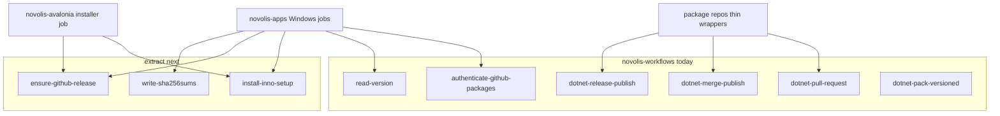

# Extend novolis-workflows (no new repo)

## Verdict

**[`novolis-workflows`](d:\novolis\novolis-workflows)** already is the org’s shared Actions repo. ~30 package repos are thin `workflow_call` wrappers. Creating a second “actions” repo would split the source of truth against [maintainer-guide](d:\novolis\novolis-governance\docs\maintainer-guide.md) (“use `novolis-workflows`; don’t duplicate CI”).

| Capability you named | Status today |
|---|---|
| Private NuGet (GPR) auth | Done: [`authenticate-github-packages`](d:\novolis\novolis-workflows\actions\authenticate-github-packages\action.yml) (used by `dotnet-build` + apps) |
| Automatic package publish | Done: merge → GPR ([`dotnet-merge-publish.yml`](d:\novolis\novolis-workflows\.github\workflows\dotnet-merge-publish.yml)); release → nuget.org |
| Automatic GitHub Release creation | Partial: libraries stay **human `release: published`** (nuget.org gate per [release-policy](d:\novolis\novolis-governance\docs\release-policy.md)); **apps** already `gh release create` inline in merge/release YAML |
| Inno Setup | Not shared — `choco install innosetup` copied in apps merge/release + avalonia release |

## What to add (composites only — no full apps reusable yet)

Keep catalog publish / `Publish-NovolisApp.ps1` in [`novolis-apps`](d:\novolis\novolis-apps\scripts\Publish-NovolisApp.ps1). Share only the portable CI glue that is copy-pasted 2–3 times.

### 1. `actions/install-inno-setup`

- `choco install innosetup -y --no-progress` (fail on non-zero)
- Resolve `ISCC.exe` (`ProgramFiles(x86)` / `ProgramFiles` / `Get-Command`)
- Output `iscc-path` for callers that compile `.iss` directly (avalonia)

**Callers:** [`novolis-apps` merge](d:\novolis\novolis-apps\.github\workflows\merge.yml), [release](d:\novolis\novolis-apps\.github\workflows\release.yml), [avalonia release installer](d:\novolis\novolis-avalonia\.github\workflows\release.yml).

### 2. `actions/ensure-github-release`

Generalize beyond nupkg-only [`upload-release-packages`](d:\novolis\novolis-workflows\actions\upload-release-packages\action.yml) (that action assumes an existing `release: published` event).

Inputs: `tag`, `title`, `assets` (multiline/glob list), optional `generate-notes` (default true), `clobber` (default true).

Behavior: `gh release view` → create if missing → `gh release upload`.

**Callers:** apps merge/release (zip + Inno + SHA256SUMS); optionally avalonia installer upload after create-if-needed is unnecessary there (release already exists) but upload path can still use a thin `upload-release-assets` sibling if preferred.

### 3. `actions/write-sha256sums`

Inputs: file paths → write `SHA256SUMS.txt` (utf8NoBOM) and output path. Pulls the repeated hash loop out of apps YAML.

### 4. Consumer cleanup (same effort)

- Replace Inno/release/sums blocks in apps merge + release with the three composites; leave `Publish-NovolisApp` / catalog / prune script local.
- PulseStrip ([smoke](d:\novolis\novolis-dogfooding\.github\workflows\pulsestrip-smoke.yml) / [publish](d:\novolis\novolis-dogfooding\.github\workflows\pulsestrip-publish.yml)): drop inline `dotnet nuget add/update`; call `authenticate-github-packages@main` + `setup-dotnet@main`.
- Avalonia installer: use `install-inno-setup` (and `resolve-release-version` if the inline version block matches — already have composite; align if identical).

### 5. Housekeeping in `novolis-workflows`

- Document new actions in [`README.md`](d:\novolis\novolis-workflows\README.md) (table is incomplete vs actual actions tree).
- Mark or delete unused composites: `bump-build-version`, `commit-version-bump` (no workflow refs).
- Leave legacy `dotnet-pack.yml` / old `restore`/`build`/`pack` alone unless you want a follow-up delete pass.
- Do **not** revive governance’s unused [`novolis-reusable-build.yml`](d:\novolis\novolis-governance\.github\workflows\novolis-reusable-build.yml) — delete or add a one-line “superseded by novolis-workflows” comment in a later cleanup.

## Explicit non-goals

- **New repo** (`novolis-actions`, org `.github` composites-only, etc.).
- **Auto-creating GitHub Releases for library packages on every merge** — that would bypass the intentional human release → nuget.org gate; apps binary releases already auto-tag `v{package-version}`.
- **Full `windows-app-release` reusable workflow** — only two consumers today and apps catalog inputs differ; revisit when a third Windows/Inno host appears.
- Packaging actions as NuGet (already rejected in [imports-todo](d:\novolis\novolis-governance\docs\imports-todo\workflows-and-release-ci.md)).

## Docs / policy touch

- Short note in [release-policy.md](d:\novolis\novolis-governance\docs\release-policy.md) Apps section: “Inno install / ensure release / SHA256SUMS via novolis-workflows composites.”
- Refresh workflows README action table so discoverability matches reality (auth, checkout-siblings, upload-release-packages, new three).

## Acceptance

1. Apps merge/release YAML no longer inline `choco install innosetup` or raw `gh release create/upload` / hash loops.
2. PulseStrip restores via shared auth action only.
3. `novolis-workflows` README lists all supported composites including Inno + ensure-release.
4. Library thin wrappers unchanged; no second Actions repository created.

