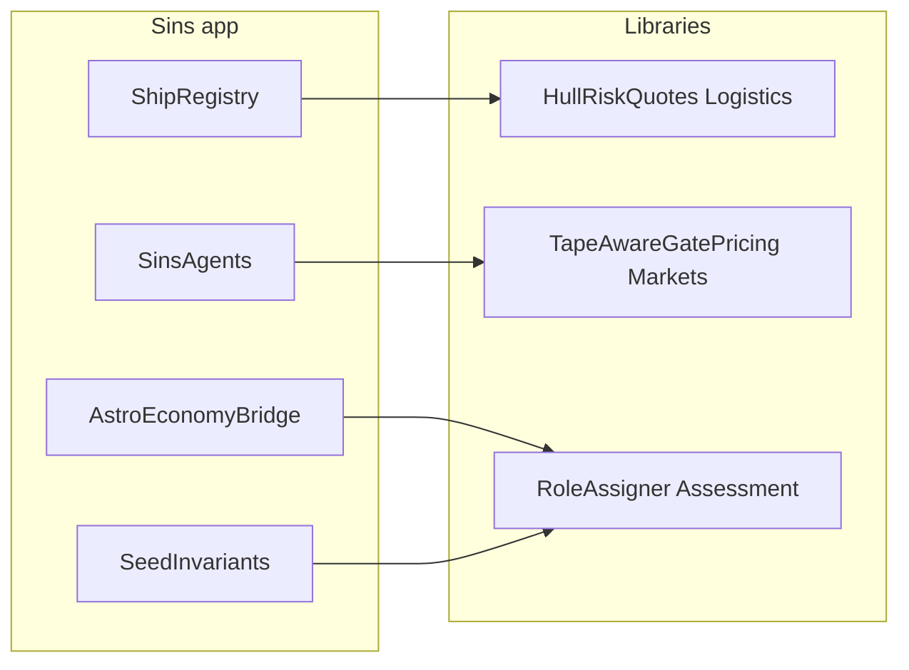

# Extract Sins fundamentals into libraries

## Locked scope

**In this pass**
1. Hull premium / drive-life quote math → [`Novolis.Economy.Logistics`](novolis-economy/src/Novolis.Economy.Logistics/)
2. Tape-aware gate pricing → [`Novolis.Economy.Markets`](novolis-economy/src/Novolis.Economy.Markets/)
3. `SystemRole` + `RoleAssigner` (+ role↔potential check helpers) → [`Novolis.Astro.Assessment`](novolis-astro/src/Novolis.Astro.Assessment/)
4. Rewire Sins to call the libraries; point unit tests at library APIs (kill mirrored formulas)

**Explicitly out**
- No `Novolis.Economy.Campaign` package
- [`AstroEconomyBridge`](novolis-apps/src/SinsOfACapitalismTycoon/Universe/Bridge/AstroEconomyBridge.cs) stays in Sins (needs `EconomyWorldBuilder` / `TransportHub`)
- Full `ShipRegistry` / `InsurancePulse` / drama / Spectre stay in Sins
- `CapacityInvestAgent` / `LoanRepayAgent` stay in Sins (hard-wired to `CampaignWorld.Ids` + milestones; no second consumer yet)
- CCA commerce-teeth work ([`cca_commerce_teeth_fd01657f.plan.md`](d:\novolis\.cursor\plans\cca_commerce_teeth_fd01657f.plan.md)) stays Sins-local; it will consume `Novolis.Astro.Assessment.SystemRole` once roles move



## 1. Logistics — hull risk quotes

Add public pure helpers next to [`TransitProfile.cs`](novolis-economy/src/Novolis.Economy.Logistics/TransitProfile.cs):

- `FtlDriveLifePolicy` — rated life light/mega, elective overhaul fraction, acute wear decay, premium grace days (today’s [`FtlDrivePolicy`](novolis-apps/src/SinsOfACapitalismTycoon/Universe/Commerce/ShipRegistry.cs))
- `HullRiskQuotes` — `DailyPremium(...)`, `ElectiveOverhaul(...)`, `BurnoutOverhaul(...)` matching current formulas (base × lifeRisk × priority × long × load, cap `base * 2.8 * load`, idle/suspended = `base * 0.25 * load`)

Keep `ShipRegistry` / `ShipRegistryEntry` in Sins; `QuoteDailyPremium` / overhaul quotes become thin wrappers that pick base premium from hull class then call `HullRiskQuotes`.

Rewrite [`CampaignRiskQuoteTests`](novolis-economy/tests/Novolis.Economy.Unit/CampaignRiskQuoteTests.cs) to call `HullRiskQuotes` / `FtlDriveLifePolicy` (remove duplicated local `Quote` lambda). Drop the vacuous drama-day identity assert or leave it only if still useful elsewhere.

## 2. Markets — tape-aware gate

Add [`TapeAwareGatePricing.cs`](novolis-economy/src/Novolis.Economy.Markets/TapeAwareGatePricing.cs) beside [`InventoryPressurePricing.cs`](novolis-economy/src/Novolis.Economy.Markets/InventoryPressurePricing.cs):

```csharp
public static decimal Gate(
  ObservedMarketBook book, ProductId product,
  decimal floor, decimal ceilingMultiple = 2.4m)
```

Same blend/trend/clamp logic as today’s [`MarketAwarePricing`](novolis-apps/src/SinsOfACapitalismTycoon/Universe/Commerce/MarketAwarePricing.cs), but take `ObservedMarketBook` (not `EconomyWorld`) so Markets stays free of Simulation.

Sins: delete `MarketAwarePricing` or leave a one-liner `Gate(world, …) => TapeAwareGatePricing.Gate(world.MarketBook, …)`. Prefer delete + update [`SinsAgents.cs`](novolis-apps/src/SinsOfACapitalismTycoon/Universe/Agents/SinsAgents.cs) call site.

Add a small Markets unit test (monotone: rising trend ≥ flat ≥ falling when tape exists; empty tape returns floor).

## 3. Astro.Assessment — roles

- Add `ProjectReference` Assessment → [`Novolis.Astro.Routing`](novolis-astro/src/Novolis.Astro.Routing/) (needs `RouteGraph`)
- Move `SystemRole` enum to `Novolis.Astro.Assessment`
- Move `RoleAssigner` as **public** API with today’s quotas/thresholds as public consts (parameterized later only if needed; keep behavior identical for seed `1001`)
- Add `SystemRoleInvariants.CollectFailures(...)` for the role↔potential rules currently in [`SeedInvariants`](novolis-apps/src/SinsOfACapitalismTycoon/Universe/SeedInvariants.cs) (mining threshold, settlement agri &gt; 0). Cohort↔facility binding stays in Sins `SeedInvariants` (needs `EconomySimulation`)

Sins deletes local `SystemRole.cs` / `RoleAssigner.cs`; [`AstroEconomyBridge`](novolis-apps/src/SinsOfACapitalismTycoon/Universe/Bridge/AstroEconomyBridge.cs), `CampaignWorld`, agents, etc. import Assessment. `RoleAssigner.SummarizePotentials` either moves with a small hub DTO `(SystemId, Role, Potential)` or stays as a Sins helper over `HubBinding` — keep Summarize/SummarizePotentials as Assessment helpers taking role dict + potential list so Bridge stays thin.

## 4. Sins rewire + docs

- Update usings / any GlobalUsings for `SystemRole`
- Thin `ShipRegistry` quotes
- Point agents/report at Assessment roles
- Brief note in [`architecture.md`](novolis-apps/src/SinsOfACapitalismTycoon/docs/architecture.md) and [`roadmap.md`](novolis-apps/src/SinsOfACapitalismTycoon/docs/roadmap.md): hull quotes / tape gate / roles live in libraries; campaign bridge still app-local

## 5. Validation (ProjectRef; no local feeds)

From `d:\novolis`:

```powershell
pwsh -File novolis-governance/build/Generate-Platform-Slnx.ps1
dotnet build novolis-economy/tests/Novolis.Economy.Unit -p:NovolisUseProjectReferences=true
dotnet build novolis-astro -p:NovolisUseProjectReferences=true   # or Assessment + tests if present
dotnet build novolis-apps/src/SinsOfACapitalismTycoon -p:NovolisUseProjectReferences=true
dotnet run --project novolis-economy/tests/Novolis.Economy.Unit -p:NovolisUseProjectReferences=true
dotnet run --project novolis-apps/src/SinsOfACapitalismTycoon -p:NovolisUseProjectReferences=true -- --engine campaign --days 10d --seed 1001 --quiet
pwsh -File novolis-governance/scripts/verify-nuget-only.ps1
pwsh -File novolis-governance/scripts/verify-project-ref-mode.ps1 -SkipBuild
```

**GPR:** API bumps need CI publish to GitHub Packages before single-repo PackageReference consumers restore without ProjectRef. Local validation stays ProjectRef-only.

## Done when

- Library owns premium/overhaul math and tape gate; tests call library
- Assessment owns `SystemRole` + `RoleAssigner`; Sins seed `1001` role summary unchanged
- Bridge / registry theater / capacity+loan agents still in Sins
- verify scripts exit 0; 10d campaign smoke green

