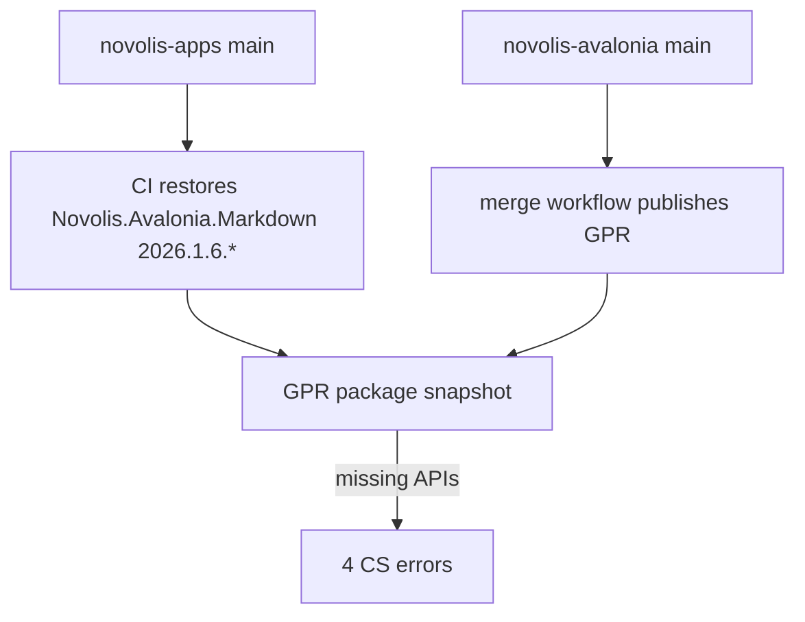
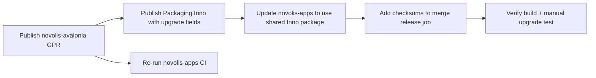

# Fix CI, Inno upgrades, and installer trust

## Problem summary



**CI failure (4 errors)** — [ManuscriptStudio](d:\novolis\novolis-apps\src\ManuscriptStudio) on `main` (`32dbe98`) calls APIs that exist in local [novolis-avalonia](d:\novolis\novolis-avalonia\src\Novolis.Avalonia.Markdown) source but not in the GPR package CI restores:

| Error | Missing API | Source location |
|-------|-------------|-----------------|
| CS0103 | `MarkdownPreviewPipeline` | [BookPreviewRenderer.cs](d:\novolis\novolis-apps\src\ManuscriptStudio\Extensions\BookAuthoring\Rendering\BookPreviewRenderer.cs) |
| CS1061 ×3 | `ZoomScaleChanged`, `DocumentBodyHtml` | [BookAuthoringExtension.cs](d:\novolis\novolis-apps\src\ManuscriptStudio\Extensions\BookAuthoring\BookAuthoringExtension.cs), [GenericMarkdownExtension.cs](d:\novolis\novolis-apps\src\ManuscriptStudio\Extensions\GenericMarkdown\GenericMarkdownExtension.cs) |

These APIs were added in novolis-avalonia (`a6aaefe` Mermaid + `MarkdownPreviewPipeline`; `78940c6` zoom events). [Directory.Packages.props](d:\novolis\novolis-apps\Directory.Packages.props) pins `Novolis.Avalonia.Markdown` at `2026.1.6.*` — correct per NuGet-only policy, but **apps merged before GPR had the matching build**.

**Inno updates** — [generate-manuscript-studio-iss.ps1](d:\novolis\novolis-apps\scripts\generate-manuscript-studio-iss.ps1) has a stable `AppId` and `ignoreversion` (good baseline) but lacks upgrade UX (`UsePreviousAppDir`, close running app) and publisher metadata.

**Security** — No Authenticode signing exists yet (per your choice: defer signing). SmartScreen warnings will remain until a future signing initiative ([governance roadmap](d:\novolis\novolis-governance\docs\roadmap.md) lists signing as post-v0). Mitigate now with publisher metadata, checksums, and clear download docs.

---

## Part 1: Unblock CI (package publish + verify)

### 1a. Publish novolis-avalonia packages to GPR

Trigger [novolis-avalonia merge workflow](d:\novolis\novolis-avalonia\.github\workflows\merge.yml) (`dotnet-merge-publish.yml`) so `Novolis.Avalonia.Markdown`, `Novolis.Avalonia.Studio`, and siblings publish a new `2026.1.6.{run_number}` build containing:

- `MarkdownPreviewPipeline.ToBodyHtml`
- `MarkdownPreviewPane.DocumentBodyHtml`
- `MarkdownPreviewPane.ZoomScaleChanged`

If main already contains these commits and merge recently ran, **re-run the merge workflow** (`workflow_dispatch`, `skip_publish: false`) to produce a fresh GPR build without code changes.

### 1b. Verify consumer restore

After GPR publish completes:

```powershell
dotnet nuget locals all --clear   # optional, only if a stale cache is suspected
dotnet restore d:\novolis\novolis-apps\Novolis.Apps.slnx --configfile d:\novolis\novolis-apps\nuget.config
dotnet build d:\novolis\novolis-apps\Novolis.Apps.slnx -c Release --no-restore
```

Confirm resolved version is the **new** `2026.1.6.*` build (not an older cached nupkg).

### 1c. Re-run novolis-apps CI

Re-run the failed merge workflow on [novolis-apps](d:\novolis\novolis-apps\.github\workflows\merge.yml) or push a no-op commit. **No app code changes required** if GPR now has the APIs.

### 1d. Prevent recurrence (lightweight guard)

Add a short note to [novolis-apps/docs/getting-started.md](d:\novolis\novolis-apps\docs\getting-started.md) or [docs/release.md](d:\novolis\novolis-apps\docs\release.md) (if present):

> When Manuscript Studio depends on new `Novolis.Avalonia.*` APIs, merge and publish **novolis-avalonia** first, wait for GPR, then merge novolis-apps.

Optional hardening (only if repeats happen): add a CI step in merge `release` job that logs resolved `Novolis.Avalonia.Markdown` version from `project.assets.json` for audit.

**Do not** add ProjectReference fallbacks or local feeds (violates [nuget-only policy](d:\novolis\novolis-governance\docs\nuget-only-policy.md)).

---

## Part 2: Inno Setup in-place upgrades

Current generated script (apps + shared [InnoScriptGenerator.cs](d:\novolis\novolis-avalonia\src\Novolis.Avalonia.Packaging.Inno\InnoScriptGenerator.cs)):

```52:72:d:\novolis\novolis-avalonia\src\Novolis.Avalonia.Packaging.Inno\InnoScriptGenerator.cs
        sb.AppendLine($"AppId={AppId}");
        // ... no UsePreviousAppDir, CloseApplications, publisher metadata
        sb.AppendLine($"Source: \"{publish}\\*\"; DestDir: \"{{app}}\"; Flags: ignoreversion recursesubdirs createallsubdirs");
```

### 2a. Centralize upgrade behavior in `Novolis.Avalonia.Packaging.Inno`

Extend `InnoScriptGenerator` (and matching MSBuild target in [Novolis.Avalonia.Packaging.Inno.targets](d:\novolis\novolis-avalonia\src\Novolis.Avalonia.Packaging.Inno\build\Novolis.Avalonia.Packaging.Inno.targets)) with new optional properties:

| Property | Default | Purpose |
|----------|---------|---------|
| `AppPublisher` | `Novolis Platform` | Installer metadata / Add/Remove Programs |
| `AppPublisherURL` | `https://github.com/Novolis-Platform` | Trust + support link |
| `AppSupportURL` | GitHub issues URL | Support link |
| `AppUpdatesURL` | GitHub releases URL | Update discovery |
| `AppCopyright` | `Copyright (C) Novolis Platform` | Version resource |
| `UsePreviousAppDir` | `yes` | Reuse `%LOCALAPPDATA%\Programs\Novolis\...` on upgrade |
| `DisableDirPage` | `auto` | Skip dir picker when upgrading |
| `CloseApplications` | `yes` | Close running app during upgrade |
| `RestartApplications` | `yes` | Relaunch after upgrade (pairs with CloseApplications) |
| `AllowDowngrades` | `no` | Block accidental downgrade installs |
| `VersionInfoVersion` | same as `AppVersion` | Correct Windows version display |

Add `[Setup]` entries:

```iss
UsePreviousAppDir=yes
DisableDirPage=auto
CloseApplications=filter:ManuscriptStudio.exe;ManuscriptStudio.exe
RestartApplications=yes
AllowDowngrades=no
AppPublisher=Novolis Platform
AppPublisherURL=https://github.com/Novolis-Platform
AppSupportURL=https://github.com/Novolis-Platform/novolis-apps/issues
AppUpdatesURL=https://github.com/Novolis-Platform/novolis-apps/releases
VersionInfoVersion={version}
```

Use `CloseApplications=filter:{exe};{basename}` parameterized by `AppExeName` so Live Studio and Manuscript Studio both work.

Keep existing upgrade essentials unchanged:

- **Stable `AppId`** — `Novolis.ManuscriptStudio` (must never change)
- **`ignoreversion` on `[Files]`** — overwrite all payload files on upgrade
- **`PrivilegesRequired=lowest`** — per-user install path

### 2b. Switch novolis-apps to shared generator (remove drift)

Replace hand-maintained [generate-manuscript-studio-iss.ps1](d:\novolis\novolis-apps\scripts\generate-manuscript-studio-iss.ps1) with the GPR package (as originally planned):

1. Add to [Directory.Packages.props](d:\novolis\novolis-apps\Directory.Packages.props): `Novolis.Avalonia.Packaging.Inno` `2026.1.*`
2. Add private `PackageReference` to [ManuscriptStudio.csproj](d:\novolis\novolis-apps\src\ManuscriptStudio\ManuscriptStudio.csproj)
3. Update [merge.yml](d:\novolis\novolis-apps\.github\workflows\merge.yml) “Generate Inno script” step to call `dotnet msbuild -t:NovolisGenerateInnoScript` with Manuscript properties (mirror [avalonia release.yml](d:\novolis\novolis-avalonia\.github\workflows\release.yml))
4. Update [build-installer.ps1](d:\novolis\novolis-apps\scripts\build-installer.ps1) similarly; delete or thin `generate-manuscript-studio-iss.ps1` to a wrapper only if needed for backward compat

Publish updated `Novolis.Avalonia.Packaging.Inno` via novolis-avalonia merge **before** apps consumes new targets.

### 2c. Manual upgrade test checklist

1. Install `ManuscriptStudioSetup-vA.exe` from a release
2. Run app, leave a settings file in place
3. Install `ManuscriptStudioSetup-vB.exe` over it
4. Confirm: same install dir, shortcuts updated, app files replaced, settings preserved, uninstall entry shows new version

---

## Part 3: Reduce security warnings without signing (deferred Authenticode)

Signing is deferred. Until a future EV/Azure Trusted Signing initiative, focus on **verifiable downloads** and **honest installer metadata** (Part 2 publisher fields).

### 3a. Release checksums in CI

In [merge.yml](d:\novolis\novolis-apps\.github\workflows\merge.yml) release job, after zip + installer are built:

```powershell
$hashZip = (Get-FileHash $env:ZIP_PATH -Algorithm SHA256).Hash
$hashExe = (Get-FileHash $env:INSTALLER_PATH -Algorithm SHA256).Hash
# Append to release body or upload SHA256SUMS.txt asset
```

Upload `SHA256SUMS.txt` alongside assets; include hashes in release notes via `gh release edit`.

### 3b. User-facing trust guidance

Update [getting-started.md](d:\novolis\novolis-apps\docs\getting-started.md) Install section:

- Download only from official `Novolis-Platform/novolis-apps` GitHub Releases
- Verify SHA256 from `SHA256SUMS.txt` before running
- Explain that **unsigned** installers may show SmartScreen “Windows protected your PC” — click “More info” → “Run anyway” until code signing is added
- Prefer installer over zip for upgrades (stable `AppId`); zip is portable only

### 3c. Future signing hook (document only, no implementation now)

When ready, add a post-ISCC step in merge `release` job:

- `signtool sign` / Azure Trusted Signing action on `ManuscriptStudioSetup-*.exe` and optionally `ManuscriptStudio.exe`
- Store cert credentials in org secrets
- Enable `SignedUninstaller=yes` in Inno script

Reference: [bootstrapping plan](d:\novolis\.github\plans\bootstrapping-organization.md) Authenticode section.

---

## Execution order



1. **novolis-avalonia** — merge/publish Markdown APIs + enhanced Packaging.Inno
2. **novolis-apps** — consume new Inno package, add checksums, update docs
3. **Verify** — `dotnet build`, `verify-nuget-only.ps1`, manual upgrade test
4. **Re-run CI** — confirm green build + release assets

---

## Success criteria

- `dotnet build Novolis.Apps.slnx -c Release` passes using **nuget.org + GPR only**
- Merge workflow produces zip + installer; installing vN+1 over vN upgrades in place
- Release includes `SHA256SUMS.txt`; docs explain unsigned SmartScreen behavior
- `pwsh novolis-governance/scripts/verify-nuget-only.ps1` exits 0

