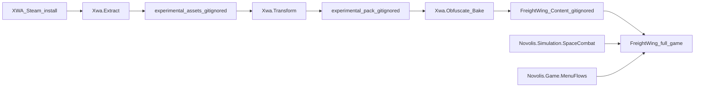

# FreightWing — extract → obfuscate → full game in apps

## Decisions (locked)

- **Source:** Steam `D:\Steam\steamapps\common\Star Wars X-Wing Alliance`.
- **Pipeline end state:** a **full game** under [`apps/raylib/FreightWing`](d:\novolis\novolis-dogfooding\apps\raylib\FreightWing) that runs from its own baked `Content/` — not a thin pointer at experimental at runtime.
- **Stages:** experimental **extract → transform**, then **obfuscate/bake into the app**.
- **MVP = B + C:** dual-role freighter→fighter + campaign shell (map/brief/flight/debrief, 3 missions).
- **Tone:** Alliance homage (family freighter, X-wing launch, Imperial hostiles, CMD HUD).
- **XFighter:** SpaceCombat consumer / arena smoke.
- **IP:** tools + parsers committed; raw extract + baked content blobs **gitignored** (local dogfood only). Never publish content as NuGet. Same spirit as [`phase1-assets.md`](d:\novolis\novolis-experimental\docs\phase1-assets.md).

## Pipeline



| Stage | Where | Output |
|-------|--------|--------|
| Extract | `novolis-experimental` | Categorized dump from Steam (OPT, WAVE, missions, flightmodels, SHIPLIST, …) |
| Transform | `novolis-experimental` | Novolis-native intermediates (meshes, PCM, craft JSON, mission IR) |
| **Obfuscate / bake** | Cli → **app tree** | Opaque pack under `apps/raylib/FreightWing/Content/` |
| Play | dogfooding app only | Full game; **no** `XWA_INSTALL_DIR` or experimental path required at runtime |

### Obfuscation bake (concrete)

`obfuscate` / `bake-app` writes into FreightWing, not a shared experimental folder the game reads live:

- **Opaque IDs:** content keyed as stable hashes/UUIDs (`c_a1f3…`, `s_9c2e…`), not `SPECDESC` / `TIEIN.OPT` / `Wave001.wav` names
- **Single Novolis pack:** e.g. `Content/freightwing.novpack` (+ small manifest) — meshes, textures, SFX, craft profiles, missions — not a mirror of the Steam tree
- **Axis/unit normalize** already done in Transform; bake only remaps IDs and packs
- **Strip provenance:** no Steam paths, no original filenames, no “extracted from XWA” strings in runtime manifests
- **App fiction table (code, committed):** maps opaque IDs → in-game display names (Azzameen-flavored / Alliance homage copy) so renaming fiction does not require re-extract
- **`.gitignore`:** `apps/raylib/FreightWing/Content/**` (except maybe `Content/README.md` explaining bake)
- **Rebuild:** experimental Cli remains the only way to regenerate Content from Steam

## Intermediate tools — `Novolis.Experimental.Xwa`

Under [`d:\novolis\novolis-experimental`](d:\novolis\novolis-experimental):

| Project | Role |
|---------|------|
| `Formats` | OPT / flight-model / mission / WAVE readers |
| `Extract` | Install → categorized dump |
| `Transform` | OPT→mesh/PNG; WAVE→PCM; flight/SHIPLIST→craft IR; missions→mission IR |
| `Obfuscate` (or Transform substep) | IR → hashed IDs + `.novpack` → FreightWing `Content/` |
| `Cli` | `inventory`, `extract`, `transform`, `bake-app` |

**Format refs:** [JeremyAnsel.Xwa.Opt](https://www.nuget.org/packages/JeremyAnsel.Xwa.Opt), [foonix/XWOpt](https://github.com/foonix/XWOpt) axis notes; port layouts in-repo where needed.

**MVP curated extract (then bake):** freighter + X-wing + 2–3 TIE OPTs; combat WAVE subset; flight profiles; 3 mission IRs for dual-role campaign.

**Fallback:** if `Content/` missing, FreightWing still boots with primitives/procedural SFX (CI without Steam) and shows a clear “run bake-app” hint.

## Platform libraries

- **`Novolis.Simulation.SpaceCombat`:** arcade flight, bolts, targeting, objectives, `Freighter`→`Transfer`→`Fighter` phases; load craft/mission from baked pack schema (opaque IDs).
- **`Novolis.Simulation.View`:** cockpit / chase-aft cameras.

## FreightWing = full game in apps

Path: `d:\novolis\novolis-dogfooding\apps\raylib\FreightWing`

Committed game code (not content blobs):

- MenuFlows campaign: map → briefing → flight → debrief → unlock
- Flight session host, HUD/CMD (from XFighter lift), input, audio playback against Content pack
- Fiction/name tables, mission unlock save
- `--smoke` mode without Content

After bake, **playing the game is only:**

```powershell
dotnet run --project d:\novolis\novolis-dogfooding\apps\raylib\FreightWing -p:NovolisUseProjectReferences=true
```

## Explicit non-goals (MVP)

- Runtime dependency on Steam or `novolis-experimental` after bake
- Checking Content blobs into git or publishing them on GitHub Packages
- Full XWA EXE mission VM / patches / BINK / multiplayer
- Path-traced combat, Avalonia.3D combat host, HOTAS package, Physics.Motion 6DOF

## Delivery sequence

1. Xwa Formats + Extract + Transform + Cli (`extract` / `transform`).
2. **`bake-app` obfuscate** → FreightWing `Content/` + Content README.
3. SpaceCombat + View cameras + unit tests.
4. Scaffold FreightWing full-game shell + Content loader + XFighter presentation lift.
5. Refactor XFighter onto SpaceCombat.
6. Mission 1 on baked Content; then missions 2–3 + progression.
7. Publish Simulation package only; dogfooding PackageReference bump; policy scripts.

## Build Content then play

```powershell
$env:XWA_INSTALL_DIR = "D:\Steam\steamapps\common\Star Wars X-Wing Alliance"
dotnet run --project d:\novolis\novolis-experimental\src\Novolis.Experimental.Xwa.Cli -- extract --install $env:XWA_INSTALL_DIR
dotnet run --project d:\novolis\novolis-experimental\src\Novolis.Experimental.Xwa.Cli -- transform
dotnet run --project d:\novolis\novolis-experimental\src\Novolis.Experimental.Xwa.Cli -- bake-app --out d:\novolis\novolis-dogfooding\apps\raylib\FreightWing\Content
dotnet run --project d:\novolis\novolis-dogfooding\apps\raylib\FreightWing -p:NovolisUseProjectReferences=true
```

