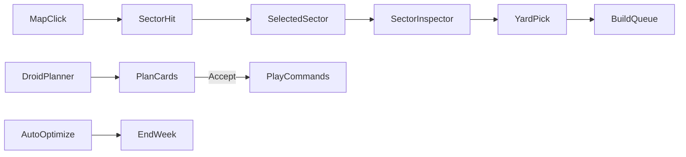

# GalacticSim UX modernization (sector session + Droid)

## Approach

Keep the existing sim loop (end week, hyperspace moves, single ship queue per system, combat, missions). Rebuild the Avalonia session so the **map selects sectors**, fleets show **mid-route**, industry is a **gauged dashboard**, and a **Droid Assistant** plans builds/moves using current `EconomyRules` / `FactionAi`-style heuristics. Silk PE path stays untouched.

Default Droid mode: **Propose → Accept**, plus an **Auto-Optimize** toggle that runs the same planner immediately before End Week.

## 1. Sector-first selection (map + session)

**Session** ([`GalacticGameHost.cs`](d:\novolis\novolis-experimental\src\Novolis.Experimental.Galactic.App\GalacticGameHost.cs)):
- Add `SelectedSector` (`int?`), keep `SelectedSystem` / `SelectedFleet` / `PendingDestination` for orders.
- Map click resolves **sector** first (nearest system’s `SectorId` or sector centroid hit with looser radius); then auto-focus a default yard system in that sector (owned system with highest `FacilityLevel`, else first owned, else nearest).

**Hit-test** ([`RebellionMapProjection.cs`](d:\novolis\novolis-experimental\src\Novolis.Experimental.Galactic.App\RebellionMapProjection.cs), [`GalacticPlayCommands.HandleMapClick`](d:\novolis\novolis-experimental\src\Novolis.Experimental.Galactic.App\GalacticPlayCommands.cs)):
- `HitTestSector(systems, nx, ny)` → `SectorId`.
- Destination clicks: pick a concrete destination **system** inside the clicked sector (owned/enemy/neutral policy: nearest system in that sector to click; for move orders prefer enemy/neutral systems when assaulting).
- Agent: add `selectsector` + enrich snapshot with `selectedSector`, sector system counts, queues.

**Map draw** ([`GalacticMapPresenter.cs`](d:\novolis\novolis-experimental\src\Novolis.Experimental.Galactic.App\GalacticMapPresenter.cs)):
- Soft sector halo / convex hull or centroid ring for selected sector (and muted ownership tint per sector).
- Individual system dots stay as secondary markers; selection highlight is sector-scale, not Rebellion-style single-planet focus.

## 2. Fleets en-route on the map

Today: amber dotted Location→Destination only; parked pip at origin; en-route fleets not selectable.

In `GalacticMapPresenter.Sync`:
- Interpolate fleet marker along the route using `1 - ArrivalTurnsRemaining / max(1, initialEta)` — if initial ETA isn’t stored, use remaining weeks vs a recomputed `HyperspaceRouter` duration (or store `TravelTurnsTotal` on order for accuracy).
- Draw faction-tinted chevron/pip on the route + short ETA badge (`2w`).
- Allow selecting en-route fleets via map click near the interpolated point (inspector shows ETA / cancel is out of scope — no new cancel mechanic).
- Keep green pending-order preview.

Minimal Core touch: optional `FleetState.TravelTurnsTotal` set in `TryOrderMove` so interpolation is stable; gameplay unchanged.

## 3. industrial session: gauges, queues, sector aggregate

**Presentation layer** (new Avalonia controls under App/Avalonia), reading live rules — no opaque DAT decode in this pass:
- Top **gauges**: Treasury, weekly income (`EconomyRules.SectorIncomePerWeek`), committed build spend (sum of active queue costs), fleet power, systems/sectors owned, win progress (`WinControlFraction`).
- **Sector inspector**: ownership mix, loyalty avg, facility levels, parked fleets, threats; list yards with queue ETA bars.
- **Build queue panel**: per-yard single-slot queue (current mechanic) with progress bar, cost, ETA; yard picker within selected sector; Hull 1/2/3 CTAs with affordability/blockade state (`BlockadeRules`).
- Fix inverted yard speed in [`TurnProcessor.TryQueueProduction`](d:\novolis\novolis-experimental\src\Novolis.Experimental.Galactic.Simulation\TurnProcessor.cs): `turns = max(1, ProductionTurnsForHull - (FacilityLevel - 1))` so higher facilities finish faster (mechanics clarification, not a new system).
- Thin facility upgrade: wire unused [`RefinedMaterialsRules`](d:\novolis\novolis-experimental\src\Novolis.Experimental.Galactic.Simulation\RefinedMaterialsRules.cs) into `TryUpgradeFacility` (credit cost from GNPRTB or small constant) + UI button — still one industrial knob, not full Rebellion facility trees.

Troops/personnel remain derived stubs unless already typed (no DAT opaque reverse-engineering in this plan).

## 4. Droid Assistant

New sim helper [`DroidAssistant.cs`](d:\novolis\novolis-experimental\src\Novolis.Experimental.Galactic.Simulation\DroidAssistant.cs) (+ plan DTOs):
- Score owned yards: idle + not blockaded + credits → queue hull (reuse `FactionAi` thresholds / hull 1–3).
- Score fleets: parked at border → set destination toward nearest vulnerable enemy/neutral system; set Assault/Patrol missions.
- Output ordered `DroidPlanStep` list (select sector/system, build, setdestination, confirmmove, setmission) with human labels.

Avalonia panel in [`GalacticMainWindow.cs`](d:\novolis\novolis-experimental\src\Novolis.Experimental.Galactic.App\Avalonia\GalacticMainWindow.cs):
- “DROID” dock: recommendation cards, **Optimize**, **Accept plan**, **Dismiss**, **Auto-Optimize** toggle.
- Accept executes via `GalacticPlayCommands` (same path as player/agent).
- End Week: if Auto-Optimize on, run Accept on a fresh plan then `EndWeek`.

Agent Surface ([`GalacticSessionContract.cs`](d:\novolis\novolis-experimental\src\Novolis.Experimental.Galactic.App\Agent\GalacticSessionContract.cs)):
- `optimize` (preview JSON), `acceptdroid`, `setmission`, `selectsector`; snapshot includes plan + industrial gauges fields.

## 5. UX chrome refresh (Avalonia only)

Evolve [`GalacticStrategyTheme`](d:\novolis\novolis-experimental\src\Novolis.Experimental.Galactic.App\Avalonia\GalacticStrategyTheme.cs) + MainWindow layout:
- Gauge strip under brand; left nav slimmed (Galaxy / Fleets / Industry / Droid / Intel).
- Right rail: Sector · Industry · Fleet context tabs.
- Keep surround layout (chrome outside GL) so native OpenGL does not cover Avalonia.
- Intentional motion: sector halo fade, gauge fill, plan-card slide.

## 6. Verification

- Build App/CLI with `-p:NovolisUseProjectReferences=true`.
- Extend [`GalacticAgentSmoke`](d:\novolis\novolis-experimental\src\Novolis.Experimental.Galactic.App\Agent\GalacticAgentSmoke.cs): `selectsector`, open Industry, `optimize`/`acceptdroid`, mapclick en-route check, endturn with Auto-Optimize off.
- Manual: sector select → yard queue progress → en-route pip moves after weeks → Droid Accept queues + routes.

## Out of scope

- PE Silk cockpit redesign
- Decoding opaque TROOPSD/MANFACSD tables into full Rebellion industry
- Multi-slot production queues or new victory conditions

