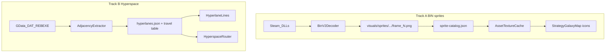

# GalacticSim 1:1 — BIN sprites + real hyperspace (parallel)

## Where we are

| Area | Shipped | Gap |
|------|---------|-----|
| UI bitmaps | [PeResourceBitmapExtractor.cs](d:\novolis\novolis-experimental\src\Novolis.Experimental.Galactic.Formats\Pe\PeResourceBitmapExtractor.cs) + [IndexedDibDecoder.cs](d:\novolis\novolis-experimental\src\Novolis.Experimental.Galactic.Formats\Bmp\IndexedDibDecoder.cs) → **2053** PNGs | Animated BIN sprites (3223 target per [open-rebellion](https://github.com/tdimino/open-rebellion)) |
| Galaxy map | [StrategyGalaxyMap.cs](d:\novolis\novolis-experimental\src\Novolis.Experimental.Galactic.App\StrategyGalaxyMap.cs) + backdrop + [RebellionMapProjection.cs](d:\novolis\novolis-experimental\src\Novolis.Experimental.Galactic.App\RebellionMapProjection.cs) | Map icons still generic (≤64px PE BMP fallback); no BIN frames |
| Hyperlanes | [HyperlaneGraphBuilder.cs](d:\novolis\novolis-experimental\src\Novolis.Experimental.Galactic.Import\HyperlaneGraphBuilder.cs) — same-sector proximity, `MaxLaneDistance = 9` | Not game topology (~897 heuristic edges today) |
| Travel time | [HyperspaceRouter.cs](d:\novolis\novolis-experimental\src\Novolis.Experimental.Galactic.Simulation\HyperspaceRouter.cs) — sector index distance | Not original hop table |
| Sprite DLLs | [ReusableAssetExtractor.cs](d:\novolis\novolis-experimental\src\Novolis.Experimental.Galactic.Import\ReusableAssetExtractor.cs) `ExtractSpriteBins` copies opaque `.bin` | No parse |



**IP / policy:** Read [open-rebellion](https://github.com/tdimino/open-rebellion) / Ghidra notes as **spec only** ([legacy-reference.md](d:\novolis\novolis-experimental\docs\legacy-reference.md)); implement decoders in C# here. No Rust code copy. No local NuGet feeds; run `verify-nuget-only.ps1` before done.

---

## Track A — BIN v2 sprite decode

### A1. Document format (clean-room)

- Add [docs/bin-sprite-format.md](d:\novolis\novolis-experimental\docs\bin-sprite-format.md): record magic, header fields, palette, frame count, compression flags discovered from `ALSPRITE.DLL` / `EMSPRITE.DLL` / `ALBRIEF.DLL` / `EMBRIEF.DLL`.
- Add a small **probe CLI** (e.g. `probe-sprites` in [Program.cs](d:\novolis\novolis-experimental\src\Novolis.Experimental.Galactic.Cli\Program.cs)) that scans DLL bytes, prints candidate BIN offsets/counts, and validates decode success rate (target: high % of carved blobs, comparable to open-rebellion’s “BIN v2” claim).
- Keep raw DLL copies under `binaries/sprite-dll/` for regression fixtures in `%LOCALAPPDATA%` only (not committed).

### A2. Decoder in Formats

New project area under [Novolis.Experimental.Galactic.Formats](d:\novolis\novolis-experimental\src\Novolis.Experimental.Galactic.Formats):

- `Bin/BinV2Decoder.cs` — parse one BIN blob → `BinSprite` (width, height, palette, `IReadOnlyList<BinFrame>` RGBA or indexed→RGBA via shared palette logic with [IndexedDibDecoder.cs](d:\novolis\novolis-experimental\src\Novolis.Experimental.Galactic.Formats\Bmp\IndexedDibDecoder.cs)).
- `Bin/BinDllScanner.cs` — enumerate BIN records inside a sprite DLL image (section-aware + carve fallback).
- `Novolis.Experimental.Galactic.Formats.Tests` (or extend existing tests): golden decode of 3–5 fixed blobs exported once from user install into `_scratch/` (gitignored).

### A3. Extract pipeline

Extend [ReusableAssetExtractor.cs](d:\novolis\novolis-experimental\src\Novolis.Experimental.Galactic.Import\ReusableAssetExtractor.cs):

| Output | Purpose |
|--------|---------|
| `visuals/sprites/{dllKey}/{spriteId:D4}/frame_{n:D2}.png` | Decoded frames |
| `schema/sprite-catalog.json` | `spriteId`, `dll`, `frameCount`, `width`, `height`, optional `tags` |
| Manifest fields | `spriteFrameCount`, `binDecodeRate` |

Replace copy-only `ExtractSpriteBins` with **parse-then-emit**; retain raw DLL copy as optional debug asset.

### A4. Runtime + map icons

- [AssetTextureCache.cs](d:\novolis\novolis-experimental\src\Novolis.Experimental.Galactic.App\AssetTextureCache.cs): load `sprite-catalog.json`; `GetMapSystemIcon(pictureId)` resolves via a **mapping table** (initially heuristic: `pictureId → sprite catalog index`; refine once SYSTEMSD / RE notes expose the real field).
- [StrategyGalaxyMap.cs](d:\novolis\novolis-experimental\src\Novolis.Experimental.Galactic.App\StrategyGalaxyMap.cs): draw frame 0 at fixed NDC scale; keep colored dots as fallback when mapping missing.
- [GalacticBuildPipeline.cs](d:\novolis\novolis-experimental\src\Novolis.Experimental.Galactic.Runtime\GalacticBuildPipeline.cs) / CLI: report `Sprite frames: N` and warn if 0.

### A5. Optional codegen hook

- [dll-codegen.md](d:\novolis\novolis-experimental\docs\dll-codegen.md) “Map ALSPRITE BIN resources to generated loaders”: emit `SpriteCatalog.g.cs` with `ReadOnlySpan` offsets after decoder stabilizes (not blocking play).

**Track A done when:** `build --force` reports thousands of sprite frames; `play` shows recognizable small system/fleet icons on the galaxy map (not encyclopedia portraits, not random large UI BMPs).

---

## Track B — Real hyperspace graph + travel times

### B1. Discover adjacency source

Investigation order (read-only RE, implement here):

1. **REBEXE.EXE** — functions that reference system pairs / sector hops (use existing [PeDllAnalyzer.cs](d:\novolis\novolis-experimental\src\Novolis.Experimental.Galactic.Formats\Pe\PeDllAnalyzer.cs) + new `probe-hyperspace` CLI).
2. **DAT tables** — [SystemsFile.cs](d:\novolis\novolis-experimental\src\Novolis.Experimental.Galactic.LegacyData\Dat\SystemsFile.cs), [SectorsFile.cs](d:\novolis\novolis-experimental\src\Novolis.Experimental.Galactic.LegacyData\Dat\SectorsFile.cs), and unparsed `GData/*.DAT` via [DatRegistry.cs](d:\novolis\novolis-experimental\src\Novolis.Experimental.Galactic.LegacyData\Dat\DatRegistry.cs) for link bitsets / neighbor lists.
3. Cross-check edge count vs original (~200 systems, sparse lane graph — not dense proximity mesh).

Document findings in [docs/hyperspace-topology.md](d:\novolis\novolis-experimental\docs\hyperspace-topology.md).

### B2. Extract + schema

- New [HyperspaceGraphExtractor.cs](d:\novolis\novolis-experimental\src\Novolis.Experimental.Galactic.Import\HyperspaceGraphExtractor.cs) (or extend [ContentSanitizer.cs](d:\novolis\novolis-experimental\src\Novolis.Experimental.Galactic.Import\ContentSanitizer.cs)) to emit:
  - `schema/hyperlanes.json` — `{ systemA, systemB }[]` from game data
  - `schema/hyperspace-travel.json` — keyed `(fromSector, toSector)` or `(fromSystem, toSystem)` → week count
- Deprecate or gate [HyperlaneGraphBuilder.cs](d:\novolis\novolis-experimental\src\Novolis.Experimental.Galactic.Import\HyperlaneGraphBuilder.cs) behind `--heuristic-lanes` fallback only.

### B3. Simulation alignment

- [HyperspaceRouter.cs](d:\novolis\novolis-experimental\src\Novolis.Experimental.Galactic.Simulation\HyperspaceRouter.cs): load travel table; reject illegal moves (no edge); use table ETA instead of `SectorDistance` heuristic.
- [TurnProcessor.cs](d:\novolis\novolis-experimental\src\Novolis.Experimental.Galactic.Simulation\TurnProcessor.cs): fleet movement only along valid edges (if multi-hop, BFS on lane graph).

### B4. Render alignment

- [RouteLines.cs](d:\novolis\novolis-experimental\src\Novolis.Experimental.Galactic.App\RouteLines.cs) / [HyperlaneLines](d:\novolis\novolis-experimental\src\Novolis.Experimental.Galactic.App\StrategyGalaxyMap.cs): unchanged consumer path, new JSON source.
- Visual spot-check: lane density and fleet route lines match reference screenshots (orange faint lines between systems, not hub-and-spoke sector spokes).

**Track B done when:** `hyperlanes.json` generated from game data (not proximity); moving fleet A→B only when connected; ETA matches table for known test pairs.

---

## Integration and verification

```powershell
cd d:\novolis\novolis-experimental
$env:GALACTIC_SOURCE_INSTALL = "D:\Steam\steamapps\common\Star Wars - Rebellion"
dotnet run --project src/Novolis.Experimental.Galactic.Cli -- build --install $env:GALACTIC_SOURCE_INSTALL --force
dotnet run --project src/Novolis.Experimental.Galactic.Cli -- play
pwsh -File d:\novolis\novolis-governance\scripts\verify-nuget-only.ps1
```

Update [parity-roadmap.md](d:\novolis\novolis-experimental\docs\parity-roadmap.md) milestones when each track completes.

---

## Follow-on (out of this sprint)

- STRATEGY UI compositor (bottom bar, cockpit chrome from PE UI atlases)
- Advisor BIN UI (separate from sprite BIN; Phase 6+ in [rebellion_c#_codegen plan](d:\novolis\.cursor\plans\rebellion_c#_codegen_5a7d3e32.plan.md))
- GNPRTB / AI / missions / tactical 3D mesh view

