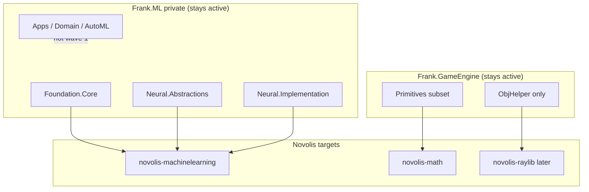

# Selective Frank.GameEngine + Frank.ML migration

## Goals and constraints

- **Migrate now:** renderer-agnostic, packable libraries with tests (or tests that can be ported to TUnit).
- **Do not archive:** [Frank.GameEngine](https://github.com/frankhaugen/Frank.GameEngine) and [Frank.ML](https://github.com/frankhaugen/Frank.ML) stay open on your personal account; use **partial sunset README** blocks (what moved, what remains), not archive banners.
- **Follow existing playbook:** extract/rebrand via [migrate-frank-slice.ps1](d:\novolis\novolis-governance\scripts\migrate-frank-slice.ps1), no git history transfer, TUnit-only tests ([naming.md](d:\novolis\novolis-governance\docs\naming.md)).
- **Respect locked graphics path:** no `Frank.GameEngine.Rendering.*` while [novolis-raylib](d:\novolis\novolis-raylib) is canonical ([gameengine-reference-policy.md](d:\novolis\novolis-governance\docs\gameengine-reference-policy.md)).
- **Frank.ML scope (your choice):** **neural stack only** in wave 1 — defer `Frank.ML.Foundation.AutoMl` (Microsoft.ML) to a later wave.



---

## Phase 0 — Governance and inventory (before code)

Update docs so execution matches “migrate ready parts, keep repos active”:

| Document | Change |
|----------|--------|
| [gameengine-reference-policy.md](d:\novolis\novolis-governance\docs\gameengine-reference-policy.md) | Replace “reference / archive” with **active selective mining**; remove archive README template; add “partial migration” README template pointing to `novolis-math` / `novolis-raylib`. |
| [frank-inventory.md](d:\novolis\novolis-governance\docs\frank-inventory.md) | Move `Frank.ML` from P3 skip → **P1 active (neural subset)**; add GameEngine wave row; note `Frank.Collections` as optional dedupe for `Array2D` (better JSON tests) — **not in scope unless you expand**. |
| [roadmap.md](d:\novolis\novolis-governance\docs\roadmap.md) | Add waves 7 (GameEngine math) and 8 (ML neural); keep `novolis-raylib` active. |
| [frank-naming-and-structure.md](d:\novolis\novolis-governance\docs\frank-naming-and-structure.md) | Add package/folder mappings (below). |
| New briefs | `extraction-briefs/wave-7-gameengine-math.md`, `extraction-briefs/wave-8-machinelearning-neural.md` |

**Personal README (not archive):** prepend a short block per repo, e.g. “Core libraries are moving to Novolis; samples/apps remain here.” Link to Novolis repos/packages. **Do not** run `gh repo archive` on either repo.

---

## Phase 1 — Wave 7: Frank.GameEngine → `novolis-math`

### What is “ready now”

Source is already under [bootstrap/scratch/frank-eval/Frank.GameEngine](d:\novolis\bootstrap\scratch\frank-eval\Frank.GameEngine).

| Frank source | Novolis package | Rationale |
|--------------|-----------------|-----------|
| `Frank.GameEngine.Primitives/SubPrimitives/*` (`Array2D`, `ArrayPosition2D`, partials) | `Novolis.Math.Arrays` | Zero engine deps; **9** existing tests in `Array2DTests.cs` |
| `Polygon`, `PolygonFactory*`, `TriangleMesh`, `IntPoint`, `IntRect`, `Rgba32`, related extensions | `Novolis.Math.Geometry` | Pure geometry; tests in `Polygon*`, `TriangleMeshTests`, `TwoDPrimitivesTests` |
| `ObjHelper` (+ thin `ObjParser` wrapper) | **Defer to wave 7b** → `novolis-raylib` | Depends on `TriangleMesh`/`Polygon`; migrate after geometry lands |

### What to skip (not library-worthy / wrong lane now)

| Area | Reason |
|------|--------|
| `Frank.GameEngine.Rendering.*`, `Core`, `Input`, `Audio` | Coupled to engine, Raylib, SharpHook, NAudio |
| `Frank.GameEngine.Physics` (`PhysicsEngine`, `CollisionDetector*`) | Scene/`GameObject` model; overlaps conceptually with [novolis-physics](d:\novolis\novolis-physics) (`Vector3d`, `IForceModel`, BVH mesh) — **redesign later** as optional `Novolis.Physics.Game2D` only if Raylib games need it |
| `GameObject`, `Scene`, `Scene2D`, `Sprite2D`, `FpsCameraState`, board types | Engine/scene graph, not math |
| `Frank.GameEngine.Assets` (Assimp, source generator) | Heavy; not “ready now” |
| All `samples/`, `AppHost`, benchmarks | Stay on personal repo |

### Target repo work

[`novolis-math`](d:\novolis\novolis-math) is scaffold-only (placeholder `Novolis.Math`). Replace with:

```
src/
  Novolis.Math.Arrays/
  Novolis.Math.Geometry/
tests/
  Novolis.Math.Arrays.Tests/
  Novolis.Math.Geometry.Tests/
Novolis.Math.slnx
```

- Extend [`.novolis/packages.json`](d:\novolis\novolis-math\.novolis\packages.json) with both packages.
- Run `migrate-frank-slice.ps1` on each slice; add replacements: `Frank.GameEngine.Primitives` → `Novolis.Math.*`, namespaces accordingly.
- Port tests from xUnit → **TUnit** using `Novolis.Testing.TUnit` from [novolis-testing](d:\novolis\novolis-testing).
- `dotnet build` / `dotnet test`; add registry stubs in [novolis-registry/packages/](d:\novolis\novolis-registry\packages\).
- Optional aggregate meta-package `Novolis.Math` referencing Arrays + Geometry.

**Overlap note:** [Frank.Collections](https://github.com/frankhaugen/Frank.Collections) also has `Array2D` with stronger JSON serialization tests. Wave 7 uses GameEngine’s copy to honor your request; schedule a **follow-up dedupe** issue to merge Collections JSON helpers into `Novolis.Math.Arrays` if desired.

---

## Phase 2 — Wave 8: Frank.ML neural foundation → `novolis-machinelearning`

### What is “ready now” (neural only)

Clone `frankhaugen/Frank.ML` (private; your `gh` auth already works) into `bootstrap/scratch/frank-eval/Frank.ML`.

| Frank package | Novolis package | Notes |
|---------------|-----------------|-------|
| `Frank.ML.Foundation.Core` | `Novolis.MachineLearning.Core` | `System.IO.Abstractions` only |
| `Frank.ML.Foundation.Neural.Abstractions` | `Novolis.MachineLearning.Neural.Abstractions` | Already `IsPackable` |
| `Frank.ML.Foundation.Neural.Implementation` | `Novolis.MachineLearning.Neural` | Depends only on Abstractions + IO abstractions |

**Tests to port:** `Frank.ML.Foundation.Core.Tests`, `Frank.ML.Foundation.Neural.Tests` → TUnit.

### Explicitly out of wave 8

| Frank area | Reason |
|------------|--------|
| `Frank.ML.Foundation.AutoMl` | Microsoft.ML stack — deferred per your choice |
| `Frank.ML.Domain.*`, `Frank.ML.Presentation.*`, `Frank.ML.App.*`, Aspire | Apps/domain/UI; stay in private Frank.ML |
| `Frank.ML.Domain.MlPipeline` | ML.NET pipeline glue, not foundation |

### Target repo work

[`novolis-machinelearning`](d:\novolis\novolis-machinelearning) is scaffold-only. Same pattern as math:

- Three packable projects + test projects + `Novolis.MachineLearning.slnx`.
- Strip Frank.ML-specific `ThisAssembly.Project` / `RepoRoot` constants unless needed; align `Directory.Build.props` with other `novolis-*` repos (net10.0, warnings as errors).
- **Publishing:** packages will be **public on Novolis-Platform** even though source repo stays private on personal GitHub — document that in README.
- Registry entries + `0.1.0-preview.1` release workflow when CI/trusted publishing is configured.

---

## Phase 3 — Wave 7b (optional, soon after math)

| Frank source | Novolis target |
|--------------|----------------|
| `ObjHelper` / `ObjParser` | `Novolis.Raylib.Assets` or `Novolis.Math.Geometry.Obj` (prefer **raylib** if only used for 3D samples) |

Depends on wave 7 geometry types being stable.

---

## Phase 4 — Personal repo README updates (no archive)

For each migrated slice, add to Frank repo README:

```markdown
> **Partially on Novolis:** `Novolis.Math.Arrays` / `Novolis.Math.Geometry` live in [novolis-math](https://github.com/Novolis-Platform/novolis-math).
> This repo remains the home for samples, experiments, and unmigrated engine code.
```

Equivalent block for Frank.ML pointing at `novolis-machinelearning` neural packages. **No** “repository is archived” language.

---

## Success criteria

- [ ] `novolis-math`: build + TUnit green; no `Frank.*` references in production code
- [ ] `novolis-machinelearning`: neural trio build + TUnit green; AutoML not included
- [ ] Governance docs and extraction briefs updated; inventory/roadmap reflect waves 7–8
- [ ] Frank.GameEngine and Frank.ML **remain unarchived** with partial-migration README
- [ ] Registry JSON for new package IDs (preview versions)
- [ ] Frank.GameEngine rendering/core/samples untouched; Frank.ML apps/domain untouched

## Risk register

| Risk | Mitigation |
|------|------------|
| `Array2D` duplicated vs Frank.Collections | Document dedupe follow-up; single Novolis API |
| GameEngine geometry tied to `System.Numerics.Vector3` vs physics `Vector3d` | Keep math package on `System.Numerics`; adapters at integration boundaries |
| Frank.ML private → public Novolis code | Legal/license already MIT in Frank.ML; ensure LICENSE propagated |
| Policy doc said “archive GameEngine” | Phase 0 doc update before marketing README changes |

## Suggested execution order

1. Governance + naming + briefs (phase 0)
2. Wave 7 `novolis-math` (arrays, then geometry, tests, CI)
3. Wave 8 `novolis-machinelearning` neural (clone Frank.ML, migrate, tests, CI)
4. Personal README partial banners
5. Wave 7b OBJ → raylib when geometry is stable

