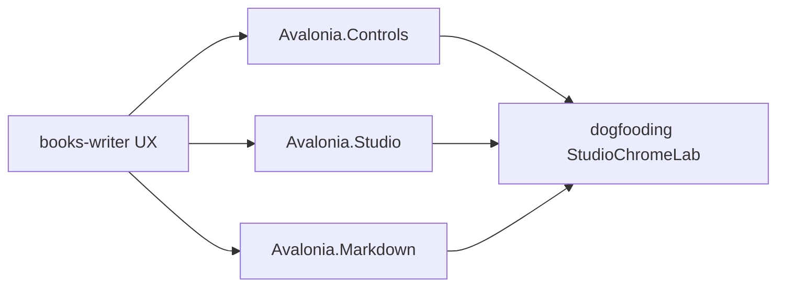

# Generic Avalonia components from books-writer

## Goal

Lift the reusable Avalonia UX from [`D:\repos\books\tools\apps\books-writer`](D:\repos\books\tools\apps\books-writer) into **existing** Avalonia packages, kept **domain-agnostic** (no chapter/book/manuscript types in library APIs). Consumers (Manuscript Studio, StarMapLab, WireFish, etc.) supply labels and DTOs.

**Out of scope:** retargeting books-writer, spellcheck, print/voice settings JSON, reference catalog services, Manuscript Studio product wiring (follow-up).

**In scope consumer:** new dogfood app under [`novolis-dogfooding`](d:\novolis\novolis-dogfooding) that exercises the dialogs, nav list, focus mode, and job panel with fake/`IO.Processes` data.

## Package map (chosen)

| Writer inspiration | Generic home | Public API shape |
|---|---|---|
| Recovery / Conflict / Reference picker chrome | [`Novolis.Avalonia.Controls`](d:\novolis\novolis-avalonia\src\Novolis.Avalonia.Controls) | `ChoiceDialog.ShowAsync(owner, title, message, detail?, options)` → selected option `Id` |
| Go To Chapter | same | `FilteredPickerDialog.ShowAsync<T>(owner, title, items, filter, display)` → `T?` |
| Chapter list row (dirty · # · title · words) | same | `MarkedListItemTemplate` / `MarkedListRow` model: `Marker`, `Leading`, `Primary`, `Trailing` (strings only) |
| Publish jobs list + cancel/open + log | same | `JobQueuePanel` bound to `IJobQueueRow` (no `IO.Processes` package ref) |
| Focus mode / dirty status bar color | [`Novolis.Avalonia.Studio`](d:\novolis\novolis-avalonia\src\Novolis.Avalonia.Studio) | `StudioFocusMode.Set(chromeControls, focused)`; `StudioStatusBrushes.Dirty/Clean` |
| HighlightService dialogue + metadata | [`Novolis.Avalonia.Markdown`](d:\novolis\novolis-avalonia\src\Novolis.Avalonia.Markdown) | Enrich `BookAuthoringStudio.xshd`; add optional `MarkdownSpanAnalyzer` (span list for tests / non-Edit hosts) |

No new `Novolis.Avalonia.Manuscript` package. Keep Controls free of Novolis.IO / Markup package references; apps adapt `ProcessJob` → `IJobQueueRow` and recovery payloads → `ChoiceDialog` options.

## API contracts (concrete)

### Controls

- **`ChoiceOption`**: `(string Id, string Label, bool IsDefault = false, bool IsCancel = false)`
- **`ChoiceDialog`**: code-built `Window` (match existing no-XAML style of Controls/Studio). Buttons from options; Enter activates default; Esc returns cancel id or `null`.
- **`FilteredPickerDialog`**: watermark filter `TextBox` + `ListBox`; live filter via `Func<T, string, bool>`; double-click / Enter confirms; Esc cancels.
- **`MarkedListRow`**: record for list items; factory helper builds a `Control` DataTemplate-equivalent via `MarkedListBox.CreateItem(MarkedListRow)` for code-first apps.
- **`IJobQueueRow`**: `Title`, `StatusLabel`, `Detail`, `LogTail`, `CanCancel`, `CanOpenOutput`, `object? Tag`
- **`JobQueuePanel`**: list + selected log `TextBlock` + Cancel/Open buttons raising `CancelRequested` / `OpenOutputRequested` with the row.

Recovery/Conflict become **app call-sites** using `ChoiceDialog` with ids like `restore` / `discard` / `keep` / `reload` / `compare` — same as writer’s string results, without library knowledge of recovery files.

### Studio

- Extend chrome helpers next to [`StudioChrome`](d:\novolis\novolis-avalonia\src\Novolis.Avalonia.Studio\StudioChrome.cs) / [`StudioWorkspace`](d:\novolis\novolis-avalonia\src\Novolis.Avalonia.Studio\StudioWorkspace.cs):
  - `StudioFocusMode.Apply(bool focused, params Control?[] chrome)` toggles `IsVisible`
  - `StudioStatusBrushes` static dirty/clean brushes (writer’s green/amber dirty bar)

### Markdown

- Update [`BookAuthoringStudio.xshd`](d:\novolis\novolis-avalonia\src\Novolis.Avalonia.Markdown\Highlighting\BookAuthoringStudio.xshd) for:
  - double-quoted dialogue spans
  - `> [!key]` metadata lines / key tokens
  - TK/TODO/FIXME (if not already present)
- Add `MarkdownSpanAnalyzer` mirroring writer [`HighlightService`](D:\repos\books\tools\apps\books-writer\Services\HighlightService.cs) kinds as a small enum + span record; unit-tested without AvaloniaEdit UI. Xshd remains the Edit path; analyzer is the portable/testable twin.

## Implementation steps

1. **Controls**: implement dialogs + marked row + job panel in `src/Novolis.Avalonia.Controls/`; widen package description beyond “packet analyzers”; add `tests/Novolis.Avalonia.Unit/Controls/` coverage for filter predicate, choice default/cancel ids, marked row field mapping, job panel event wiring (headless where possible; dialog logic testable via extracted static helpers if Window show is awkward).
2. **Studio**: add focus-mode + status brushes; document on [`Studio` README](d:\novolis\novolis-avalonia\src\Novolis.Avalonia.Studio\README.md).
3. **Markdown**: xshd + analyzer + tests under existing Markdown test folder.
4. **Wire repo metadata**: update [`Novolis.Avalonia.slnx`](d:\novolis\novolis-avalonia\Novolis.Avalonia.slnx) if needed; ensure unit project references Studio when testing focus helpers; refresh [`.novolis/packages.json`](d:\novolis\novolis-avalonia\.novolis\packages.json) paths for Studio/Markdown/Controls as required by release tooling.
5. **Dogfood**: `novolis-dogfooding/apps/avalonia/StudioChromeLab` (WinExe Avalonia) demonstrating:
   - ChoiceDialog (fake recovery + conflict)
   - FilteredPickerDialog over a string list
   - MarkedListBox
   - JobQueuePanel over in-memory rows (and optionally one real `ProcessJob` via adapter)
   - Focus mode toggle + dirty status brush
   - Package refs only (`2026.1.*`); register in `Directory.Packages.props` + `Novolis.Dogfooding.slnx` + README table
6. **Publish path**: after merge, CI publishes Avalonia packages to GitHub Packages; dogfood restores floating `2026.1.*` (bootstrap push `2026.1.99`-style only if GPR lacks versions before CI).

## Non-goals / explicit skips

- `Novolis.Avalonia.Manuscript` package
- ProjectReference from Avalonia → books repo or sibling `novolis-apps`
- SpellService, PrintSettingsService, VoiceMapService, CatalogService
- Changing StarMapLab (already has selectable jumps)

## Done when

- Unit tests green for analyzer, filter, choice resolution, job panel events
- `StudioChromeLab` builds/runs against GPR packages
- `verify-nuget-only` clean for touched repos (no cross-repo ProjectReference)
- Public APIs have XML docs; Controls/Studio/Markdown READMEs mention the new types

