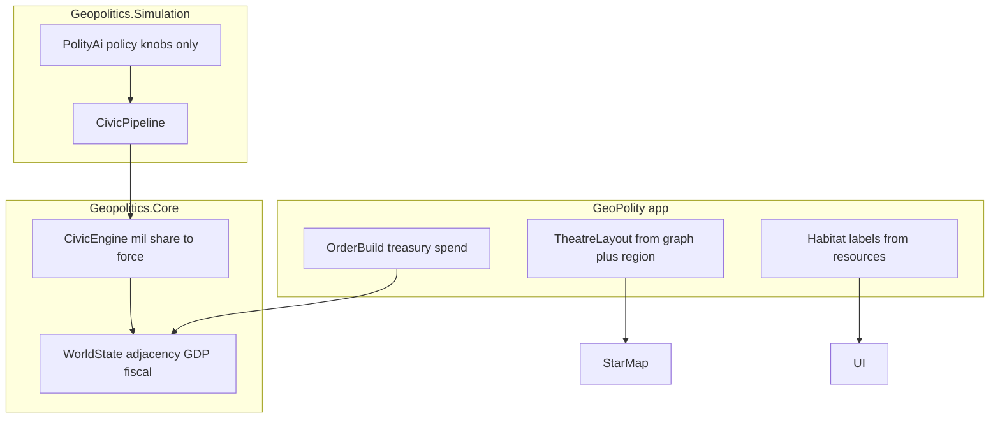

# Geopolitics Core purity (1C + 2B)

## Locked decisions

- **Province role:** delete `HabitatKind` / `Province.Habitat` now. No replacement until a mechanic needs `SettlementFunction`. GeoPolity labels habitats from `ResourceWeights` + `Coastal`.
- **Rename depth:** theatre strip + force rigor. Defer `TechLevel` / `PowerScore` / `Continent` renames.

## Boundary (Economy-aligned)

Extend [Core README](d:\novolis\novolis-geopolitics\src\Novolis.Geopolitics.Core\README.md) **Out of boundary** to explicitly ban:

- Visual / map presentation (`MapX`/`MapY`, chart layout, UI short-labels)
- App theatre vocabulary (System / Habitat / Cluster) as model types
- Instant player force procurement (app concern); Core only grows force via fiscal stock–flow

Mirror Economy’s line: *Resource holdings & transfers* in; *Visual/map presentation* out.

## 1. Core: remove presentation fields

In [Entities.cs](d:\novolis\novolis-geopolitics\src\Novolis.Geopolitics.Core\Entities.cs), [Habitats.cs](d:\novolis\novolis-geopolitics\src\Novolis.Geopolitics.Core\Habitats.cs), [WorldSeed.cs](d:\novolis\novolis-geopolitics\src\Novolis.Geopolitics.Core\WorldSeed.cs), [ProceduralWorldGenerator.cs](d:\novolis\novolis-geopolitics\src\Novolis.Geopolitics.Core\ProceduralWorldGenerator.cs):

- Delete `HabitatKind`, `HabitatRules`, `Province.Habitat`, seed `Habitat` + `ParseHabitat`.
- Delete `Polity.MapX/MapY`, `Province.MapX/MapY` and all generator theatre-chart layout that only exists to fill them.
- Keep continent **grid / adjacency / bridges** as structural generation (science); drop cluster-offset chart coordinates.
- Regen embedded `world-seed.json` via SeedGen after DTO change (optional fields can vanish; old seeds ignore missing habitat/map).

## 2. Core/Sim: force event + AI rigor

- Rename `GeoEventKind.MilitaryBuild` → `ForceExpansion` in [Ids.cs](d:\novolis\novolis-geopolitics\src\Novolis.Geopolitics.Core\Ids.cs); update emitters/consumers.
- [PolityAi.cs](d:\novolis\novolis-geopolitics\src\Novolis.Geopolitics.Simulation\PolityAi.cs): remove ad-hoc `Military.Land += …` and direct `ForceExpansion` spam. AI only adjusts `StateFiscalPolicy.MilitaryShare` (and diplomacy); force stocks change via `CivicEngine.ApplyMonth` only.
- Keep `CivicEngine` monthly mil spend → Land/Air/Naval increments (stock–flow); comment in science terms (capability accumulation), not RTS “build”.

## 3. Labels out of Core

- Move `SupranationalCatalog.ShortLabel` usage for UI into GeoPolity (or a thin app helper). If Core keeps a catalog name enum, leave **identifiers**; drop presentation abbreviation helpers from Core if they exist only for UI.
- Delete any Core `*ShortLabel*` tied to habitats.

## 4. GeoPolity: own theatre presentation

- [TheatreMapProjection.cs](d:\novolis\novolis-apps\src\GeoPolity\Avalonia\TheatreMapProjection.cs): compute layout from polity id + `Continent` (deterministic cluster grid / hash) — **no Core coords**. Same visual intent, app-owned.
- [SystemDetailPanel.cs](d:\novolis\novolis-apps\src\GeoPolity\Avalonia\Views\SystemDetailPanel.cs): replace `HabitatRules.ShortLabel` with local label from dominant `ResourceWeights` + `Coastal`.
- [HeadlineFeedController](d:\novolis\novolis-apps\src\GeoPolity\Session\HeadlineFeedController.cs) / agent: map `ForceExpansion` → BUILD tag; player `OrderBuild` may still emit `ForceExpansion` as an app-driven stock change (documented as player lever outside monthly civic settlement).
- Update [TheatreBuildTests](d:\novolis\novolis-apps\tests\GeoPolity.Unit\TheatreBuildTests.cs): assert projection point count = polities; drop MapX/Y and habitat-diversity Core asserts; add assert that projection coords are non-degenerate from app layout.
- Update [GeoPolity README](d:\novolis\novolis-apps\src\GeoPolity\README.md) + Core README / layering: theatre vocab is **UI-only**.

## 5. Docs + verify

- Expand Core **Out of boundary** and [layering.md](d:\novolis\novolis-geopolitics\docs\layering.md) Non-goals with visual/map ban.
- `dotnet test` geopolitics unit + GeoPolity.Unit with `-p:NovolisUseProjectReferences=true`.

## Out of scope

- `TechLevel` / `PowerScore` / `Continent` → `MacroRegion` renames
- Adding `SettlementFunction` mechanics
- GL / TwoD / multiplayer

