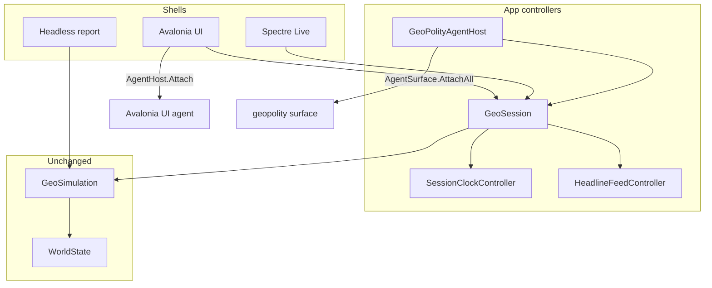

# GeoPolity Avalonia + Agent Surface

## Locked approach

- **Bridge-first Avalonia** (Studio + Briefing + Controls) — same Cap2/Sins choice. **No** `Novolis.Avalonia.Gaming` / `TwoDSceneControl` in this slice (province map can be a later Canvas/StarMap control).
- **Shared session controllers** behind all shells: Avalonia UI, Spectre Live, Agent `Execute`, and headless all call the same bridge API — never tick/`Advance` from UI code paths that bypass it.
- **Two agent planes** (Sins pattern):
  1. **Session** — `Novolis.Agent.Surface` (`geopolity`, HTTP **18857** / TCP **18858**)
  2. **UI** — `Novolis.Avalonia.Agent` `AgentHost.Attach` on the main window when Avalonia runs
- **Modes:** `--mode avalonia` (default when no flags), `--mode spectre`, `--headless` (keep years report). Agent Surface attaches for Avalonia + Spectre; skip on pure headless batch unless `--agent` is passed (default: attach on interactive only).

Layering stays: Core civic/fiscal + Simulation tick unchanged; app only observes and enqueues bridge commands ([docs/layering.md](d:\novolis\novolis-geopolitics\docs\layering.md)).



## Controllers to add

Extract from today’s [`Program.cs`](d:\novolis\novolis-geopolitics\apps\GeoPolity\Program.cs) / [`Dashboard.cs`](d:\novolis\novolis-geopolitics\apps\GeoPolity\Dashboard.cs):

| Type | Responsibility |
|------|----------------|
| `GeoSession` | Owns `WorldState`, `GeoSimulation`, opening ownership snapshot; `Pulse()`, `RefreshHeadlines()` |
| `SessionClockController` | `Running` (default **false** / HardPause), `DaysPerPulse`, `PulseMs`, speed presets 1–5 (day/week/month/year/5y), Space toggle |
| `HeadlineFeedController` | Event cursor → capped headline queue; same filter as `Dashboard.IsHeadline` |
| `GeoSessionCommands` | Pure command helpers: `Pause`, `Resume`, `ToggleRun`, `SetSpeed(preset)`, `Step(days)`, `Quit` — used by keys + Agent |
| `GeoPolityAgentHost` | Implements `IAgentHost`; `Execute` → `GeoSessionCommands`; `Snapshot.StatusLines` = date, running, speed, wars, mean legit/approval, top power names |

No changes to `PolityAi` (sim AI). “Controllers” here means **bridge/session** controllers, not nation AI.

## Avalonia UI (v1)

New under [`apps/GeoPolity`](d:\novolis\novolis-geopolitics\apps\GeoPolity):

```text
Avalonia/
  GeoPolityApp.cs
  GeoPolityAvaloniaHost.cs     # AppBuilder + attach surfaces
  MainWindow.cs                # Studio chrome + panels
  Views/
    CommandPanel.cs             # date, clock, wars, civics, campaign (from Dashboard left)
    TheatrePanel.cs            # continent bars + org list
    HeadlinePanel.cs           # FeedPanel-style headlines
Agent/
  GeoPolitySessionContract.cs  # [AgentSurface("geopolity", ...)]
  GeoPolityAgentHost.cs
  GeoPolityActionIds.cs
Bridge/
  GeoSession.cs
  SessionClockController.cs
  HeadlineFeedController.cs
  GeoSessionCommands.cs
```

**UI packages** (PackageReference only): `Avalonia`, `Avalonia.Desktop`, `Avalonia.Themes.Fluent`, `Novolis.Avalonia.Studio`, `Novolis.Avalonia.Briefing`, `Novolis.Avalonia.Controls`, `Novolis.Avalonia.Agent`, `Novolis.Avalonia.Agent.Protocol`, `Novolis.Agent.Surface`. Keep Spectre for `--mode spectre`.

**Visual direction:** navy/teal + copper amber tramp-bridge feel (reuse steelblue/teal/darkorange from current Spectre UI); Fluent theme tuned with Studio chrome — not purple SaaS.

**Tick binding:** `DispatcherTimer` (or Task+`Post`) at `PulseMs`; if `SessionClockController.Running` then `GeoSession.Pulse()` → `sim.Advance(daysPerPulse)` → refresh view models. HardPause: paused by default; modal overlays (if any) also freeze via session flag.

**Stable agent ids:** `AgentProperties.SetId` on Run/Pause, speed buttons, headline list (`geopolity.run`, `geopolity.speed.day`, …).

## Agent Surface contract

Mirror Galactic/Sins:

```csharp
[AgentSurface("geopolity",
    HttpPort = 18857, TcpPort = 18858,
    EnableEnv = "NOVOLIS_GEOPOLITY_SESSION",
    MarkerPrefix = "novolis-geopolity-session",
    Description = "GeoPolity bridge: pause, speed, step, snapshot")]
[AgentAction("pause")]
[AgentAction("resume")]
[AgentAction("toggle")]
[AgentAction("setspeed", Params = "preset|1-5")]
[AgentAction("step", Params = "days|1..3650")]
[AgentAction("advanceyears", Params = "years|1..100")]  // headless-style burst
```

`Hello`/`Snapshot`/`Actions`/`Execute`/`Continue`/`Subscribe` all implemented; `Continue`/decision events unused (no decision gate yet). Attach with `AgentAttachOptions` HTTP+IPC+TCP on interactive startup; dispose on quit. Log `HttpBaseUrl` once.

Avalonia path also: `AgentHost.Attach(mainWindow)` for `ui.*` tree/screenshot/click (complementary to session surface).

## Program entry rewrite

[`Program.cs`](d:\novolis\novolis-geopolitics\apps\GeoPolity\Program.cs) becomes a thin router:

1. Parse `--mode avalonia|spectre`, `--headless`, `--years`, optional `--agent`
2. Load `DefaultWorld` + construct `GeoSession`
3. Route: Avalonia host / Spectre Live loop / headless report
4. Spectre keyboard path calls `GeoSessionCommands` (same as Agent)

Update [`README.md`](d:\novolis\novolis-geopolitics\README.md) with Avalonia default + agent ports + env `NOVOLIS_GEOPOLITY_SESSION`.

## Tests

- Unit: `SessionClockController` speed presets; `GeoSessionCommands` pause/step advances day; Agent host `Execute("step")` against in-memory session (no HTTP required)
- Keep existing Core/Sim tests untouched
- Manual smoke: Avalonia UI + `GET http://127.0.0.1:18857/agent/document`

## Out of scope (this plan)

- GL globe / `GameShell` / province Silk map
- Player-nation diplomacy UI (acceptance dialogs)
- Publishing new packages (app stays in-repo; Platform ProjectRef mode for Avalonia packages)

