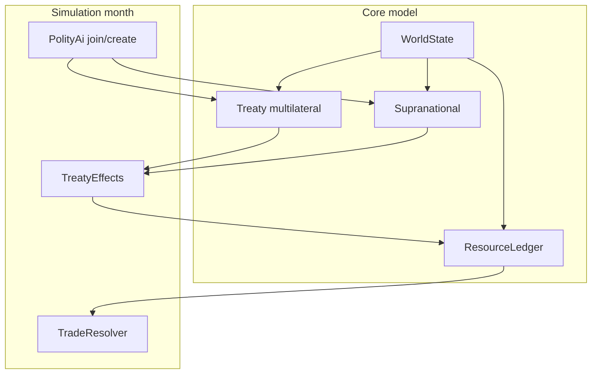

# GeoPolity Diplomacy Depth (SP2-inspired)

## Inspiration (disk, not shipped)

Read-only reference from local Steam SDK ([`D:\Steam\steamapps\common\SuperPower 2\Extras\SDK\SDK1.5.7.zip`](D:\Steam\steamapps\common\SuperPower 2\Extras\SDK\SDK1.5.7.zip)):

- `GTreaty` is **multilateral** (Side A / Side B / pressure, name, creator, suspend) — [`sp2_treaty.h`](d:\novolis\artifacts\sp2-sdk-peek\SDK1.5.7\includes\common_lib\sp2_treaty.h)
- `ETreatyType`: Alliance, MilitaryAccess, EconomicPartnership, CommonMarket, EconomicAid, EconomicEmbargo, WeaponTrade(+Embargo), ResearchPartnership, CulturalExchanges, Annexation, … — [`sp2_constants.h`](d:\novolis\artifacts\sp2-sdk-peek\SDK1.5.7\includes\common_lib\sp2_constants.h)
- AI joins/creates by type with soft caps (`CreateOrJoinTreaty`, e.g. ≤3 CommonMarkets) — [`sp2_common_market.cpp`](d:\novolis\artifacts\sp2-sdk-peek\SDK1.5.7\Server\Source\sp2_common_market.cpp)

**IP lock:** homage formulas only; never commit SDK extracts, GDB, or SP2 string tables. Keep [`docs/seed-attribution.md`](d:\novolis\novolis-geopolitics\docs\seed-attribution.md) + README homage notice. Ensure `artifacts/sp2-sdk-peek` stays gitignored / deleted after use.

Supreme Ruler–style dept micromanagement stays out of scope; we take SP2’s political/economic treaty + resource-sharing pillars.

## Gap today

[`Treaty`](d:\novolis\novolis-geopolitics\src\Novolis.Geopolitics.Core\Entities.cs) is bilateral `A`/`B` with thin `Peace|Alliance|Trade`. Trade has **no economic effect**. No resources, no multilateral blocs, no named orgs.

## Locked design



### 1. Multilateral treaties (replace bilateral-only)

Evolve `Treaty` to SP2-shaped (original C#):

- `Id`, `Name`, `Kind`, `Creator`, `SignedDay`, `ExpiresDay`, `Active`
- `Members` (`HashSet<PolityId>`) for single-side instruments (Alliance, CommonMarket, EconomicPartnership, ResearchPartnership, MilitaryAccess)
- `SideA` / `SideB` for directed instruments (EconomicEmbargo, EconomicAid, WeaponTradeEmbargo)
- Drop the old 2-field `A`/`B` shape; migrate helpers on `WorldState` / `Diplomacy`

**Kinds in this slice** (subset of SP2, enough for depth):

| Kind | Effect |
|------|--------|
| `Alliance` | Mutual defense (existing join-war); relation floor |
| `MilitaryAccess` | Soft combat bonus when attacking from allied/access neighbor |
| `EconomicPartnership` | Monthly GDP production bonus scaled by partners’ GDP share (homage to EP constants) |
| `CommonMarket` | Resource surplus→deficit fill among members **before** world market |
| `EconomicAid` | SideA pays SideB treasury transfer (capped % of donor budget) |
| `EconomicEmbargo` | Block SideA↔SideB resource trade |
| `ResearchPartnership` | Tech progress multiplier among members |
| `Peace` | Directed bilateral ceasefire (SideA/SideB size 1 each) — keep war cooldown |

Legacy `TreatyKind.Trade` maps to `EconomicPartnership` (or delete and regenerate seed consumers).

### 2. Supranationals

New first-class `Supranational`:

- `Id`, `Name`, `ContinentHint` (optional), `MemberIds`, `Charter` flags: `HasCommonMarket`, `HasAlliance`, `HasResearchPact`
- At seed time, create **one org per continent** (8) with the continent’s top ~6 polities by GDP; wire charter → linked multilateral treaties (same member set)
- Orgs are joinable/leavable; leaving breaks linked treaty membership and costs relation (−10 homage to SP2 leave penalty)
- Voting weight = GDP share (used later; MVP: AI join if relation to median member ≥ threshold)

This is the “supra-national” layer the user asked for — not a full UN sim, but persistent named blocs with economic + military charters.

### 3. Resources (enables real trade alliances)

Add compact resource model (not full `Novolis.Economy`):

- `ResourceKind`: `Food`, `Energy`, `Materials`, `Goods`, `MilitaryGoods`, `Rare` (6)
- Per polity monthly: `Production[k]`, `Consumption[k]` derived from owned provinces (population/wealth/coastal/tech) + military upkeep → MilitaryGoods
- `TradeResolver` monthly order:
  1. Domestic balance
  2. CommonMarket internal clear (members first)
  3. World market among non-embargoed pairs (GDP-weighted sellers)
  4. Shortages → stability / GDP drag; surpluses → treasury crumbs

Province seed: add per-province resource weights (procedural); regenerate `world-seed.json` via SeedGen.

### 4. Simulation / AI

- Month pipeline: budget → **resources + treaty effects** → AI
- AI (inspired by SP2 EHE caps): create/join Alliance / CommonMarket / EconomicPartnership / ResearchPartnership; prefer continent neighbors; soft global caps (~3 AI-created CM/Alliance waves); embargo rivals when relation &lt; −40 and at war or bordering
- Alliance defense: keep/extend defender-ally join

### 5. Bridge + tests

[`apps/GeoPolity/Program.cs`](d:\novolis\novolis-geopolitics\apps\GeoPolity\Program.cs):

- Rows: active orgs, CM membership counts, global resource shortage index, embargo count
- Headless report: orgs, CM clears, embargoes, EP GDP boost aggregate

Tests: multilateral join; CM fills deficit; embargo blocks pair; EP raises GDP vs control; org leave drops membership; 50y smoke still exits 0.

### 6. Docs

- [`docs/diplomacy-homage.md`](d:\novolis\novolis-geopolitics\docs\diplomacy-homage.md): maps our kinds → SP2 pillars (homage, not parity); no code quotes from SDK
- Update README feature list

## Out of scope (this pass)

Unit designs / TO&E, nukes, espionage, annexation treaties, full government types, Novolis.Economy bridge, Raylib/Avalonia globe.

## Verification

```powershell
dotnet test d:\novolis\novolis-geopolitics\tests\Novolis.Geopolitics.Unit\Novolis.Geopolitics.Unit.csproj
dotnet run --project d:\novolis\novolis-geopolitics\apps\GeoPolity -- --headless --years 50
```

