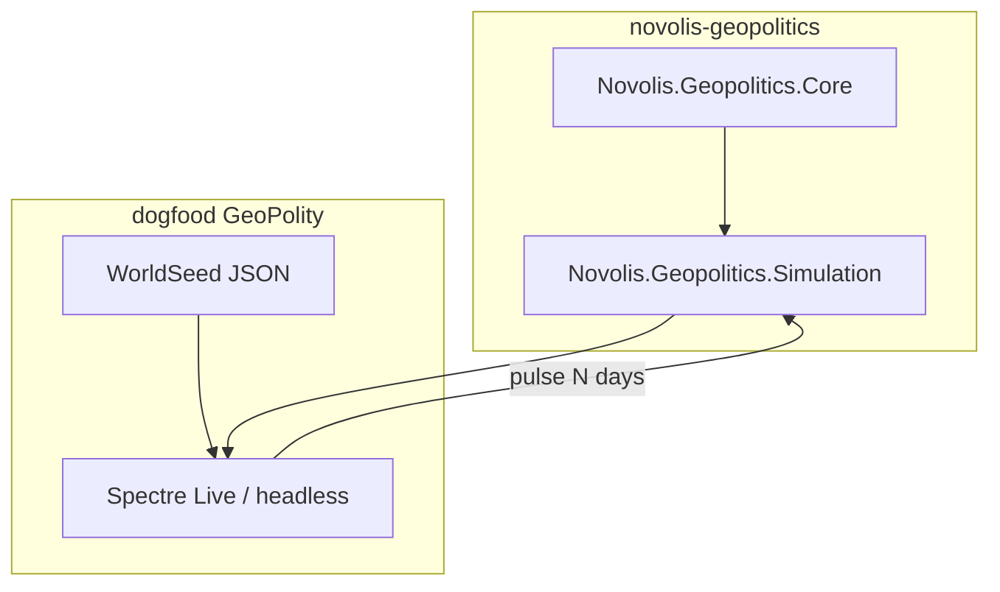

# GeoPolity — SP2 homage (full-world tick)

## Locked decisions

- **Homage only:** no SuperPower 2 install path, SDK, GDB, textures, or string tables. Inspiration is pillar-level (countries, regions, military, diplomacy, economy), not parity.
- **MVP loop:** full-world day/month tick with ~200 AI polities; thin Spectre Live + `--headless` report (NearSolPolity pattern), not a Raylib globe.
- **Package family:** new orthogonal repo [`d:\novolis\novolis-geopolitics`](d:\novolis\novolis-geopolitics) — **not** under `Novolis.Simulation.*` (spatial stack) and **not** inside Economy (diplomacy/combat are explicitly out of Economy Core boundary).
- **Economy coupling:** MVP uses **lightweight polity scalars** (treasury, tax, military budget, stability). Do **not** run `EconomySimulation.AdvanceAsync` for all 200 nations. Optional later bridge: player nation ↔ `Novolis.Economy.*`.
- **World data:** embed original seed JSON (~200 countries, ~800–1200 provinces, adjacency, starting armies/GDP priors). Generate once from **public-domain** Natural Earth (or equivalent) offline; commit only the compact Novolis seed + attribution — never SP2 `DATABASE.GDB`.

## Architecture

**Turn model (MVP):**

1. **Day tick:** relation drift, mobilization/attrition, war front resolution on contested edges, treaty expiry checks, event log append.
2. **Month tick:** budget (tax in → military/civ out), research/tech level +1 progress (simple), AI agenda (war / peace / alliance / build).
3. **AI:** deterministic seeded heuristics per polity (power ratio, neighbor threat, alliance obligations) — no ML.

## Package layout

| Project | Responsibility |
|---------|----------------|
| `Novolis.Geopolitics.Core` | `PolityId`, `ProvinceId`, `WorldState`, ownership map, adjacency, `RelationMatrix`, `Treaty`, `War`, `MilitaryForce` (abstract strength by domain: land/air/naval), event records |
| `Novolis.Geopolitics.Simulation` | `GeoClock`, `DayPipeline` / `MonthPipeline`, combat resolver, AI controllers, `Advance(days)` |
| Unit tests | Seed load, adjacency invariants, war flips ownership, treaty blocks attack, 50-year headless smoke stability |

Register packable projects in Platform slnx via [`d:\novolis\novolis-governance\build\Generate-Platform-Slnx.ps1`](d:\novolis\novolis-governance\build\Generate-Platform-Slnx.ps1) when ready to publish `2026.1.*` to GPR. Until first publish, dogfood may use ProjectReference **only** through Platform slnx / local ProjectRef mode — never sibling hacks in committed consumer csproj for cross-repo; for brand-new unpublished packages, keep the dogfood app **in the same repo** initially **or** develop against Platform ProjectRef mode after map regen.

**Pragmatic MVP wiring:** put Core + Simulation + tests + dogfood host all under `novolis-geopolitics` for the first shippable loop (same-repo ProjectReference is fine). Add a thin pointer app under dogfooding later once packages hit GPR — optional follow-up.

## Dogfood UI

Path: [`d:\novolis\novolis-geopolitics\apps\GeoPolity`](d:\novolis\novolis-geopolitics\apps\GeoPolity) (Spectre.Console Live).

Mirror [`NearSolPolity/Program.cs`](d:\novolis\novolis-dogfooding\apps\economy\NearSolPolity\Program.cs):

- Live: year/day, active wars, top-10 power, last N events, speed keys
- `--headless --years 50`: print war count, ownership churn, insolvency, treaty totals
- No Inter/purple SaaS chrome — mono tables fine for this debug bridge

## MVP feature slice (pillars)

| Pillar | In MVP | Deferred |
|--------|--------|----------|
| Provinces + ownership | Yes | Cultural/religious layers |
| Relations + treaties (peace, alliance, trade) | Yes | Espionage, UN-style orgs |
| Wars + front combat | Abstract strength on borders | Unit designs, nukes |
| Budget / tax / military spend | Scalars | Full `Novolis.Economy` |
| Research | Single tech level | Multi-tree |
| UI | Thin Spectre | Globe map, Avalonia UI |
| Multiplayer | No | Later |

## IP / open source

- Original C# under Novolis license; seed data attributed as derived from public geo sources.
- README states **spiritual homage**, not affiliated with GolemLabs / THQ Nordic / SuperPower.
- Do not unpack or vendor `D:\Steam\steamapps\common\SuperPower 2\Extras\SDK`.

## Verification

- Unit tests green for Core + Simulation
- Headless 50-year run exits 0 with bounded event log
- `pwsh -File d:\novolis\novolis-governance\scripts\verify-nuget-only.ps1` (and project-ref checks) once packages are wired for publish — no local feeds

