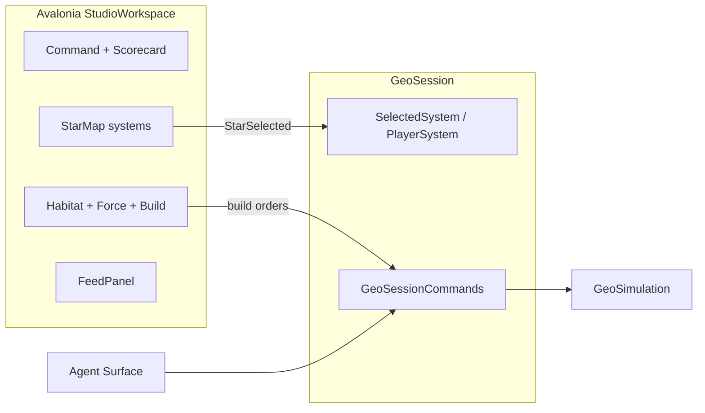

# GeoPolity theatre + military build

## Context

Avalonia host moved to [`d:\novolis\novolis-apps\src\GeoPolity`](d:\novolis\novolis-apps\src\GeoPolity). Today it is a clock + text dashboard (`CommandPanel` / continent bars / feed). Core has province graphs and auto fiscal mil growth, but **no map coords**, **no player polity**, **no build commands**.

**Locked defaults**
- **Presentation vocabulary:** Polity → **System**, Province → **Habitat**, Continent → **Cluster** (UI/docs only; Core types stay `Polity` / `Province`).
- **Player control:** one player system (highest starting GDP after load); AI runs everyone else. Player can set mil budget share and order Land/Air/Naval builds that spend treasury.
- **Map stack:** `StudioWorkspace` + `StarMapControl` (Sins pattern) — **no** Gaming/`TwoDSceneControl` in this slice.
- Kernel layering unchanged: UI/Agent only call `GeoSessionCommands`; `CivicEngine` still settles monthly stocks.

## 1. Core: spatial layout for theatre

In [`Novolis.Geopolitics.Core`](d:\novolis\novolis-geopolitics\src\Novolis.Geopolitics.Core):

- Add `MapX` / `MapY` on `Polity` (system chart position).
- Add `MapX` / `MapY` on `Province` (local habitat offset around home system; used in detail rail, not StarMap v1).
- Add `HabitatKind` enum on Province (`World`, `Orbital`, `Outpost`, `Industrial`, `Agri`) — rolled in generator for legibility.
- Persist in [`WorldSeed.cs`](d:\novolis\novolis-geopolitics\src\Novolis.Geopolitics.Core\WorldSeed.cs) DTO fields (optional with fallbacks for old seeds).
- Update [`ProceduralWorldGenerator.cs`](d:\novolis\novolis-geopolitics\src\Novolis.Geopolitics.Core\ProceduralWorldGenerator.cs): **keep** the existing continent grid; write cell `(col,row)` scaled into world `MapX/MapY` (cluster offset so 8 continents don’t overlap); place habitats in a small ring around the system. Regen embedded `world-seed.json` via SeedGen.

Edges for StarMap: one edge per **inter-polity border** (share province neighbors across polities) + light intra-cluster links already implied by generator bridges.

## 2. Session: focus + military orders

Extend [`GeoSession`](d:\novolis\novolis-apps\src\GeoPolity\Session\GeoSession.cs) / commands:

| API | Behavior |
|-----|----------|
| `PlayerSystemId` | Set at load = max GDP polity |
| `SelectedSystemId` | StarMap / list selection |
| `SelectSystem(id)` | Focus + status note |
| `SetMilitaryShare(share)` | Player polity only; clamps; syncs `Policy` + mirrors |
| `OrderBuild(domain, amount)` | Player only; cost from treasury (`amount * unitCost`); adds to Land/Air/Naval immediately; emits `MilitaryBuild` event / headline |

`OrderBuild` is the **player lever**; CivicEngine monthly build remains for AI and baseline. Headless/AI unchanged.

Agent actions (extend contract): `selectsystem`, `setmilshare`, `build` (`domain|land,air,naval` + `amount`), keep clock actions. Snapshot adds `player`, `selected`, force totals, treasury.

## 3. Avalonia: rich Studio theatre

Add package `Novolis.Avalonia.StarMap`. Rebuild MainWindow as **StudioWorkspace**:

| Region | Controls | Content |
|--------|----------|---------|
| Center | `StarMapControl` | Systems as points (label = polity name), edges = borders; ship marker on **player** system; select → focus |
| Left rail | `DualMetricStrip`, `ScorecardView`, `MetricTableView`, clock toolbar | Date/clock, wars/blocs scorecard, top power / cluster summary |
| Right rail | `TreeDetailsView` or stacked panels, `MarkedListBox`, `JobQueuePanel`, build buttons | Selected system: gov/civics/GDP/treasury; habitat list (kind, owner, resources); force Land/Air/Naval; mil-share slider + Build Land/Air/Naval |
| Bottom | `FeedPanel` | Existing headlines (tag WAR/PEACE/BUILD) |

Projection helper `TheatreMapProjection` (app-local, Sins `CaptainMapProjection` style): `WorldState` → `StarMapPoint`/`StarMapEdge`. Navy/teal/copper brushes; cluster tint via point styling only where StarMap allows (selection + ship marker); force readouts stay in the rail (StarMap has no faction-color API).

Stable agent ids: `geopolity.map`, `geopolity.build.land|air|naval`, `geopolity.milshare`, `geopolity.habitats`, plus existing run/speed ids.

Replace thin `TheatrePanel` continent bars with the StarMap; keep a compact cluster legend in the left scorecard.

## 4. Docs + tests

- Update GeoPolity README: theatre vocabulary, player build, agent actions, run command under `novolis-apps`.
- Unit tests (GeoPolity.Unit or geopolitics unit): seed has non-zero `MapX/Y`; `OrderBuild` spends treasury and raises force for player only; `SelectSystem` updates focus; map projection point count = polity count.
- Manual smoke: Avalonia select system → build naval → see force/treasury change; `GET :18857/agent/document` + `build` command.

## Out of scope

- GL / `GameShell` / TwoD scene
- Full diplomacy UI dialogs
- Multi-player or hotseat
- Habitat-level combat placement (forces stay polity-scoped)

