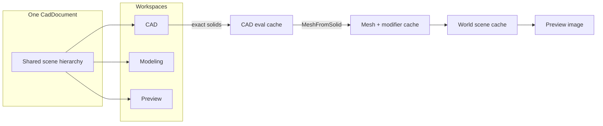

# One document, three workspaces (CAD / Modeling / Preview)

## Pivot from prior plan

Previous plan treated hard-surface ops as a flat toolkit on entity CAD-light. **New spine:** one persistent model, one shared hierarchy, three workspace lenses. Ops still land in layers (CAD generators vs Modeling modifiers vs Preview effects), not one mega-geometry type.

Product wording: **CAD / Modeling / Preview** only — no Cinema 4D / Calypso branding in UI or docs for this feature.

## Reality check (unchanged base)

Today:

- Flat [`CadEntity`](novolis-avalonia/src/Novolis.Avalonia.Cad/Primitives/CadDocument.cs) list; `ParentId` unused as a real tree
- UI is **Draft | Model** only ([`CadEditorSurface`](novolis-avalonia/src/Novolis.Avalonia.Cad/Ui/CadEditorSurface.cs), [`CadViewMode`](novolis-avalonia/src/Novolis.Avalonia.Cad/Primitives/CadDocument.cs))
- Schema stubs: boolean / weld / instance / arrayInstance — **not evaluated**; renderer skips them
- Tessellation: [`CadPhysExporter`](novolis-avalonia/src/Novolis.Avalonia.Cad/Services/CadPhysExporter.cs); mesh math: [`TriangleMesh`](novolis-math/src/Novolis.Math.Geometry/TriangleMesh.cs)
- Session mutations via [`CadSessionService.Execute`](novolis-avalonia/src/Novolis.Avalonia.Cad/Session/CadSessionService.cs)
- Shapes/materials are thin (`shapeId`, string `Material`); document has a single orbit [`CadCamera`](novolis-avalonia/src/Novolis.Avalonia.Cad/Primitives/CadDocument.cs) — not a scene light/camera graph

**Locked geometry policy:** analytic CSG feature tree for CAD solids (no commercial B-rep NuGet). Tessellate explicitly via **Mesh From Solid** adapter. Mesh modifiers never silently destroy the CAD source.



## User-facing shell

Top-level workspaces (replace Draft/Model toggle):

```text
[ CAD ] [ Modeling ] [ Preview ]
```

Shared left: **scene tree** (same nodes, view-filtered projection). Center: viewport. Right: properties for the active workspace. Toolbars and selection semantics swap with workspace.

| Workspace | Answers | Primary selection | Tools focus |
|-----------|---------|-------------------|-------------|
| **CAD** | What exact objects exist and how are they constructed? | Object, Body, Face/Edge (solid), Sketch element | Primitives, sketch, extrude/revolve/sweep (phased), boolean, array, symmetry, solid split, measure/snap |
| **Modeling** | How should the exact object become a visually useful shape? | Object, Mesh island, Face, Edge, Vertex | Tessellate adapter, bridge, weld, optimize, inset, face extrude, loop cut, dissolve, smooth, subdiv, normals, UVs (phased) |
| **Preview** | What does it look like in a shot? | Object, Material slot, Light, Camera, Animation track | Materials, lights, cameras, env/fog, visibility, LOD, animation, render settings (phased) |

Map existing **Draft** → CAD plan/sketch viewport; existing **Model** Raylib host → shared 3D host used by Modeling + Preview (different overlays/tools), or Preview starts as Model host + material/light chrome.

`setviewmode` expands to `cad` | `modeling` | `preview` (keep `draft`/`model` aliases briefly for session compat).

## Shared hierarchy, different projections

One graph; each view projects different child meanings and property panels.

```text
Door Assembly                    (Group)
├── Frame                        (Group)
│   ├── Rectangle Sketch         (CAD — CAD view)
│   ├── Extrude                  (Generator — CAD)
│   └── Bevel                    (Generator — CAD)
├── Door Leaf                    (Group)
│   ├── Mesh From Solid          (adapter — Modeling)
│   │   └── Door Body            (Geometry / CAD solid)
│   └── Weighted Normals         (MeshModifier stack)
│       └── Optimize
│           └── Weld
└── Hinge Array                  (Generator)
    └── Hinge                    (source)
```

CAD projection hides mesh-modifier stacks (or collapses to “has mesh”). Modeling shows CAD leaves as read-only sources under Mesh From Solid. Preview shows material/light/animation attachments on the same assemblies.

### Node categories (explicit roles)

```csharp
public abstract record SceneNode(Guid Id, string Name, Guid? ParentId);

public sealed record GroupNode(...) : SceneNode;
public sealed record GeometryNode(...) : SceneNode;       // solid or mesh result
public sealed record GeneratorNode(...) : SceneNode;      // boolean, array, symmetry, extrude…
public sealed record MeshFromSolidNode(...) : SceneNode;  // adapter
public sealed record MeshModifierNode(...) : SceneNode;   // weld, optimize, bridge…
public sealed record MaterialNode(...) : SceneNode;
public sealed record LightNode(...) : SceneNode;
public sealed record CameraNode(...) : SceneNode;
public sealed record TransformNode(...) : SceneNode;
```

**Do not rely on child order alone.** Structural generators use named roles (persist as fields or role-tagged links):

```text
Boolean Difference
├── Target: Wall
└── Cutter: Door Opening
```

| Node | Children / links mean |
|------|------------------------|
| Group | Assembly members |
| Boolean | Named operands (Target/Cutter or Left/Right) |
| Array / Symmetry | Source object(s) |
| Mesh modifier | Single input below (modifier stack) |
| Material | Geometry receiving assignment |
| Light / Camera rig | Transforms that move together |

Internally keep **object hierarchy** and **geometry processing stack** distinct even if the tree UI unifies them visually.

### Mesh From Solid (never silent destroy)

```csharp
public sealed record MeshFromSolidNode(
    Guid SourceSolidId,
    TessellationOptions Tessellation,
    MeshLinkMode LinkMode);

public enum MeshLinkMode
{
    Linked,    // regenerates when CAD source changes
    Detached,  // independent polygon copy
    Baked      // frozen snapshot
}
```

Modeling ops attach **above** this adapter as a modifier stack, not by overwriting the CAD body.

## Operation layers

### CAD generators (exact)

Primitive, Sketch, Extrude, Revolve, Sweep, Boolean, Fillet, Chamfer, Array, Symmetry, Split Solid, Connect (group/compound/fuse), Instance.

v1 priority (reuse prior op order inside CAD): **Boolean evaluate → Symmetry → Array/Cloner → Connect → Split by plane**. Extrude/revolve/sweep/fillet/chamfer remain on the same generator API but ship in later PRs unless already trivial.

### Modeling modifiers (topology)

Tessellate (via adapter), Bridge, Weld, Optimize, then Inset / Face Extrude / Loop Cut / Dissolve / Smooth / Subdivision / Normal / UV (after Bridge).

Weld/Optimize are **stack modifiers** on one mesh input — not multi-child assembly ops (unlike Boolean/Array).

### Preview effects (appearance)

Material, Texture/Shader, Displacement (render-only vs baked-in-Modeling made explicit), Light, Camera, Fog, Visibility, Animation, Post, Render settings.

## Staged evaluation + invalidation

```text
CAD evaluation          → exact solids cache
Mesh generation         → polygons (MeshFromSolid)
Modeling modifiers      → renderable mesh cache
Transforms / instances  → world-space scene cache
Materials / lights / cam → Preview image
```

Invalidate narrowly:

| Change | Rebuild |
|--------|---------|
| Material / light / camera | Preview stage only |
| Mesh modifier param | Modeling → Preview |
| Sketch / boolean / symmetry | CAD → Mesh (if Linked) → Modeling → Preview |
| Detached/Baked mesh edit | Modeling → Preview (CAD untouched) |

Commands still mutate the document graph via `CadCommandBus` / session `Execute`; evaluators rebuild caches — UI never writes vertex buffers directly.

## Package split

| Package | Owns |
|---------|------|
| [`Novolis.Math.Geometry`](novolis-math/src/Novolis.Math.Geometry) | `EditableMesh`, spatial-hash Weld, Optimize (+ diagnostics), Bridge, plane clip, mesh CSG for solid boolean evaluate |
| [`Novolis.Avalonia.Cad`](novolis-avalonia/src/Novolis.Avalonia.Cad) | Scene nodes, staged evaluator, workspaces UI (`CadSceneTree`, toolbars, property panels), session actions, renderers |
| [`novolis-governance`](novolis-governance/schemas/cad) | `.cadjson` extensions for node roles, `meshFromSolid`, modifiers, lights/cameras as entities |

Cad already references Math.Geometry. No local feeds.

## Persistence mapping

Keep one `.cadjson` (plus existing phys/shape sidecars). Evolve entities toward typed nodes:

| Concept | Kind / fields |
|---------|----------------|
| Group | `group` + children via `ParentId` |
| Boolean | existing `boolean` + explicit `targetId`/`cutterId` aliases for Left/Right |
| Array | `arrayInstance` / `clone` + realization |
| Symmetry | `symmetry` |
| Connect | `connect` + mode |
| Split | `split` |
| Mesh From Solid | `meshFromSolid` (`sourceId`, tessellation, `linkMode`) |
| Mesh modifiers | `weld` / `optimize` / `bridge` as stack nodes with single `inputId` (prefer stack over multi-member weld-as-assembly) |
| Material / Light / Camera | `material` / `light` / `camera` nodes under groups |

Document camera may become the active Preview camera node while keeping a default for orbit bootstrap.

## UI components to add (in Cad package)

1. **`CadWorkspaceBar`** — CAD | Modeling | Preview  
2. **`CadSceneTree`** — shared tree, role icons, view filter, drag reparent (groups)  
3. **`CadToolStrip`** — workspace-specific tools (CAD generators vs Modeling modifiers vs Preview place-light/camera)  
4. **`CadPropertyPanel`** — selection + active workspace fields  
5. **`CadSelectionModeBar`** — Object/Body/Sketch vs Object/Face/Edge/Vertex vs Object/Material/Light/Camera  
6. Viewport hosts: plan sketch for CAD; Raylib for Modeling + Preview (Preview adds gizmo overlays for lights/cameras)

Wire all through session `actionId`s for LLM parity (`setworkspace`, `setselectionmode`, generator/modifier/preview actions).

## Delivery slices (PRs)

1. **Workspace shell + scene tree** — `CadWorkspace`, tree from `ParentId`/groups, property stub, session `setworkspace`; Draft→CAD, Model→Preview interim; Modeling mode shell  
2. **Staged evaluator + MeshFromSolid** — CAD tessellate cache, Linked/Detached/Baked, renderer consumes eval cache; stop skipping evaluated boolean once CSG works  
3. **CAD generators** — Boolean roles, Symmetry, Array/Cloner instances, Connect, plane Split  
4. **Modeling modifiers** — EditableMesh, Weld, Optimize, Bridge (equal loops); Modeling selection modes  
5. **Preview layer** — material/light/camera nodes, appearance-only invalidation, Preview property panel  
6. **Schema/docs + verify** — cadjson + cadjson.md; unit tests per stage; DraftStudio smoke across three workspaces; GPR Math then Avalonia.Cad  

## Explicit non-goals (near term)

- Commercial B-rep kernel  
- Full sculpt / advanced subdiv / animation timeline in first Preview slice  
- Merging SketchControl into CAD sketch (CAD sketch stays cadjson line/circle/rect/spline for now)  
- Three separate apps or three file formats  

## Verification

- Unit: evaluator invalidation matrix; MeshFromSolid link modes; weld/optimize/bridge; boolean/symmetry/array  
- Smoke: CAD build door-like assembly → Modeling Mesh From Solid + Weld → Preview material → change material without retessellating; edit CAD sketch with Linked mesh regenerates  
- Policy scripts + ProjectRef; publish order Math → Avalonia.Cad

