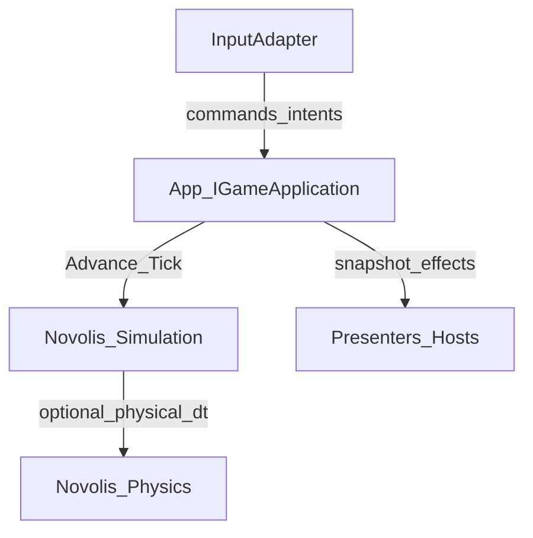

# Implement HexGame placement canvas (governance)

## Scope (locked)

Implement the canvas’s **recommended move order steps 1–3** as documentation and agent-facing policy:

1. Informative HexGame ideal with Math → Physics → Simulation made explicit  
2. Application cores stay in apps and drive Simulation  
3. Physics is only a callee from sim/domain steps  

**Out of scope for this change:** `Novolis.Game.Intent`, Simulation FrameSnapshots, Multiplayer host glue packages, vendoring `HexGame.*`, and dogfood app refactors. Those remain deferred until multiple apps share a shape (per the canvas).

Source of truth for content: [hexgame-novolis-placement.canvas.tsx](C:\Users\frank\.cursor\projects\d-novolis\canvases\hexgame-novolis-placement.canvas.tsx). External reference: [frankhaugen/HexGame](https://github.com/frankhaugen/HexGame) (informative only — not Novolis law).

## Deliverable 1 — Architectural ideal

Add [d:\novolis\novolis-governance\docs\architectural-ideals\hexgame-authoritative-core.md](d:\novolis\novolis-governance\docs\architectural-ideals\hexgame-authoritative-core.md), styled like [workspace-snapshot-timeline.md](d:\novolis\novolis-governance\docs\architectural-ideals\workspace-snapshot-timeline.md):

- **Purpose:** HexGame-shaped games on Novolis without HexGame packages or a GameKit layer  
- **Non-goals:** Not an IETF/BCP 14 Novolis RFC; not a mandate to PackageReference HexGame; not Stride Lite  
- **Stack roles table:** Math / Physics / Simulation / Apps / Raylib·Rendering / Gaming — matching [library-boundaries.md](d:\novolis\novolis-governance\docs\library-boundaries.md)  
- **Hard rule:** HexGame Tick / command dispatch / world systems / replay / presentation snapshots → **Simulation + app**; Physics must not own tick order (call out that `Novolis.Physics.Motion.SimulationPipeline` is an integrator pipeline name, not orchestration)  
- **Composition table:** app owns `IGameApplication`-shaped API → Simulation clock/systems → optional Physics inside systems → host adapters (Raylib/Silk) → presenters  
- **Package map:** existing homes only (`Simulation.*`, `Physics.*` as callee, `Raylib.Hosting`, `Game.Identity`/`Multiplayer`, `Commands.*` vs player intent, `Snapshots.*` vs sim replay)  
- **Deferred:** `Game.Intent`, shared frame DTOs under Simulation.Abstractions, FrameSnapshots — with exit criteria (“2–3 apps share envelope”)  
- **Conformance checklist** (for dogfood/PR review): engine objects not save state; local authority via same core; Physics not tick owner; no HexGame NuGet in platform csproj; gaming has no sim/raylib refs  

## Deliverable 2 — Cross-links (policy glue)

Short “Related” / one-paragraph pointers only — do not duplicate the full ideal:

| File | Change |
|------|--------|
| [library-boundaries.md](d:\novolis\novolis-governance\docs\library-boundaries.md) | Related link to the new ideal; one sentence that HexGame-style game ticks belong in Simulation/apps, not Physics |
| [simulation-layer-policy.md](d:\novolis\novolis-governance\docs\simulation-layer-policy.md) | Related link + note that Simulation is the orchestration home for HexGame-aligned loops |
| [gaming-layer-policy.md](d:\novolis\novolis-governance\docs\gaming-layer-policy.md) | Related link; restate that `IGameApplication`/domain rules stay in apps; player-intent package deferred |
| [gameengine-reference-policy.md](d:\novolis\novolis-governance\docs\gameengine-reference-policy.md) | Distinguish HexGame (architecture pattern, personal spec) from Frank.GameEngine (selective mining) — both are not platform Kit layers |
| [platform-library-boundaries.mdc](d:\novolis\.cursor\rules\platform-library-boundaries.mdc) | One quick-placement row/bullet: HexGame Tick → Simulation/apps; never Physics |

No new Cursor skill/agent unless the ideal is large enough to warrant it; the existing boundaries rule + new doc are enough for agents.

## Deliverable 3 — Index hygiene

[architectural-ideals/README.md](d:\novolis\novolis-governance\docs\architectural-ideals\README.md) currently mirrors the distributed-services guideline index. Add a short **Ideals in this folder** list at the top (or a separate `index.md` if rewriting README would be too disruptive) linking:

- `hexgame-authoritative-core.md`  
- `workspace-snapshot-timeline.md`  
- `distributed-services-architectural-guideline.md`  

Prefer a minimal top-of-README index to avoid relocating the distributed-services content in this change.

## Verification

- Links resolve within `novolis-governance`  
- Wording does not invent `Novolis.HexGame.*` or authorize HexGame PackageReferences  
- Physics section of the ideal cannot be read as “put simulation in Physics”  
- No csproj / package map / Generate-Platform-Slnx changes in this PR  

## Follow-ups (documented only, not implemented)

Record in the ideal’s Deferred section: extract `Novolis.Game.Intent` after shared command envelopes; shared frame DTOs only under `Novolis.Simulation.Abstractions`; never grow orchestration under Physics.

