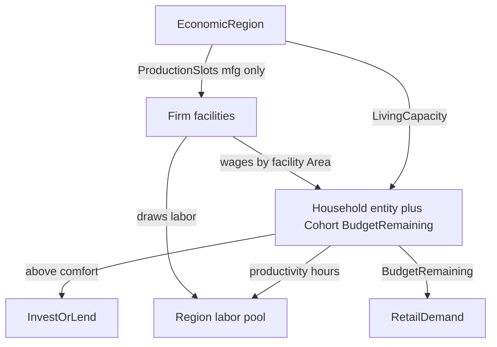

# Households, regions, labor productivity, comfort rules

## Locked decisions

- **Region = habitat** at library resolution: reuse [`GeographicAreaId`](novolis-economy/src/Novolis.Economy/Identifiers.cs); product may say Habitat. One homogeneous blob + hub(s); no intra-region logistics.
- **Cohort scale:** one `LegalEntity` (Household) per `ConsumerCohort`. `Population.Value` stays headcount; **household count** = `max(1, Population / PeoplePerHousehold)` with `PeoplePerHousehold = 4`.
- **Productivity:** `HouseholdProductivityKind` → hours/household/day: **Common=12, Mean=18, Extreme=24** (default **Mean**).
- **Labor/tick (hourly):** region pool = `HouseholdCount × HoursPerDay(kind) / 24`.
- **Single spendable wallet:** cohort `BudgetRemaining` is the only household liquid for retail, comfort, invest, and lend. Household firm **ledger exists** for ownership/loan party identity and fingerprint; wage/dividend/purchase cash that belongs to households updates **`BudgetRemaining` only** (ledger cash for Household kind stays at 0 / unused for spending). No dual pots.
- **Comfort:** invest/lend only if `BudgetRemaining > ComfortThresholdPerHousehold × HouseholdCount`. Policy default `ComfortThresholdPerHousehold = Money.From(50m)`. Below threshold: retail only.
- **Invest:** `PurchaseOwnership` (cash from buyer `BudgetRemaining` if Household, else ledger → issuer ledger + claim). **Lend:** `OriginateLoan` as lender (Household lender debit from `BudgetRemaining`). No household share issuance.
- **Production slot:** counts only facilities whose layout has at least one `Manufacturing` or `Assembly` unit. Retail-only and carrier posts do **not** consume slots.
- **Living capacity seed-safe:** `AddRegion` living cap must be `>=` sum of household counts already/to-be seeded in that area; NearSol sets `LivingCapacityHouseholds = max(roleFloor, seededHouseholds)` so day-0 never rejects. Over-cap `AddCohort` after seed **clamps** population down to remaining living space (does not throw in builder).
- **Wage area matching:** wages from work at a facility credit cohorts whose `Area` equals `FacilityBinding.Area`. Multi-area firms pay per facility’s area. Facilities with null area → global population-weighted fallback (legacy).
- **Guards in ApplyDecisions** (not agent-only): Household lender below comfort → reject `OriginateLoan`; Household buyer below comfort after purchase would breach comfort → reject `PurchaseOwnership`.
- **Labor richness accepted this pass:** NearSol Mean pools may exceed plant demand; acceptance does **not** require labor to bind. Freight circulation must not regress (fills/delivered still grow; carriers not frozen).
- PackageId unchanged; NuGet-only publish + NearSol retarget.



## 1. Primitives

**Files:** [`LegalEntity.cs`](novolis-economy/src/Novolis.Economy/LegalEntity.cs), new types in `Novolis.Economy`.

- `LegalEntityKind.Household`; `CanIssueShares` only Firm/Civic.
- `HouseholdProductivityKind { Common, Mean, Extreme }` + `HoursPerDay` → 12 / 18 / 24.
- `PurchaseOwnership(Issuer, Buyer, Fraction, Price)` command; `OwnershipChanged` + cash/budget events as needed.

## 2. Population — cohort fields

**File:** [`PopulationModels.cs`](novolis-economy/src/Novolis.Economy.Population/PopulationModels.cs)

- `HouseholdProductivityKind Productivity` (default Mean).
- `FirmId? HouseholdFirmId` (set by builder).
- `HouseholdMath.Count`, `LaborHoursPerDay`, `ComfortFloor(cohort, thresholdPerHousehold)`.

## 3. Simulation — EconomicRegion + labor + wages

**Files:** [`EconomyWorld.cs`](novolis-economy/src/Novolis.Economy.Simulation/EconomyWorld.cs), [`EconomyWorldBuilder.cs`](novolis-economy/src/Novolis.Economy.Simulation/EconomyWorldBuilder.cs), [`AllocateLaborPhase`](novolis-economy/src/Novolis.Economy.Simulation/Phases/StubPhases.cs) / wage distribute.

```csharp
public sealed class EconomicRegion
{
  public GeographicAreaId AreaId { get; }
  public int LivingCapacityHouseholds { get; init; }
  public int ProductionSlots { get; init; }  // mfg/assembly facilities only
}
```

- `EconomyWorld.Regions` by area.
- `AddRegion` / `AddCohort` → `EnsureHousehold` entity; seed opening into **`BudgetRemaining`** (not household ledger cash); living clamp as locked above.
- `AddFacility`: if `Area` set and facility is mfg/assembly, enforce `UsedProduction < ProductionSlots` (skip add / no-op with clear builder rule: return false or ignore excess in dogfood seeds sized to fit).
- **AllocateLabor:** when `Regions` non-empty, per-area pool from cohorts; allocate to firms with mfg demand at facilities in that area (deterministic firm id order); set `AvailableLaborHours`/`AllocatedLaborHours` from pool (legacy `SetAvailableLabor` ignored for firms that only operate inside region-covered areas when policy `UseRegionLaborPools` is true — default **true** when any region exists).
- **Wage credits:** only `BudgetRemaining` on cohorts in the facility’s area (see locked wage matching). Emit `HouseholdCreditsIssued`.
- Policy: `PeoplePerHousehold = 4`, `HouseholdComfortThresholdPerHousehold = 50`, default productivity Mean.

## 4. Accounting / ApplyDecisions — purchase + comfort

- `TryPurchaseOwnership`: if buyer is Household, debit `BudgetRemaining` via Simulation helper (Accounting posts issuer cash/equity only from that money); if buyer is Firm/Civic, debit buyer ledger. Then assign claim.
- Household `OriginateLoan` as lender: debit lender `BudgetRemaining`, credit borrower ledger (extend loan disbursement path for Household lenders).
- ApplyDecisions: comfort guards for Household lend/invest; reject if would leave budget `<= ComfortFloor`.

## 5. Agents — HouseholdFirmAgent

**New:** [`HouseholdFirmAgent`](novolis-economy/src/Novolis.Economy.Agents/HouseholdFirmAgent.cs)

- Comfort check: `BudgetRemaining > ComfortFloor` only (no ledger cash).
- Above comfort: small `OriginateLoan` and/or `PurchaseOwnership` per policy.
- At/below: `LastDecision = "comfort hold"`.
- NearSol pulse: all cohorts with `HouseholdFirmId` (or capital + industrial areas first if perf — **lock: all cohorts** for correctness).

## 6. Docs + tests + publish

- design/release/READMEs: Household, region/habitat, 12/18/24, single wallet, comfort formula, mfg-only slots, wage-by-facility-area, labor-rich OK.
- Tests: pool caps labor; below comfort blocks lend/invest in ApplyDecisions; purchase moves budget→issuer + claim; living clamp; production slot ignores retail/carrier; wages stay in-area.
- Push Economy `2026.1.*`.

## 7. NearSol dogfood

- Per system `AddRegion` with `LivingCapacityHouseholds = max(roleFloor, seeded HH count)` and production slots sized to existing mfg facilities + small headroom.
- Cohorts Mean productivity; drop `SetLabor` as supply when regions present.
- Seed capital household Mining claim via `PurchaseOwnership` or builder assign (assign OK for seed; runtime invest uses purchase).
- Report: region used living/production, pool hours, `BudgetRemaining`, comfort holds, productivity kind; keep freight macros.
- Acceptance: `|ΔLiquid+imports|≈0`; comfort blocks verified in unit tests; **100d/1000d freight not frozen** (fills/delivered progress); labor need not bind.
- `verify-nuget-only`; push dogfood.

## Out of scope

- Per-person entities, binding labor scarcity tuning, freight tramp count, intra-habitat logistics, PackageId rename, housing build UI, GE wage clearing, household ledger as second wallet.

