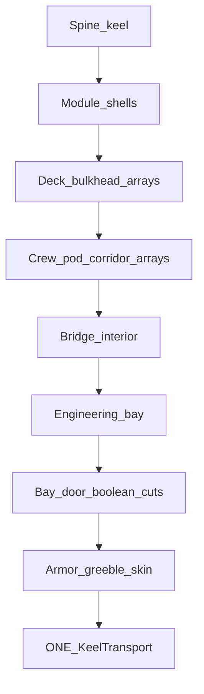

# Keel transport — detailed interiors (not Rodger Young)

## Problem

The current [Troop Corvette](novolis-dogfooding/apps/avalonia/SceneLab/tools/TroopCorvetteBuilder/) is a **solid box block-out**. Your screenshot shows hollow-ish mid modules with pod arrays, but overall fidelity is schematic. You want **detailed and believable interiors**, and **not** a Rodger Young tribute.

## Decision

**Ship identity:** *Keel Transport* — modular cargo/crew hauler on a long structural spine (the silhouette in your viewport), rebuilt from scratch with **interior-first modules**.

**ONE final baked mesh** (`Troop Corvette` → **Keel Transport** / `keel-transport.nov3djson`). Live HTTP stage opens so you can watch.

**Construction method (critical):** With today’s AABB [`MeshBoolean`](novolis-math/src/Novolis.Math.Geometry/MeshBoolean.cs) (Union=`Concat`, Difference=centroid discard), do **not** carve interiors out of solid blocks. Instead:

1. Build each module as a **thin outer shell** (6 wall plates)
2. **Insert** decks, bulkheads, corridors, furniture as arrays **inside** the shell
3. **Boole Difference** only for openings (bay mouths, door cuts, viewports) with oversized box cutters

Wireframe will read as a real ship with rooms — the look you want.

## Interior program (believable)

| Zone | Interior contents (arrays + shells) |
|------|-------------------------------------|
| Spine | Pressure tunnel: ring frames + walkway floor along keel |
| Mid port/stbd modules | 2–3 deck plates; longitudinal corridor; crew-pod / cargo-rack grid (the arrays visible in your shot, denser) |
| Bow | Sensor bay + airlock vestibule + forward magazine racks |
| Stern / bridge | Multi-deck tower: CIC console banks, windows (boolean slits), ladder wells |
| Aft engineering | Engine room: thrust mounts, catwalks, coolant tank array, nozzle recesses |

## Stages (HTTP playback)

Emit `samples/keel-stages/keel-stage-NN.nov3djson` (one mesh each):

1. Keel + pressure tunnel rings  
2. Mid module shells (symmetric)  
3. Decks + bulkheads  
4. Crew/cargo bay arrays + corridor  
5. Bow shell + airlock interior  
6. Bridge tower + CIC furniture  
7. Engineering + catwalks + engines  
8. Bay mouths / door Boole cuts + exterior greeble skin → final  

Final → [`samples/keel-transport.nov3djson`](novolis-dogfooding/apps/avalonia/SceneLab/samples/keel-transport.nov3djson).

## Implementation

Replace/repurpose builder as **`KeelTransportBuilder`** under [`apps/avalonia/SceneLab/tools/`](novolis-dogfooding/apps/avalonia/SceneLab/tools/) (keep ShipArray/ShipYard helpers; drop Rodger-specific stage script).

New helpers in builder:

- `ModuleShell(size, wallThickness)` — 6 thin boxes inset  
- `DeckStack(count, spacing, size)` — floor plates  
- `Corridor(length, width, height)` — floor + 2 walls  
- `PodBay(rows, cols, pitch)` — crew/cargo cell array  
- `CutOpening(hull, cutter)` — Difference for doors/bays  

SceneLab: `--keel` loads final sample; README points at keel stages (retire `--corvette` as alias to `--keel` or remove).

Playback: same curl loop as corvette (~2s/stage), WirePoints → Isoline.

## Density target

Aim **≥8k–15k tris** on the final mesh (vs ~3k solid corvette) so mid modules read as rooms, not empty boxes. Prefer many thin plates over few fat solids.

## Out of scope

True manifold CSG rewrite, UVs/materials, animation, franchise names/silhouettes, Cad solids.

