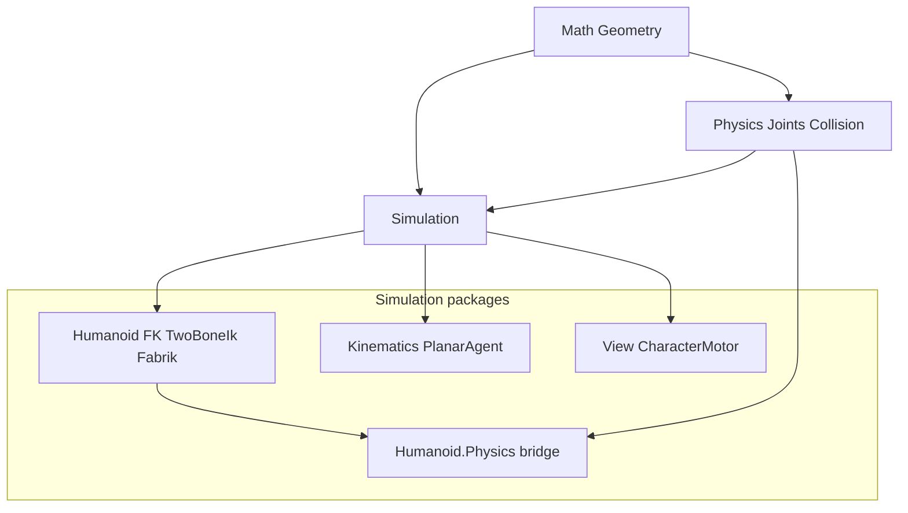

# Kinematics & IK roadmap (from canvas)

Source of truth for placement: [kinematics-ik-placement.canvas.tsx](C:\Users\frank\.cursor\projects\d-novolis\canvases\kinematics-ik-placement.canvas.tsx).



## Defaults (locked)

- **Keep** package id `Novolis.Simulation.Kinematics` (planar only) — clarify docs, do not rename.
- **Skeletal IK stays in** [`Novolis.Simulation.Humanoid`](d:\novolis\novolis-simulation\src\Novolis.Simulation.Humanoid) — extend it; do not add IK to Math, Physics.Joints, or Simulation.Kinematics.
- **Gap fill algorithm:** FABRIK for N-link position chains + compose with existing [`TwoBoneIk`](d:\novolis\novolis-simulation\src\Novolis.Simulation.Humanoid\TwoBoneIk.cs) for limbs. No Jacobian/CCD in this pass.
- **Generic chain:** BCL `Vector3` + segment lengths API in Humanoid (reusable, not a new package). Humanoid bone wrappers sit on top.

## Phase 1 — Codify placement

Update docs so the canvas “two kinematics” rule is enforceable for agents/humans:

1. [`library-boundaries.md`](d:\novolis\novolis-governance\docs\library-boundaries.md) — short subsection:
   - Humanoid owns FK/IK/clips schema
   - Kinematics owns planar agent motion only
   - Physics.Joints = constraint dynamics / ragdoll, not target IK
   - Forbidden: IK solvers in Math; TwoBoneIk in Kinematics
2. [`Novolis.Simulation.Kinematics/README.md`](d:\novolis\novolis-simulation\src\Novolis.Simulation.Kinematics\README.md) — callout: not skeletal IK; link Humanoid.
3. [`Novolis.Simulation.Humanoid/README.md`](d:\novolis\novolis-simulation\src\Novolis.Simulation.Humanoid\README.md) — document FK / TwoBoneIk / (new) Fabrik / full-body entry points; related-package table matching canvas recipes.
4. [`Novolis.Physics.Joints/README.md`](d:\novolis\novolis-physics\src\Novolis.Physics.Joints\README.md) — one line: for skeletal reach use Simulation.Humanoid, not joints.

## Phase 2 — Close canvas gaps in Humanoid

Add to `d:\novolis\novolis-simulation\src\Novolis.Simulation.Humanoid\`:

| Type | Role |
|------|------|
| `FabrikChain` | Static FABRIK on `Span<Vector3>` positions + rest lengths; forward/backward passes; iteration cap |
| `FabrikChain.Solve` | Root pinned or free; single end effector target |
| `HumanoidChainIk` | Maps a `HumanoidBone[]` chain + bind lengths → FABRIK → writes `HumanoidWorldPose` (positions + `FromToRotation` like TwoBoneIk.ApplyLimb) |
| `HumanoidFullBodyIk` | Multi-effector: feet/hands via `TwoBoneIk.ApplyLimb`, optional spine/neck via `HumanoidChainIk`; order = lower body then upper; does not invent foot IK contacts |

Unit tests in `d:\novolis\novolis-simulation\tests\Novolis.Simulation.Humanoid.Unit\`:

- FABRIK reaches target within epsilon when reachable; clamps when overstretched
- Two-bone limb still matches existing `TwoBoneIkTests` behavior when used from full-body
- Full-body: dual hand targets move both end effectors without destroying hip root unless configured

Keep BCL-only (`System.Numerics`); no Simulation.World / Physics refs in Humanoid core.

## Phase 3 — Dogfood

Extend [`HumanoidLab`](d:\novolis\novolis-dogfooding\apps\avalonia\HumanoidLab):

- New pane (or Bow sibling): **Reach** — drag/target two hands + optional feet with `HumanoidFullBodyIk`
- README table updated for Walk / Ragdoll / Bow / Reach
- Smoke or unit path remains ProjectRef: `-p:NovolisUseProjectReferences=true`

## Phase 4 — Verify / publish path

```powershell
dotnet test d:\novolis\novolis-simulation\tests\Novolis.Simulation.Humanoid.Unit\Novolis.Simulation.Humanoid.Unit.csproj -p:NovolisUseProjectReferences=true
dotnet build d:\novolis\novolis-dogfooding\apps\avalonia\HumanoidLab\HumanoidLab.csproj -p:NovolisUseProjectReferences=true
pwsh -File d:\novolis\novolis-governance\scripts\verify-nuget-only.ps1
```

After merge to main, CI publishes `Novolis.Simulation.Humanoid` to GitHub Packages (no local feed). Update canvas gap rows to `ready` when shipping.

## Out of scope

- Renaming `Simulation.Kinematics`
- Jacobian IK / CCD
- Separate `Novolis.Simulation.Ik` package (revisit only if non-humanoid consumers appear)
- Math ownership of any IK
- Changing ragdoll / cloth packages

