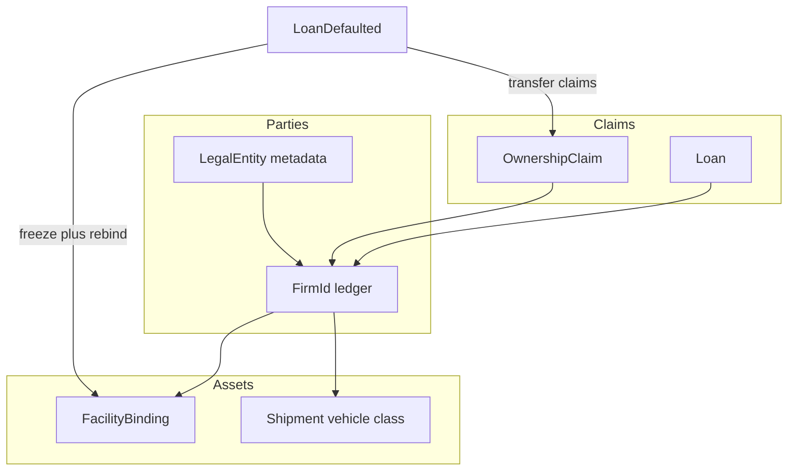

# Legal entity, ownership, capacity, default bite

## Locked decisions

- **Keep `FirmId`** as the party id everywhere (loans, ledgers, agents, facilities). No mass `LegalEntityId` rename this pass.
- **`LegalEntity` metadata** keyed by `FirmId`: kinds **Firm** and **Civic** only. Households stay cohorts; ships/hubs/facilities stay **assets** of a firm.
- **No `Novolis.Economy.Civics` package.** Civic = firm kind + existing `TollBeneficiaryFirmId` + report copy.
- **Default bite:** set `CreditFrozen` on borrower; rebind borrower’s facilities to lender; transfer all ownership claims where borrower is issuer to lender. No inventory fire-sale UI.
- **NuGet-only:** publish Economy `2026.1.*` to GPR; dogfood restores nuget.org + github only.



## 1. Kernel — LegalEntity metadata

**Where:** [`EconomyWorld.cs`](novolis-economy/src/Novolis.Economy.Simulation/EconomyWorld.cs), [`EconomyWorldBuilder.cs`](novolis-economy/src/Novolis.Economy.Simulation/EconomyWorldBuilder.cs), [`Identifiers.cs`](novolis-economy/src/Novolis.Economy/Identifiers.cs) only if a small `RegistryId` typedef helps.

Add:

```csharp
public enum LegalEntityKind { Firm = 0, Civic = 1 }

public sealed class LegalEntity
{
  public FirmId Id { get; }
  public LegalEntityKind Kind { get; init; }
  public string? RegistryId { get; init; }  // opaque; not a map place
  public bool CreditFrozen { get; set; }
  public bool CanIssueShares => Kind is LegalEntityKind.Firm or LegalEntityKind.Civic;
}
```

- `EconomyWorld.Entities: Dictionary<FirmId, LegalEntity>`
- `EnsureFirm` / `AddFirm` creates `LegalEntity(Kind=Firm)` if missing
- Builder: `AddCivic(FirmId, name, cash, registryId?)` → entity Kind=Civic
- Include entity flags (kind, frozen, registry hash) in [`Fingerprint()`](novolis-economy/src/Novolis.Economy.Simulation/EconomyWorld.cs)

## 2. Kernel — Ownership shares + dividends

**Where:** types/commands in [`CommandsAndEvents.cs`](novolis-economy/src/Novolis.Economy/CommandsAndEvents.cs); engine in **Accounting** (cash moves) e.g. `OwnershipEngine.cs`; world list on `EconomyWorld`; apply in [`ApplyDecisionsPhase`](novolis-economy/src/Novolis.Economy.Simulation/Phases/StubPhases.cs).

| Piece | Spec |
|-------|------|
| `OwnershipClaim` | `(IssuerFirmId, OwnerFirmId, Fraction)` — fractions per issuer sum to ~1 |
| `AssignOwnership` / `TransferOwnership` | Commands; reject if issuer `!CanIssueShares` or owner missing |
| `DeclareDividend(issuer, total)` | Pro-rata cash from issuer to owners; skip/short-pay if cash insufficient (deterministic order by owner id) |
| Events | `OwnershipChanged`, `DividendPaid` |

Seed helper: `EconomyWorldBuilder.SetOwnership(issuer, owner, fraction)` normalizing remaining to a residual owner if needed (dogfood: Station owns Mining 100% or 60/40).

Unit tests: assign → dividend moves cash; invalid issuer kind rejected; fingerprint changes.

## 3. Kernel — Capacity upgrade

**Where:** command in core; apply in `ApplyDecisionsPhase`; mutate facility via replace binding (layout is immutable records in [`ProductionModels.cs`](novolis-economy/src/Novolis.Economy.Production/ProductionModels.cs)).

- `UpgradeFacility(FacilityId, Money cost, decimal capacityFactor)` with `capacityFactor > 1` (e.g. 1.25)
- Debit owner firm cash (`FacilityBinding.FirmId`); on success replace `OperatingUnit` capacities for Manufacturing/Assembly/Extraction units; emit `FacilityUpgraded`
- Fail → `FacilityUpgradeFailed` (cash) — no partial upgrade

Unit test: pay cost → `ManufacturingCapacity` rises; insufficient cash → no change.

## 4. Kernel — Default consequences + credit freeze

**Where:** [`SettleFinancePhase`](novolis-economy/src/Novolis.Economy.Simulation/Phases/StubPhases.cs) after `LoanDefaulted`; [`LoanEngine.TryOriginate`](novolis-economy/src/Novolis.Economy.Finance/LoanModels.cs); `OriginateLoan` path in ApplyDecisions.

On default (extend existing block ~L899–904):

1. `Entities[borrower].CreditFrozen = true`
2. Rebind all `Facilities` with `FirmId == borrower` → new `FacilityBinding` with lender as owner (same locations/layout)
3. Move all `OwnershipClaim` where `IssuerFirmId == borrower` to `OwnerFirmId = lender` (merge fractions)
4. Emit `CreditFrozenSet`, `FacilityAbsorbed` / `OwnershipChanged` as needed

`TryOriginate`: reject if borrower entity `CreditFrozen`.

Treasury / any agent: originating to frozen borrower no-ops (engine rejects).

Unit tests: default → frozen + facility owner flip + cannot re-borrow; liquid stock-flow still holds under closed policy for dividend/upgrade cash moves.

## 5. Agents (thin)

**Where:** [`TreasuryFirmAgent`](novolis-economy/src/Novolis.Economy.Agents/TreasuryFirmAgent.cs) skip targets with `CreditFrozen`; other agents unchanged except reading freeze if they enqueue loans.

No captain/license matrix this pass.

## 6. Docs + publish

- Update [`docs/design.md`](novolis-economy/docs/design.md) / [`docs/release.md`](novolis-economy/docs/release.md): LegalEntity, ownership, upgrade, default absorb; terminology (Civics = product copy; Equity account ≠ shares).
- Tests green → commit/push `novolis-economy` → CI packs `2026.1.*` (ensure new files are in projects already in [`Novolis.Economy.slnx`](novolis-economy/Novolis.Economy.slnx)).

## 7. Dogfood NearSol

**Where:** [`NearSolAgents.cs`](novolis-dogfooding/apps/economy/NearSolPolity/NearSolAgents.cs), [`PolityWorld.cs`](novolis-dogfooding/apps/economy/NearSolPolity/PolityWorld.cs), [`HeadlessReport.cs`](novolis-dogfooding/apps/economy/NearSolPolity/HeadlessReport.cs), [`CreditCirculation.cs`](novolis-dogfooding/apps/economy/NearSolPolity/CreditCirculation.cs).

- Mark Station entity **Civic** + `RegistryId` (e.g. `"nearsol-civic"`); other firms Firm
- Seed ownership: Station owns fraction of Mining (and optionally Industry)
- Optional: one scripted or treasury path that can surface absorb if desired; otherwise report ownership lines after normal loan repay
- Report: entity kind, registry, ownership lines, credit-frozen flags, facility owner, Civics label for tolls/treasury (copy only)
- Restore new packages; `--headless 100d` / `1000d`; `verify-nuget-only.ps1`; commit/push dogfood

**Out of this plan:** second star system seed, household-as-entity, ship-as-entity, insurance, containers, amort schedules, Avalonia UI, `LegalEntityId` rename.

## Acceptance

| Check | Pass |
|-------|------|
| Unit | ownership, dividend, upgrade, default absorb + freeze, originate blocked |
| NearSol 100d/1000d | households not ~0; `Δ+imports≈0`; ownership visible; wall clock still tens of seconds for 1000d |
| Policy | nuget-only verify exit 0 |

