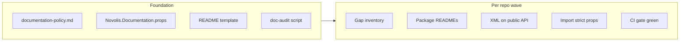

# Library documentation rollout (XML docs + package READMEs)

## Goal

Every **packable** library under `novolis-*/src/` gets:

1. **XML documentation** on all public types and members (`///` comments → `.xml` in the NuGet).
2. A **package README** at `src/<PackageId>/README.md`, packed via `PackageReadmeFile` (per [package-policy.md](d:\novolis\novolis-governance\docs\package-policy.md)).

**Enforcement (your choice):** `GenerateDocumentationFile=true` with **no `CS1591` suppression** — builds fail until public API is fully documented.

**Reference implementations today:**

| Area | Best example |
|------|----------------|
| Package README | [novolis-raylib/src/Novolis.Raylib/README.md](d:\novolis\novolis-raylib\src\Novolis.Raylib\README.md) — install, API matrix, quick start, cross-links |
| XML comment style | [novolis-codegen Reflection packages](d:\novolis\novolis-codegen\src\Novolis.CodeGen.Reflection) — `summary` / `param` / `returns` on extensions |
| Packaging props (partial) | [Novolis.Raylib.Documentation.props](d:\novolis\novolis-raylib\build\Novolis.Raylib.Documentation.props) — currently **suppresses** CS1591; must be tightened |

**Current gaps (survey):**

- ~**70+** packable `src/**/*.csproj` across **22** repos.
- **14** package READMEs exist (almost all in **raylib**); **1** in physics.
- **XML docs enabled** only in wirefish (global), rendering/physics/simulation/raylib (via `build/*` with CS1591 suppressed). **Codegen, commands, transports, testing, security, etc.** have no `GenerateDocumentationFile`.
- **Repo-level `docs/` trio** missing in simulation, markup, wirefish ([repository-policy.md](d:\novolis\novolis-governance\docs\repository-policy.md)).



---

## Phase 0 — Governance and shared infrastructure

### 0.1 Add `documentation-policy.md` in [novolis-governance/docs](d:\novolis\novolis-governance\docs)

Define mandatory rules (complements [repository-policy.md](d:\novolis\novolis-governance\docs\repository-policy.md) and [package-policy.md](d:\novolis\novolis-governance\docs\package-policy.md)):

**XML docs (public API only):**

- Every `public` / `protected` type and member: `/// <summary>` (required).
- Methods: `<param>`, `<returns>` when non-void; generic types: `<typeparam>`.
- Document thrown exceptions with `<exception>` when part of the contract.
- Prefer `<see cref="..."/>` for cross-references; use `<inheritdoc/>` on explicit interface implementations.
- **Exclude:** `private`, `internal` (unless intentionally exposed), compiler-generated, and **generated binding surfaces** where docs are produced by codegen (document the generator/manifest instead in README — aligns with [binding-codegen spec](d:\novolis\novolis-codegen\docs\specs\binding-codegen-library\initial-idea.md)).

**Package README (required sections):**

1. Title + one-line purpose  
2. `dotnet add package`  
3. Prerequisites / target framework (`net10.0`)  
4. Minimal quick-start snippet  
5. When to use this package vs siblings (table for meta/umbrella packages)  
6. Links: repo `docs/getting-started.md`, sibling package READMEs  
7. Stability note (alpha/pre-release if applicable)

**README packaging (standard csproj fragment):**

```xml
<PackageReadmeFile>README.md</PackageReadmeFile>
<ItemGroup>
  <None Include="README.md" Pack="true" PackagePath="\" Condition="Exists('README.md')" />
</ItemGroup>
```

### 0.2 Add shared MSBuild: `novolis-governance/build/Novolis.Documentation.props`

```xml
<PropertyGroup Label="Novolis API documentation (strict)">
  <GenerateDocumentationFile>true</GenerateDocumentationFile>
  <!-- No CS1591 / CS1574 suppressions -->
</PropertyGroup>
```

Import from each repo’s `build/<Repo>.Documentation.props` (or `Directory.Build.props` once the repo is complete). **Do not** import globally until that repo’s packages are documented — strict mode would break CI immediately.

Update [novolis-template-dotnet](d:\novolis\novolis-template-dotnet) and [novolis-templates](d:\novolis\novolis-templates) scaffolds to include README placeholder + Documentation.props import for new packages.

### 0.3 Add `scripts/doc-audit.ps1` (governance or workflows)

Automated inventory for PR/CI:

- Enumerate `src/**/*.csproj` where `IsPackable != false`.
- Fail if `README.md` missing next to csproj.
- Fail if `GenerateDocumentationFile` not true (once repo marked “documentation complete”).
- Optional: Roslyn-based count of undocumented `public` members (report-only during migration, blocking after repo flip).

Wire into [novolis-workflows](d:\novolis\novolis-workflows) build workflow as a dedicated job step once foundation lands.

### 0.4 README scaffold

Add `novolis-governance/docs/templates/package-readme.md` — copy/adapt from raylib README structure. Each package README should take ~15–30 minutes once the API is understood.

---

## Phase 1 — Remove transitional suppressions (repos already generating XML)

These repos already set `GenerateDocumentationFile` but **hide** missing docs. Tighten first so strict enforcement has a clear target:

| Repo | Current props | Action |
|------|---------------|--------|
| [novolis-raylib](d:\novolis\novolis-raylib\build\Novolis.Raylib.Documentation.props) | `WarningsNotAsErrors` includes CS1591 | Remove suppressions; fill gaps (bindings/native may be largest) |
| [novolis-rendering](d:\novolis\novolis-rendering\build\Novolis.Rendering.Packaging.props) | `NoWarn` CS1591 | Same |
| [novolis-physics](d:\novolis\novolis-physics\build\Novolis.Physics.Packaging.props) | CS1591 suppressed | Same |
| [novolis-simulation](d:\novolis\novolis-simulation\build\Novolis.Simulation.Packaging.props) | CS1591 suppressed | Same + add missing `docs/` trio |
| [novolis-wirefish](d:\novolis\novolis-wirefish\Directory.Build.props) | `NoWarn` 1591 | Document `Frank.WireFish`; add `docs/` trio |

**Raylib:** READMEs are largely done (10/11 packages). Focus effort on **XML coverage** (especially `Novolis.Raylib.Bindings`, `Native`, generated façades).

**Rendering / physics / simulation:** Add **13 + 9 + 7** package READMEs respectively; document public API (rendering has the largest surface — ~14 packages).

---

## Phase 2 — Repo waves (document → enable strict props → CI)

Work **one repo at a time** (single PR or stacked PRs per repo). Per-repo checklist:

1. Fill repo `docs/getting-started.md`, `docs/design.md`, `docs/release.md` where missing.
2. For each packable project under `src/`:
   - Add `README.md` from template.
   - Add `PackageReadmeFile` + `None Include` pack items to `.csproj`.
   - Add XML docs to all public API (use Reflection packages in codegen as style guide).
3. Import `Novolis.Documentation.props` (repo-level `build/*.props` or `Directory.Build.props`).
4. `dotnet build` / `dotnet test` — fix all CS1591/CS1574 until green.
5. Run `doc-audit.ps1`; merge only when clean.

### Suggested wave order (smallest → largest blast radius)

| Wave | Repos | Packable packages (approx.) | Notes |
|------|-------|------------------------------|-------|
| **A** | install, aspire, smoketest, wirefish, math, markup, messaging, storage | ~12 | Small surface; fix policy gaps (markup, wirefish) |
| **B** | analyzers, avalonia, commands, machinelearning, security, testing | ~24 | Analyzers: document public descriptors/APIs |
| **C** | codegen, transports | ~14 | Codegen: Bindings/Pipeline/Roslyn are largest; Reflection already partially done |
| **D** | physics, simulation | ~17 | Packaging props exist; remove CS1591 suppress |
| **E** | rendering | ~14 | Largest API; many backends |
| **F** | raylib | ~11 | READMEs exist; XML + remove suppress |
| **G** | templates | 1 | Packable template package + ensure scaffolds document sample projects |

**Codegen detail** ([6 packages](d:\novolis\novolis-codegen\src)):

| Package | Public surface | README focus |
|---------|----------------|--------------|
| `Novolis.CodeGen.Bindings` | Largest (~41 types) | Manifest model, emit pipeline, hook extension points |
| `Novolis.CodeGen.Bindings.Roslyn` | Small | Source generator / incremental host integration |
| `Novolis.CodeGen.Pipeline` | Medium | Step runner, caching, skip semantics |
| `Novolis.CodeGen.Reflection*` | Small (mostly done XML) | Type inspection, dump, class diagram |

---

## Phase 3 — CI and regression prevention

1. **Per-repo:** After wave complete, `Directory.Build.props` or shared `build/<Repo>.Documentation.props` imports strict `Novolis.Documentation.props` for all `src/` packable projects.
2. **Org workflow:** Add `doc-audit` step to standard build in [novolis-workflows](d:\novolis\novolis-workflows) — fails PR if a packable package lacks README or XML doc file when enforcement flag is set.
3. **CONTRIBUTING.md** stub in each repo → link to `documentation-policy.md`.
4. **Registry:** No change required; published packages will pick up README + `.xml` on next release.

---

## Phase 4 — Optional follow-ups (out of strict scope, but valuable)

- **DocFX / API browser** per major repo (rendering, raylib, codegen) — generated from XML; not required for NuGet consumption.
- **IDE snippet** or analyzer rule (custom Novolis analyzer) to nudge missing `///` on new public members — only after baseline is green.

---

## Effort and sequencing notes

- **Strict-all** implies **sequential repo completion** — never enable `Novolis.Documentation.props` workspace-wide in one commit.
- **Raylib READMEs** save ~40–50% README effort in that repo; **physics** has one README to use as a partial template.
- **Generated code** (raylib bindings, future codegen output): prefer documenting *how to regenerate* and *manifest inputs* in README; apply `[ExcludeFromCodeCoverage]`-style exclusions only where truly machine-owned and documented elsewhere — avoid blanket CS1591 suppress on whole projects.
- Expect **rendering + raylib bindings** to be the longest XML doc passes; **aspire/install/smoketest** the shortest.

---

## Definition of done

- [ ] `documentation-policy.md` merged in governance; template + `Novolis.Documentation.props` available.
- [ ] `doc-audit.ps1` passes for every repo (all packable packages: README + strict XML build).
- [ ] No `CS1591` / `CS1574` suppressions in any `*Documentation*.props` or `Directory.Build.props`.
- [ ] Every packable package publishes `README.md` + `.xml` documentation file on NuGet.
- [ ] All repos comply with [repository-policy.md](d:\novolis\novolis-governance\docs\repository-policy.md) `docs/` trio.

