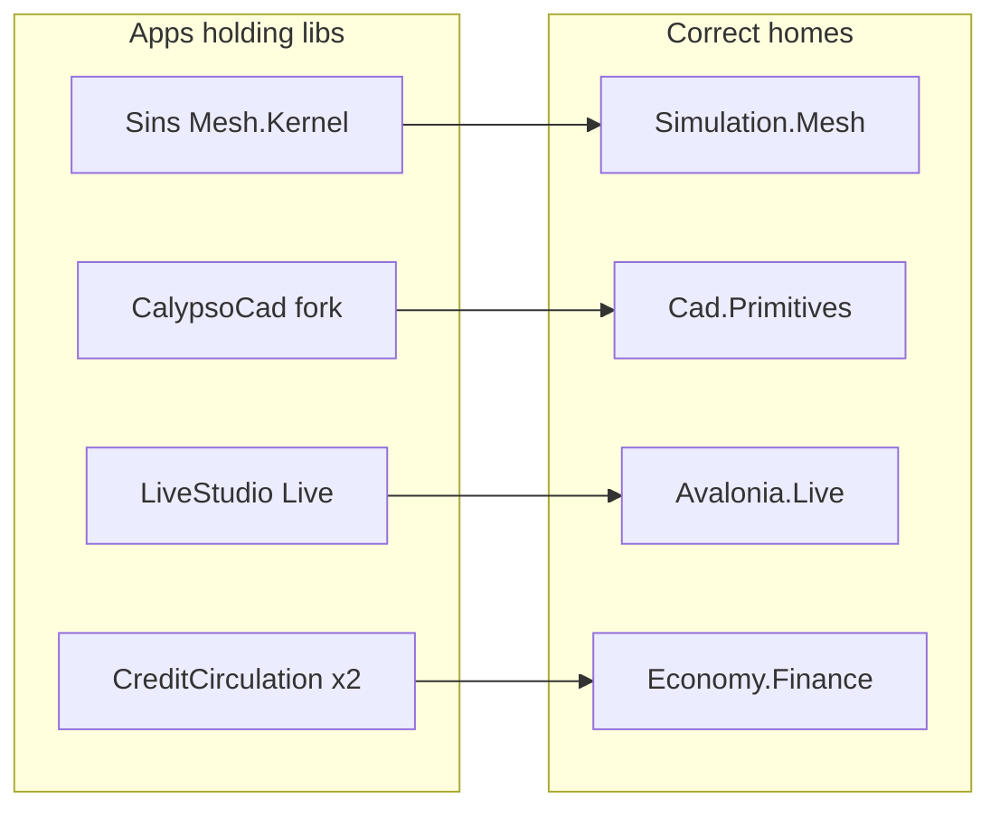

# Library layer extraction (from canvas)

Source: [library-layer-misplacement.canvas.tsx](C:\Users\frank\.cursor\projects\d-novolis\canvases\library-layer-misplacement.canvas.tsx)

**Constraint:** NuGet-only cross-repo — after each packable change, publish `2026.1.*` to GitHub Packages before consumers can restore. Use `Novolis.Platform.slnx` ProjectReference mode for local iteration only.

---

## Phase 1 — Mesh kernel → `Novolis.Simulation.Mesh`

**Repo:** [novolis-simulation](novolis-simulation)

- Add packable `Novolis.Simulation.Mesh` from [Universe/Mesh](novolis-apps/src/SinsOfACapitalismTycoon/Universe/Mesh/) files under `...Mesh.Kernel` (engines, state, pathfinder, pipeline). Public API; drop `internal`.
- Leave [Universe/Mesh/Sins](novolis-apps/src/SinsOfACapitalismTycoon/Universe/Mesh/Sins/) in the app (gameplay pulse, spot ledger, captain inbox).
- Sins PackageReferences the new package; delete moved kernel sources.
- Unit tests for flood/TTL/mailbox/pathfind in simulation tests.
- Publish GPR; regen Platform map via `Generate-Platform-Slnx.ps1`.

---

## Phase 2 — Genericize `Novolis.Game.Session`

**Repo:** [novolis-gaming](novolis-gaming) + [novolis-apps](novolis-apps) Sins/Captain Bridge adapters

Per [gaming-layer-policy.md](novolis-governance/docs/gaming-layer-policy.md): no product domain in session contracts.

- In [SessionDtos.cs](novolis-gaming/src/Novolis.Game.Session/SessionDtos.cs):
  - Replace `SpotFreight` / `GoodsCharters` / `MarketLots` with `SessionBoardDto[] Boards` (`Id` + `SessionBoardItemDto[]`).
  - Collapse product-named status strings into a fixed generic set (`StatusLines` dictionary or numbered `Line0..N`) — keep MessagePack keys stable where possible via reserved keys / version bump to `1.1`.
  - Slim `SessionCommandDto` to `ActionId` + `IDictionary<string,string>` (or string params bag); drop hard-coded `Sku` / `DestSystemId` as first-class fields.
- [SessionEndpoints.cs](novolis-gaming/src/Novolis.Game.Session/SessionEndpoints.cs): rename `SinsPipeName` → app-owned constant in Sins; platform keeps only `DefaultPipeName = "novolis-game-session"`. [SessionSurface](novolis-gaming/src/Novolis.Game.Session/SessionSurface.cs) requires explicit pipe or uses Default — never Sins-branded.
- Update Sins `CaptainDesk*` mappers and dogfooding `AvaloniaAgentMcp` known endpoint to the app constant.
- Bump protocol version; publish gaming; retarget apps.

---

## Phase 3 — CalypsoCad → `Novolis.Cad.Primitives`

**Repos:** [novolis-dogfooding](novolis-dogfooding) CalypsoCad, [novolis-cad](novolis-cad)

- Delete forked model in [CalypsoCad/Models/CadModels.cs](novolis-dogfooding/apps/cad/CalypsoCad/Models/CadModels.cs); PackageReference `Novolis.Cad.Primitives` (same pattern as DraftStudio).
- Move [OpeningDerivation.cs](novolis-dogfooding/apps/cad/CalypsoCad/Generation/OpeningDerivation.cs) into `Novolis.Cad.Primitives` (ops helper), publish, consume from CalypsoCad.
- Keep CalypsoRevGGenerator, palette, interior ensembles as product.

---

## Phase 4 — Economy dedup

**Repo:** [novolis-economy](novolis-economy) + consumers

- Lift [CreditCirculation.cs](novolis-apps/src/SinsOfACapitalismTycoon/Universe/CreditCirculation.cs) into `Novolis.Economy.Finance` as public `CreditCirculation` (strip Sins namespace; keep `EconomySimulation` coupling).
- Lift [AstroEconomyBridge.cs](novolis-apps/src/SinsOfACapitalismTycoon/Universe/Bridge/AstroEconomyBridge.cs) into `Novolis.Economy.Logistics` as `AstroEconomyBridge` (catalog/route → hubs/corridors).
- Delete NearSolPolity copies; both apps PackageReference Finance + Logistics.
- Publish economy; slim NearSolPolity to scenario host.

---

## Phase 5 — `Novolis.Avalonia.Live`

**Repo:** [novolis-avalonia](novolis-avalonia) + [novolis-apps](novolis-apps) LiveStudio

- New packable `Novolis.Avalonia.Live` from [LiveStudio/studio/Components/Live](novolis-apps/src/LiveStudio/studio/Components/Live/) (files marked “Designed to move into Novolis.Avalonia.Live”).
- LiveStudio becomes thin host PackageReference; leave product workspace wiring / demo scripts in the app.
- Publish avalonia; wire apps `Directory.Packages.props`.

---

## Phase 6 — Misfiled Avalonia packages

**Repos:** [novolis-avalonia](novolis-avalonia), [novolis-cad](novolis-cad), [novolis-commands](novolis-commands)

Keep **PackageId** / namespaces stable (no consumer rename).

- Physically move [Novolis.Modeling.Scene](novolis-avalonia/src/Novolis.Modeling.Scene/) → `novolis-cad` (headless mesh graph belongs with CAD, not UI).
- Physically move [Novolis.Agent.Surface](novolis-avalonia/src/Novolis.Agent.Surface/) → `novolis-commands` (agent hosts, no Avalonia).
- [Novolis.Avalonia.3D](novolis-avalonia/src/Novolis.Avalonia.3D/) switches from ProjectReference to PackageReference for both.
- Update slnx / Platform map; publish cad + commands; avalonia restore from GPR.

---

## Phase 7 — Camera policy cleanup

**Repos:** [novolis-simulation](novolis-simulation), [novolis-rendering](novolis-rendering), dogfooding RtsLite

- Add map-style rig to `Novolis.Simulation.View` from [RtsClassicCamera.cs](novolis-dogfooding) (~120 LOC); RtsLite consumes View + input wiring only.
- Remove [SilkOrbitCamera.cs](novolis-rendering/src/Novolis.Rendering.Presentation.Silk/SilkOrbitCamera.cs); Silk demos compose `OrbitCameraRig` / `ViewPose` at app layer (or thin adapter next to demos).
- Rename [TwoDCamera](novolis-rendering/src/Novolis.Rendering.TwoD/TwoDCamera.cs) → `TwoDViewport` (or equivalent non-Camera name); update Rendering.TwoD + dogfood `OrthoPanCamera` consumers.
- Publish simulation + rendering; fix dogfooding.

---

## Phase 8 — Residual policy debt

- `Novolis.Simulation.Racing`: finish Vector2 → planar `Vector3` (`Y = 0`); remove `NOV2002` NoWarn.
- Docs only: [gaming-layer-policy.md](novolis-governance/docs/gaming-layer-policy.md) and related — state `novolis-workflows` is **GitHub Actions shared workflows**, not WorkflowEngine; WorkflowEngine import targets a future `novolis-workflow-engine` (no CI repo rename in this plan).

---

## Done criteria (each phase)

1. `pwsh -File novolis-governance/scripts/verify-nuget-only.ps1` and `verify-project-ref-mode.ps1 -SkipBuild` exit 0
2. Affected packages published to GitHub Packages
3. Consumers restore/build with nuget.org + github only
4. Update canvas checkmarks / close findings as phases land

**Out of scope (canvas “stay in apps”):** Sins Drama/Player/CalypsoTheme, Keel stage recipes, NeuralRacing, BridgeCommander, ViewPose→CameraSnapshot compose bridges, Commerce insurance pulse generalization (P1 follow-up after Phase 4).

