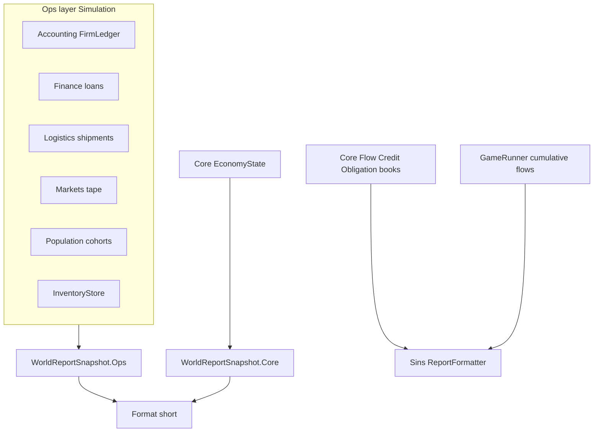

# Library report extensions + Sins Core books

## Locked decisions (clarity)

- **Two money truths, never mixed:** Ops `FirmLedger` cash and Core vault/deposit stocks are separate layers. [`WorldReportSnapshot`](novolis-economy/src/Novolis.Economy.Simulation/EconomyWorld.cs) nests `Ops` and `Core` sections. **Do not** add Ops cash + Core cash into one total; formatters must label `Ops cash` vs `Core cash/broad money`.
- **Naming:** Sins sections are **Core books** (flows, credit, obligations, stress) — not firm GAAP. Firm P&amp;L/BS live only under Accounting Extensions / Simulation Ops.
- **Sins stays Core-only:** no `Novolis.Economy.Accounting` (or Simulation) PackageReference on Sins.
- **Core `EconomySnapshot` record shape unchanged.** New data via sibling methods: `FlowInsight()`, `ObligationBook()`, `CreditBook()`.
- **Sins Flows = horizon cumulative**, not last-period-only. `GameRunner` accumulates `PeriodFlowLedger` fields each Advance; report shows cumulative + last-period net for context.
- **Invoice AR authority:** commercial open AR = sum of unsettled `Invoice.Remaining`. Ledger `AccountRole.AccountsReceivable` is a separate book balance; `LedgerBookSnapshot` reports both (`InvoiceOpenReceivables` vs `LedgerAccountsReceivable`) and does not silently prefer one.
- **Debit-positive convention (documented on insight types):** assets/expenses &gt; 0; revenue/liability/equity stored negative on the ledger; P&amp;L/BS helpers expose **presentation amounts** (revenue positive, liabilities positive owed).
- **Market tape:** add a minimal public read on [`ObservedMarketBook`](novolis-economy/src/Novolis.Economy.Markets/ObservedMarketBook.cs) (e.g. `TryGetTape` / product enumeration) so Extensions can build insights without reflecting private nested types. Do not “fix” `RecordTrade` pricing bugs in this plan unless they block reads.
- **Sins package gate:** local verification uses `-p:NovolisUseProjectReferences=true`. Shipping Sins against GPR requires publishing a new `Novolis.Economy.Core` that includes the Core book APIs (call out in PR; not a sibling-local feed).
- **Out of scope:** Sins on EconomyWorld; Core pivot; sectoral SFC matrix; holdings-at-posted-prices national accounts; GPR junk cleanup beyond what’s needed to restore consumers.



## 1. Accounting Extensions

Path: [`novolis-economy/src/Novolis.Economy.Accounting/Extensions/`](novolis-economy/src/Novolis.Economy.Accounting/)

- `InsightTypes.cs` — XML docs state debit-positive storage vs presentation amounts.
  - `FirmLedgerInsight`, `TrialBalanceLine`, `IncomeStatement`, `BalanceSheet`
  - `LedgerBookSnapshot`: firm count, ops total cash, `InvoiceOpenReceivables`, `LedgerAccountsReceivable` sum, settled/open invoice counts, per-firm insights list
- `FirmLedgerExtensions`: `ToInsight()`, `TrialBalance()`, `IncomeStatement()`, `BalanceSheet()`, `IsTrialBalanced(tolerance)`
- `LedgerBookExtensions.Snapshot(ledgers, invoices)`

Role sets for presentation:

- Assets: Cash, Inventory, AccountsReceivable, NotesReceivable
- Liabilities (owed = −ledger balance): AP, WagesPayable, NotesPayable
- Equity (presentation = −ledger): Equity
- P&amp;L credits (presentation = −ledger): Revenue, InterestIncome
- P&amp;L debits: COGS, WageExpense, TransportFuelExpense, TransportTollExpense, InterestExpense

## 2. Sibling library Extensions

Same `Extensions/` + `InsightTypes` pattern; read-only.

| Package | API | Insight content |
|---------|-----|-----------------|
| Finance | `LoanBookExtensions.Snapshot(loans)` | Active/defaulted/closed counts; principal; accrued interest; per-loan `LoanInsight` |
| Logistics | `LogisticsNetworkExtensions.Snapshot(hubs, corridors, shipments)` | Counts by `ShipmentPhase`; cargo qty in flight; corridor toll sum as static exposure; berth util when `BerthCapacity &gt; 0` |
| Markets | Public tape read + `ObservedMarketBookExtensions.Snapshot()` | Per product: last price, cumulative volume, trade count, trend |
| Population | `ConsumerCohort.ToInsight()` | Households, disposable income, area, effective labor hours |
| Production | `InventoryStoreExtensions.Snapshot()` | Slot count, total qty, total lot book cost, breakdowns by firm/product |

## 3. Core Extensions (Sins + Simulation Core layer)

Path: [`novolis-economy/src/Novolis.Economy.Core/Extensions/`](novolis-economy/src/Novolis.Economy.Core/Extensions/)

Add insight records + methods on `EconomyState` (do **not** change `EconomySnapshot`):

- `FlowInsight()` → wraps current `state.Flows` (last period): money created/destroyed/net, cash moved, obligations paid, tax, transfers, production output value, wages accrued
- `ObligationBook()` → counts and sums by status and kind; due-now total
- `CreditBook()` → facilities (count, limit, drawn, undrawn committed); loans by status + principal

Reuse existing: `IlliquidButSolventEntities()`, `CohortInsights()`, `CheckInvariants()`.

## 4. Simulation `WorldReportSnapshot`

Path: [`novolis-economy/src/Novolis.Economy.Simulation/Extensions/`](novolis-economy/src/Novolis.Economy.Simulation/)

```text
WorldReportSnapshot
  Ops: LedgerBookSnapshot, LoanBookSnapshot, LogisticsSnapshot,
       InventorySnapshot, MarketBookSnapshot, cohort insights
  Core: EconomySnapshot?, FlowInsight?, ObligationBook?, CreditBook?
        (null/empty when CoreState has no entities)
```

- `EconomyWorldExtensions.ToReportSnapshot(this EconomyWorld world)`
- `WorldReportFormatter.Format(snapshot)` — **short**: labeled Ops vs Core blocks, one line per nested snapshot headline; no merging of cash figures

## 5. Sins report (compact Core books)

Files: [`GameRunner.cs`](novolis-apps/src/SinsOfACapitalismTycoon/Sim/GameRunner.cs), [`SimReport.cs`](novolis-apps/src/SinsOfACapitalismTycoon/Sim/SimReport.cs), [`ReportFormatter.cs`](novolis-apps/src/SinsOfACapitalismTycoon/Sim/ReportFormatter.cs)

**Horizon cumulative flows** (new fields on report/horizon):

- Each period after `Advance`, add `state.Flows.*` into running totals (`CumMoneyCreated`, `CumMoneyDestroyed`, `CumWages`, `CumTax`, `CumTransfers`, `CumObligationsPaid`, `CumProduction` already partly exists)

**Report sections** (after Drama / Horizon), each ≤3 lines:

| Section | Content |
|---------|---------|
| Flows | cumulative created/destroyed/net; wages/tax/transfers; last-period net in parentheses |
| Credit | performing/delinq/default loans; principal; undrawn; facility drawn/limit |
| Obligations | pending/delinq counts + due-now; optional top kind by sum |
| Stress | count illiquid-but-solvent; up to 3 short entity ids |
| Cohorts | one line per cohort: hh, cash, labor hours |
| Invariants | violation count; up to 3 messages |

Avalonia unchanged: still prints `ReportFormatter` text.

## 6. Tests and verification

- **AccountingExtensionsTests:** seed cash → trial balanced; cash sale → revenue/COGS/inventory; loan disbursement → notes R/P; assert presentation signs; invoice open vs ledger AR both reported when invoices passed.
- **EconomyCoreExtensionsTests:** FlowInsight / ObligationBook / CreditBook on existing fixtures.
- **FinanceExtensionsTests:** minimal loan book counts.
- **Simulation:** one `ToReportSnapshot` smoke on a small world fixture (or builder); assert Format contains `Ops` and does not invent a combined cash total.
- **Sins:** `baseline` 100 and `logistics_bind` 300 quiet with ProjectRef; greppable `Flows` / `Credit` / `Stress` lines.

```powershell
dotnet test novolis-economy/tests/Novolis.Economy.Unit --filter "Extensions"
dotnet run --project novolis-apps/src/SinsOfACapitalismTycoon -p:NovolisUseProjectReferences=true -- --mode headless --scenario baseline --periods 100 --seed 42 --quiet
dotnet run --project novolis-apps/src/SinsOfACapitalismTycoon -p:NovolisUseProjectReferences=true -- --mode headless --scenario logistics_bind --periods 300 --seed 42 --quiet
```

## Done when

- Ops libraries expose Extensions; Markets has a public tape read.
- `WorldReportSnapshot` nests Ops vs Core; formatter never sums the two cash stocks.
- Core sibling book APIs exist; `EconomySnapshot` unchanged.
- Sins prints compact Core book sections with **horizon-cumulative** flows.
- Accounting P&amp;L/BS sign tests + Core book tests + Sins smokes pass under ProjectRef.

