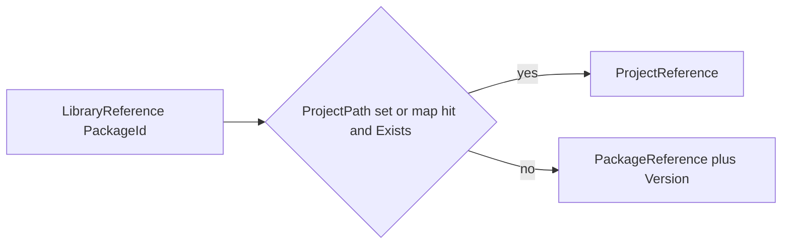

# LibraryReference MSBuild package repo

## Context (today’s ProjectRef mode)

Novolis already rewrites committed `PackageReference` → sibling `ProjectReference` when enabled, via pure props/targets (no custom task):

- Trigger / map import: [Novolis.ProjectReferenceMode.props](d:\novolis\novolis-governance\build\Novolis.ProjectReferenceMode.props)
- Intersect substitution: [Novolis.ProjectReferenceMode.targets](d:\novolis\novolis-governance\build\Novolis.ProjectReferenceMode.targets)
- Generated map: [Novolis.PackageToProject.props](d:\novolis\novolis-governance\build\generated\Novolis.PackageToProject.props) (`NovolisPackageProject` = PackageId → `ProjectPath`)

That model keeps `.csproj` PackageReference-only and only substitutes when **PackageReference ∩ map ∩ Exists**. `LibraryReference` inverts the declaration: the committed item *is* the dependency; expansion invents Project vs Package at evaluate time.



**Out of scope for this plan:** mass-migrating Novolis repos off `PackageReference` / retiring ProjectRef mode. This plan ships the package + tests + a thin optional governance bridge so the existing map can feed `LibraryProjectMap`.

## Repo: `novolis-msbuild`

Scaffold from [novolis-template-dotnet](d:\novolis\novolis-template-dotnet) under `Novolis-Platform` (standard CalVer + thin workflows → [novolis-workflows](d:\novolis\novolis-workflows)).

| Piece | Choice |
|-------|--------|
| Repo | `d:\novolis\novolis-msbuild` |
| Package | `Novolis.MSBuild.LibraryReference` |
| Layout | Props/targets-only nupkg (`IncludeBuildOutput=false`, `DevelopmentDependency=true`) under `build/` + `buildTransitive/` |
| Versioning | Platform CalVer via `build/version.json` → `2026.1.1.{run}` on merge publish to GPR |
| Sources | nuget.org + GitHub Packages only (no local feed; drop template `pack-local` / `NovolisLocalFeed` leftovers) |

Packable project pattern:

```xml
<!-- src/Novolis.MSBuild.LibraryReference/Novolis.MSBuild.LibraryReference.csproj -->
IncludeBuildOutput=false, SuppressDependenciesWhenPacking=true,
DevelopmentDependency=true, IsPackable=true
None Include="build/**" Pack → PackagePath=build/
None Include="buildTransitive/**" Pack → PackagePath=buildTransitive/
```

Consumer import: `PackageReference` with `PrivateAssets=all` (typically in `Directory.Build.props` / CPM), so restore auto-imports targets without shipping the tooling package as a library dependency.

## `LibraryReference` contract

Committed usage:

```xml
<ItemGroup>
  <LibraryReference Include="Novolis.Math.Geometry"
                    Version="2026.1.*"
                    ProjectPath="$(NovolisWorkspaceRoot)novolis-math\src\Novolis.Math.Geometry\Novolis.Math.Geometry.csproj" />
  <!-- Version omitted → $(LibraryReferenceDefaultVersion), default "*" -->
  <LibraryReference Include="Some.Other.Lib" />
</ItemGroup>
```

**Resolution (single target, same BeforeTargets list as ProjectRef mode):**

1. Resolve effective path: item `ProjectPath` metadata, else `%(LibraryProjectMap.ProjectPath)` where map `Include` equals PackageId.
2. If path non-empty, `Exists`, and not self → emit `ProjectReference` to that path; forward safe metadata (`PrivateAssets`, `IncludeAssets`, `ExcludeAssets`, `ReferenceOutputAssembly`, `OutputItemType`, `Aliases`, `SetConfiguration`/`SetPlatform` if present).
3. Else → emit `PackageReference` for the PackageId:
   - Version = item `Version` if set, else `$(LibraryReferenceDefaultVersion)` (default `*`).
   - If `ManagePackageVersionsCentrally == true`: emit bare `PackageReference` + `PackageVersion` (only when no existing `PackageVersion` for that id, so CPM tables still win when present).
   - If not CPM: put `Version` on the `PackageReference`.
4. Clear processed `LibraryReference` items (or mark expanded) so they are not double-applied.

**Properties:**

| Property | Default | Role |
|----------|---------|------|
| `LibraryReferenceDefaultVersion` | `*` | “latest” float when Version omitted |
| `LibraryReferenceEnabled` | `true` | Kill switch |
| `EnableFloatingVersions` / CPM float | consumer responsibility | `*` / `2026.1.*` need floating versions enabled (Novolis already sets `CentralPackageFloatingVersionsEnabled`) |

**Map item (optional):**

```xml
<LibraryProjectMap Include="Novolis.Math.Geometry">
  <ProjectPath>$(NovolisWorkspaceRoot)novolis-math\...\Novolis.Math.Geometry.csproj</ProjectPath>
</LibraryProjectMap>
```

No filesystem crawl. Discovery is explicit path and/or map (same reliability model as today’s generated map).

## Implementation files (inside the package)

- `build/Novolis.MSBuild.LibraryReference.props` — defaults + empty item definitions
- `build/Novolis.MSBuild.LibraryReference.targets` — `ExpandLibraryReferences` target before `CollectPackageReferences;ResolvePackageAssets;Restore;ResolvePackageFileConflicts`
- `buildTransitive/*` — same imports so transitive PrivateAssets patterns still load when appropriate
- Package README documenting CPM vs non-CPM, non-transitive ProjectReference caveat (same as ProjectRef mode), and metadata forwarding

Keep logic pure MSBuild ItemGroup surgery (match existing Novolis style); no C# task DLL unless metadata join proves impossible (map join by PackageId is doable with `Remove` / batching like [Novolis.ProjectReferenceMode.targets](d:\novolis\novolis-governance\build\Novolis.ProjectReferenceMode.targets)).

## Tests

Under `tests/`:

1. **Fixture provider + consumer** csprojs (same-repo) proving: with `ProjectPath` present → `ProjectReference`; with path missing/deleted → `PackageReference` (mock with a fake package id / skip restore assert via `-getItem`).
2. **Map-only path**: `LibraryProjectMap` without item `ProjectPath` → project when Exists.
3. **CPM path**: `ManagePackageVersionsCentrally=true` → emitted `PackageVersion` when falling back to package.
4. **Default version**: omitted Version → `*`.

Drive with `dotnet msbuild -getItem:ProjectReference` / `-getItem:PackageReference` (same smoke style as [verify-project-ref-mode.ps1](d:\novolis\novolis-governance\scripts\verify-project-ref-mode.ps1)).

## Publish / repo infra checklist

Reuse template + governance scripts:

1. Create repo from template; set `NovolisGitHubRepository` = `novolis-msbuild`.
2. `build/version.json` on platform line; sync via `d:\novolis\novolis-governance\scripts\sync-version-props.ps1`.
3. Thin workflows: PR / merge / release calling `novolis-workflows` `@main`.
4. `nuget.config`: nuget.org + GPR `Novolis.*` only.
5. Register PackageId in platform map after first packable project exists (`Generate-Platform-Slnx.ps1`) so meta-solution consumers can ProjectRef the MSBuild package itself while iterating.
6. Docs required by policy: README, `docs/getting-started.md`, `docs/design.md`, `docs/release.md`.
7. Validate: `verify-nuget-only.ps1`, merge → GPR `2026.1.1.{run}`.

Local iteration before first GPR publish: build consumer fixtures with `-p:NovolisUseProjectReferences=true` against sibling source, or `ProjectReference` the packable project from test fixtures only (same-repo).

## Thin Novolis bridge (governance, small follow-on in same effort)

After the package exists (or via ProjectRef to the new repo in meta mode):

- Add optional import/adapter in governance that copies `@(NovolisPackageProject)` → `@(LibraryProjectMap)` when the LibraryReference package targets are present.
- Document that committed `LibraryReference` is allowed by policy (expands at build time; still no committed cross-repo `ProjectReference`).
- Extend [verify-nuget-only.ps1](d:\novolis\novolis-governance\scripts\verify-nuget-only.ps1) to ignore/allow `LibraryReference` (and still forbid raw sibling `ProjectReference` in `.csproj`).

Do **not** rewrite existing Novolis `PackageReference` trees in this plan.

## Relation to current ProjectRef mode

| | ProjectRef mode | LibraryReference |
|--|-----------------|------------------|
| Committed item | `PackageReference` | `LibraryReference` |
| When project used | Mode on + map ∩ PackageReference ∩ Exists | Path/map Exists (always, if enabled) |
| When package used | Default / mode off | Path missing |
| Version | CPM `2026.1.*` on PackageReference | Item Version or default `*` |
| Map | Generated Novolis-only | Optional `LibraryProjectMap` (can be fed by Novolis map) |

ProjectRef mode remains the supported Novolis multi-repo workflow until a later migration adopts `LibraryReference` in csprojs.

