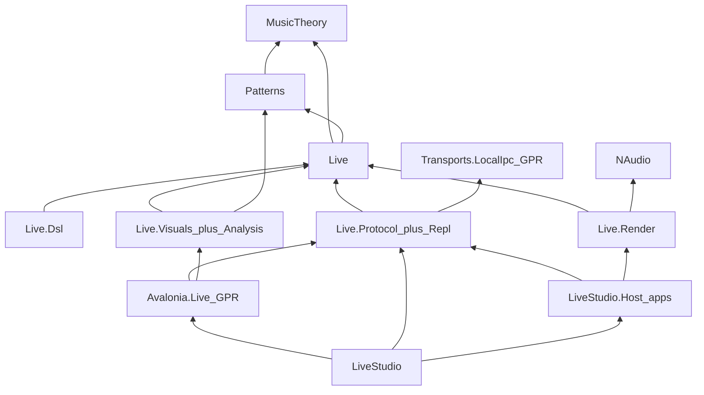

# Live family improvements (Option C)

## Locked decisions

- **Scope:** hygiene + consolidate thin packages + first synthesis that makes sound
- **Host ownership:** canonical executable only at [`novolis-apps/src/LiveStudio/host`](novolis-apps/src/LiveStudio/host) (`LiveStudio.Host` / assembly `Novolis.Audio.Live.Host`). Delete [`novolis-audio/src/Novolis.Audio.Live.Host`](novolis-audio/src/Novolis.Audio.Live.Host) (duplicate of apps host today).
- **Breaking GPR clean break** for deleted/renamed packages (no type-forward shells)

## Target shape



Spine packages kept: `MusicTheory`, `Patterns`, `Live`, `Dsl`, `Protocol`, `Visuals`, new `Render`.

## Phase 1 — Hygiene and NuGet-only

### 1.1 Dead references

In [`Novolis.Audio.Live.csproj`](novolis-audio/src/Novolis.Audio.Live/Novolis.Audio.Live.csproj): remove unused `ProjectReference`s to `Novolis.Audio.Analysis` and `Novolis.Audio.Core`.

### 1.2 Protocol → GPR transports

- Add `Novolis.Transports.LocalIpc` `2026.1.*` to [`novolis-audio/Directory.Packages.props`](novolis-audio/Directory.Packages.props)
- In [`Novolis.Audio.Live.Protocol.csproj`](novolis-audio/src/Novolis.Audio.Live.Protocol/Novolis.Audio.Live.Protocol.csproj): replace sibling `ProjectReference` to `novolis-transports` with `PackageReference`
- Confirm restore/build against GitHub Packages only

### 1.3 Avalonia → GPR audio Live packages

In [`Novolis.Avalonia.Live.csproj`](novolis-avalonia/src/Novolis.Avalonia.Live/Novolis.Avalonia.Live.csproj) and [`samples/LiveAvalonia/LiveAvalonia.csproj`](novolis-avalonia/samples/LiveAvalonia/LiveAvalonia.csproj):

- Replace cross-repo `ProjectReference`s into `novolis-audio` with `PackageReference`s (`Live.Protocol`, `Live.Visuals`, and post-consolidation package set)
- Add versions to [`novolis-avalonia/Directory.Packages.props`](novolis-avalonia/Directory.Packages.props)

**Publish order:** audio packages (after consolidation) → Avalonia Live → LiveStudio apps consume floating `2026.1.*`

### 1.4 Docs honesty

Update [`novolis-audio/README.md`](novolis-audio/README.md), Live package READMEs, and [`docs/design.md`](novolis-audio/docs/design.md) (or add a short `docs/live.md`):

- State explicitly: control plane + **basic synthesis** (post Phase 3); not a full DAW
- Document three families (game SFX / voice / live) and that Live does not use Voice or miniaudio
- List consolidated package table

### 1.5 verify-nuget-only

Re-run `pwsh -File novolis-governance/scripts/verify-nuget-only.ps1` — Live.Protocol and Avalonia Live ProjectReference violations must be gone. (Any remaining non-Live violations are out of scope unless they are the same files.)

## Phase 2 — Consolidate thin packages

### 2.1 Merge `Analysis` into `Live.Visuals`

- Move `WaveformFrame`, `SpectrumFrame`, `AudioAnalysisSnapshot` into [`Novolis.Audio.Live.Visuals`](novolis-audio/src/Novolis.Audio.Live.Visuals/) under namespace `Novolis.Audio.Live.Visuals` (or keep `Novolis.Audio.Analysis` namespace only if Avalonia already imports it heavily — prefer `Live.Visuals` and update usings)
- Delete project [`Novolis.Audio.Analysis`](novolis-audio/src/Novolis.Audio.Analysis/); remove from [`Novolis.Audio.slnx`](novolis-audio/Novolis.Audio.slnx) and governance platform solution lists
- Drop Analysis from consumer `Directory.Packages.props` files

### 2.2 Fold `Repl` into `Protocol`

- Move `LiveReplClient` and `LiveReplSyntaxCompiler` into `Novolis.Audio.Live.Protocol` (subfolder `Repl/`, namespace `Novolis.Audio.Live.Repl` kept for minimal churn **or** `Novolis.Audio.Live.Protocol.Repl` — use **`Novolis.Audio.Live.Repl` namespace kept inside Protocol assembly** so LiveStudio source mostly only drops a PackageReference)
- Protocol gains ProjectReferences currently on Repl (`Dsl` if needed for syntax compiler)
- Delete [`Novolis.Audio.Live.Repl`](novolis-audio/src/Novolis.Audio.Live.Repl/) project; LiveStudio / tests / Avalonia sample stop referencing that package Id
- Update unit test project refs

### 2.3 Delete duplicate audio Host project

- Remove [`novolis-audio/src/Novolis.Audio.Live.Host`](novolis-audio/src/Novolis.Audio.Live.Host/) from repo and slnx
- Point sample README / `LiveHostPaths` at apps host only
- Keep assembly name `Novolis.Audio.Live.Host` on apps exe for launcher compatibility

### 2.4 Rename game `Audio.Host.*` → `Audio.Output.*`

Avoid collision with Live host:

| Old | New |
|-----|-----|
| `Novolis.Audio.Host.Abstractions` | `Novolis.Audio.Output.Abstractions` |
| `Novolis.Audio.Host.NAudio` | `Novolis.Audio.Output.NAudio` |

- Rename folders, PackageIds, AssemblyNames, RootNamespaces (`Novolis.Audio.Output`)
- Update dogfooding: [`NovolisVoiceStudio`](novolis-dogfooding/apps/audio/NovolisVoiceStudio/NovolisVoiceStudio.csproj), [`MeshBench`](novolis-dogfooding/apps/rendering/MeshBench/MeshBench.csproj), and `Directory.Packages.props`
- Document breaking rename in [`docs/release.md`](novolis-audio/docs/release.md)

## Phase 3 — First synthesis (`Live.Render`)

### 3.1 New packable package

Create `Novolis.Audio.Live.Render`:

- Depends on: `Live`, `MusicTheory`, `Patterns`, `NAudio` (nuget.org)
- **Does not** depend on Voice, miniaudio, or Avalonia

Public surface (minimal):

```csharp
public interface ILiveAudioEngine : IAsyncDisposable
{
    void Bind(LiveSession session);
    Task StartAsync(CancellationToken ct = default);
    Task StopAsync(CancellationToken ct = default);
}

public sealed class OscillatorLiveAudioEngine : ILiveAudioEngine { ... }
```

### 3.2 Engine behavior (v0)

- Sample rate 44.1 kHz mono (or stereo identical channels), NAudio `WaveOutEvent` + custom `ISampleProvider` / `WaveProvider32`
- Drive from `LiveSession.ActiveProgram` + `LiveSession.Clock` (poll or callback from host clock loop)
- Map pattern notes to short voices: frequency from `Pitch`, duration from `Duration`, amplitude from `Velocity`
- Map `InstrumentKind` to waveforms for v0:
  - `Sine`, `Lead`, `Pad`, `Bell`, `Keys` → sine
  - `Square`, `Pluck` → square
  - `Saw`, `Bass` → saw
  - `Triangle` → triangle
  - `Noise`, `Hat`, `Snare`, `Clap` → white-noise burst
  - `Kick`, `Tom` → low sine + short decay
  - `Sampler` → sine fallback (no samples yet)
- Respect track presence; ignore `EffectKind` chains in v0 (no-op / documented)
- Polyphony cap (e.g. 16 voices) with steal-oldest
- Optional: fill `WaveformFrame` / `AudioAnalysisSnapshot` from the mix buffer so Visuals stop being empty placeholders

### 3.3 Wire into apps host

In [`LiveStudio/host/Program.cs`](novolis-apps/src/LiveStudio/host/Program.cs):

- Construct `LiveSession` + `OscillatorLiveAudioEngine`
- Start engine with session; keep existing IPC handlers
- Drive clock as today (`AdvanceTo`) and let engine read session state each tick / audio callback
- PackageReference `Novolis.Audio.Live.Render` (after publish) or same-repo only via apps consuming GPR post-merge

### 3.4 Tests

In `Novolis.Audio.Live.Unit` (or new Render tests):

- Pitch → frequency sanity
- Engine starts/stops without throw
- Submitting a one-note program produces non-silent buffer samples (offline render helper preferred over WaveOut in CI)

## Phase 4 — Consumers and publish

1. Publish audio packages to GitHub Packages (`Live`, `Visuals`, `Protocol`, `Dsl`, `Render`, `Output.*`, …)
2. Switch Avalonia Live to PackageReferences; publish `Novolis.Avalonia.Live`
3. Update [`novolis-apps` LiveStudio](novolis-apps/src/LiveStudio/) PackageReferences (drop `Live.Repl` / `Analysis`; add `Render` on host)
4. Update dogfooding Output package names
5. `dotnet test` Live.Unit; smoke LiveStudio host (hear a note)
6. `verify-nuget-only.ps1` exit 0 for touched repos

## Out of scope

- Full DAW FX (`EffectKind` DSP)
- Sample libraries / true `Sampler`
- Merging Live with Voice or game SFX
- Voice package debt (Codecs, adapter→facade DI) — separate pass

## Done check

- No sibling ProjectReferences from Protocol or Avalonia Live into other repos
- `Analysis` and `Live.Repl` and audio `Live.Host` projects gone; `Host.*` renamed to `Output.*`
- LiveStudio host plays oscillator audio for a compiled program
- Docs describe control plane + basic synthesis honestly
- Unit tests green; nuget-only verify clean for Live/Avalonia paths

