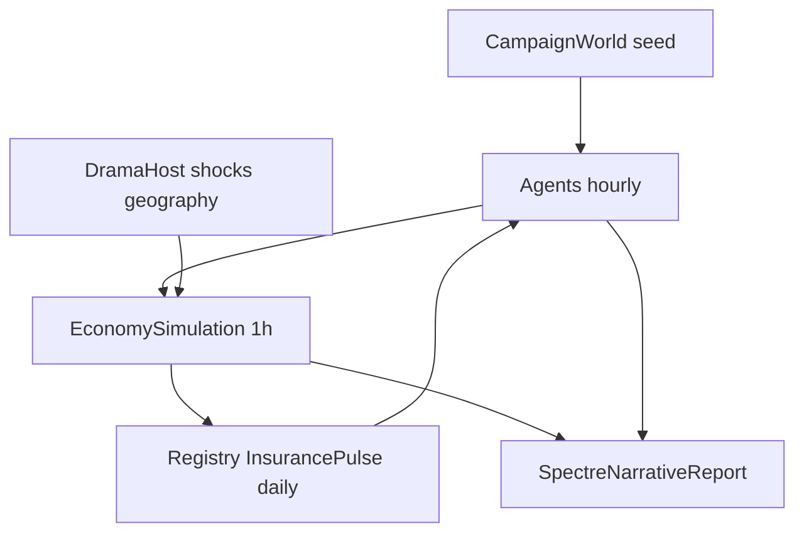

# Living campaign universe (deep + wide + rigorous)

## Locked defaults

- **Surface:** headless-first. Spectre becomes a *narrative causality report* (milestones, biographies, grounding cascades). Avalonia StarMap stays out (roadmap later).
- **Drama axis:** **balanced** — owner-master margin *and* FTL geography in one pulse (not two separate products).
- **Architecture:** keep logic in Sins `Universe/` + thin conservative library hooks; **no** new `Novolis.Economy.Campaign` package yet.
- **Money rule unchanged:** Ops vs Core never summed; campaign insurance stays Ops-led until claims need Core `LossEvent`.
- **Validation cadence:** after each phase — regenerate map if packables change → `dotnet build … -p:NovolisUseProjectReferences=true` → campaign `10d`/`100d` seed `1001` → Economy unit suite → `verify-project-ref-mode -SkipBuild` / `verify-nuget-only`.

Fiction anchors: [Margin Was Freedom](https://frankhaugen.github.io/galactic-confederation-review/articles/the-margin-was-the-freedom/), [Ship Law dossier](https://frankhaugen.github.io/galactic-confederation-review/dossiers/ship-law-and-registry/), [FTL tradeoffs](https://frankhaugen.github.io/galactic-confederation-review/articles/ftl-transit-operational-tradeoffs/). Docs live in [`docs/ship-law-and-transit.md`](novolis-apps/src/SinsOfACapitalismTycoon/docs/ship-law-and-transit.md).



## What already exists (baseline)

- 100 hubs, corridors, roles, tramp + mega-hauler, `TransitProfile`, `ShipRegistry`, daily premiums, Spectre ops/registry tables ([`CampaignWorld.cs`](novolis-apps/src/SinsOfACapitalismTycoon/Universe/CampaignWorld.cs), [`Commerce/`](novolis-apps/src/SinsOfACapitalismTycoon/Universe/Commerce/), [`SpectreHeadlessReport.cs`](novolis-apps/src/SinsOfACapitalismTycoon/Universe/Reporting/SpectreHeadlessReport.cs)).
- Library agents already present but **feedback-starved**: fixed gate prices, no facility upgrades, insurance is premium-only, ventures gated off, berth congestion not acted on.

## Life moments this plan must produce (acceptance)

After `100d` seed `1001` (and a second seed for variance), Spectre must show scannable evidence of:

1. **Late-payment spiral** — tramp/firm cash vs due-now → missed premium or idle haul → registry hold → plant ore floor stress.
2. **Mega-hauler biography** — reconstructable Slow bulk lane (Sol↔mine↔plant): days, wear, lots delivered.
3. **Registry grounding cascade** — ≥2 hulls uninsured/suspended in same window; Final shelf / HH idle consequence visible.
4. **Fuel-starved region** — injected or endogenous bunker drought; plan-fails spike; hulls stuck Loading.
5. **Insured loss that does not erase damage** — stall-abandon or production shock → claim net of deductible; underwriter cash down; Industry still short for days.

Rigor: deterministic seed; state hash in header; Ops/Core dual books; cash conservation invariants where Core smoke still runs; no silent NaNs; greppable `MILESTONE:` lines.

---

## Phase A — Endogenous commerce feedback (library agents + Sins wiring)

**Goal:** prices and capacity become causal, not constants.

1. **Market-aware gates** in [`SinsAgents.cs`](novolis-apps/src/SinsOfACapitalismTycoon/Universe/Agents/SinsAgents.cs): wrap `GatePrice` with `ObservedMarketBook` trend/estimate where tape exists; seed constants become floors/ceilings only ([`ObservedMarketBook`](novolis-economy/src/Novolis.Economy.Markets/ObservedMarketBook.cs)).
2. **Capacity investment agent pulse** (Sins-local or thin Manufacturing policy): when plant/mine stockouts persist and cash > floor, enqueue `UpgradeFacility` via existing [`DefaultConsequenceEngine.TryUpgradeFacility`](novolis-economy/src/Novolis.Economy.Simulation/DefaultConsequenceEngine.cs) / `UpgradeFacility` command.
3. **Proactive `RepayLoan`** on Treasury borrowers (Industry + carriers) before due; allow rare default → absorb to reshape facilities ([`SettleFinancePhase`](novolis-economy/src/Novolis.Economy.Simulation/Phases/StubPhases.cs)).
4. **Enable spoilage** on Final (and optionally Energy) via `EconomyPolicy` so long Slow legs create time-value pressure.

**Library change:** only if Manufacturing/Carrier need optional hooks; prefer app wrappers first.

---

## Phase B — Loss, claims, and registry teeth

**Goal:** insurance becomes a risk market, not a tax.

1. On logistics **stall-abandon** / cancelled dump and on extreme Priority wear events, emit ops claim or Core `LossEvent(TransportLoss)` bridged into campaign underwriter ([`RiskKind`](novolis-economy/src/Novolis.Economy.Core/Enums.cs), period claim path). Deductible + payout; loss quantity still gone.
2. Extend [`InsurancePulse`](novolis-apps/src/SinsOfACapitalismTycoon/Universe/Commerce/InsurancePulse.cs): premium quotes rise with Priority exposure + route difficulty; claims drain underwriter; underwriter insolvency raises premiums globally (actuarial feedback).
3. **Yard fiction (light):** suspended hulls require a cash “service” post (not just premium) to clear wear below threshold — stops bomb-edging via pay-to-clear exploit.
4. Enable **`VenturesEnabled`** after berth/fuel entry fix: venture tramp must `ShipRegistry.Register` + `CanOperate` + insurance from day one ([`HouseholdTrampVentureAgent`](novolis-apps/src/SinsOfACapitalismTycoon/Universe/Agents/HouseholdTrampVentureAgent.cs)).

---

## Phase C — FTL geography pressure

**Goal:** the map bites.

1. **Heterogeneous fuel geography:** reduce seeded bunker at Waypoint/Transit edges; Capital/Industrial keep denser fuel. Add rare `DramaHost` fuel drought on a role cluster (deterministic from seed ^ day).
2. **Berth congestion:** tighten Capital berths slightly; carriers prefer alternate hubs when `WaitingBerth` / high utilization (read snapshot [`AverageBerthUtilization`](novolis-economy/src/Novolis.Economy.Logistics/Extensions/) if present, else count WaitingBerth).
3. **Lane quality tag (app):** mark long-band corridors (`difficulty=3` already in bridge) as higher wear/premium exposure in registry quotes — no duplicate corridor graph.
4. **Poorly connected systems:** RoleAssigner / report call out low-degree hubs; Sol export + tramp incentives to serve them when margin allows (edge commerce from the memoir).

Optional thin library: expose berth utilization on `TransportAggregates` if missing (conservative counter).

---

## Phase D — DramaHost + Spectre narrative

**Goal:** exciting, greppable stories without UI.

1. New [`Universe/Drama/CampaignDramaHost.cs`](novolis-apps/src/SinsOfACapitalismTycoon/Universe/Drama/): scheduled, seed-deterministic events inspired by Core [`ShockPolicy`](novolis-apps/src/SinsOfACapitalismTycoon/Sim/Policies/ShockPolicy.cs) / fiscal / logistics-bind — but campaign-scale (hub id, SKU, magnitude). CLI: `--drama on|off` (default on).
2. **Ship biography log:** ring buffer per firm (departures, profile, origin→dest, delivered qty, wear Δ, stall, claim). Mega-hauler always retained.
3. Expand [`SpectreHeadlessReport`](novolis-apps/src/SinsOfACapitalismTycoon/Universe/Reporting/SpectreHeadlessReport.cs):
   - Milestones table (`MILESTONE: grounding`, `fuel-famine`, `claim`, `upgrade`, `default`)
   - Mega biography panel
   - Berth util / shipments-by-phase / market tape sample
   - Cohort labor / Final stockout days
4. Docs: update [`ship-law-and-transit.md`](novolis-apps/src/SinsOfACapitalismTycoon/docs/ship-law-and-transit.md), [`agents-and-firms.md`](novolis-apps/src/SinsOfACapitalismTycoon/docs/agents-and-firms.md), [`cli-and-reports.md`](novolis-apps/src/SinsOfACapitalismTycoon/docs/cli-and-reports.md), [`vision.md`](novolis-apps/src/SinsOfACapitalismTycoon/docs/vision.md) — institutional tone.

---

## Phase E — Rigor gate (meta-solution loop)

From `d:\novolis`:

```powershell
pwsh -File novolis-governance/build/Generate-Platform-Slnx.ps1   # if packables changed
dotnet build novolis-apps/src/SinsOfACapitalismTycoon -p:NovolisUseProjectReferences=true
dotnet run --project novolis-economy/tests/Novolis.Economy.Unit --no-build   # after ProjectRef build of tests
dotnet run --project novolis-apps/src/SinsOfACapitalismTycoon -p:NovolisUseProjectReferences=true -- --engine campaign --days 10d --seed 1001
dotnet run --project novolis-apps/src/SinsOfACapitalismTycoon -p:NovolisUseProjectReferences=true -- --engine campaign --days 100d --seed 1001 --quiet
dotnet run --project novolis-apps/src/SinsOfACapitalismTycoon -p:NovolisUseProjectReferences=true -- --engine core --scenario baseline --periods 50 --quiet
pwsh -File novolis-governance/scripts/verify-project-ref-mode.ps1 -SkipBuild
pwsh -File novolis-governance/scripts/verify-nuget-only.ps1
```

Add Economy unit tests for: profile×claim interaction, premium quote monotonic in wear, drama determinism (same seed → same milestone set).

**GPR note:** library API bumps need CI publish before single-repo PackageReference consumers; local validation stays ProjectRef-only (no local feeds).

---

## Out of scope (this plan)

- Avalonia StarMap / live Spectre dashboard
- Shared `Novolis.Economy.Campaign` extraction
- Full C-series container objects, passenger modules, true piracy AI, rescue fleet simulation
- Live HYG catalog regeneration

## Done when

- Five life moments appear in `100d` Spectre with greppable milestones
- Economy unit suite green; core baseline still conserves cash
- Docs map fiction↔code for new loops
- verify-nuget-only / project-ref-mode OK

