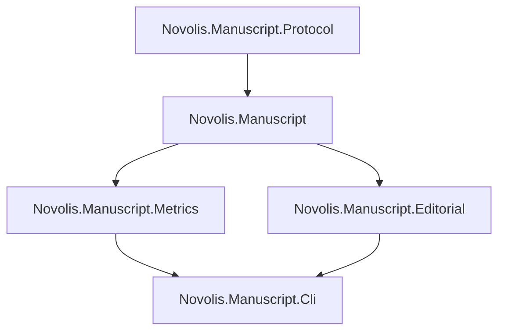

# Manuscript Editorial Phase 1

Architecture source: [manuscript-editorial-heuristics.canvas.tsx](C:\Users\frank\.cursor\projects\d-novolis\canvases\manuscript-editorial-heuristics.canvas.tsx).

**Scope of this plan (mergeable slice):** Phase 1 only — `Novolis.Manuscript.Editorial` + Metrics metadata findings + Cli. Continuity / Dialogue / Editorial.Ml are sequenced follow-ons after this ships (not in this PR).

## Locked decisions

- Detectors live in **libraries**, not books tools, agent skills, or Protocol.
- Reuse existing [`DiagnosticFinding`](d:\novolis\novolis-manuscript\src\Novolis.Manuscript\ManuscriptDoctor.cs) / `DiagnosticSeverity` from `Novolis.Manuscript` (no parallel finding type).
- **Protocol stays structural** — no editorial finding codes in NMP diagnostics.
- **No** `Novolis.MachineLearning.*` references in this phase.
- **No** `ProjectReference` or content dump from `D:\repos\books` into libraries; fixtures are inline unit-test markdown/YAML.
- Seed forbid/prefer patterns by **porting** high-value rules from books `docs/LLM_PROSE_GLOSSARY.md` + `EDITORIAL_GUIDELINES.md` into C# rule modules (code is source of truth; docs remain human guidance).
- Avalonia unchanged this phase (Cli-first).

## Package layout

New project: [`d:\novolis\novolis-manuscript\src\Novolis.Manuscript.Editorial\`](d:\novolis\novolis-manuscript\src\Novolis.Manuscript.Editorial\)

| Type | Role |
|------|------|
| `EditorialAnalyzer` | Entry: scan book/chapters dir → `IReadOnlyList<DiagnosticFinding>` |
| `EditorialOptions` | Profile (`fiction` / `nonfiction`), paths, enable flags |
| `LexiconRules` | Forbid-list / prefer-pair matchers (warp→jumpspace, ship lexicon, etc.) |
| `SlopPatternRules` | Deterministic patterns: correlative negation, meta-commentary stems, post-beat gloss heuristics |
| `NamingRules` | Optional alias table (built-in Calypso core cast variants + API to load extra names) |
| Finding codes | Stable string codes e.g. `editorial-lexicon-forbid`, `editorial-slop-correlative-negation`, `editorial-naming-variant` |

Csproj: packable, `ProjectReference` → `Novolis.Manuscript` only (same as Metrics). Add to [`Novolis.Manuscript.slnx`](d:\novolis\novolis-manuscript\Novolis.Manuscript.slnx); ProjectRef from unit tests + Cli.

## Metrics extension (metadata / TK debt)

In [`ManuscriptCharacterSlices.cs`](d:\novolis\novolis-manuscript\src\Novolis.Manuscript.Metrics\ManuscriptCharacterSlices.cs) / sibling:

- New API e.g. `ManuscriptMetadataDebt.Diagnose(chaptersDir)` emitting findings for:
  - Literal `TK` in public/extended metadata values
  - Missing `pov` and/or `characters` when format is callout/YAML metadata present
  - Empty chapter body (if not already covered by Doctor — avoid duplicate codes; prefer Doctor for empty, Metrics for metadata-quality)

Keep Metrics free of ML and Avalonia.

## Cli wiring

Extend [`BookCommands.cs`](d:\novolis\novolis-manuscript\src\Novolis.Manuscript.Cli\BookCommands.cs):

- `book editorial [--series] [--book] [--json]` → run `EditorialAnalyzer` (+ optionally metadata debt) and print via existing `WritePayload`
- ProjectReference Editorial from Cli csproj
- Help text updated

Do **not** fold editorial into `book doctor` yet (keeps structural doctor clean; compose later if desired).

## Tests

[`d:\novolis\novolis-manuscript\tests\Novolis.Manuscript.Unit\`](d:\novolis\novolis-manuscript\tests\Novolis.Manuscript.Unit\) — new `Editorial\` folder:

- Lexicon: forbidden token hits / allow in dialogue-quoted exceptions only if rule says so
- Slop: correlative negation and 1–2 guideline patterns fire; clean Calypso-like prose does not
- Naming: variant spelling vs canonical table
- Metadata debt: `TK` and missing pov
- No filesystem dependency on `D:\repos\books`

## Platform / publish hygiene

After adding packable project:

1. Regen map: `pwsh -File d:\novolis\novolis-governance\build\Generate-Platform-Slnx.ps1`
2. Build/test: `dotnet test d:\novolis\novolis-manuscript\tests\Novolis.Manuscript.Unit\Novolis.Manuscript.Unit.csproj -p:NovolisUseProjectReferences=true`
3. Policy: `pwsh -File d:\novolis\novolis-governance\scripts\verify-nuget-only.ps1` (and project-ref mode check as usual)
4. Publish `Novolis.Manuscript.Editorial` via normal manuscript CI/GPR path on merge (no local feed)

## Out of scope (next milestones after Phase 1)

| Phase | Package | Work |
|-------|---------|------|
| 2 | `Novolis.Manuscript.Continuity` | Timeline/clock graph, fact ledger, FTL/route TSV adapters |
| 3 | `Novolis.Manuscript.Dialogue` | Quote spans + attribution; later `Export.Audio` consumer |
| 4 | `Novolis.Manuscript.Editorial.Ml` | PackageReference `Novolis.MachineLearning.*` only here |
| 5 | Apps | Avalonia.Manuscript finding chrome |

## Done when

- Editorial package builds, packs, and is referenced only downward as above
- Cli `book editorial` reports findings on synthetic fixtures
- Metrics metadata-debt tests green
- Protocol unchanged for editorial policy
- Platform slnx regenerated; nuget-only / layer checks clean

