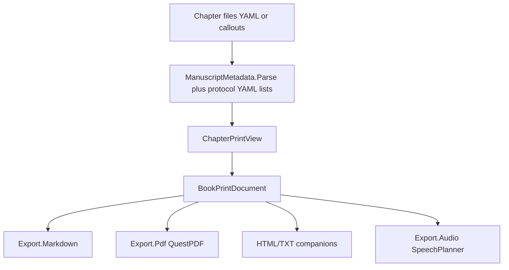

# Manuscript print remodel (from audit canvas)

Source of truth for defects: [novolis-manuscript-audit.canvas.tsx](C:\Users\frank\.cursor\projects\d-novolis\canvases\novolis-manuscript-audit.canvas.tsx).

## Locked decisions

- **Print fidelity:** keep books-grade QuestPDF in [`Novolis.Manuscript.Export.Pdf`](d:\novolis\novolis-manuscript\src\Novolis.Manuscript.Export.Pdf); do **not** replace it with lower-fidelity [`MarkdownPdfExporter`](d:\novolis\novolis-markup\src\Novolis.Markup.Markdown.Rendering\MarkdownPdfExporter.cs). Feed it **assembled reader markdown**, never raw chapter concat.
- **Metadata:** NMP/1 YAML is canonical ([PROTOCOL.md §12](d:\novolis\novolis-manuscript\src\Novolis.Manuscript.Protocol\PROTOCOL.md)); callouts remain a legacy ingest path. One print model owns public vs hidden.
- **Markup:** new `Novolis.Manuscript.Export.Markdown` builds reader/author Markdown strings (and HTML companions via `Novolis.Markup.Markdown.Rendering`). Fluent `MarkdownDocument` only for structured emit when useful; chapter **parse** stays in manuscript (`ManuscriptMetadata` + protocol YAML).
- **Editorial:** empty/generic defaults in core; Calypso cast + lexicon live in an explicit `EditorialProfiles.Calypso` pack apps opt into.
- **Avalonia:** move `Novolis.Avalonia.Manuscript` to `novolis-avalonia` after print packages ship; apps keep the same package id.
- **Coverage:** org standard is MTP `dotnet test --coverage` (no Coverlet). Gate **≥95% branch and line** on headless manuscript assemblies. Mark Avalonia chrome `[ExcludeFromCodeCoverage]` so UI panes do not tank the gate.



## Phase A — Shared print model (core)

Add to [`Novolis.Manuscript`](d:\novolis\novolis-manuscript\src\Novolis.Manuscript):

| Type | Role |
|------|------|
| `ChapterMetadataVisibility` | Move public-tag policy from Export.Pdf (`date/time/system/location`) into core |
| `ChapterPrintView` | Title, reader dateline lines, hidden fields, body markdown (no front matter) |
| `BookPrintDocument` | Ordered chapters + cover meta |
| `BookPrintAssembler` | Load chapter paths → parse → views → assemble reader or author markdown |

Enhance [`ManuscriptMetadata.cs`](d:\novolis\novolis-manuscript\src\Novolis.Manuscript\ManuscriptMetadata.cs):

- Treat **any first H1** as title (drop `# Chapter N - Title` as the only recognized shape; keep that regex only as an optional number/title splitter when it matches).
- YAML: prefer protocol-quality list coercion for `locations` / `characters` (reuse logic from [`ProtocolMetadataReader.ReadChapterFrontMatter`](d:\novolis\novolis-manuscript\src\Novolis.Manuscript.Protocol\Internal\ProtocolMetadataReader.cs) or call into Protocol for NMP chapters). Naive `key: value` alone is insufficient for PROTOCOL lists.
- `Parse` must strip YAML fences so body never retains `---` / keys.

Reader emit order (acceptance for the Duckville failure):

```text
# Chapter title
{merged date time}
{system}
{location(s)}
<blank>
{body}
```

Hidden (`pov`, `characters`, `status`, `tags`, `notes`, extras) appear only in author mode / debug.

## Phase B — Wire exporters

### PDF / HTML / TXT

Refactor [`BookPrintExporter`](d:\novolis\novolis-manuscript\src\Novolis.Manuscript.Export.Pdf\BookPrintExporter.cs), [`ManuscriptBookPdfExporter`](d:\novolis\novolis-manuscript\src\Novolis.Manuscript.Export.Pdf\ManuscriptBookPdfExporter.cs), [`ManuscriptDocumentEmitters`](d:\novolis\novolis-manuscript\src\Novolis.Manuscript.Export.Pdf\ManuscriptDocumentEmitters.cs):

- Replace `ConcatenateChapterMarkdown` for **print** with `BookPrintAssembler` reader markdown.
- Keep callout→panel rendering in QuestPDF for any remaining reader dateline blockquotes **or** emit plain dateline paragraphs from the assembler (prefer assembler-owned plain lines so PDF does not depend on `[!tag]` detection for correctness).
- Delete / stop relying on Markdig treating `---` as thematic breaks for chapter metadata.

### Page breaks

In [`QuestPdfDocuments.WriteBookPdf`](d:\novolis\novolis-manuscript\src\Novolis.Manuscript.Export.Pdf\QuestPdfDocuments.cs):

- Insert `PageBreak` before **every** chapter H1 when the content column already has items (including chapter 1 after front matter).
- After cover, if the first content is a chapter H1, still start it on a fresh content page when prior non-cover material exists; simplest rule: **page break before each H1 except when it is the very first block of the content page and there is no preceding block**.

### Audio

Update [`SpeechPlanner.Normalize`](d:\novolis\novolis-manuscript\src\Novolis.Manuscript.Export.Audio\SpeechPlanner.cs) to consume body from `ManuscriptMetadata.Parse` / `ChapterPrintView` (strip YAML **and** callouts), not only `> [!` lines.

### New package `Novolis.Manuscript.Export.Markdown`

- Project under `src/Novolis.Manuscript.Export.Markdown/`, packable, referenced from CLI + unit tests + [`Novolis.Manuscript.slnx`](d:\novolis\novolis-manuscript\Novolis.Manuscript.slnx); regenerate platform map via [`Generate-Platform-Slnx.ps1`](d:\novolis\novolis-governance\build\Generate-Platform-Slnx.ps1).
- Package refs: `Novolis.Manuscript`, `Novolis.Markup.Markdown`, `Novolis.Markup.Markdown.Rendering`.
- API: `ManuscriptMarkdownExporter.ExportBook(BookPrintDocument|BookInfo, outputDir, ManuscriptMarkdownExportOptions)` writing `{id}.reader.md`, optional `{id}.author.md`, and HTML via `MarkdownHtmlExporter` / `MarkdownHtmlDocument.FromMarkdown`.
- CLI book print commands write Markdown through this package instead of raw concat.

## Phase C — Genericize editorial

In [`Novolis.Manuscript.Editorial`](d:\novolis\novolis-manuscript\src\Novolis.Manuscript.Editorial):

- `NamingRules`: empty built-in map; move `CalypsoCoreNames` to `EditorialProfiles.Calypso`.
- `LexiconRules`: Fiction profile does **not** auto-enable Calypso forbid-list unless Calypso profile (or explicit options) is selected.
- `EditorialOptions`: apps pass `NameMap` / `EnableLexicon` / profile id; CLI default stays neutral unless `--profile calypso`.
- Update BooksWriterStudio / BooksMobile only if they currently rely on implicit Calypso defaults (wire `EditorialProfiles.Calypso` explicitly where fiction GC work expects it).

## Phase D — Avalonia relocation

1. Move [`src/Novolis.Avalonia.Manuscript`](d:\novolis\novolis-manuscript\src\Novolis.Avalonia.Manuscript) → `d:\novolis\novolis-avalonia\src\Novolis.Avalonia.Manuscript` (same package id).
2. Remove from manuscript slnx/README package table as a “core” manuscript package; document under Avalonia composition grain.
3. Bump [`novolis-apps`](d:\novolis\novolis-apps) PackageReferences after GPR publish (PackageReference-only; no ProjectReference into sibling checkouts).
4. Assembly-level `[ExcludeFromCodeCoverage]` on Avalonia chrome until/unless dedicated UI tests exist.

## Phase E — Real tests (95% branch)

Expand [`tests/Novolis.Manuscript.Unit`](d:\novolis\novolis-manuscript\tests\Novolis.Manuscript.Unit) (TUnit). Prefer focused files over mega-coverage dumps; still cover branches.

### Must-have regression suite (Duckville failure mode)

New `Export/PrintAssemblerYamlRegressionTests.cs`:

| Test | Assert |
|------|--------|
| YAML chapter → reader TXT/HTML/MD | No `pov:`, `characters:`, `status:`, raw `date:` keys; no false `***` from `---` |
| YAML chapter → reader dateline | Values only; date+time merged; after H1 |
| Callout chapter → same reader contract | Parity with YAML |
| Preface + Chapter 1 PDF | Chapter 1 H1 starts new page (assert via structured emit hook or PDF text extract / companion TXT page markers if PDF text assert is brittle—prefer testing assembler + page-break decision helper with InternalsVisibleTo) |
| Author mode | Hidden fields present |
| Companion `.reader.md` | Built by Export.Markdown; hidden stripped |
| Audio Normalize on YAML chapter | Does not contain `pov:` / `characters:` |

### Branch coverage targets by assembly

Drive gaps with additional tests (mirror existing `*Coverage*` naming only where needed):

- **Novolis.Manuscript:** `BookPrintAssembler`, visibility filter, YAML lists, empty/malformed front matter, H1-only titles, callout+YAML precedence (YAML wins when both present at start).
- **Export.Pdf:** page-break helper branches, cover on/off, empty chapters dir, debug vs reader, thematic breaks that are real `***` scene breaks in body, tables/lists unchanged.
- **Export.Markdown:** reader vs author, HTML write, missing book dir, empty chapter set.
- **Export.Audio:** Normalize YAML / callout / keepTitle branches.
- **Editorial:** empty defaults produce no Calypso hits; Calypso profile flags known variants; lexicon off by default.

### Coverage verification (no Coverlet)

```powershell
dotnet test d:\novolis\novolis-manuscript\tests\Novolis.Manuscript.Unit\Novolis.Manuscript.Unit.csproj -c Release -p:NovolisUseProjectReferences=true --coverage --coverage-output-format cobertura --coverage-output d:\novolis\novolis-manuscript\artifacts\coverage\unit.cobertura.xml

pwsh -File d:\novolis\novolis-governance\scripts\get-coverage-report.ps1 -Include novolis-manuscript -PlatformSlnx -FailBelow 95
```

Done when manuscript host aggregate **line and branch ≥ 95%** with Avalonia excluded from instrumentation via `[ExcludeFromCodeCoverage]`. Inspect ReportGenerator HTML for remaining branches in Assembler / QuestPdfDocuments / ManuscriptMetadata before claiming done.

Also run:

```powershell
dotnet test d:\novolis\novolis-manuscript\tests\Novolis.Manuscript.Unit\Novolis.Manuscript.Unit.csproj -p:NovolisUseProjectReferences=true
pwsh -File d:\novolis\novolis-governance\scripts\verify-nuget-only.ps1
pwsh -File d:\novolis\novolis-governance\scripts\verify-project-ref-mode.ps1 -SkipBuild
```

## Ship order

1. Core print model + metadata fixes + PDF/audio wiring + regression tests (unblocks the user PDF).
2. Export.Markdown + CLI.
3. Editorial profile extraction + app explicit Calypso wiring.
4. Avalonia move + apps PackageReference after manuscript/avalonia GPR publish (`push origin main`, no maintainer PRs).
5. Coverage gap fill until FailBelow 95 passes for novolis-manuscript.

## Out of scope

- Rewriting NMP/1 filesystem layout.
- Replacing QuestPDF with Markup’s simple PDF exporter.
- Books content repo migrations (library must accept both YAML and callouts; content can stay).
- Org-wide Platform.slnx 95% gate for unrelated repos.
