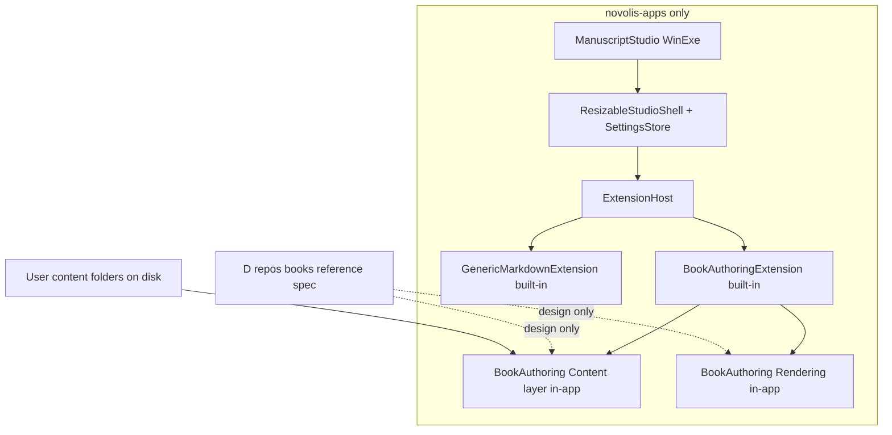

# Manuscript Studio: rename, layout, built-in Book Authoring

## Goals

| Item | Decision |
|------|----------|
| App name | **Manuscript Studio** (`src/ManuscriptStudio/`) |
| Scope | **novolis-apps only** — one WinExe, all logic in-app |
| `D:\repos\books` | **Reference / spec source** for layout, metadata, QuestPDF semantics — not a dependency, not a NuGet, not a sibling `ProjectReference` |
| Book Authoring | **Built-in extension** compiled into Manuscript Studio (no dynamic plugins, no separate books product) |
| Settings | JSON on disk, **AppContext-relative** data root (see below) |
| Splitters | Resizable tree / editor / preview; column widths saved in settings |

## Architecture



**NuGet-only (third-party + existing Novolis GPR):**

- `Novolis.Avalonia.Studio` (GPR)
- Avalonia 12, `Avalonia.HtmlRenderer`, `Markdig`, `QuestPDF`, `YamlDotNet`, `Microsoft.Extensions.Hosting` (nuget.org)

**No** `novolis-books` repo. **No** `Novolis.Books.*` packages. **No** `ProjectReference` into `D:\repos\books`.

---

## 1. Rename HandcraftedMarkdown → ManuscriptStudio

In [novolis-apps](d:\novolis\novolis-apps):

- `src/HandcraftedMarkdown/` → `src/ManuscriptStudio/`
- Update [Novolis.Apps.slnx](d:\novolis\novolis-apps\Novolis.Apps.slnx), README, docs
- Title: **Manuscript Studio**; namespace `ManuscriptStudio`
- **Generic Markdown** remains the default built-in mode (current folder tree + Markdig preview)

---

## 2. App data and persisted layout

Replace [AppSettingsStore.cs](d:\novolis\novolis-apps\src\HandcraftedMarkdown\Services\AppSettingsStore.cs) with `ManuscriptAppContext` + `ManuscriptSettingsStore`.

**Data root** (AppContext-relative, writable fallback):

```csharp
var dataRoot = Path.Combine(AppContext.BaseDirectory, "ManuscriptStudio");
if (!TryEnsureWritable(dataRoot))
    dataRoot = Path.Combine(
        Environment.GetFolderPath(Environment.SpecialFolder.LocalApplicationData),
        "Novolis", "ManuscriptStudio");
```

**File:** `{dataRoot}/settings.json`

```json
{
  "layout": { "leftColumnPixels": 280, "rightColumnPixels": 420 },
  "lastWorkspaceRoot": "D:\\repos\\books\\content\\series\\the-calypso-cycle",
  "contentRoot": "D:\\repos\\books",
  "activeExtensionId": "book-authoring",
  "bookAuthoring": {
    "seriesId": "the-calypso-cycle",
    "bookId": "calypso",
    "debugMetadata": false
  }
}
```

`contentRoot` is the user's publishing workspace root (default `D:\repos\books` on your machine) — paths under `content/series/` and `content/books/` discovered from there. Not wired to the books git repo as a build dependency.

Persist on: splitter drag-end, mode switch, series/book change, folder open.

---

## 3. Resizable three-column shell

Replace fixed [StudioWorkspace](d:\novolis\novolis-avalonia\src\Novolis.Avalonia.Studio\StudioWorkspace.cs) columns in [MainWindow.cs](d:\novolis\novolis-apps\src\HandcraftedMarkdown\MainWindow.cs) with app-local `ResizableStudioShell`:

- Columns: `Left | GridSplitter | * | GridSplitter | Right`
- Min width ~120px per side; center `*`
- `GridSplitter.DragCompleted` → save `layout` to settings
- Keep `StudioChrome` / `StudioFeedback` from GPR package

---

## 4. Built-in extension host

Under `src/ManuscriptStudio/Core/`:

| Type | Role |
|------|------|
| `IManuscriptExtension` | Id, display name, left rail, toolbar items, preview hook |
| `ManuscriptExtensionRegistry` | Registers **only built-in** extensions in `Program.cs` |
| `ManuscriptHostContext` | Session, feedback, settings, active extension |
| Mode switcher | Toolbar: **Generic Markdown** / **Book Authoring** |

**Built-in extensions (v1):**

1. `generic-markdown` — current [MarkdownEditorSession](d:\novolis\novolis-apps\src\HandcraftedMarkdown\Services\MarkdownEditorSession.cs) + folder tree + Markdig preview
2. `book-authoring` — Book Authoring (section 5)

No DLL plugin loading. Future modes = new built-in class + registry entry in the same project.

---

## 5. Built-in Book Authoring (all code in ManuscriptStudio)

Folder layout inside the app project:

```
src/ManuscriptStudio/
  Extensions/BookAuthoring/
    BookAuthoringExtension.cs      # IManuscriptExtension impl + UI wiring
    Navigation/                    # series/book/chapter picker
    Helpers/                       # metadata + dialogue insert actions
    Content/                       # in-app "books" logic (not a separate repo)
      ContentCatalog.cs            # discover content/series + content/books
      SeriesBookModels.cs          # series.yaml, book.yaml models
      ChapterOrder.cs              # booktools-chapter, heading, filename rules
      ChapterMetadata.cs           # [!tag] parse/write/visibility
    Rendering/
      BookPreviewRenderer.cs       # Markdig + metadata HTML (books semantics)
      BookPdfExporter.cs           # QuestPDF export (Community license)
```

**Design reference** (read-only, do not import or shell out):

- [content-model.cs](D:\repos\books\tools\models\content-model.cs) — discovery layout
- [CHAPTER_METADATA_SPEC.md](D:\repos\books\docs\CHAPTER_METADATA_SPEC.md) — `[!tag]` tags
- [chapter-order.md](D:\repos\books\docs\chapter-order.md) — sort keys
- [compile-book.cs](D:\repos\books\tools\dev\compile-book.cs) — preview/PDF behavior (reimplement in-app, not copy-paste)

### Navigation (left rail)

- `contentRoot` picker (default `D:\repos\books`)
- Series dropdown → book dropdown → ordered chapter list (from in-app `ContentCatalog` + `ChapterOrder`)
- Opens chapter `.md` files under `content/series/{id}/books/{slug}/chapters/` (or standalone `content/books/`)

### Toolbar helpers

| Helper | Behavior |
|--------|----------|
| Metadata | Insert `[!date]`, `[!time]`, `[!system]`, `[!location]`, `[!pov]`, `[!characters]` at cursor |
| Dialogue | Insert functional-block prose templates (line-break dialogue, quoted paragraph) per books STYLE conventions |
| Chapter tag | Insert `<!-- booktools-chapter: N -->` |
| Debug metadata | Toggle extended `[!tag]` visibility in preview |
| Export PDF | In-app `BookPdfExporter` → `{dataRoot}/exports/{series}/{book}/` or user-picked folder |

### Preview

- **Book Authoring mode:** `BookPreviewRenderer` (books-aligned Markdig + metadata blockquote handling)
- **Generic mode:** existing `MarkdownPreviewRenderer` + `Avalonia.HtmlRenderer`

Optional v1: small metadata summary panel (parsed tags for current chapter).

### QuestPDF

Set `QuestPDF.Settings.License = LicenseType.Community` once at app startup (same as books `compile-book.cs`). Package: **QuestPDF** on nuget.org only.

---

## 6. Package references

Update [Directory.Packages.props](d:\novolis\novolis-apps\Directory.Packages.props) — add only:

```xml
<PackageVersion Include="YamlDotNet" Version="16.3.0" />
<PackageVersion Include="QuestPDF" Version="2025.7.4" />
<PackageVersion Include="Markdig" Version="0.41.3" />
```

(Align Markdig with books reference; bump patch if Avalonia app already pins 0.38 — pick one version for the app.)

Keep: Avalonia 12, `Avalonia.HtmlRenderer`, `Novolis.Avalonia.Studio`, `Microsoft.Extensions.Hosting`.

---

## 7. Docs (novolis-apps only)

- [docs/getting-started.md](d:\novolis\novolis-apps\docs\getting-started.md) — Manuscript Studio, Book Authoring mode, `contentRoot`, Calypso smoke path
- [docs/design.md](d:\novolis\novolis-apps\docs\design.md) — built-in extensions; books repo as editorial reference, not runtime dependency
- App README under `src/ManuscriptStudio/README.md`

No governance/registry changes for a books domain.

---

## Implementation order

1. Rename to ManuscriptStudio + update slnx/docs
2. `ManuscriptSettingsStore` + `ResizableStudioShell`
3. Extension host + `GenericMarkdownExtension` (lift current code)
4. `Extensions/BookAuthoring/` — Content layer (catalog, order, metadata)
5. Book Authoring rendering (preview + PDF) + UI (nav, helpers, mode switch)
6. `verify-nuget-only.ps1`, `dotnet build`, smoke: open Calypso `047-marsh-black.md` in Book Authoring mode

## Risks

- **HtmlRenderer** may not render full `style.css` from books — PDF export is the faithful print path for v1
- **QuestPDF Community** license required at startup
- **GPR** still needed for `Novolis.Avalonia.Studio` only (no new Novolis packages)

