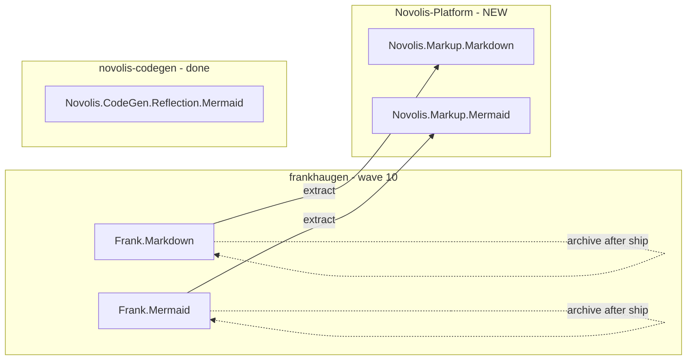

# Frank.Markdown + Frank.Mermaid → Novolis-Platform

## Repos found (frankhaugen)

| Repo | Role | NuGet | Deps | Novolis status |
|------|------|-------|------|----------------|
| [Frank.Markdown](https://github.com/frankhaugen/Frank.Markdown) | Fluent GitHub-flavored Markdown builder | `Frank.Markdown` | None (library) | **Not migrated** — P1 hold in [frank-inventory.md](d:\novolis\novolis-governance\docs\frank-inventory.md) |
| [Frank.Mermaid](https://github.com/frankhaugen/Frank.Mermaid) | Fluent Mermaid diagram text builder (flowchart, sequence, gantt, …) | `Frank.Mermaid` | None (library) | **Not migrated** — not listed separately from Reflection |
| [Frank.Reflection.Mermaid](https://github.com/frankhaugen/Frank.Reflection) (package inside Reflection repo) | Reflection → `classDiagram` strings | `Frank.Reflection.Mermaid` | `Frank.Reflection` | **Already migrated** → `Novolis.CodeGen.Reflection.Mermaid` in [novolis-codegen](d:\novolis\novolis-codegen) |

**Out of scope (per your choice):** [Frank.Blazor.Mermaid](https://github.com/frankhaugen/Frank.Blazor.Mermaid), [Frank.MarkdownEditor](https://github.com/frankhaugen/Frank.MarkdownEditor) (apps/UI).

**Important distinction:** `Frank.Mermaid` (standalone repo) and `Frank.Reflection.Mermaid` (codegen) are **different libraries**. Do not fold standalone Mermaid into `novolis-codegen`; keep reflection diagrams in `Novolis.CodeGen.Reflection.Mermaid`.



Frank.Reflection’s deferred Roslyn/doc path uses `Frank.Markdown` as a **NuGet dependency** ([Frank.Reflection.Roslyn](d:\novolis\bootstrap\scratch\frank-eval\Frank.Reflection\Frank.Reflection.Roslyn\Frank.Reflection.Roslyn.csproj)); that is a later codegen wave, not part of this repo merge.

---

## Org repo name (chosen)

**`novolis-markup`**

| | |
|--|--|
| **GitHub repo** | `Novolis-Platform/novolis-markup` |
| **Domain** | `Markup` |
| **Packages** | `Novolis.Markup.Markdown`, `Novolis.Markup.Mermaid` |
| **Solution** | `Novolis.Markup.slnx` |

**Why this name:** Both libraries produce **text markup** consumed by docs tools (GitHub-flavored Markdown and Mermaid diagram syntax). The name is neutral, covers both facets, and does not collide with `novolis-codegen` (reflection/Roslyn) or `novolis-templates`.

**Alternatives not used:**

| Repo | Packages | Why skipped |
|------|----------|-------------|
| `novolis-docs` | `Novolis.Docs.*` | Governance draft name; “docs” overlaps with governance/docs repos conceptually |
| `novolis-authoring` | `Novolis.Authoring.*` | Longer domain; less precise than “markup” |

Avoid: `novolis-mermaid` (excludes Markdown), `novolis-markdown` (excludes Mermaid), `novolis-diagrams` (misleading for Markdown).

---

## Governance prerequisites (before coding)

Current [frank-inventory.md](d:\novolis\novolis-governance\docs\frank-inventory.md) non-goal: *“Create `novolis-docs` for Markdown without governance approval.”* Resolve by updating governance to **`novolis-markup`** instead:

- [frank-naming-and-structure.md](d:\novolis\novolis-governance\docs\frank-naming-and-structure.md) — add `novolis-markup` row + package mapping
- [frank-inventory.md](d:\novolis\novolis-governance\docs\frank-inventory.md) — move Markdown/Mermaid from P1 hold → **Wave 10**; target `novolis-markup`
- New brief: `extraction-briefs/wave-10-markup.md`
- [migrate-frank-slice.ps1](d:\novolis\novolis-governance\scripts\migrate-frank-slice.ps1) — add replacements:
  - `Frank.Markdown` → `Novolis.Markup.Markdown`
  - `Frank.Mermaid` → `Novolis.Markup.Mermaid`
- [frank-sunset-banners.md](d:\novolis\novolis-governance\docs\frank-sunset-banners.md) — wave row for both Frank repos

---

## Target layout (matches Novolis convention)

```text
novolis-markup/
  src/Novolis.Markup.Markdown/
  src/Novolis.Markup.Mermaid/
  tests/Novolis.Markup.Markdown.Tests/
  tests/Novolis.Markup.Mermaid.Tests/
  Novolis.Markup.slnx
  .novolis/packages.json
  Directory.Build.props
  Directory.Packages.props
  global.json          # net10.0, SDK 10.x (align with other waves)
  .github/workflows/   # ci.yml + release.yml (copy from novolis-math or novolis-codegen)
```

No cross-package `ProjectReference` between Markdown and Mermaid (both are independent today).

---

## Migration steps (extract/rebuild, not git transfer)

Follow [frank-migration-runbook.md](d:\novolis\novolis-governance\docs\frank-migration-runbook.md):

1. **Scaffold** `Novolis-Platform/novolis-markup` from `novolis-template-dotnet` (or clone structure from [novolis-math](d:\novolis\novolis-math)).
2. **Source:** shallow clone into `bootstrap/scratch/frank-eval/`:
   - `Frank.Markdown`
   - `Frank.Mermaid`
3. **Extract** with `migrate-frank-slice.ps1` into `src/` / `tests/` (two slices).
4. **Tests — port xUnit → TUnit** ([naming.md](d:\novolis\novolis-governance\docs\naming.md)):
   - Frank.Markdown: ~38 `[Fact]` tests across 3 files (xUnit + Moq today)
   - Frank.Mermaid: tests under `Frank.Mermaid.Tests/` (verify count during slice)
   - Drop xUnit/Moq/JetBrains test packages; use TUnit + `Novolis.Testing.TUnit` only if needed
5. **Build:** `dotnet build` / `dotnet test` on `net10.0`.
6. **Registry:** add `novolis-registry/packages/novolis.markup.markdown.json` and `novolis.markup.mermaid.json`.
7. **Release:** `0.1.0-preview.1` per package (same pattern as wave 5 codegen).
8. **Personal repos — archive:**
   - Apply sunset banner from [frank-sunset-banners.md](d:\novolis\novolis-governance\docs\frank-sunset-banners.md) pointing to `Novolis.Markup.*` / `novolis-markup`
   - Archive `frankhaugen/Frank.Markdown` and `frankhaugen/Frank.Mermaid`
   - Optional: leave NuGet `Frank.*` packages unlisted with README pointing to `Novolis.Markup.*` (no binding redirect required — different package IDs)

**Do not** use GitHub “Transfer repository” for these libs; Novolis policy is extract without history transfer.

---

## Frank.Mermaid extras

- `Frank.Mermaid.Docs` sample project: move to `samples/Novolis.Markup.Mermaid.Docs/` or drop if redundant with README examples.
- README currently mentions “Blazor component” in places but the core package is renderer-agnostic diagram text — fix README during migration.

---

## Dependency / downstream notes

| Consumer | Action after wave 10 |
|----------|---------------------|
| `Frank.Blazor.Mermaid` (personal, out of scope) | Would need `Novolis.Markup.Mermaid` if ever migrated |
| `Frank.Reflection.Roslyn` (deferred) | Switch `PackageReference` from `Frank.Markdown` → `Novolis.Markup.Markdown` when Roslyn wave runs |
| `novolis-codegen` | No change — keep `Novolis.CodeGen.Reflection.Mermaid` separate |

---

## Suggested tracking

| Item | Action |
|------|--------|
| Governance PR | Sign off `novolis-markup` domain + wave 10 brief |
| `novolis-markup` issue #1 | Migrate `Novolis.Markup.Markdown` |
| `novolis-markup` issue #2 | Migrate `Novolis.Markup.Mermaid` |
| `novolis-registry` PR | Two package entries |
| Personal repos | Archive after preview NuGet publish |

