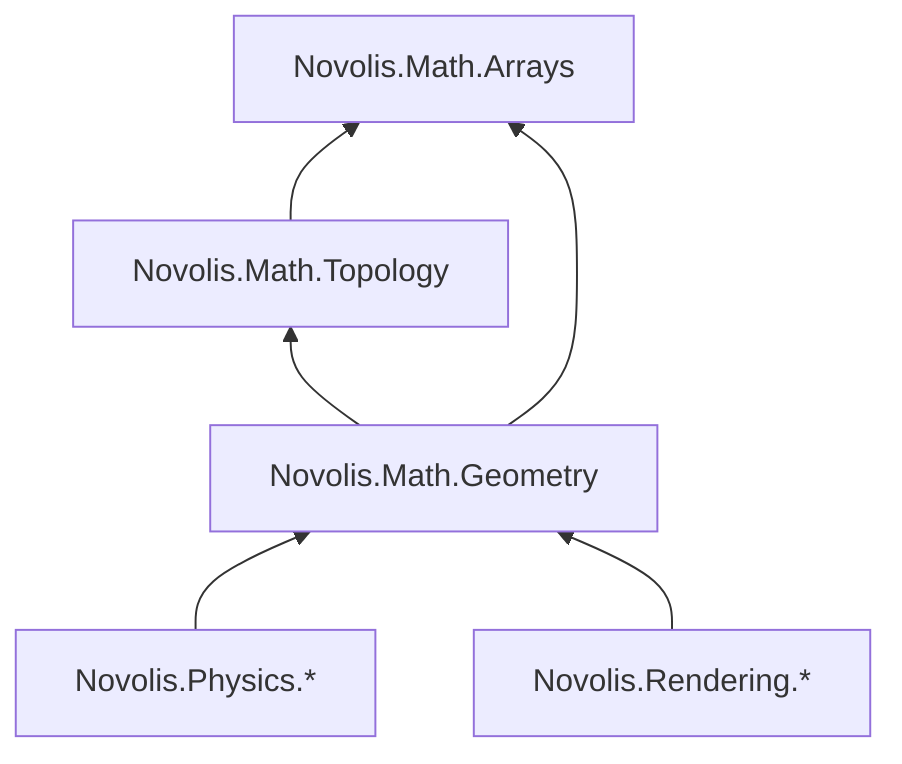

# Math libraries: BCL-first, no dimension suffixes

## North star

Math owns **spatial algorithms on `System.Numerics`**, in small facets. Public API rules:

- **BCL types at the surface** (`Vector3`, `Quaternion`, `Matrix4x4`, `Plane`).
- **No `*3` / `*2D` suffixes** on public Math types or members (stack is 3D-only; planar work uses `Vector3` with **Y = 0** via [`Vector3PlanarExtensions.cs`](d:\novolis\novolis-math\src\Novolis.Math.Geometry\Vector3PlanarExtensions.cs)).
- **No `Vector2`** in stack code (existing governance).
- **No obsolete public shims named `Ray3`** — breaking rename in one wave (avoid perpetuating forbidden names).

Backend-only duplicates (`Float3` in ILGPU) stay in [`Novolis.Rendering.Backends.Igpu`](d:\novolis\novolis-rendering\src\Novolis.Rendering.Backends.Igpu).

---

## Phase 1 — Governance and math design docs

Update canonical policy so agents and consumers match implementation:

| Doc | Changes |
|-----|---------|
| [`novolis-math/docs/design.md`](d:\novolis\novolis-math\docs\design.md) | Facet DAG, naming rules (no `*3`/`*2D` in public API), BCL-first, what stays out of Math |
| [`novolis-governance/docs/library-boundaries.md`](d:\novolis\novolis-governance\docs\library-boundaries.md) | Replace `Ray3`/`Sphere3` examples with `Ray`/`Sphere`; add `Novolis.Math.Topology`; BVH ownership |
| Package READMEs | [`Novolis.Math.Geometry/README.md`](d:\novolis\novolis-math\src\Novolis.Math.Geometry\README.md), new Topology README |

Add a short **naming table** (single source of truth):

| Old (remove) | New |
|--------------|-----|
| `Ray3` | `Ray` |
| `Sphere3` | `Sphere` |
| `AxisAlignedBox3` | `AxisAlignedBox` |
| (new) | `RigidTransform` |
| (new) | `ViewBasis` |

Files to rename in Geometry: [`Ray3.cs`](d:\novolis\novolis-math\src\Novolis.Math.Geometry\Ray3.cs) → `Ray.cs`, [`Sphere3.cs`](d:\novolis\novolis-math\src\Novolis.Math.Geometry\Sphere3.cs) → `Sphere.cs`, [`AxisAlignedBox3.cs`](d:\novolis\novolis-math\src\Novolis.Math.Geometry\AxisAlignedBox3.cs) → `AxisAlignedBox.cs`.

---

## Phase 2 — Extract `Novolis.Math.Topology`

New project: `src/Novolis.Math.Topology/Novolis.Math.Topology.csproj` (packable, `net10.0`, no deps except BCL).

**Move** from Geometry (namespace `Novolis.Math.Topology`):

- Connectivity: [`Polygon.cs`](d:\novolis\novolis-math\src\Novolis.Math.Geometry\Polygon.cs), [`Edge.cs`](d:\novolis\novolis-math\src\Novolis.Math.Geometry\Edge.cs), [`Face.cs`](d:\novolis\novolis-math\src\Novolis.Math.Geometry\Face.cs), [`Shape.cs`](d:\novolis\novolis-math\src\Novolis.Math.Geometry\Shape.cs)
- Factories/extensions: `PolygonFactory*`, `ShapeFactory`, `FaceFactory`, `*Extensions` for polygon/shape/face/edge

**Keep in Geometry** (metric / queries):

- [`TriangleMesh.cs`](d:\novolis\novolis-math\src\Novolis.Math.Geometry\TriangleMesh.cs), primitives, transforms, intersection, BVH, lattice types, `Rgba32`, serializers

Wire solution: [`Novolis.Math.slnx`](d:\novolis\novolis-math\Novolis.Math.slnx) + [`Directory.Packages.props`](d:\novolis\novolis-math\Directory.Packages.props).

Geometry csproj: `ProjectReference` → Topology (Topology does **not** reference Geometry).

Move tests: `PolygonTest`, `PolygonFactoryTests` → `tests/Novolis.Math.Unit/Topology/`.

---

## Phase 3 — Centralize intersection and BVH in Geometry

Today [`TriangleBvh.cs`](d:\novolis\novolis-math\src\Novolis.Math.Geometry\TriangleBvh.cs) keeps `RaySlabIntersect` private while [`PathTracerEngine.cs`](d:\novolis\novolis-rendering\src\Novolis.Rendering.Backends.Cpu\PathTracerEngine.cs) and [`BvhStaticWorld.cs`](d:\novolis\novolis-physics\src\Novolis.Physics.Collision.Simple\BvhStaticWorld.cs) duplicate ~80 lines each.

**Add public APIs** (names without dimension suffix):

1. **`AxisAlignedBox.RayInterval`** (or static `RayExtensions.IntervalAgainstBox`) — slab test used by BVH and shadow rays.
2. **`TriangleBvhNode`** — already suffix-free; keep as the single node struct.
3. **`TriangleBvhBuilder.Build`** — unchanged entry; returns `TriangleBvh`.
4. **`BvhRaycast`** (static helper) — traverse `ReadOnlySpan<TriangleBvhNode>` + `triangleOrder` + callback `bool TryHitTriangle(int triIndex, in Ray ray, float maxT, out float t, out Vector3 normal)` so material index lives in the callback (Rendering) while Physics uses triangle index only.

Refactor [`TriangleBvh.Raycast`](d:\novolis\novolis-math\src\Novolis.Math.Geometry\TriangleBvh.cs) to call shared traversal internally.

Add unit tests: brute vs BVH parity, analytic ray–box, ray–triangle edge cases; shared epsilon via small `GeometryConstants` type.

---

## Phase 4 — BCL-centric pose helpers (no camera types)

**Add** (Geometry, `System.Numerics` only):

- **`RigidTransform`** — `readonly struct` with `Vector3 Position`, `Quaternion Rotation`, `float UniformScale`; `ToMatrix4x4()`, `TransformPoint`/`TransformDirection`.
- **`ViewBasis`** — `FromLookAt(eye, target, upHint)` → orthonormal `(Forward, Right, Up)`; **`PrimaryRayDirection(basis, u, v, tanHalfFov, aspect)`** for trace kernels.

**Do not add** `RigidTransform3`, `ViewBasis3`, or new `Camera` types.

**Remove** unused obsolete surface from Geometry if unreferenced after grep: [`Camera.cs`](d:\novolis\novolis-math\src\Novolis.Math.Geometry\Camera.cs), [`Grid.cs`](d:\novolis\novolis-math\src\Novolis.Math.Geometry\Grid.cs) (Simulation already uses [`DenseGrid<T>`](d:\novolis\novolis-simulation\src\Novolis.Simulation.World\SimulationWorld.cs)).

Mark mutable [`Transform`](d:\novolis\novolis-math\src\Novolis.Math.Geometry\Transform.cs) class `[Obsolete("Use RigidTransform")]`; keep for one release if templates still reference it, then migrate callers.

---

## Phase 5 — Physics consolidation

| File | Action |
|------|--------|
| [`BvhStaticWorld.cs`](d:\novolis\novolis-physics\src\Novolis.Physics.Collision.Simple\BvhStaticWorld.cs) | Delete private `BuildRecursive` / `BvhNode` / slab copy; build with `TriangleBvhBuilder` over mesh vertices/indices; traverse via `BvhRaycast` or wrap `TriangleBvh` |
| [`TriangleRay.cs`](d:\novolis\novolis-physics\src\Novolis.Physics.Collision.Simple\TriangleRay.cs) | Remove duplicate Möller–Trumbore; call `Novolis.Math.Geometry.TriangleRay.TryHit` with `float` distance (cast at boundary if `HitInfo` needs `double`) |
| [`ObsoleteNumericsForwards.cs`](d:\novolis\novolis-physics\src\Novolis.Physics.Numerics\ObsoleteNumericsForwards.cs) | Update obsolete messages: `Ray3` → `Ray` |
| Abstractions / tests | Rename `Ray3`/`Sphere3`/`AxisAlignedBox3` → new names (~12 files under `novolis-physics`) |

Physics packages already reference Geometry only — no new Topology reference unless a project uses `Polygon` directly.

---

## Phase 6 — Rendering consolidation

| Area | Action |
|------|--------|
| [`SceneCompiler.cs`](d:\novolis\novolis-rendering\src\Novolis.Rendering.Compile\SceneCompiler.cs) | Map `TriangleBvhNode` directly into compiled scene (drop duplicate [`BvhNode`](d:\novolis\novolis-rendering\src\Novolis.Rendering.Runtime\BvhNode.cs) struct or make it a type alias to `TriangleBvhNode`) |
| [`PathTracerEngine.cs`](d:\novolis\novolis-rendering\src\Novolis.Rendering.Backends.Cpu\PathTracerEngine.cs) | Replace local `TraverseBvh` / `RaySlabIntersect` with Math `BvhRaycast` + `TriangleRay`; use `ViewBasis` in [`CameraSnapshot`](d:\novolis\novolis-rendering\src\Novolis.Rendering.Runtime\CameraSnapshot.cs) `LookAt` |
| [`IlgpuPathTracerKernels.cs`](d:\novolis\novolis-rendering\src\Novolis.Rendering.Backends.Igpu\IlgpuPathTracerKernels.cs) | Keep `Float3` on device; **host** uses `Ray`/`AxisAlignedBox`; optional follow-up to align GPU slab math with tested CPU helper (comments cite parity) |
| GPU layout structs | `GpuBvhNode` continues to use `Float3` bounds — adapter only |

**Out of scope:** moving GGX/glass/sky into Math (Rendering-only).

---

## Phase 7 — Cross-repo consumer sweep

Mechanical rename in all `.cs` referencing old types (~25 files today):

- `novolis-physics` (abstractions, collision, ballistics, tests)
- `novolis-rendering` (compile, runtime, CPU backend)
- `novolis-simulation` ([`PlanarAgent.cs`](d:\novolis\novolis-simulation\src\Novolis.Simulation.Kinematics\PlanarAgent.cs), builder tests)
- [`DoomLite3D/PlayerController.cs`](d:\novolis\novolis-dogfooding\apps\DoomLite3D\Game\PlayerController.cs) — delete local `Ray3` struct; use `Novolis.Math.Geometry.Ray`

Bump central package versions where needed:

- [`novolis-math/Directory.Packages.props`](d:\novolis\novolis-math\Directory.Packages.props) — add `Novolis.Math.Topology`
- [`novolis-physics/Directory.Packages.props`](d:\novolis\novolis-physics\Directory.Packages.props), [`novolis-rendering/Directory.Packages.props`](d:\novolis\novolis-rendering\Directory.Packages.props), [`novolis-simulation/Directory.Packages.props`](d:\novolis\novolis-simulation\Directory.Packages.props), [`novolis-dogfooding/Directory.Packages.props`](d:\novolis\novolis-dogfooding\Directory.Packages.props) if explicit pins exist

MonoGame template content referencing `Polygon` may need `PackageReference` to Topology or Geometry (transitive).

---

## Phase 8 — Verification and publish

Per workspace rule ([`nuget-only-dependencies`](d:\novolis\.cursor\rules\nuget-only-dependencies.mdc)):

1. `pwsh -File novolis-governance/scripts/verify-nuget-only.ps1` (exit 0)
2. `dotnet build` / `dotnet test` [`Novolis.Math.slnx`](d:\novolis\novolis-math\Novolis.Math.slnx), then Physics + Rendering solutions
3. Local pack feed or GPR publish `Novolis.Math.Arrays`, `Novolis.Math.Topology`, `Novolis.Math.Geometry` (`2026.1.*`)
4. `dotnet restore` + `dotnet build` consumers with package refs only

**Breaking change note:** no public `Ray3` obsolete alias (forbidden name). Release notes list rename table and Topology package install (`dotnet add package Novolis.Math.Topology` only when using polygon APIs directly; Geometry consumers get Topology transitively).

---

## Risk notes

- **`Ray` name**: lives in `Novolis.Math.Geometry` namespace — no BCL `Ray` conflict; avoid `using` aliases that pull in unrelated `Ray` types.
- **ILGPU**: device code may keep duplicated slab/triangle until a shared-source or codegen step exists; CPU/Physics path must be single implementation.
- **Coordinate publish order**: Math packages first, then Physics/Rendering PRs that bump `PackageReference` versions.

