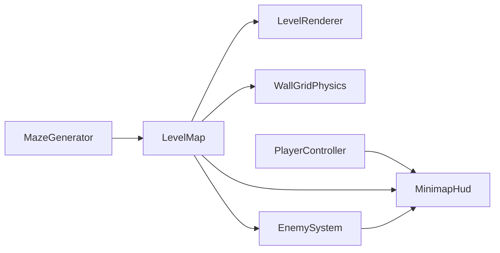

# DoomLite3D: taller walls, random maze, calm spawn, minimap

## Current state

- Level is a fixed ASCII layout in [`LevelMap.CreateDefault()`](d:\novolis\novolis-dogfooding\apps\DoomLite3D\Game\LevelMap.cs) (`WallHeight = 2f`, ~18×8 cells).
- [`DoomLiteGame`](d:\novolis\novolis-dogfooding\apps\DoomLite3D\Game\DoomLiteGame.cs) holds one `LevelMap` for the session; F1 only resets player/enemies/combat, not the map or BVH.
- HUD already exposes `HudRect` / `HudLine` / `HudText` on [`RayGameContext`](d:\novolis\novolis-raylib\src\Novolis.Raylib.Game\RayGame.cs) (same pattern as XFighter radar in [`CockpitHud.cs`](d:\novolis\novolis-raylib\samples\XFighter\Game\CockpitHud.cs)).



## 1. Wall height +50%

In [`LevelMap.cs`](d:\novolis\novolis-dogfooding\apps\DoomLite3D\Game\LevelMap.cs):

- Change `WallHeight` from `2f` to **`3f`** (`2 × 1.5`).
- No other edits needed: [`LevelRenderer`](d:\novolis\novolis-dogfooding\apps\DoomLite3D\Game\LevelRenderer.cs) and [`WallGridPhysics.BuildWorld`](d:\novolis\novolis-dogfooding\apps\DoomLite3D\Game\WallGridPhysics.cs) already read `LevelMap.WallHeight`.

## 2. Procedural maze (compact, not sprawling)

Add [`MazeGenerator.cs`](d:\novolis\novolis-dogfooding\apps\DoomLite3D\Game\MazeGenerator.cs) in the app (dogfood-only; no novolis-math extraction unless you want it later).

**Grid size:** `21×21` cells (`CellSize` unchanged at `1f`) — large enough to feel like a maze, small enough to cross in ~1–2 minutes.

**Algorithm:** recursive backtracker on odd coordinates inside a solid border:

1. Fill grid with walls (`1`).
2. Carve a **calm spawn chamber** first: e.g. `5×5` open floor anchored at `(1,1)` (inside border), record center as `PlayerSpawn`.
3. Start DFS from the chamber’s east-facing corridor cell; carve passages to odd `(x,z)` cells, removing walls between visited neighbors.
4. Result: guaranteed connected maze with an obvious safe starting room.

**“Not too long” guard (optional but cheap):** after carve, BFS from spawn; if longest path &gt; ~40 cells, re-roll with a new seed (cap 8 attempts). Keeps dead-end sprawl bounded without huge maps.

Replace `CreateDefault()` with **`LevelMap.CreateRandom(int? seed = null)`** that calls `MazeGenerator` and returns `LevelMap` with `DenseGrid<byte>` walls + spawn + enemy list.

## 3. Enemy placement with calm start

In `MazeGenerator` (or a small `EnemyPlacement` helper in the same file):

- Enumerate all floor cells (`walls == 0`).
- **Exclude calm zone:** Manhattan distance from `PlayerSpawn` &lt; **6** (covers the 5×5 room plus a short buffer corridor).
- From remaining cells, shuffle (seeded `Random`) and place enemies with:
  - Target density ~**20–30%** of eligible cells (cap ~12–18 enemies on 21×21).
  - **Min spacing 3** cells between enemy positions (skip crowded picks).
  - Alternate `SpriteIndex` 0/1 like today.

Remove the old ASCII `'e'` parsing from `LevelMap`.

## 4. Regenerate level + physics on restart

Refactor [`DoomLiteGame`](d:\novolis\novolis-dogfooding\apps\DoomLite3D\Game\DoomLiteGame.cs):

- Change `readonly LevelMap _level` to mutable `LevelMap _level`.
- Extract `RegenerateLevel()`:
  - `_level = LevelMap.CreateRandom();`
  - `_physicsWorld = WallGridPhysics.BuildWorld(_level.Walls, LevelMap.CellSize, LevelMap.WallHeight);`
  - `_player.SetPhysicsWorld(_physicsWorld);`
  - `_player.Reset(_level);` + `_enemies.Reset(_level);` + `_combat.Reset();`
- Call from `Initialize` and when **F1** is pressed (new maze each restart).
- Pass `_level` into HUD draw for minimap (see below).

## 5. Minimap (top-right)

Add [`MinimapHud.cs`](d:\novolis\novolis-dogfooding\apps\DoomLite3D\Game\MinimapHud.cs):

| Element | Drawing |
|--------|---------|
| Panel | `160×160` at `(ctx.Width - 176, 16)`, dark border via `HudRect` |
| Walls | 1×1 px rects per wall cell (dim gray) |
| Floor | skip or very dark fill |
| Player | bright dot at world XZ → grid, **rotated by `-Camera.Yaw`** (heading-up) |
| Enemies | red dots (alive only), same rotation |

**Mapping:** `gridX = worldX / CellSize - 0.5`, center minimap on player; scale `cellPx = mapSize / max(width, height)` (clamp so the whole map fits).

Wire from [`WeaponHud.Draw`](d:\novolis\novolis-dogfooding\apps\DoomLite3D\Game\WeaponHud.cs) or call `MinimapHud.Draw` from `DoomLiteGame` after world pass — pass `LevelMap`, `PlayerController`, `EnemySystem`.

Avoid overlap with ammo text (bottom-right): minimap stays **top-right** (`y = 16`).

## 6. Small HUD copy tweak

Update control hint line if desired: mention F1 generates a **new maze** (optional one-line change in `WeaponHud`).

## Files touched

| File | Change |
|------|--------|
| [`LevelMap.cs`](d:\novolis\novolis-dogfooding\apps\DoomLite3D\Game\LevelMap.cs) | `WallHeight = 3f`, `CreateRandom`, remove ASCII layout |
| **New** `MazeGenerator.cs` | Carve + spawn + enemies |
| **New** `MinimapHud.cs` | Top-right map |
| [`DoomLiteGame.cs`](d:\novolis\novolis-dogfooding\apps\DoomLite3D\Game\DoomLiteGame.cs) | Regenerate level/physics on init + F1 |
| [`WeaponHud.cs`](d:\novolis\novolis-dogfooding\apps\DoomLite3D\Game\WeaponHud.cs) | Invoke minimap draw (or delegate from game) |

No library changes in novolis-math / raylib / physics.

## Verification

```bash
cd d:\novolis\novolis-dogfooding
dotnet build apps/DoomLite3D/DoomLite3D.csproj
dotnet run --project apps/DoomLite3D/DoomLite3D.csproj
```

Manual checks:

- Walls visibly taller (3m).
- Spawn room empty of enemies; enemies appear deeper in the maze.
- F1 produces a different layout.
- Minimap tracks movement, rotates with look, shows enemies.

