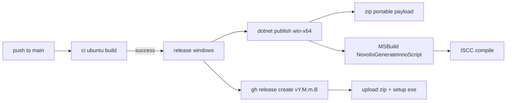

# Auto-release on merge + Inno installer

## Current state

- [merge.yml](d:\novolis\novolis-apps\.github\workflows\merge.yml) runs only Linux CI via `dotnet-pull-request.yml` (build solution, no tests).
- No `build/version.json`, no release workflow, no Inno packaging.
- Reference implementation: [novolis-avalonia/.github/workflows/release.yml](d:\novolis\novolis-avalonia\.github\workflows\release.yml) + [Novolis.Avalonia.Packaging.Inno](d:\novolis\novolis-avalonia\src\Novolis.Avalonia.Packaging.Inno) (published as `Novolis.Avalonia.Packaging.Inno` on GPR).

## Target flow



Each merge to `main` (non-doc paths, per existing `paths-ignore`) produces:

| Asset | Path pattern |
|-------|----------------|
| Portable zip | `ManuscriptStudio-{version}-win-x64.zip` (self-contained publish folder) |
| Inno installer | `ManuscriptStudioSetup-{version}-win-x64.exe` |

Version: `YEAR.MAJOR.MINOR.BUILD` from `build/version.json` + `github.run_number` (same as other Novolis repos via [read-version](d:\novolis\novolis-workflows\actions\read-version\action.yml)).

Release tag: `v{package-version}` (e.g. `v2026.1.0.42`).

## 1. Versioning scaffold

Add [build/version.json](d:\novolis\novolis-apps\build\version.json):

```json
{
  "year": 2026,
  "major": 1,
  "minor": 0,
  "dotnetBaseline": "net10.0",
  "publicPackage": false
}
```

Update [Directory.Build.props](d:\novolis\novolis-apps\Directory.Build.props) to import governance version targets when present (CI clones `novolis-governance` sibling — same pattern as `dotnet-build`):

```xml
<Import Project="../novolis-governance/build/Novolis.Version.targets"
        Condition="Exists('../novolis-governance/build/Novolis.Version.targets')" />
```

No new in-repo packaging library — apps repo stays app-only.

## 2. Inno packaging (NuGet-only)

Add to [Directory.Packages.props](d:\novolis\novolis-apps\Directory.Packages.props):

```xml
<PackageVersion Include="Novolis.Avalonia.Packaging.Inno" Version="2026.1.*" />
```

Add to [ManuscriptStudio.csproj](d:\novolis\novolis-apps\src\ManuscriptStudio\ManuscriptStudio.csproj) as a **private** build dependency (targets only):

```xml
<PackageReference Include="Novolis.Avalonia.Packaging.Inno">
  <PrivateAssets>all</PrivateAssets>
  <IncludeAssets>runtime; build; native; contentfiles; analyzers; buildtransitive</IncludeAssets>
</PackageReference>
```

CI will invoke `NovolisGenerateInnoScript` on the app project with Manuscript Studio properties:

| MSBuild property | Value |
|------------------|--------|
| `NovolisInnoAppName` | `Manuscript Studio` |
| `NovolisInnoAppExeName` | `ManuscriptStudio.exe` |
| `NovolisInnoAppId` | `Novolis.ManuscriptStudio` |
| `NovolisInnoDefaultGroupName` | `Manuscript Studio` |
| `NovolisInnoInstallDirName` | `Novolis\Manuscript Studio` |
| `NovolisInnoOutputBaseFilename` | `ManuscriptStudioSetup-{version}-win-x64` |
| `NovolisInnoScriptPath` | `{installerDir}\manuscript-studio.iss` |

Publish: `dotnet publish src/ManuscriptStudio/ManuscriptStudio.csproj -c Release -r win-x64 --self-contained true` with `-p:PackageVersion=…`, `-p:AssemblyVersion=…`, `-p:FileVersion=…`, `-p:InformationalVersion=…`.

## 3. Extend merge workflow

Update [merge.yml](d:\novolis\novolis-apps\.github\workflows\merge.yml):

**Keep existing `ci` job** (unchanged Linux build).

**Add `release` job**:

- `needs: ci`
- `runs-on: windows-latest`
- `permissions: contents: write`, `packages: read`
- `if: success()` (implicit via `needs`)
- Steps (mirror avalonia release job structure):
  1. `actions/checkout@v4`
  2. Clone `novolis-governance` if missing (for version targets / consistency)
  3. `setup-dotnet` + `authenticate-github-packages`
  4. `read-version` action → `package-version`, assembly/file versions
  5. `dotnet publish` → `artifacts/manuscript-studio/app`
  6. Zip publish dir → `artifacts/manuscript-studio/ManuscriptStudio-{version}-win-x64.zip`
  7. `dotnet msbuild` `-t:NovolisGenerateInnoScript` with Inno properties above
  8. `choco install innosetup` + locate `ISCC.exe`
  9. `ISCC manuscript-studio.iss`
  10. Create/upload GitHub Release:
     - If `gh release view v{version}` exists → `gh release upload … --clobber`
     - Else → `gh release create v{version} --title "Manuscript Studio {version}" --generate-notes` then upload both assets

Add `workflow_dispatch` on merge workflow (optional `skip_release` input) so you can rebuild/release manually without a new commit.

## 4. Optional `release.yml` (manual republish)

Add [release.yml](d:\novolis\novolis-apps\.github\workflows\release.yml) with `workflow_dispatch` only that calls the same Windows release steps for a chosen tag/version — useful if Inno compile fails and you need to re-run without a new merge. Not required for merge auto-release but low cost.

## 5. Local build script + docs

Add [scripts/build-installer.ps1](d:\novolis\novolis-apps\scripts\build-installer.ps1) mirroring CI (publish → generate `.iss` → optional local `ISCC` if installed).

Update:

- [docs/getting-started.md](d:\novolis\novolis-apps\docs\getting-started.md) — download installer from GitHub Releases; portable zip option
- [README.md](d:\novolis\novolis-apps\README.md) — release cadence (every merge to `main`)

## 6. Verify

- `dotnet build Novolis.Apps.slnx -c Release` (restore pulls `Novolis.Avalonia.Packaging.Inno` from GPR)
- `pwsh scripts/build-installer.ps1` locally (if Inno installed)
- `verify-nuget-only.ps1` — only new `PackageReference` to GPR package (no ProjectReference hacks)
- After merge: confirm GitHub Release on [novolis-apps](https://github.com/Novolis-Platform/novolis-apps) has zip + setup exe

## Notes / constraints

- **NuGet-only**: Inno via `Novolis.Avalonia.Packaging.Inno` package, not a sibling `ProjectReference` into `novolis-avalonia`.
- **No NuGet publish**: apps remain `IsPackable=false`; release job only ships GitHub Release assets.
- **Doc-only merges**: existing `paths-ignore` on merge workflow means no CI and no release when only docs/md change (unchanged behavior).
- **Per-user install**: generated Inno script uses `PrivilegesRequired=lowest` and `%LOCALAPPDATA%\Programs\Novolis\Manuscript Studio` (from packaging targets).

