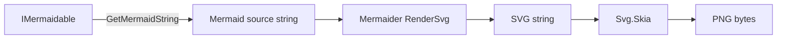

# Novolis.Markup.Mermaid.Rendering

## Context

- There is no Mermaid base class. Diagrams implement [`IMermaidable`](d:\novolis\novolis-markup\src\Novolis.Markup.Mermaid\IMermaidable.cs); emit via [`GetMermaidString()`](d:\novolis\novolis-markup\src\Novolis.Markup.Mermaid\MermaidableExtensions.cs).
- SVG rendering already lives in Avalonia as [`MermaidSvg`](d:\novolis\novolis-avalonia\src\Novolis.Avalonia.Mermaid\MermaidSvg.cs) (Mermaider `RenderSvg` only — **no PNG**).
- Naming precedent: [`Novolis.Markup.Markdown.Rendering`](d:\novolis\novolis-markup\src\Novolis.Markup.Markdown.Rendering\) — Avalonia-free export beside the fluent builder.

## Package

| Item | Value |
|------|-------|
| PackageId | `Novolis.Markup.Mermaid.Rendering` |
| Path | [`d:\novolis\novolis-markup\src\Novolis.Markup.Mermaid.Rendering\`](d:\novolis\novolis-markup\src\Novolis.Markup.Mermaid.Rendering\) |
| Deps | `Novolis.Markup.Mermaid` (ProjectReference), **Mermaider** `0.12.1`, **Svg.Skia** (pulls SkiaSharp for raster) |
| Layer | Orthogonal Markup island — **no Avalonia** |

## Public API

Extensions on `IMermaidable` (and parallel `string` helpers for raw Mermaid source):

```csharp
using Novolis.Markup.Mermaid;
using Novolis.Markup.Mermaid.Rendering;

var chart = new Flowchart(Direction.TopToBottom);
// ...
string? svg = chart.ToSvg();                    // Mermaider
byte[]? png = chart.ToPng(scale: 2f);           // Mermaider → Svg.Skia
chart.ExportSvg(@"d:\out\diagram.svg");
chart.ExportPng(@"d:\out\diagram.png");
```

Supporting types (moved/adapted from Avalonia):

- `MermaidRenderTheme` — `StudioDark` / `GitHubLight` (same palettes as current `MermaidTheme`)
- `MermaidSvgRenderer` — static `TryRenderSvg` / theme→`RenderOptions` (core of today’s `MermaidSvg`)
- `MermaidPngRenderer` — SVG string → PNG bytes via `SKSvg`
- `MermaidRenderExtensions` — `ToSvg` / `ToPng` / `ExportSvg` / `ExportPng` on `IMermaidable`
- Soft-fail: `Try*` / `To*` return `null` on blank/invalid (match Avalonia); `Export*` return `bool`

HTML `` / fallback `<pre>` stay in **Avalonia** (UI host concern), not this package.



## Avalonia follow-up (same effort, after markup publish)

In [`novolis-avalonia`](d:\novolis\novolis-avalonia):

- Replace direct `Mermaider` PackageReference with `Novolis.Markup.Mermaid.Rendering`
- Make `MermaidSvg.TryRenderSvg` / `OptionsFor` thin wrappers over `MermaidSvgRenderer`
- Map `MermaidTheme` ↔ `MermaidRenderTheme` (keep Avalonia enum for API stability; Markdown preview mapping unchanged)
- Update unit tests that assert theme options

Publish order: **markup first** (GPR), then Avalonia. Local ProjectRef via `Novolis.Platform.slnx` covers both before GPR.

## Repo wiring (novolis-markup)

- Add project to [`Novolis.Markup.slnx`](d:\novolis\novolis-markup\Novolis.Markup.slnx)
- Register in [`.novolis/packages.json`](d:\novolis\novolis-markup\.novolis\packages.json)
- Central versions in [`Directory.Packages.props`](d:\novolis\novolis-markup\Directory.Packages.props): `Mermaider`, `Svg.Skia`
- ProjectReference from [`Novolis.Markup.Unit`](d:\novolis\novolis-markup\tests\Novolis.Markup.Unit\Novolis.Markup.Unit.csproj)
- Package README (brand header + quick start, mirror Markdown.Rendering)
- Regen platform map: `pwsh -File d:\novolis\novolis-governance\build\Generate-Platform-Slnx.ps1`

## Tests

Under `tests/Novolis.Markup.Unit/Mermaid/Rendering/`:

- Flowchart/sequence `ToSvg` contains `<svg`
- Blank / invalid → `null`
- `ToPng` non-empty, PNG signature `89 50 4E 47`
- Theme StudioDark vs GitHubLight changes background options
- `ExportSvg` / `ExportPng` write files

## Out of scope

- Dogfooding demo app
- Changing fluent Mermaid builders
- Moving HTML image helpers into Markup
- Touching `Novolis.Rendering.*` GPU stack

