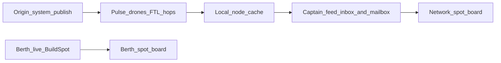

# Mesh as gameplay (communication delays)

## Design rule

```text
Same system (berth / co-located node)  → live / push / force Emergency now
Other systems                          → mesh hop delay, then visible / pull
```

This extends the existing CCA glass rule ([gameplay.md](novolis-apps/src/SinsOfACapitalismTycoon/docs/gameplay.md)): see the network, accept only at dock — but **network sight itself is delayed** by the mesh.



## 1. Minimal packet payload

Extend [`MeshPacket`](novolis-apps/src/SinsOfACapitalismTycoon/Universe/Mesh/ModelTypes.cs):

- `string Subject` (short)
- `string Body` (compact text; spot digests are line-oriented)
- `string Topic` (stable kind: `spot-digest`, `escrow`, `emergency`, …)

`PublishEngine.PublishPulse` / helpers accept subject/body/topic. No crypto, no JSON schema package — plain text lines for digests.

Add feed id `MeshFeedId.CommerceSpot` (`Commerce.Spot`). Keep `News.*` and `Emergency`.

## 2. Mailbox location sync (delays only matter if you move)

Each campaign hour in [`CampaignRunner.PulseDaysAsync`](novolis-apps/src/SinsOfACapitalismTycoon/Universe/CampaignRunner.cs) **before** `MeshPulse.TickHour`:

- Resolve Calypso / tramp **current system** from shipment `CurrentHubId` or berth ([`LiveSession.CurrentHubSystemId`](novolis-apps/src/SinsOfACapitalismTycoon/Universe/CampaignRunner.cs))
- `MailboxEngine.Move` for `ship:{RegistryName}` and player `person:{PlayerFlavorId}` to that `MeshNodeId`
- Firms/households/things stay on seeded home nodes (v1)

New helper: `Universe/Mesh/Sins/MeshMailboxSync.cs`.

## 3. Publish gameplay traffic — `MeshGameplayPulse`

New file `Universe/Mesh/Sins/MeshGameplayPulse.cs`, called once per **day** from `PulseDaysAsync` (after day pulses / escrow), not every hour (keeps flood volume sane).

| Event | Mesh action | Delay effect |
|-------|-------------|--------------|
| Spot market snapshot | From each active origin node, publish `Commerce.Spot` feed packet (`Topic=spot-digest`, Body = compact lines of origin/dest/sku/qty/margin/profile) | Distant systems see digests only after flood reaches their node |
| Escrow open / release | Identity pulse to `ship:{carrier}` (+ person for Calypso) with subject/body | Notice arrives when mailbox co-located with a node that holds the packet |
| Drama / soft-fail / stockout milestones worth civil alert | `Emergency` feed from Sol (or event system) | Force into all mailboxes at nodes that have received it |

Wire escrow hooks in [`EscrowBook`](novolis-apps/src/SinsOfACapitalismTycoon/Universe/Commerce/EscrowPulse.cs) via a small callback or by scanning open/release in `MeshGameplayPulse` from milestones / escrow counters already logged — prefer publishing at open/release sites inside EscrowBook when `Ids.Mesh` is available (pass mesh by ref on `TickDay` or publish from runner after escrow tick using escrow events list).

**Chosen approach:** `EscrowBook` appends lightweight `EscrowNotice` records; `MeshGameplayPulse.TickDay` drains them and publishes identity packets from the carrier’s current system node (or Sol if unknown).

## 4. Network spot board reads mesh (the delay mechanic)

Change [`CaptainJobBoard.ListSpot`](novolis-apps/src/SinsOfACapitalismTycoon/Universe/Player/CaptainJobBoard.cs):

- **`berthOnly` / local board:** keep live `BuildSpot` for `currentSystemId` only (same-system = no FTL delay).
- **Network board:** build candidates **only from `Commerce.Spot` digests** already in the captain’s feed inbox (`person:` or `ship:ST Calypso`) at the current mailbox node — parse Body lines into `SpotCandidate`. Accept still requires `AtOrigin` (dock act unchanged).

If no digests have arrived yet, network board is empty/thin (honest lag), not a silent fallback to omniscient `BuildSpot`.

Subscribe Calypso (person + ship) to `Commerce.Spot` at seed in [`SeedMesh`](novolis-apps/src/SinsOfACapitalismTycoon/Universe/CampaignWorld.cs) / smoke path.

## 5. Captain bridge + CLI surface

- [`CaptainBridgeModel`](novolis-apps/src/SinsOfACapitalismTycoon/Ui/CaptainBridgeModel.cs): add mesh lines — Emergency count, mailbox push count, last N inbox subjects (mailbox + feed), and note network intel is mesh-delayed.
- Existing `Feed` list can prepend Emergency / mesh notices (from inbox packets) ahead of milestone vox.
- [`CaptainConsole`](novolis-apps/src/SinsOfACapitalismTycoon/Cli/CaptainConsole.cs) `status`: show mesh lag hint (`mesh inbox N · emergency M · network digests K`).

No new Avalonia control package — reuse scorecard / feed lines.

## 6. Docs + tests

- Update [gameplay.md](novolis-apps/src/SinsOfACapitalismTycoon/docs/gameplay.md) and [mesh-and-communications.md](novolis-apps/src/SinsOfACapitalismTycoon/docs/mesh-and-communications.md): network intel delayed; berth live; escrow/Emergency via mesh.
- Unit tests:
  - Spot digest published at Sol is not in Wolf inbox until hops complete; after delay, network parse yields candidates.
  - Berth `ListSpot` still live without digest.
  - Mailbox sync moves ship identity with system change → catch-up push.
  - Escrow notice identity packet eventually mailboxed when co-located.

## Explicit non-goals (this pass)

- Full `MeshState` in save files (seed→hour replay rebuilds mesh during `--load`)
- Ansible channel, postage cash, bulk archives, Limbo ceremony
- Intra-system radio mesh beyond co-location
- Replacing berth accept rules

## Touch list (primary)

- Mesh kernel: `ModelTypes` / `PublishEngine` payload
- `MeshMailboxSync`, `MeshGameplayPulse`, escrow notice drain
- `CaptainJobBoard`, `CampaignRunner`, `CampaignWorld` seed subscriptions
- `CaptainBridgeModel`, `CaptainConsole`, docs, unit tests

