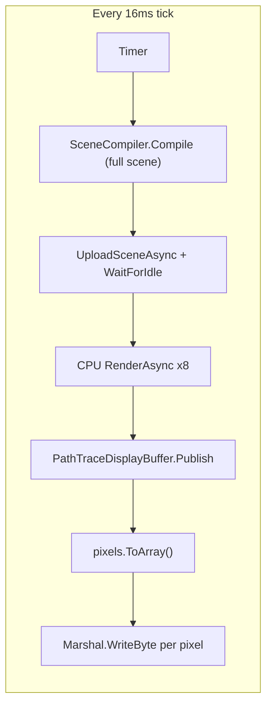
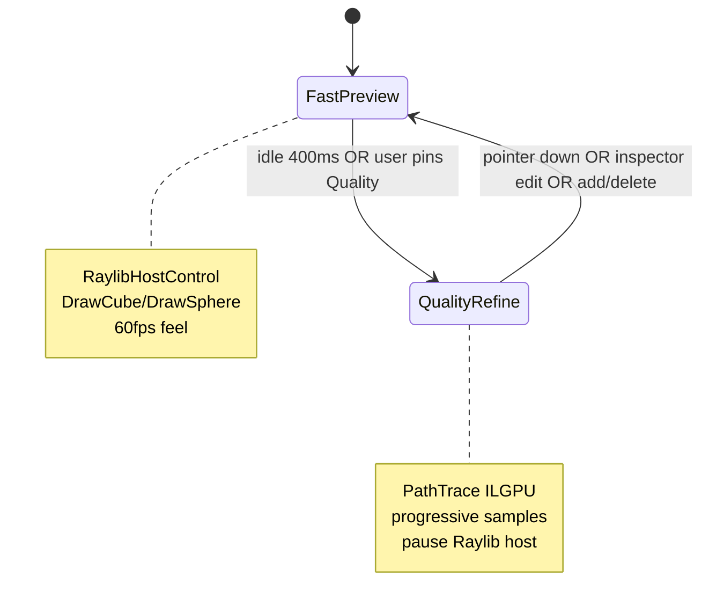

# Mesh Studio performance plan

## Problem diagnosis

Current Mesh Studio ([`MainWindow.cs`](d:\novolis\novolis-dogfooding\apps\rendering\MeshBench\MainWindow.cs)) is bound to **CPU path tracing at full resolution, ~60 Hz**, with expensive work on the hot path:

| Bottleneck | Where | Impact |
|------------|-------|--------|
| Full scene recompile | `OnSceneEdited` → `RebuildViewport` → [`MeshSceneStore.Compile`](d:\novolis\novolis-dogfooding\apps\rendering\MeshBench\Services\MeshSceneStore.cs) | Runs on **every** inspector slider tick and **every** Shift+drag pixel |
| CPU-only backend | [`PathTraceViewport`](d:\novolis\novolis-dogfooding\apps\rendering\MeshBench\Services\PathTraceViewport.cs) uses `UseCpuBackend()` | 10–100× slower than ILGPU already in [`novolis-rendering`](d:\novolis\novolis-rendering\src\Novolis.Rendering.DependencyInjection\RenderingServiceCollectionExtensions.cs) |
| Sync GPU wait on UI path | `WaitForIdle()` + `.GetAwaiter().GetResult()` in resize/set-scene | UI thread stalls |
| Triple pixel copy | Backend → display buffer → [`ToArray`](d:\novolis\novolis-dogfooding\apps\rendering\MeshBench\Ui\ViewportSurface.cs) → per-byte `Marshal.WriteByte` in [`Rgba32Bitmap`](d:\novolis\novolis-avalonia\src\Novolis.Avalonia.Rendering\Rgba32Bitmap.cs) | ~8 MB/frame alloc + blit at 1080p |
| Present every tick | `TryPresent` even when sample count unchanged | Wasted UI work |
| Zip snapshot on save | [`WorkspaceTimeline.SavePointAsync`](d:\novolis\novolis-workspaces\src\Novolis.Workspaces.Timeline\WorkspaceTimeline.cs) | Correctly async but still heavy; UI waits on full pipeline |

You chose **dual mode**: fast preview while editing, path trace when idle.

---

## Target architecture

**Rule:** Only one **Raylib GLFW host** active at a time ([`RaylibGlfwProcessSync`](d:\novolis\novolis-raylib\src\Novolis.Raylib.Runtime\Internal\RaylibGlfwProcessSync.cs)). When entering quality mode, **stop** the Raylib embedded loop; when returning to fast mode, **stop** path-trace accumulation.

---

## Phase 1 — Dual viewport (Mesh Studio, highest UX impact)

### 1.1 Fast preview via Raylib

**New files** in [`novolis-dogfooding/apps/rendering/MeshBench/`](d:\novolis\novolis-dogfooding\apps\rendering\MeshBench):

- `Services/RaylibSceneRenderer.cs` — implements `IRaylibFrameRenderer`: `BeginMode3D`, ground grid, `World.DrawCubeV` / `DrawSphere` per [`MeshPartRecord`](d:\novolis\novolis-dogfooding\apps\rendering\MeshBench\Models\MeshPartRecord.cs), shared orbit camera
- `Services/ViewportModeCoordinator.cs` — `Fast | Quality | Transitioning`; idle timer (~400 ms); exposes `SharedOrbitCamera` synced from [`PathTraceViewport.Orbit`](d:\novolis\novolis-dogfooding\apps\rendering\MeshBench\Services\PathTraceViewport.cs) / scene JSON

**UI** ([`MainWindow.cs`](d:\novolis\novolis-dogfooding\apps\rendering\MeshBench\MainWindow.cs)):

- Stack `RaylibHostControl` + existing `ViewportSurface` in the same grid cell (only one visible)
- Toolbar: **Preview** (fast) / **Quality** (path trace) toggle; status shows active mode
- Default: **Fast** on open and on any edit interaction

**Packages** ([`MeshBench.csproj`](d:\novolis\novolis-dogfooding\apps\rendering\MeshBench\MeshBench.csproj), [`Directory.Packages.props`](d:\novolis\novolis-dogfooding\Directory.Packages.props)):

- Add `Novolis.Avalonia.Raylib`, `Novolis.Raylib` (GPR `2026.1.*`)

### 1.2 Debounced scene sync

- `Services/SceneUpdateScheduler.cs` — debounce 80–120 ms; coalesce compile/upload for **quality** path only
- Inspector: debounce `PartChanged` (sliders fire continuously)
- Shift+drag move: update Raylib **every frame** (cheap); schedule **one** debounced quality rebuild on release

### 1.3 Render loop split

- Fast mode: Raylib host runs at 60 FPS; **disable** `PathTraceViewport.Tick`
- Quality mode: Raylib host **stopped**; path trace tick at 30 FPS max (33 ms timer) until target samples, then throttle to 5 FPS

---

## Phase 2 — Presentation hot path (novolis-avalonia + MeshBench)

### 2.1 Zero-copy-ish frame present

In [`Rgba32FrameControl`](d:\novolis\novolis-avalonia\src\Novolis.Avalonia.Rendering\Rgba32FrameControl.cs) / [`ViewportSurface`](d:\novolis\novolis-dogfooding\apps\rendering\MeshBench\Ui\ViewportSurface.cs):

- Reuse one `byte[]` / `Rgba32[]` staging buffer sized to viewport
- Remove `pixels.ToArray()` when presenter already on UI thread with owned buffer

In [`Rgba32Bitmap.CopyPixels`](d:\novolis\novolis-avalonia\src\Novolis.Avalonia.Rendering\Rgba32Bitmap.cs):

- Replace per-pixel `Marshal.WriteByte` with **unsafe** row `Span<byte>` copy (BGRA swap in bulk)
- Optional: `Vector128`/`uint` writes where alignment allows

### 2.2 Present only when frame changes

Extend [`PathTraceDisplayBuffer`](d:\novolis\novolis-rendering\src\Novolis.Rendering.PathTrace.Demos\PathTraceDisplayBuffer.cs):

- Add `FrameGeneration` incremented in `Publish`
- `TryPresent` returns false if generation already presented
- Mesh Studio tracks last presented generation

---

## Phase 3 — Path trace quality mode (novolis-rendering + MeshBench)

### 3.1 ILGPU default for quality

In [`PathTraceViewport`](d:\novolis\novolis-dogfooding\apps\rendering\MeshBench\Services\PathTraceViewport.cs):

- Replace `UseCpuBackend()` with `AddRayTracingFromEnvironment()` or `UseIlgpuBackend()` (CPU fallback already inside ILGPU backend)
- Surface backend label in status (`ILGPU` vs `CPU fallback`)

### 3.2 Adaptive quality while refining

- **Interaction downscale**: during orbit (before idle), path trace at 50% resolution (max 1280×720 cap)
- **Progressive batching**: 4–16 samples per batch based on idle time
- **Cached compile**: `MeshSceneStore` keeps `CompiledScene?` + `int sceneRevision`; skip `SceneCompiler.Compile` when only camera changed

### 3.3 Non-blocking upload

- `RebuildViewportAsync`: compile on `Task.Run`, upload on background; UI shows `StudioFeedback` “Updating scene…”
- Remove `.GetAwaiter().GetResult()` from UI-thread resize path where possible; use async resize chain from coordinator

---

## Phase 4 — Workspace / timeline snappiness

In [`MeshBenchSession`](d:\novolis\novolis-dogfooding\apps\rendering\MeshBench\Services\MeshBenchSession.cs):

- **Save**: write `scene.json` first (fast), zip snapshot on `Task.Run` with cancellation; flash progress (“Packing snapshot…”)
- **Restore**: overlay + async restore; reload scene once, single `RebuildViewport`
- **Timeline list**: stop `ItemsSource = null` reset; bind observable collection or diff rows only when `TimelineRows` reference changes
- **Open workspace**: parallelize timeline read + scene load where safe

Shared fix already staged in workspaces repo: [`ZipWorkspaceSnapshotStore`](d:\novolis\novolis-workspaces\src\Novolis.Workspaces.Snapshots\ZipWorkspaceSnapshotStore.cs) `FileShare.ReadWrite` — ensure GPR package consumed by dogfooding.

---

## Phase 5 — Verification and budgets

| Scenario | Target |
|----------|--------|
| Add box | &lt; 50 ms until visible (fast preview) |
| Inspector slider | Raylib updates smoothly; no full compile per tick |
| Idle → quality | First visible path-traced frame &lt; 500 ms (ILGPU, 50% res) |
| Orbit in fast mode | 60 FPS UI, no path trace work |
| Save point | UI responsive within 100 ms; zip completes in background |
| 1080p present | No per-frame `ToArray`; blit &lt; 4 ms on UI thread |

**Tests / checks:**

- Manual script in [`README.md`](d:\novolis\novolis-dogfooding\apps\rendering\MeshBench\README.md)
- Optional: lightweight benchmark test in `novolis-avalonia` for `Rgba32Bitmap` copy throughput
- `dotnet build` MeshBench + `novolis-avalonia`; `verify-nuget-only` for dogfooding

---

## Implementation order (recommended)

1. **SceneUpdateScheduler** + stop compile-on-every-slider (quick win even before Raylib)
2. **Dual viewport** (Raylib fast + mode coordinator)
3. **Presentation blit** + present-generation (shared library)
4. **ILGPU + adaptive quality** for refine mode
5. **Workspace async save** + timeline UI diff

## Out of scope (follow-ups)

- Incremental `CompiledScene` mesh patches in `novolis-rendering` (large API change)
- GPU Avalonia composition (Metal/Vulkan interop) — not needed if Raylib fast path is sufficient
- Merging `ViewportSurface` into GPR `Novolis.Avalonia.Raylib` host (cleanup after perf lands)

