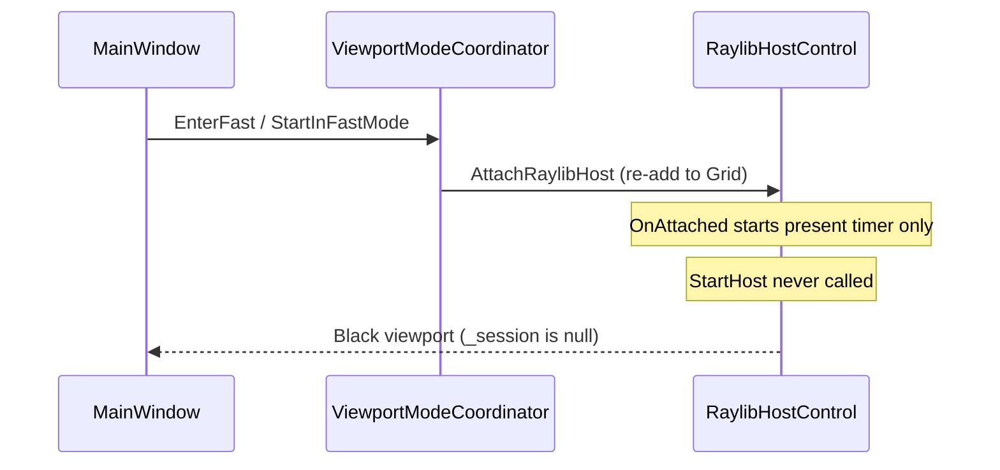

# Mesh Studio: Raylib Preview + Git Graph UX

## Diagnosis

### Raylib Preview is black (Quality works)

Path trace uses [`ViewportSurface`](d:\novolis\novolis-dogfooding\apps\rendering\MeshBench\Ui\ViewportSurface.cs) and works. Preview uses [`RaylibHostControl`](d:\novolis\novolis-avalonia\src\Novolis.Avalonia.Raylib\RaylibHostControl.cs) via [`ViewportModeCoordinator`](d:\novolis\novolis-dogfooding\apps\rendering\MeshBench\Services\ViewportModeCoordinator.cs).



[`RaylibHostControl.OnAttachedToVisualTree`](d:\novolis\novolis-avalonia\src\Novolis.Avalonia.Raylib\RaylibHostControl.cs) only starts the **present timer**; the render loop starts in `StartHost()`, which is only reached via **`SetHostActive(true)`**. The coordinator never calls that API (grep shows zero usage in MeshBench).

After Quality mode, `DetachRaylibHost` triggers `OnDetachedFromVisualTree` → `SetHostActive(false)` → host stopped. Returning to Preview re-attaches the control but **does not restart** the host.

### Git graph panel looks empty / unusable

Current stack: [`GitHistoryPanel`](d:\novolis\novolis-dogfooding\apps\rendering\MeshBench\Ui\GitHistoryPanel.cs) → [`GitGraphTimelineBuilder`](d:\novolis\novolis-dogfooding\apps\rendering\MeshBench\Services\GitGraphTimelineBuilder.cs) → [`GitGraphTimelineList`](d:\novolis\novolis-dogfooding\apps\rendering\MeshBench\Ui\GitGraphTimelineList.cs).

Gaps vs your request:

| Request | Current state |
|---------|----------------|
| Visible git graph | Empty until first **Save** (timeline nodes only created in `SavePointAsync`); overlapping Grid can hide empty hint behind ScrollViewer |
| Branch color-coding | Single blue graph color; branch name only in refs column |
| Clear "you are here" dot | `HEAD` text in refs column; graph uses `*` for all commits |
| Save-point type colors | `Presentation.Kind` (`manual`, `safety`, etc. from [`SnapshotKinds`](d:\novolis\novolis-workspaces\src\Novolis.Snapshots.Abstractions\SnapshotKinds.cs)) not used in UI |

---

## Part 1 — Fix Raylib Preview

### 1.1 Wire host lifecycle in coordinator

In [`ViewportModeCoordinator.cs`](d:\novolis\novolis-dogfooding\apps\rendering\MeshBench\Services\ViewportModeCoordinator.cs):

- **`EnterFast` / `StartInFastMode`**: after `AttachRaylibHost()`, call `_raylibHost.SetHostActive(true)`.
- **`EnterQuality`**: call `_raylibHost.SetHostActive(false)` **before** `DetachRaylibHost()` (belt-and-suspenders with `OnDetached`).
- **`EnsureViewportSized` path** (via [`MainWindow`](d:\novolis\novolis-dogfooding\apps\rendering\MeshBench\MainWindow.cs)): keep setting `FrameWidth` / `FrameHeight` from `_viewportHost.Bounds` so restarts pick up size (already done).

### 1.2 Safety net in `RaylibHostControl` (novolis-avalonia)

In [`RaylibHostControl.cs`](d:\novolis\novolis-avalonia\src\Novolis.Avalonia.Raylib\RaylibHostControl.cs):

- `OnAttachedToVisualTree`: call `SetHostActive(true)` when attached (so first launch works even if coordinator forgets).
- Keep `OnDetachedFromVisualTree` → `SetHostActive(false)` (GLFW single-host rule from [`RaylibGlfwProcessSync`](d:\novolis\novolis-raylib\src\Novolis.Raylib.Runtime\Internal\RaylibGlfwProcessSync.cs)).

### 1.3 GPR package

MeshBench consumes `Novolis.Avalonia.Raylib` via GPR ([`MeshBench.csproj`](d:\novolis\novolis-dogfooding\apps\rendering\MeshBench\MeshBench.csproj)). After avalonia changes, **publish** `Novolis.Avalonia.Raylib` so `SetHostActive` is available to dogfooding (per nuget-only policy).

### 1.4 Verify

- Open app → **Preview** shows meshes immediately (Raylib grid + objects).
- Switch **Quality** → path trace (already works).
- Switch back **Preview** → Raylib returns (not black).

---

## Part 2 — Git graph with branch colors + HEAD dot

### 2.1 Enrich row model

Extend [`GitGraphTimelineRow`](d:\novolis\novolis-dogfooding\apps\rendering\MeshBench\Services\GitGraphTimelineBuilder.cs):

- `BranchName` (string)
- `SnapshotKind` (from `node.Presentation.Kind`)
- `BranchColor` / `KindColor` (Avalonia `Color` or ARGB int)
- `IsHere` (maps to `node.IsHead` — workspace HEAD / "you are here")
- `Marker` (`●` for HEAD, `○` for normal, `◉` optional for branch-point)

Add small palettes in new `GitGraphPalette.cs`:

- **Branches**: stable hash of `BranchName` → 6–8 distinct hues (`main` always one fixed color).
- **Snapshot kinds**: `manual` = green tint, `safety` = amber, `autosave` = gray, `quick` = cyan, etc. (from `SnapshotKinds` constants).

### 2.2 Improve graph builder

In `GitGraphTimelineBuilder`:

- Pass `BranchName`, `Kind`, `IsHead` into each row.
- Colorize graph prefix characters (`│`, `├`, `└`) conceptually via row metadata (UI applies brush).
- **Fallback**: if `TimelineTreeView.Roots` is empty but `GetNodesAsync()` has nodes, build a simple linear `git log --oneline` list (newest first) so saves always appear even if tree projection edge case fails.

### 2.3 Row template redesign

In [`GitGraphTimelineList.cs`](d:\novolis\novolis-dogfooding\apps\rendering\MeshBench\Ui\GitGraphTimelineList.cs) (or new `GitGraphRowControl.cs`):

```
[ colored ● ]  │─┬─*   Subject label          branch refs
   12px dot    graph   (kind badge optional)
```

- **HEAD / you are here**: large filled dot (10–12px), white ring or glow, `ToolTip: "You are here (HEAD)"`.
- **Other commits**: smaller dot filled with **branch color**.
- **Graph column**: monospace lanes tinted with **branch color** (lower opacity).
- **Subject**: white; optional small pill for snapshot kind (e.g. `manual`) using **kind color**.
- **Refs column**: branch name only (drop redundant `HEAD` text when dot conveys it).

### 2.4 Fix History panel layout

In [`GitHistoryPanel.cs`](d:\novolis\novolis-dogfooding\apps\rendering\MeshBench\Ui\GitHistoryPanel.cs):

- Replace overlapping `Grid` with `DockPanel`: header area N/A (header stays in `MainWindow`), `ScrollViewer` fills center, empty hint **only when** `rows.Count == 0` (no overlapping black ListBox).
- Ensure `MinHeight` and visible border so panel never looks like a void.

### 2.5 Session refresh

In [`MeshBenchSession.RefreshTimelineAsync`](d:\novolis\novolis-dogfooding\apps\rendering\MeshBench\Services\MeshBenchSession.cs): pass `head` into builder so `IsHead` is accurate after save/restore/branch.

After **Save** in `MainWindow.OnSavePoint`, `RefreshUi()` already runs — graph should populate immediately.

### 2.6 Optional polish

- Auto-select HEAD row on refresh.
- Legend line under "History (git graph)": colored swatches for `main` + active branches (only if ≥2 branches).

---

## Files to touch

| File | Change |
|------|--------|
| [`ViewportModeCoordinator.cs`](d:\novolis\novolis-dogfooding\apps\rendering\MeshBench\Services\ViewportModeCoordinator.cs) | `SetHostActive(true/false)` on mode switch |
| [`RaylibHostControl.cs`](d:\novolis\novolis-avalonia\src\Novolis.Avalonia.Raylib\RaylibHostControl.cs) | Auto-start on attach |
| [`GitGraphTimelineBuilder.cs`](d:\novolis\novolis-dogfooding\apps\rendering\MeshBench\Services\GitGraphTimelineBuilder.cs) | Colors, markers, fallback list |
| New `GitGraphPalette.cs` | Branch/kind color maps |
| [`GitGraphTimelineList.cs`](d:\novolis\novolis-dogfooding\apps\rendering\MeshBench\Ui\GitGraphTimelineList.cs) | Dot + colored row template |
| [`GitHistoryPanel.cs`](d:\novolis\novolis-dogfooding\apps\rendering\MeshBench\Ui\GitHistoryPanel.cs) | Dock layout, empty state |
| [`MainWindow.cs`](d:\novolis\novolis-dogfooding\apps\rendering\MeshBench\MainWindow.cs) | Select HEAD after refresh (minor) |
| GPR publish | `Novolis.Avalonia.Raylib` after avalonia fix |

---

## Verification

1. **Preview**: meshes visible on open; survives Preview ↔ Quality toggles.
2. **Ctrl+S**: History shows ≥1 row with colored branch dot; HEAD row has prominent **●**.
3. **Branch**: create branch, save — second branch color differs from `main`.
4. `dotnet build` MeshBench; `verify-nuget-only.ps1` after GPR publish.

