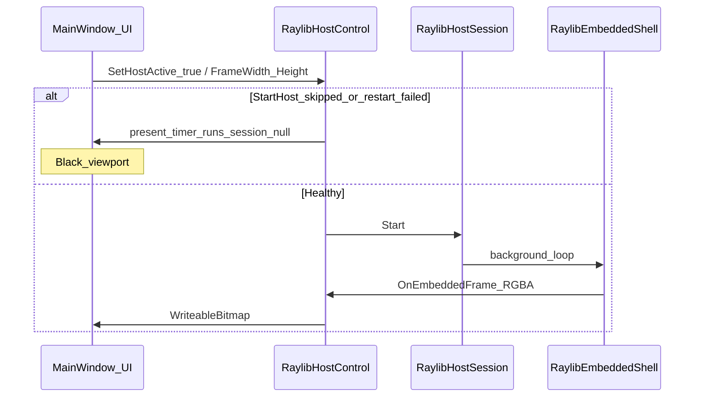
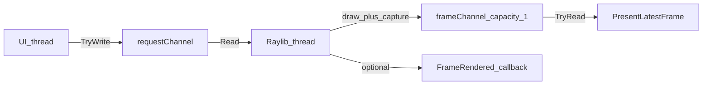

# Mesh Studio: Raylib viewer + git tree fix

## Current diagnosis

Your screenshot matches two separate gaps:

| Symptom | Root cause |
|---------|------------|
| **Black Preview** (status says `Raylib` / Preview) | UI presents frames only when [`RaylibHostSession`](d:\novolis\novolis-avalonia\src\Novolis.Avalonia.Raylib\RaylibHostSession.cs) exists and `TryTakeFrame` succeeds. If `StartHost()` never runs or restarts fail, [`PresentLatestFrame`](d:\novolis\novolis-avalonia\src\Novolis.Avalonia.Raylib\RaylibHostControl.cs) no-ops and you see the dark panel background (`#18181C`). |
| **Empty History panel** | Meshes come from [`MeshSceneStore`](d:\novolis\novolis-dogfooding\apps\rendering\MeshBench\Services\MeshSceneStore.cs) (`CreateDefault()` / `scene.json`). Git rows come only from **timeline nodes** created by [`SavePointAsync`](d:\novolis\novolis-dogfooding\apps\rendering\MeshBench\Services\MeshBenchSession.cs). Six default meshes with zero saves ⇒ `_gitGraphRows` is `[]` (expected data-wise, poor UX). |

Lifecycle fixes were added in source ([`ViewportModeCoordinator`](d:\novolis\novolis-dogfooding\apps\rendering\MeshBench\Services\ViewportModeCoordinator.cs), [`RaylibHostLifecycle`](d:\novolis\novolis-dogfooding\apps\rendering\MeshBench\Services\RaylibHostLifecycle.cs), local [`RaylibHostControl.SetHostActive`](d:\novolis\novolis-avalonia\src\Novolis.Avalonia.Raylib\RaylibHostControl.cs)), but **MeshBench still consumes GPR** [`Novolis.Avalonia.Raylib` 2026.1.1.19](d:\novolis\novolis-dogfooding\apps\rendering\MeshBench\MeshBench.csproj) — runtime may not include `SetHostActive` unless that package is republished and restored.

---

## Part 1 — Reliable Raylib host (stop the black viewport)

### 1.1 Deterministic host start (no timing races)

In [`RaylibHostControl.cs`](d:\novolis\novolis-avalonia\src\Novolis.Avalonia.Raylib\RaylibHostControl.cs):

- Split **present timer** from **render session**: `SetHostActive(true)` must not start `_presentTimer` until `_session` is running (or first frame is pending).
- Add `EnsureHostStarted()` called from:
  - `OnAttachedToVisualTree` (after `base`)
  - `SetHostActive(true)` when `VisualRoot != null`
  - **New** `OnLoaded` / first layout with valid `FrameWidth`/`FrameHeight` (≥64)
- If `VisualRoot` was null when `SetHostActive(true)` ran, queue `Dispatcher.UIThread.Post(EnsureHostStarted, Loaded)` so coordinator + attach order cannot leave timer-without-session.

In [`MainWindow.EnsureViewportSized`](d:\novolis\novolis-dogfooding\apps\rendering\MeshBench\MainWindow.cs):

- Call `_coordinator.RaylibHost.EnsureHostStarted()` (or public wrapper) **after** setting `FrameWidth`/`FrameHeight` when in Preview mode.
- **Debounce** size-driven restarts (e.g. 150ms coalesce) so `OnPropertyChanged` → `RestartHost()` does not thrash during window layout (common on open).

### 1.2 Coordinator attach order

In [`ViewportModeCoordinator.cs`](d:\novolis\novolis-dogfooding\apps\rendering\MeshBench\Services\ViewportModeCoordinator.cs):

- `EnterFast` / `StartInFastMode`: `AttachRaylibHost()` → set size (via MainWindow) → `SetActive(true)`.
- `EnterQuality`: `SetActive(false)` **before** `DetachRaylibHost()` (already correct).
- Register `_raylibHostParent` on first layout if host is in grid but parent tracking is null (so re-attach after Quality never no-ops).

### 1.3 Runtime visibility (debuggability)

Extend status line in [`MainWindow.UpdateStatus`](d:\novolis\novolis-dogfooding\apps\rendering\MeshBench\MainWindow.cs) when Preview:

- `host running` / `host stopped`
- optional `last frame ms` age from host

Surfaces silent failures (GLFW init, capture miss in [`RaylibEmbeddedShell`](d:\novolis\novolis-raylib\src\Novolis.Raylib.Runtime\Shell\RaylibEmbeddedShell.cs) line 71).

### 1.4 GPR publish (required for dogfooding)

Per nuget-only policy: **publish** updated `Novolis.Avalonia.Raylib` (and bump MeshBench package version) after host lifecycle + channel API land. Remove dependence on [`RaylibHostLifecycle`](d:\novolis\novolis-dogfooding\apps\rendering\MeshBench\Services\RaylibHostLifecycle.cs) reflection once GPR contains `SetHostActive` / `EnsureHostStarted`.

---

## Part 2 — Channel-driven on-demand rendering (your suggested approach)

Replace “always-on 60fps loop + lock handoff” with explicit **request → render → callback/present**, modeled after [`FrameCapturePipeline`](d:\novolis\novolis-raylib\src\Novolis.Raylib.Capture\FrameCapturePipeline.cs) (`Channel`, single writer, drop-oldest).

### 2.1 API in `Novolis.Avalonia.Raylib`

Evolve [`RaylibHostSession`](d:\novolis\novolis-avalonia\src\Novolis.Avalonia.Raylib\RaylibHostSession.cs):

- **`Channel<HostRenderRequest>`** (bounded, `DropOldest`): reasons `Redraw`, `Resize`, `Start`, `Stop`.
- **`Channel<HostFrame>`** (capacity 1, `DropOldest`): latest RGBA + dimensions.
- Render thread loop:
  - Block on `requestChannel` (with short idle timeout, e.g. 250ms, for one refresh while idle).
  - Coalesce pending requests (resize wins over redraw).
  - Run **one** `RaylibEmbeddedShell` frame (extract inner draw/capture from [`RaylibEmbeddedShell.Run`](d:\novolis\novolis-raylib\src\Novolis.Raylib.Runtime\Shell\RaylibEmbeddedShell.cs) into `RenderSingleFrame` in `Novolis.Raylib.Runtime` to avoid duplicating GLFW setup).
- UI [`RaylibHostControl`](d:\novolis\novolis-avalonia\src\Novolis.Avalonia.Raylib\RaylibHostControl.cs):
  - `Invalidate()` / `RequestFrame()` → writes `Redraw` (MeshBench calls this from `NotifySceneChanged`, camera drag end, mode enter).
  - Present timer only applies latest `HostFrame` (no `TryTakeFrame` lock dance).

### 2.2 MeshBench wiring

- [`ViewportModeCoordinator.NotifySceneChanged`](d:\novolis\novolis-dogfooding\apps\rendering\MeshBench\Services\ViewportModeCoordinator.cs): `_raylibHost.RequestFrame()` in Fast Preview (instead of relying on continuous loop).
- [`MainWindow`](d:\novolis\novolis-dogfooding\apps\rendering\MeshBench\MainWindow.cs) pointer handlers: request frame on orbit/pan end (optional coalesce during drag at 30fps via channel drop-oldest).
- Keep [`RaylibSceneRenderer`](d:\novolis\novolis-dogfooding\apps\rendering\MeshBench\Services\RaylibSceneRenderer.cs) as the `FrameRendering` draw callback (unchanged draw code).

### 2.3 Benefits

- No wasted GPU work when scene is static.
- Clear contract: UI signals demand, render thread produces one frame, UI presents via callback/channel.
- Easier to test (inject channel reader/writer).

---

## Part 3 — Git tree “100%” (data + UX)

### 3.1 Bootstrap timeline on open

In [`MeshBenchSession.OpenOrCreateDefaultAsync`](d:\novolis\novolis-dogfooding\apps\rendering\MeshBench\Services\MeshBenchSession.cs):

- After `RefreshTimelineAsync`, if `GetNodesAsync()` is empty and workspace is new or has no timeline nodes:
  - Call `SavePointAsync("Initial workspace")` once (or restore-only if `scene.json` exists without nodes — label `"Recovered scene"`).
- Result: first launch shows **one commit** aligned with visible meshes; Save/Branch/Restore graph is immediately exercisable.

### 3.2 History panel always readable

In [`GitHistoryPanel`](d:\novolis\novolis-dogfooding\apps\rendering\MeshBench\Ui\GitHistoryPanel.cs):

- `ShowEmpty()`: also `_list.SetRows([])` to clear stale `ItemsSource`.
- Stronger empty state (larger font, icon line: “Press **Ctrl+S** for another commit”).
- Set `_gitHistory` / `_scroll` `VerticalAlignment = Stretch`, `MinHeight` on scroll area so the panel never collapses to a blank dark strip (matches your screenshot).

In [`GitGraphTimelineList`](d:\novolis\novolis-dogfooding\apps\rendering\MeshBench\Ui\GitGraphTimelineList.cs):

- Fix ID-only refresh skip: also compare `IsHere`, `Graph`, `Subject` so restore/branch updates repaint.
- **Double-click row** → invoke restore (same as toolbar Restore).

### 3.3 Graph builder verification

In [`GitGraphTimelineBuilder`](d:\novolis\novolis-dogfooding\apps\rendering\MeshBench\Services\GitGraphTimelineBuilder.cs):

- Add unit-style test or `verify` command path: given fixture nodes/branches/head, assert non-empty rows, HEAD row `IsHere`, branch colors from [`GitGraphPalette`](d:\novolis\novolis-dogfooding\apps\rendering\MeshBench\Services\GitGraphPalette.cs).
- Keep flat fallback when `tree.Roots` empty but nodes exist (already present).

### 3.4 UI refresh guarantees

In [`MainWindow.OnOpened`](d:\novolis\novolis-dogfooding\apps\rendering\MeshBench\MainWindow.cs):

- `finally { RefreshUi(); }` so git panel updates even if a non-fatal step fails after scene load.
- After bootstrap save, `RefreshUi()` shows graph + auto-select HEAD ([`SelectHeadRow`](d:\novolis\novolis-dogfooding\apps\rendering\MeshBench\Ui\GitGraphTimelineList.cs)).

---

## Verification checklist

1. **Fresh workspace**: open Mesh Studio → Preview shows grid + meshes + HUD text; History shows initial commit with HEAD dot.
2. **Ctrl+S**: second row appears; branch colors if branching.
3. **Restore / double-click**: scene + meshes + camera restore; Preview stays live.
4. **Quality → Preview**: Raylib re-attaches; status shows `host running`; frames resume.
5. **Static scene**: GPU idle (channel not flooded); orbit triggers redraw.
6. `dotnet build` MeshBench; `verify-nuget-only.ps1`; publish `Novolis.Avalonia.Raylib` + restore dogfooding.

---

## File touch list (primary)

| Area | Files |
|------|--------|
| Raylib host + channel | [`RaylibHostControl.cs`](d:\novolis\novolis-avalonia\src\Novolis.Avalonia.Raylib\RaylibHostControl.cs), [`RaylibHostSession.cs`](d:\novolis\novolis-avalonia\src\Novolis.Avalonia.Raylib\RaylibHostSession.cs), [`RaylibEmbeddedShell.cs`](d:\novolis\novolis-raylib\src\Novolis.Raylib.Runtime\Shell\RaylibEmbeddedShell.cs) |
| MeshBench glue | [`ViewportModeCoordinator.cs`](d:\novolis\novolis-dogfooding\apps\rendering\MeshBench\Services\ViewportModeCoordinator.cs), [`MainWindow.cs`](d:\novolis\novolis-dogfooding\apps\rendering\MeshBench\MainWindow.cs), remove/simplify [`RaylibHostLifecycle.cs`](d:\novolis\novolis-dogfooding\apps\rendering\MeshBench\Services\RaylibHostLifecycle.cs) after GPR |
| Git tree | [`MeshBenchSession.cs`](d:\novolis\novolis-dogfooding\apps\rendering\MeshBench\Services\MeshBenchSession.cs), [`GitHistoryPanel.cs`](d:\novolis\novolis-dogfooding\apps\rendering\MeshBench\Ui\GitHistoryPanel.cs), [`GitGraphTimelineList.cs`](d:\novolis\novolis-dogfooding\apps\rendering\MeshBench\Ui\GitGraphTimelineList.cs) |

