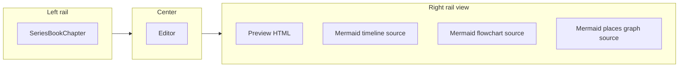

# Metadata views + `novolis-apps` on `main`

## Part A — Git remote and branch policy

**Current state:** Local repo at [novolis-apps](d:\novolis\novolis-apps) is on branch **`master`** with **no `origin` remote**. `Novolis-Platform/novolis-apps` does not exist on GitHub yet. Uncommitted work includes full **ManuscriptStudio** tree; index still shows stale `HandcraftedMarkdown` paths.

**Target state:**

| Item | Value |
|------|--------|
| GitHub repo | `Novolis-Platform/novolis-apps` |
| Default branch | **`main` only** — do not create or push `master` |
| Local branch | `main` tracking `origin/main` |
| CI | Existing workflows already target `main` ([pull-request.yml](d:\novolis\novolis-apps\.github\workflows\pull-request.yml)) |

**Steps (execution order):**

1. Stage all current files (`ManuscriptStudio`, docs, slnx); remove deleted `HandcraftedMarkdown` from index.
2. Commit if needed so `main` has a clean snapshot.
3. `git branch -m master main` (rename local branch; **do not** push `master`).
4. `gh repo create Novolis-Platform/novolis-apps --public --source=. --remote=origin --push` with explicit default branch `main`:
   ```powershell
   gh repo create Novolis-Platform/novolis-apps --public --source=. --remote=origin
   git push -u origin main
   ```
   If the org requires template scaffolding first, create empty repo with `--default-branch main` then push.
5. Verify: `gh repo view Novolis-Platform/novolis-apps --json defaultBranchRef` → `main`; `git branch -a` shows only `main` on remote.
6. Optional: add `HEAD` symlink protection / branch rules in GitHub UI (org policy) so `master` cannot be created.

No changes to [novolis-governance](d:\novolis\novolis-governance) required unless you want `apps-repos.md` to link the live repo URL after creation.

---

## Part B — Replace toolbar buttons with metadata views (v1: export-only)

**User choice:** Live Mermaid rendering deferred — **source panel + export** in v1.

### UX change

Replace the crowded toolbar in [BookAuthoringExtension.cs](d:\novolis\novolis-apps\src\ManuscriptStudio\Extensions\BookAuthoring\BookAuthoringExtension.cs) (lines 59–74) with:

| Control | Role |
|---------|------|
| **Right-rail view** combo | `Preview` · `Timeline` · `Relationships` · `Map` |
| **Insert** (single menu) | Metadata lines, dialogue/thinking snippets, chapter tag — collapsed, not primary |
| **Debug meta** | Toggle extended `[!tag]` in preview |
| **Export** menu | Export PDF (existing), Export view (.mmd), Export all views (zip folder) |

Center column stays the **chapter editor**. Right rail switches content by view (not `RenderPreviewHtml` only).



### Data pipeline (in-app, no books repo dependency)

New folder: `src/ManuscriptStudio/Extensions/BookAuthoring/Views/`

| Component | Responsibility |
|-----------|----------------|
| `BookMetadataIndex` | Scan ordered chapters of `_currentBook`; per chapter: sort key, title, file path, parsed `[!tag]` rows ([ChapterMetadata.cs](d:\novolis\novolis-apps\src\ManuscriptStudio\Extensions\BookAuthoring\Content\ChapterMetadata.cs)) |
| `TimelineMermaidBuilder` | Build Mermaid `timeline` from `[!date]` + chapter titles; section per POV or flat chapter order |
| `RelationshipMermaidBuilder` | `flowchart` from `[!characters]` + `[!pov]` co-occurrence (nodes = characters, edges = shared chapters) |
| `PlacesMermaidBuilder` | `flowchart` from `[!system]` → `[!location]` hierarchy + chapter pins |
| `MermaidViewExporter` | Write `.mmd` to `{dataRoot}/exports/{series}/{book}/views/`; optional bundled `views-manifest.json` |

**Reference alignment (design only):** Mirror patterns in `D:\repos\books\...\references\about\relationships-timelines-and-maps.md` — do not read that file at runtime in v1; generated charts come from **live chapter metadata scan**.

**Optional v1.1:** Load curated `history/timeline.md` table as overlay section in timeline builder (parse markdown table dates).

### Mermaid generation package

Add to [Directory.Packages.props](d:\novolis\novolis-apps\Directory.Packages.props):

```xml
<PackageVersion Include="Novolis.Markup.Mermaid" Version="2026.1.*" />
```

Use `Novolis.Markup.Mermaid` (`Timeline`, `Flowchart`, `Node`, `Link`) from GPR — programmatic builders, not string hacks.

### MainWindow / extension contract

Extend [IManuscriptExtension.cs](d:\novolis\novolis-apps\src\ManuscriptStudio\Core\IManuscriptExtension.cs):

```csharp
Control CreateRightRail(ManuscriptHostContext host);  // preview OR diagram source
void OnRightRailViewChanged(string viewId);
IReadOnlyList<BookViewDescriptor> GetRightRailViews(); // Book Authoring only; Generic returns Preview only
```

Update [MainWindow.cs](d:\novolis\novolis-apps\src\ManuscriptStudio\MainWindow.cs):

- Replace fixed `_preview` `HtmlPanel` with `_rightRailHost` `Grid`.
- Book Authoring: right-rail combo drives `CreateRightRail` / refresh; Timeline/Relationships/Map show read-only monospace `TextBox` + **Copy** / **Save .mmd** buttons in rail header.
- Preview view keeps `HtmlPanel` + existing debounced refresh.

Persist last right-rail view in [ManuscriptSettings.cs](d:\novolis\novolis-apps\src\ManuscriptStudio\Core\ManuscriptSettings.cs):

```json
"bookAuthoring": { "rightRailView": "timeline", ... }
```

### Export behavior (v1)

| Action | Output |
|--------|--------|
| Export view | `{dataRoot}/exports/{seriesId}/{bookId}/views/{timeline|relationships|map}.mmd` |
| Export all views | Same folder with all three `.mmd` + `manifest.json` (generated at, chapter count) |
| Export PDF | Unchanged ([BookPdfExporter.cs](d:\novolis\novolis-apps\src\ManuscriptStudio\Extensions\BookAuthoring\Rendering\BookPdfExporter.cs)) |

No SVG/PNG in v1 (requires mermaid-cli or WebView — follow-up).

### Calypso smoke test

After build, Book Authoring → `D:\repos\books` → Calypso Cycle → `calypso`:

- **Timeline** view shows Mermaid with chapter dates from metadata-rich chapters (e.g. `047-marsh-black.md`).
- **Relationships** shows character nodes from `[!characters]` / `[!pov]`.
- **Map** shows system/location nodes.
- Export writes `.mmd` under app data `exports/`.

---

## Part C — Docs and verify

- Update [docs/getting-started.md](d:\novolis\novolis-apps\docs\getting-started.md) and [src/ManuscriptStudio/README.md](d:\novolis\novolis-apps\src\ManuscriptStudio\README.md) — views, export paths, no live diagram preview in v1.
- `dotnet build Novolis.Apps.slnx -c Release`
- `verify-nuget-only.ps1` (PackageReference only; new `Novolis.Markup.Mermaid`)

---

## Implementation order

1. **Git:** Clean commit → `master` → `main` → create GitHub repo → `git push -u origin main` → verify default branch.
2. **Views data layer:** `BookMetadataIndex` + three Mermaid builders + exporter.
3. **UI:** Extend extension contract; right-rail view switcher; slim toolbar (Insert menu + exports).
4. **Docs + build + Calypso smoke.**

## Deferred (not in this plan)

- Live Mermaid render (WebView + mermaid.js)
- SVG/PNG export via `@mermaid-js/mermaid-cli`
- Merging curated reference markdown (`relationships-timelines-and-maps.md`) into generated charts

