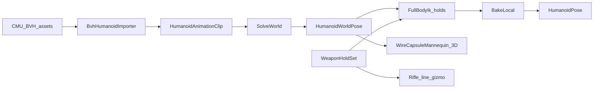

# CharacterLab mocap reboot

## Why the current app feels like “nothing”

Procedural `DrillClips` + flat Avalonia sticks never look like captured human motion. The mesh path exploded for separate reasons. The platform already has the right building blocks; CharacterLab was not using them.

**Use now (in-repo):**
- [`BvhHumanoidImporter`](novolis-simulation/src/Novolis.Simulation.Humanoid.Import/BvhHumanoidImporter.cs) — BVH → `HumanoidAnimationClip`
- [`HumanoidPoseSolver`](novolis-simulation/src/Novolis.Simulation.Humanoid/HumanoidPoseSolver.cs) / `BakeLocal`
- [`HumanoidFullBodyIk`](novolis-simulation/src/Novolis.Simulation.Humanoid/HumanoidFullBodyIk.cs) + [`HumanoidDebugDraw`](novolis-simulation/src/Novolis.Simulation.Humanoid/HumanoidDebugDraw.cs)
- Hold points already in [`WeaponHoldSet`](novolis-dogfooding/apps/avalonia/CharacterLab/Demo/WeaponHoldSet.cs)

**References (do not vendor):**
- [CMU MoCap](http://mocap.cs.cmu.edu/) — free BVH source of truth (credit NSF EIA-0196217; do not resell data)
- [EasyMocap](https://github.com/zju3dv/EasyMocap) / [FreeMoCap](https://freemocap.org/) — capture pipelines for a later ingest story (Python/SMPL/cameras), not this dogfood pass
- [mannequin.js](https://boytchev.github.io/mannequin.js/) — **GPL-3.0**: inspiration for articulated capsules only; do not copy code
- MoCap Online free-guide — commercial sample packs; skip shipping their assets



## Locked product shape

**CharacterLab default = mocap player**, not procedural-only sticks.

1. **Primary viewport:** orbitable **3D wire capsule mannequin** (`SceneWireGlControl` + thin capsule/box segments per `HumanoidDebugDraw` bone) so motion reads in depth.
2. **Secondary:** keep Front/Side stick panes (current HumanoidLab-style) as diagnostic orthographic views.
3. **Clips:** ship **2–3 short CMU BVH** files under `CharacterLab/assets/mocap/` (+ `CREDITS.md` with CMU attribution). Curate motions that prove retargeting (e.g. walk + a standing reach/interact). Prefer cgspeed-style BVH that maps cleanly through existing name retarget in `BvhHumanoidImporter`.
4. **Rifle hold overlay:** on standing/reach frames, place rifle gizmo; `HumanoidFullBodyIk` locks hands to primary/secondary holds; `BakeLocal` so pose persists. GripΔ stays on the status line / agent `sampleholds`.
5. **UI:** clip dropdown + scrub/seek + pause; agent surface keeps `setphasetime` / `explore` / `sampleholds` against the mocap clock.
6. **Meshes (WhiteTechwearGirl / Rifle FBX):** remain **off** until mocap + hold locks look right in wire (explicit follow-up). Keep `DrillParadeDriver` codepath dead or behind `--with-mesh` only after wire is trusted.

## Implementation work

### A. Assets + import smoke

- Add `assets/mocap/*.bvh` (small) + `CREDITS.md` (CMU + NSF text).
- Extend CharacterLab csproj `Content` copy for mocap.
- Headless `--drill-smoke`: load BVH → sample mid-clip → assert hand/foot travel and (when hold mode on) `rErr`/`lErr` gates.
- Unit/dogfood: one test that `BvhHumanoidImporter.ImportFile` on the shipped clip yields `Keys.Count > 10` and duration &gt; 0.

### B. Mocap driver (replace procedural as default)

Rewrite driver around mocap (new `MocapParadeDriver` or evolve `SkeletonDrillDriver`):

- Load selected BVH into `HumanoidClipBank` via Import.
- Each tick: `clip.Sample` → `SolveWorld` → optional hold IK → `BakeLocal` into pose for next frame.
- Expose clip list, duration, seek.
- Keep procedural `DrillClips` as a listed “Synthetic drill” clip so military scene is not deleted—just no longer the only motion.

### C. 3D wire mannequin

- Build a tiny `WireMannequinScene` helper: `SceneDocument` with one `MeshNode` per bone segment (scaled box/capsule along `HumanoidBoneSegment`), update transforms each frame from world pose; rifle as one segment + hold marker spheres.
- Host with `SceneWireGlControl` (wire is intentional here) + orbit; clear selection so no cyan “selected soup.”
- Front/Side `StickFigurePane` continue to call `Paint` from the same world pose.

### D. Agent + docs

- Agent snapshot: `clip`, `source=cmu-bvh|synthetic`, hold errors.
- README: CMU credit; what EasyMocap/FreeMoCap mean for later (“capture → BVH/FBX → this player”); mannequin.js noted as visual inspiration only (GPL).

## Explicit non-goals (this pass)

- Embedding EasyMocap / FreeMoCap / SMPL fitting
- Copying mannequin.js sources
- Auto-skin FBX character as the default view
- Downloading the full CMU corpus in CI

## Verify

```powershell
dotnet run --project novolis-dogfooding/apps/avalonia/CharacterLab -p:NovolisUseProjectReferences=true -- --drill-smoke
dotnet run --project novolis-dogfooding/apps/avalonia/CharacterLab -p:NovolisUseProjectReferences=true -- --agent-explore
dotnet run --project novolis-dogfooding/apps/avalonia/CharacterLab -p:NovolisUseProjectReferences=true
```

Expect: orbitable wire human walking/reaching from real mocap; rifle holds lock with ~0 grip error in hold mode; agent explore green.

