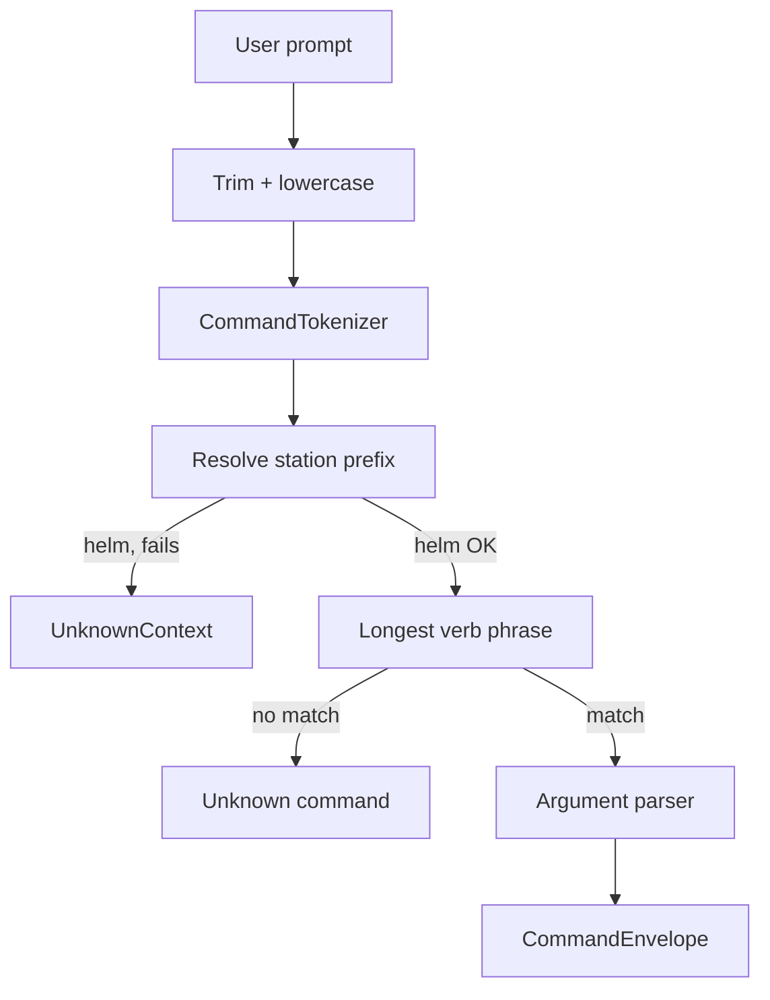

# Natural bridge orders and 3D heading

## What failed (from your log)

| Spoken order | Root cause today |
|--------------|------------------|
| `helm come about` | No verb phrase `come about` in registry |
| `helm all ahead full` | No phrase `all ahead full` (only `warp N` / `full stop`) |
| `weaps target the closest enemy` | No phrase `target … enemy`; only `lock target` |
| `helm, set heading to 122 by 180` | First token is `helm,` (comma) → **UnknownContext**; even if fixed, parser cannot handle `to` fillers or **BY** second axis |



## Design

### 1. Punctuation-tolerant tokens (engine)

**File:** [`CommandTokenizer.cs`](d:\novolis\novolis-commands\src\Novolis.Commands.Engine\CommandTokenizer.cs)

After splitting on whitespace, **trim trailing/leading punctuation** on each token (`helm,` → `helm`, `180.` → `180`) using a small `SearchValues<char>` set (`,;:.!?`).

- Fixes `helm, set heading…` without special-casing the first token only.
- Add tokenizer tests for comma/colon variants.

### 2. Natural verb phrases (registry + dogfood)

**Files:**

- [`BridgeCommandRegistry.cs`](d:\novolis\novolis-dogfooding\apps\BridgeCommander\Bridge\BridgeCommandRegistry.cs)
- [`CommandEngineTestRegistry.CreateBridge()`](d:\novolis\novolis-commands\tests\Novolis.Commands.Engine.Tests\Support\CommandEngineTestRegistry.cs)

| Phrase(s) | Maps to | Notes |
|-----------|---------|--------|
| `come about` | **new** `helm.come-about` | No args; processor turns **180°** from current heading |
| `all ahead full`, `ahead full` | **new** `helm.all-ahead-full` | No args; processor sets warp **9** (existing clamp) |
| `target the closest enemy`, `target closest enemy` | `tactical.lock-target` | Same handler; still locks KR-12 |
| `set heading to`, `set heading`, `heading` | `helm.set-heading` | Keep existing; heading args parsed by new parser |

**Processor:** [`BridgeCommandProcessor.cs`](d:\novolis\novolis-dogfooding\apps\BridgeCommander\Bridge\BridgeCommandProcessor.cs)

- `helm.come-about`: `Heading = (Heading + 180) % 360`
- `helm.all-ahead-full`: `SpeedWarp = 9`, status “all ahead full”

### 3. Two-axis helm heading (MARK / BY) — your 3D convention

**Semantics (per your clarification):**

- `BY` introduces the **second axis** (not maritime “mark”).
- `MARK` introduces the **decimal** part of the primary axis.
- Example: `122 MARK 6 BY 180` → primary **122.6°**, secondary **180.0°**
- Example: `122 BY 180` → primary **122°**, secondary **180°**
- Single number only → set primary; leave secondary unchanged (or 0 if never set — pick one and document in help).

**State:** [`BridgeState.cs`](d:\novolis\novolis-dogfooding\apps\BridgeCommander\Bridge\BridgeState.cs)

- Add `double HeadingPrimary` (or keep `Heading` int + `HeadingFraction` — prefer **one `double Heading` + `double HeadingBy`** for clean 122.6 display).
- Update `FormatStatus()` e.g. `HDG 122.6 BY 180° | …`

**Engine:** new internal [`HeadingArgumentParser.cs`](d:\novolis\novolis-commands\src\Novolis.Commands.Engine\HeadingArgumentParser.cs)

- Called from [`CommandParser.BuildSuccess`](d:\novolis\novolis-commands\src\Novolis.Commands.Engine\CommandParser.cs) when command is `helm.set-heading`.
- Skips filler tokens: `to`, `at`, `the`, `degrees`.
- Grammar (token scan after verb phrase):
  - `{int}` → primary
  - `{int} MARK {int} [BY {int}]` → primary = int + mark/10, optional by
  - `{int} BY {int}` → primary, by
- Envelope arguments: `heading` (double), `headingBy` (double, optional — omit key if absent).

Extend [`CommandArgumentDefinition`](d:\novolis\novolis-commands\src\Novolis.Commands.Engine\CommandArgumentDefinition.cs) with `CommandArgumentKind.Double` **or** keep ints in envelope and use custom parser only for set-heading (minimal surface: two optional doubles on envelope).

**Processor** `helm.set-heading`: read `heading` + optional `headingBy`, update state, status reflects both axes.

### 4. Help and reference panel

**File:** [`BridgeHelp.cs`](d:\novolis\novolis-dogfooding\apps\BridgeCommander\Bridge\BridgeHelp.cs)

Add natural examples matching what players type:

```
helm come about
helm all ahead full
weaps target the closest enemy
helm set heading to 122 by 180
helm heading 122 mark 6 by 180
```

Note that commas after the station name are OK.

### 5. Tests (library + scenes)

**Engine**

- Tokenizer: `helm,` / `tactical,` punctuation cases
- Parser: each of the **four failed log lines** as success cases
- Heading parser unit tests: `122 by 180`, `122 mark 6 by 180`, `set heading to 122`, single `270`

**Bridge scenes:** extend [`BridgeScenes.cs`](d:\novolis\novolis-commands\tests\Novolis.Commands.Engine.Tests\Support\Bridge\BridgeScenes.cs) with a short **“Natural orders”** beat using the exact transcript lines; simulation asserts heading/by/warp/lock after the KR-12 scene.

**Simulator:** [`BridgeSimulator.cs`](d:\novolis\novolis-commands\tests\Novolis.Commands.Engine.Tests\Support\Bridge\BridgeSimulator.cs) — mirror new helm commands + two-axis heading for scene tests.

### 6. Optional follow-up (out of scope unless you want it in same PR)

- `IValidateOptions` on registry build (duplicate phrases, unknown contexts) — separate small PR
- Smarter failure hints (“Did you mean `lock target`?”) when verb phrase is close — not required for these four fixes

## Files touched (summary)

| Area | Files |
|------|--------|
| Engine | `CommandTokenizer.cs`, `CommandParser.cs`, `HeadingArgumentParser.cs`, `CommandArgumentDefinition.cs` (if Double added) |
| Dogfood | `BridgeCommandRegistry.cs`, `BridgeCommandProcessor.cs`, `BridgeState.cs`, `BridgeHelp.cs` |
| Tests | `CommandTokenizerTests.cs`, `CommandEngineTestCases` / new `NaturalOrderTests.cs`, `BridgeScenes.cs`, `BridgeSimulator.cs`, `CommandEngineTestRegistry.cs` |

## Verification

```powershell
dotnet test --project d:\novolis\novolis-commands\tests\Novolis.Commands.Engine.Tests\Novolis.Commands.Engine.Tests.csproj
dotnet run --project d:\novolis\novolis-dogfooding\apps\BridgeCommander
```

Manual checklist — all four log lines should **parse and execute**:

1. `helm come about`
2. `helm all ahead full`
3. `weaps target the closest enemy`
4. `helm, set heading to 122 by 180`

