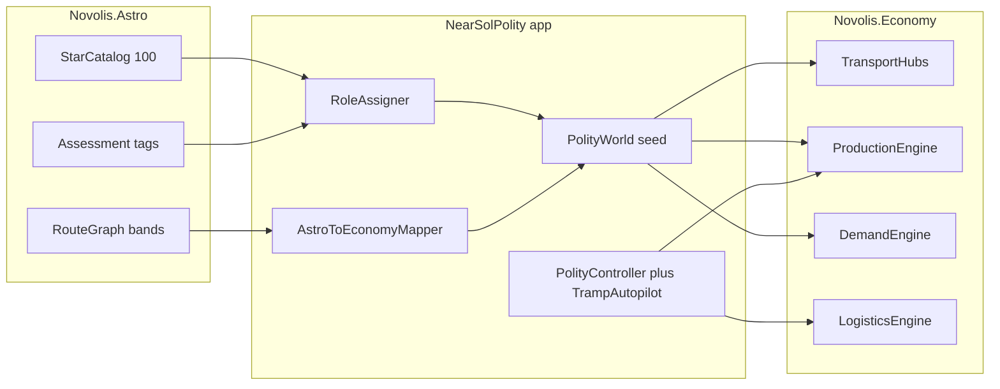

# Near-Sol interstellar polity simulation

## Defaults (locked)

- **New app** [`novolis-dogfooding/apps/economy/NearSolPolity/`](novolis-dogfooding/apps/economy/NearSolPolity/) — Spectre Live, variable speed (reuse TrampFreighterSim clock/keys). Keep [`TrampFreighterSim`](novolis-dogfooding/apps/economy/TrampFreighterSim/) as the small 4-hub circuit.
- **Background polity + 1–3 tramp freighters** with margin heuristics. Local firms auto-plan production/restock; freighters pick jobs. No multi-fleet AI war in v1.
- **Bridge only in dogfood** — Economy stays Astro-free per [`novolis-economy/docs/design.md`](novolis-economy/docs/design.md). Map `StarSystem` → `TransportHub` / hop → `TransportCorridor` in the app.
- **Packages:** `Novolis.Astro.*`, `Novolis.Physics.Astro`, `Novolis.Economy.*` all `2026.1.*` from GitHub Packages only.

## Architecture



## 1. Near-Sol catalog (100 closest)

StarMapLab already embeds **84** Johnston (2022) systems in [`MainWindow.cs` `DemoCatalog`](novolis-dogfooding/apps/astro/StarMapLab/MainWindow.cs) (~≤20.5 ly).

- Extract catalog into shared dogfood helper: [`novolis-dogfooding/apps/shared/Novolis.Dogfooding.NearSol/`](novolis-dogfooding/apps/shared/Novolis.Dogfooding.NearSol/) (or app-local `Catalog/` if shared project is heavy).
- Embed as **JSON/CSV resource** (id, name, x,y,z ly, spectral, tags) — not hardcoding 100 `Add` calls in UI code.
- Expand to **100** systems (same Johnston galactic XYZ convention; document source in README). Filter/sort: `OrderBy(DistanceFromOrigin).Take(100)` with Sol forced as id `sol`.
- Reuse `HygCsvImporter` shape if CSV; otherwise thin loader calling `StarCatalog.Add`.
- Optionally retarget StarMapLab to load the shared catalog later (not required for v1).

## 2. Roles: inhabited vs transit vs resource

Deterministic classification (fixed seed, no RNG drift):

| Role | How | Economy effect |
|------|-----|----------------|
| **Capital** | Sol (+ maybe 1 secondary) | High budget cohort, parts/goods retail, berths |
| **Inhabited** | `planet-host` tags + `HabitabilityAssessor` top-N (~12–18) | Cohorts + goods demand; light industry |
| **Industrial** | subset of inhabited / high strategic score (~4–6) | Ore→Parts→Goods recipes |
| **Mining** | M/K dwarfs or overlay tag (~8–12) | Ore production, low population |
| **Transit** | high hop degree from `RouteGraph` and/or `StrategicAssessor` (~15–25) | Fuel stock, bunkering, tolls, no/low production |
| **Waypoint** | remaining catalog stars on the graph | Hubs with berths only (pass-through) |

Only systems that appear on the hop graph become `TransportHub`s (expect most of the 100 if max range ~12 ly). UI focuses on **active** roles (inhabited/industrial/mining/transit), not scrolling 100 rows every pulse.

## 3. Astro → Economy corridor mapping

From existing Astro routing ([`RouteGraph`](novolis-astro/src/Novolis.Astro.Routing/RouteGraph.cs) + [`RangeBandCostModel.CreatePrototypeCompatible`](novolis-astro/src/Novolis.Astro.Routing/CostModels.cs): ≤10 ly @1× / ≤12 ly @3×):

For each undirected hop edge, emit **two** directed `TransportCorridor`s:

- `TransitHours = max(1, ceil(distanceLy / CruiseLyPerHour))` with **CruiseLyPerHour = 1/24** (1 ly/day → matches AstroSmoke’s mental model; long hops are multi-day).
- `Difficulty = band multiplier` (1 or 3) so fuel burn scales.
- `Toll = base × distanceLy` (small money).
- `MaxCargo` from polity vehicle class.

Vehicle class: tramp freighter (tank sized for ≤10 ly short-band without mid-bunker; long-band requires transit refuel — same tank-scarcity drama as Sparse Rim, but emergent from geometry).

## 4. Polity economy seed (kernel features already exist)

Reuse patterns from [`EconomyBoard/ChainScenario.cs`](novolis-dogfooding/apps/economy/EconomyBoard/ChainScenario.cs) + tramp logistics:

**Products:** `Ore` → `Parts` → `Goods`; `Fuel` as logistics commodity.

**Firms:** one **polity industrial firm** (state yards / co-op) owning mining + industrial facilities; one **tramp firm** (player-watched) with cash/hull. Keep exogenous procurement only as a thin emergency valve (fuel at transit if stock empty), not the main supply.

**Per role:**

- Mining: `SetProductionPlan` ore each period; inventory at local hub.
- Industrial: recipes consume ore → parts → goods; restock retail via local stock or `PlanShipment`/`FreightRoute` from mines (start with **local ore buys + tramp hauls**, then add polity auto-restock on short feeder lanes if needed).
- Inhabited: `ConsumerCohort` budgets + category prefs (goods/parts); `SetRetailPrice` posted asks.
- Transit: fuel lots + higher berth capacity.

**Controller (`PolityController.Tick`):** each hour, ensure production plans, top up fuel at transit hubs, set retail prices from simple cost-plus (ore floor, parts, goods), and optionally enqueue feeder `PlanShipment`s for the polity firm when industrial ore &lt; threshold and a mining hub has surplus.

**Tramp autopilot:** generalize [`TrampAutopilot`](novolis-dogfooding/apps/economy/TrampFreighterSim/TrampAutopilot.cs) — quote jobs by scanning (product, origin with stock, dest with unmet demand/price), use `ItineraryPlanner` for real hours/fuel/tolls, accept if margin ≥ min. Sell delivered cargo before next haul. Reject tank-infeasible paths.

## 5. Spectre Live UI

Two-column board (evolve tramp layout):

- **Left:** hour/day, cash (tramp + polity summary), fuel/toll/wage/revenue aggregates, freighter status, best job eval, polity stock highlights (top mining/industrial hubs).
- **Right:** compact lane strip (Sol + current freighter route waypoints), role counts (`I18 / T22 / M10…`), event log; optional `P`ause / speed keys unchanged.
- Non-TTY: advance N hours, print hash + summary (cash, delivered, produced, systems with stockouts).

Optional: write SVG via `Novolis.Astro.Plotting` on quit (path of last haul) — nice, not blocking.

## 6. Files to add (concise)

```
apps/economy/NearSolPolity/
  NearSolPolity.csproj
  Program.cs                 # Live loop
  NearSolCatalog.cs          # load 100-star resource
  data/nearsol-100.json      # Johnston-based coords
  RoleAssigner.cs
  AstroEconomyBridge.cs      # hubs + corridors
  PolityWorld.cs             # EconomyWorldBuilder seed
  PolityController.cs        # production / prices / feeder
  TrampFleetAutopilot.cs     # heuristic jobs on real graph
  Dashboard.cs               # Spectre table
  README.md
apps/shared/Novolis.Dogfooding.NearSol/   # if catalog shared
```

Wire into [`Novolis.Dogfooding.slnx`](novolis-dogfooding/Novolis.Dogfooding.slnx) + economy README.

## 7. Verification

- `dotnet build` NearSolPolity (nuget.org + github only).
- Non-interactive 500h smoke: cash not monotonically dying; ore produced; goods sold; freighter deliveries &gt; 0; determinism hash stable for fixed seed.
- Run `verify-nuget-only.ps1` before claiming done.
- No Economy package changes required for v1; if demand must be area-scoped and cheapest-global breaks multi-hub retail, add a **small** follow-up in `DemandEngine` (prefer same-hub / same-area offers) — only if smoke shows all sales collapsing to one warehouse.

## Out of scope (v1)

- Avalonia StarMap host (disk/UI cost); use Spectre + optional SVG.
- Competing AI freighter firms / diplomacy.
- Relativistic flight, orbits, Physics.Orbits coupling.
- Publishing a NuGet “near-sol content” pack (stays dogfood data until proven).

