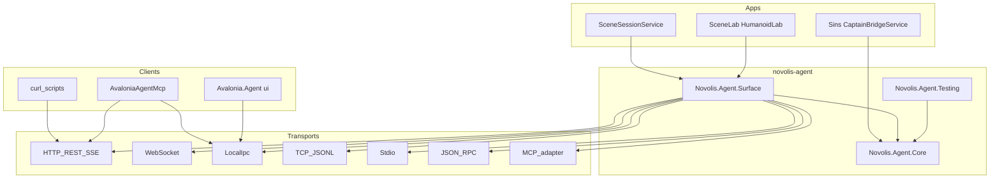

# novolis-agent — Agent Surface implementation plan

## Goals

- New platform repo **`novolis-agent`** owns live process control (not Commands, not Avalonia UI kit).
- Vocabulary: **Surface / Host / Channel / Transport / Document / Announce** — no platform **Session** or **Bridge**.
- One authoritative **`AgentSurfaceDocument`** with OpenAPI / MCP / RPC projections; announce live endpoints.
- Transport mix: LocalIpc, WebSocket (duplex), HTTP REST, SSE, TCP JSONL, Stdio, JSON-RPC adapter, MCP adapter.
- Migrate producers/consumers; delete Agent packages from [`novolis-commands`](novolis-commands).

## Locked decisions

| Decision | Choice |
|----------|--------|
| Repo | `novolis-agent` under `Novolis-Platform` (scaffold from [`novolis-template-dotnet`](novolis-template-dotnet)) |
| Packages | `Novolis.Agent.Core`, `Novolis.Agent.Surface`, `Novolis.Agent.Testing` only |
| Retire | `Novolis.Agent.Session` package (no shim NuGet) |
| Wire prefix | `agent.*` + `/agent/*`; temporary `/session/*` aliases until consumers migrate |
| Avalonia UI | Stay in [`novolis-avalonia`](novolis-avalonia) (`Novolis.Avalonia.Agent*`); no move into `novolis-agent` |
| Decision-gate | Optional host capabilities (`agent.continue`, events) via Core — not a separate package |
| NuGet | GPR `2026.1.*` only; no local feeds |



---

## Phase 0 — Scaffold repo

1. Create GitHub repo from [`novolis-template-dotnet`](novolis-template-dotnet) → clone to `d:\novolis\novolis-agent`.
2. Set `NovolisGitHubRepository` = `novolis-agent` in [`Directory.Build.props`](novolis-template-dotnet/Directory.Build.props); keep `nuget.config` nuget.org + GitHub only.
3. Add `Novolis.Agent.slnx`, `src/`, `tests/`, `.novolis/packages.json`, docs trio (`getting-started`, `design`, `agent-surface` protocol).
4. CPM: `Novolis.Transports.LocalIpc` `2026.1.*`, MessagePack, TUnit via existing patterns from [`novolis-commands/Directory.Packages.props`](novolis-commands/Directory.Packages.props).
5. Wire CI: same reusable workflows as template (`pull-request`, `merge` → GPR, `release`).

---

## Phase 1 — `Novolis.Agent.Core`

Extract and rename contracts from current Surface/Session into Core (BCL + MessagePack as needed).

**Types**

| New | Source today |
|-----|----------------|
| `IAgentHost` | Merge [`IAgentSession`](novolis-commands/src/Novolis.Agent.Surface/Dtos/AgentDtos.cs) + [`IGameSession`](novolis-commands/src/Novolis.Agent.Session/IGameSession.cs) |
| `AgentFrame` / `IAgentChannel` | New duplex abstraction (kind: request/response/event) |
| `IAgentTransport` | Replace `ISessionTransport` |
| Shared DTOs | Hello, Snapshot, Actions, Command, events — rename off `Session*` |
| Method names | `AgentMethodNames` → `agent.hello`, `agent.snapshot`, …; include optional `agent.continue` |

**Host surface (minimal)**

```csharp
public interface IAgentHost
{
    AgentHello Hello();
    AgentSnapshot Snapshot();
    AgentActions Actions();
    AgentCommandResult Execute(AgentCommand command);
    void Subscribe();
    // optional: Continue() when capability advertised
    event Action<AgentEvent>? Event;
}
```

Events unify decision/changed/actionResult as typed `AgentEvent` (kind discriminator) so Core stays free of product names.

Unit tests: DTO round-trip MessagePack + JSON; frame codec.

---

## Phase 2 — `Novolis.Agent.Surface`

Port and expand [`Novolis.Agent.Surface`](novolis-commands/src/Novolis.Agent.Surface) + Session hosts into one attach package depending on Core + LocalIpc.

### 2a Definition & attributes

Keep `[AgentSurface]`, `[AgentAction]`, `[AgentMethod]` on [`AgentAttributes.cs`](novolis-commands/src/Novolis.Agent.Surface/Attributes/AgentAttributes.cs); defaults use `NOVOLIS_AGENT_*` and marker prefix `novolis-agent-{id}` (no `*_SESSION`).

### 2b Document (OpenAPI-for-agents)

Replace ad-hoc `BuildOpenApiFragment` / `BuildMcpTools` / `ToDiscoveryJson` with one builder:

- **`AgentSurfaceDocument`**: info, endpoints, methods, actions+schemas, events, paths, rpc methods, mcp tools, channel capabilities.
- Projections: `ToOpenApiJson()`, `ToMcpTools()`, `ToRpcMethods()`, `ToJson()`.
- Live HTTP routes: `GET /agent/document`, `/agent/openapi.json`, `/agent/mcp/tools`, `/agent/rpc/methods`, `/agent/announce`, `/health`.
- `agent.hello` returns document URL/hash + capabilities.

### 2c Announce

- **`AgentAnnouncement`**: surfaceId, protocolVersion, pid, appId, transports[], documentUrl, attachedAtUtc.
- Temp markers: `%TEMP%/novolis-agent-{surfaceId}.{http|ws|ipc|tcp|mcp|rpc}`.
- Write markers on attach; delete on dispose (same pattern as today’s HTTP/TCP markers).

### 2d Transports (implement in Surface)

| Transport | Work |
|-----------|------|
| HTTP REST + SSE | Port [`AgentHttpHost`](novolis-commands/src/Novolis.Agent.Surface/Hosting/AgentHttpHost.cs); paths `/agent/*`; keep `/session/*` aliases temporarily |
| **WebSocket** | New: `ws://127.0.0.1:{port}/agent/ws` — duplex `AgentFrame` (JSON text v1; MessagePack binary optional behind flag) |
| LocalIpc | Port [`SessionHost`](novolis-commands/src/Novolis.Agent.Session/SessionHost.cs) → `AgentLocalIpcTransport` on `IAgentHost` |
| TCP JSONL | Port Surface/Session TCP hosts |
| Stdio JSONL | Port [`SessionStdioHost`](novolis-commands/src/Novolis.Agent.Session/SessionStdioHost.cs) |
| **JSON-RPC** | Adapter over WS or TCP: `method` = `agent.*`; notifications = events |
| **MCP** | In-process optional `AgentMcpStdioTransport` **only for headless hosts**; GUI apps use dogfood sidecar that reads document + speaks LocalIpc/HTTP (do not put MCP stdio on Avalonia) |

### 2e Attach API

```csharp
AgentSurface.AttachAll(host, definition, AgentAttachOptions);
AgentSurface.TryAttachFromEnvironment(host, definition);
```

Options flags per transport; expose `HttpBaseUrl`, `WebSocketUrl`, `LocalIpcEndpoint`, `Document`, `Announcement`.

### 2f Clients

Port/rename `AgentHttpClient`; add `AgentWebSocketClient`, `AgentLocalIpcClient`, shared dispatcher.

### 2g Testing package

`Novolis.Agent.Testing`: in-memory `IAgentChannel`, fake host, document snapshot asserts.

---

## Phase 3 — First GPR publish + platform map

1. Merge `novolis-agent` → CI publishes Core/Surface/Testing to GitHub Packages.
2. Run [`Generate-Platform-Slnx.ps1`](novolis-governance/build/Generate-Platform-Slnx.ps1); update org landing via existing Update-OrgLandingStatus flow.
3. Update [`gaming-layer-policy.md`](novolis-governance/docs/gaming-layer-policy.md) and [`novolis-commands` README](novolis-commands/README.md): Agent packages live in `novolis-agent`.
4. Add `docs/agent-surface.md` in the new repo as the canonical protocol (replaces [`session-protocol.md`](novolis-commands/docs/session-protocol.md)).

---

## Phase 4 — Migrate consumers (same PackageIds where possible)

| Consumer | Change |
|----------|--------|
| [`Novolis.Avalonia.3D`](novolis-avalonia/src/Novolis.Avalonia.3D) | `ISceneSession` → implement `IAgentHost`; PackageReference stays `Novolis.Agent.Surface` (new feed owner) |
| Dogfood / sample SceneLab | `AgentSurface.AttachAll`; env/marker renames |
| [`CaptainBridgeService`](novolis-apps/src/SinsOfACapitalismTycoon/Universe/CaptainBridgeService.cs) | `: IAgentHost`; drop `Novolis.Agent.Session` ref; add Surface/Core |
| [`MainWindow`](novolis-apps/src/SinsOfACapitalismTycoon/Ui/MainWindow.cs) / CaptainConsole | `SessionSurface.AttachAll` → `AgentSurface.AttachAll`; DTO renames |
| [`AvaloniaAgentMcp`](novolis-dogfooding/apps/AvaloniaAgentMcp) | Tools/runtimes use `agent_*` + Core/Surface clients; derive tools from `/agent/document` where practical |
| Scene3D unit tests | Assert document + `/agent` routes |
| HumanoidLab custom HTTP | Replace hand-rolled host with Surface attach (follow-up if blocking) |

Central `Directory.Packages.props` in apps/avalonia/dogfooding: remove `Novolis.Agent.Session`; keep Surface; add Core if referenced directly.

**Wire migration:** clients call `agent.*` first; hosts accept both until Phase 5.

---

## Phase 5 — Delete from `novolis-commands`

1. Remove `src/Novolis.Agent.Surface` and `src/Novolis.Agent.Session` from [`Novolis.Commands.slnx`](novolis-commands/Novolis.Commands.slnx) and `.novolis/packages.json`.
2. Strip Agent rows from commands README/package index; leave Commands.* only.
3. Delete or redirect `docs/session-protocol.md` → link to `novolis-agent` docs.
4. Regen platform map; `verify-nuget-only` + `verify-project-ref-mode -SkipBuild`; ProjectRef build of Platform slnx for agent + key consumers.
5. Remove `/session/*` aliases after Sins + SceneLab + MCP smoke green.

---

## Phase 6 — Avalonia.Agent alignment (narrow)

No package move. Document that `ui.*` and `agent.*` are separate surfaces.

- [`Novolis.Avalonia.Agent`](novolis-avalonia/src/Novolis.Avalonia.Agent): optional PackageReference to Core only if sharing frame DTOs is worthwhile; otherwise leave LocalIpc `ui.*` as-is.
- MCP sidecar already multiplexes UI + domain tools — update docs to say domain tools come from Agent Surface document.

---

## Validation gates (each phase)

```powershell
pwsh -File novolis-governance/scripts/verify-nuget-only.ps1
pwsh -File novolis-governance/scripts/verify-project-ref-mode.ps1 -SkipBuild
dotnet test  # novolis-agent
# After consumer migrate:
dotnet build  # Avalonia.3D, SceneLab, Sins (ProjectRef mode)
# Smoke: GET /agent/document, WS round-trip, LocalIpc hello, MCP tool list
```

---

## Out of scope (this plan)

- Moving Avalonia UI agent into `novolis-agent`
- Remote (non-loopback) auth
- Unifying Cad’s private HTTP hosts into Agent Surface (can follow later)
- Changing Calypso UX “bridge” wording in the Sins UI

