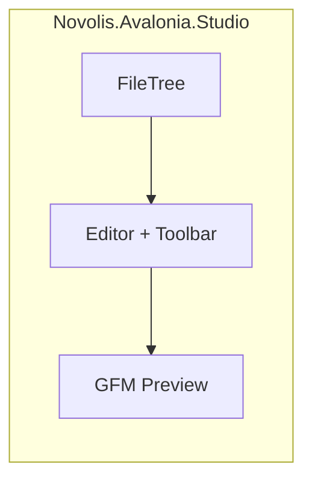

# novolis-apps repository and HandcraftedMarkdown editor

## Context

| Repo | Role today | Future |
|------|------------|--------|
| [novolis-dogfooding](d:\novolis\novolis-dogfooding) | Integration smoke apps + shared `apps/shared/*` helpers; no CI | Studio apps migrate here over time |
| **novolis-apps** (new) | Shipped/user-facing apps; **zero** in-repo shared code | Home for Voice Studio, MeshBench, WireFish, etc. |

Ecosystem gaps relevant to this app ([exploration summary](b598185c-c82d-4928-b6b0-8a0cdc3af1a7)):
- Strong Avalonia studio chrome in `Novolis.Avalonia.Studio` ([StudioWorkspace](d:\novolis\novolis-avalonia\src\Novolis.Avalonia.Studio\StudioWorkspace.cs))
- `Novolis.Markup.Markdown` is **generation + basic parse**, not a full GFM renderer — no markdown editor UI exists
- Your novel files use rich GFM (alerts, HTML comments) — **v1 stays generic**; Calypso-specific toggles (hide NOTES, `booktools-chapter` sort) are a follow-up

## Repository scaffold

Create `novolis-apps` from [novolis-template-dotnet](d:\novolis\novolis-template-dotnet) conventions, adapted for an **apps-only** repo (like dogfooding, not a package repo).

```
novolis-apps/
  LICENSE                    # MIT, Copyright (c) 2026 Novolis-Platform
  README.md
  docs/design.md             # nuget-only, no shared/, migration path from dogfooding
  docs/getting-started.md
  docs/release.md
  Directory.Build.props      # net10.0, IsPackable=false, TreatWarningsAsErrors
  Directory.Packages.props   # central versions; Novolis.* at 2026.1.*
  global.json                # SDK 10.0.100+
  nuget.config               # nuget.org + GitHub Packages only (no novolis-local)
  Novolis.Apps.slnx
  .github/workflows/
    pull-request.yml         # restore + build solution
    merge.yml                # same on main
  src/
    HandcraftedMarkdown/     # first app — fully self-contained
```

**Hard rules** (stricter than dogfooding):
- Every `.csproj` under `src/` is a complete app (`OutputType=WinExe`, `IsPackable=false`)
- **No** `src/shared/`, **no** cross-app `ProjectReference`
- Cross-repo deps: `PackageReference` to `Novolis.*` at `2026.1.*` only ([nuget-only-policy](d:\novolis\novolis-governance\docs\nuget-only-policy.md))
- Run `pwsh -File novolis-governance/scripts/verify-nuget-only.ps1` before claiming done

**Not in platform slnx** — same treatment as `novolis-dogfooding` (consumer repo, not a library producer).

## First app: `HandcraftedMarkdown`

**Purpose:** Open a folder on disk, browse `.md` files in a tree, edit raw markdown, preview rendered GFM in a split view. Optimized for prose manuscripts (your Calypso tree at `D:\repos\books\content\series\the-calypso-cycle` has ~376 markdown files across `books/` and `references/`).

### UI layout (reuse Novolis studio patterns)



- **Chrome:** `StudioChrome.Create()` + `StudioWorkspace(leftRail, center, rightRail)` — same pattern as [NovolisVoiceStudio](d:\novolis\novolis-dogfooding\apps\audio\NovolisVoiceStudio) / MeshBench
- **Left rail:** `TreeView` built from `System.IO` walk (filter `*.md`; skip common junk like `.git`)
- **Center:** toolbar (Open Folder, Save, dirty indicator) + monospace editor
- **Right rail:** scrollable preview panel
- **Hosting:** `Microsoft.Extensions.Hosting` + DI for `IFileSystem` ([MeshBench Program.cs](d:\novolis\novolis-dogfooding\apps\rendering\MeshBench\Program.cs) pattern)

### Dependencies (v1)

| Package | Source | Role |
|---------|--------|------|
| `Avalonia` / `Desktop` / `Fonts.Inter` / `Themes.Fluent` | nuget.org | Desktop shell |
| `Novolis.Avalonia.Studio` | GPR | 3-column studio chrome |
| `Markdig` | nuget.org (MIT) | GFM HTML preview (tables, alerts, fenced code) |
| `Microsoft.Extensions.Hosting` | nuget.org | App host / DI |

**Deferred v1:** `Novolis.Markup.Markdown` (limited parser; preview uses Markdig), `Novolis.Workspaces.*` (MeshBench-grade persistence — overkill for plain file edit), `AvaloniaEdit` (nice editor UX — can add in v1.1 if TextBox feels too bare).

### Core behaviors (v1 MVP)

1. **Open folder** — `OpenFolderPicker` or CLI arg `HandcraftedMarkdown.exe "D:\repos\books\content\series\the-calypso-cycle"`
2. **File tree** — recursive `.md` listing; select file loads content
3. **Editor** — `TextBox` (AcceptsReturn, monospace) tracks dirty state; Ctrl+S saves
4. **Preview** — debounced Markdig pipeline (`UseAdvancedExtensions()` + GFM) → HTML displayed in preview panel
5. **Persistence** — remember last opened root in `%LocalAppData%/Novolis/HandcraftedMarkdown/settings.json` (app-local JSON, not a shared library)
6. **Status line** — path, word count, save state via `StudioFeedback`

### Preview rendering approach

Markdig produces HTML strings. For v1, use a lightweight Avalonia HTML display option:

- **Preferred:** `Avalonia.HtmlRenderer` (MIT) if it restores cleanly on Avalonia 12
- **Fallback:** `WebView` control (platform-dependent) or read-only `ScrollViewer` with basic `TextBlock` strips (last resort)

Validate preview choice during implementation against Avalonia 12 compatibility; document the chosen renderer in `src/HandcraftedMarkdown/README.md`.

### Calypso validation (manual, not v1 features)

After build, smoke-test against your novel root:
- Open `the-calypso-cycle`, navigate `books/calypso/chapters/047-marsh-black.md`
- Confirm editor shows raw content (including `<!-- NOTES` blocks)
- Confirm preview renders `#` headers and `> [!date]` alert blocks reasonably
- Save round-trip does not corrupt encoding (UTF-8)

Calypso-specific features (**v2**, not v1):
- Toggle hide HTML comments in editor/preview
- Chapter sort by `<!-- booktools-chapter: N -->`
- Separate roots for `books/` vs `references/`

## CI and governance

- Add `pull-request.yml` + `merge.yml`: `dotnet restore` + `dotnet build Novolis.Apps.slnx` with `GITHUB_TOKEN` for GPR
- Dogfooding currently has **no CI** — novolis-apps should have CI because it targets shipped apps
- Update [novolis-governance/docs](d:\novolis\novolis-governance\docs) (short addition to repository-policy or a new `apps-repos.md`): clarify dogfooding vs apps split and migration intent
- Optional: register repo in workspace checkout at `d:\novolis\novolis-apps` (clone from GitHub after creation)

## Studio migration path (document, not execute in v1)

When migrating apps from dogfooding:

| Dogfooding app | Target in novolis-apps | Migration note |
|----------------|------------------------|------------------|
| `NovolisVoiceStudio` | `src/NovolisVoiceStudio` | Replace `ProjectReference` to `Novolis.Dogfooding.Voice` with new GPR package or inline in app |
| `MeshBench` | `src/MeshBench` | Drop `Novolis.Dogfooding.*` shared refs |
| `WireFishViewer` | `src/WireFishViewer` | Straight package-only move |

**Blocker to resolve during migration:** [NovolisVoiceStudio.csproj](d:\novolis\novolis-dogfooding\apps\audio\NovolisVoiceStudio\NovolisVoiceStudio.csproj) references `..\..\shared\Novolis.Dogfooding.Voice` — that helper logic must become a published `Novolis.*` package or live inside the app project before migration.

Sequence: (1) ship `novolis-apps` + HandcraftedMarkdown, (2) migrate one studio app as proof, (3) deprecate moved apps in dogfooding README.

## Implementation order

1. Create GitHub repo `Novolis-Platform/novolis-apps` (from template or manual scaffold)
2. Wire repo metadata: MIT LICENSE, docs trio, `nuget.config`, `Directory.Build.props`, `Directory.Packages.props`
3. Add `Novolis.Apps.slnx` with `src/HandcraftedMarkdown`
4. Implement HandcraftedMarkdown (Program → MainWindow → session service → tree/editor/preview)
5. Add CI workflows
6. `verify-nuget-only.ps1`, `dotnet restore`, `dotnet build`
7. Manual dogfood against Calypso path; document in `docs/getting-started.md`

## Key files to mirror

| Source | What to copy/adapt |
|--------|-------------------|
| [novolis-dogfooding/nuget.config](d:\novolis\novolis-dogfooding\nuget.config) | Package sources + mapping |
| [novolis-dogfooding/Directory.Build.props](d:\novolis\novolis-dogfooding\Directory.Build.props) | App repo MSBuild defaults |
| [novolis-dogfooding/apps/rendering/MeshBench](d:\novolis\novolis-dogfooding\apps\rendering\MeshBench) | Avalonia host + studio shell wiring |
| [novolis-template-dotnet/.github/workflows](d:\novolis\novolis-template-dotnet\.github\workflows) | CI workflow skeleton |

