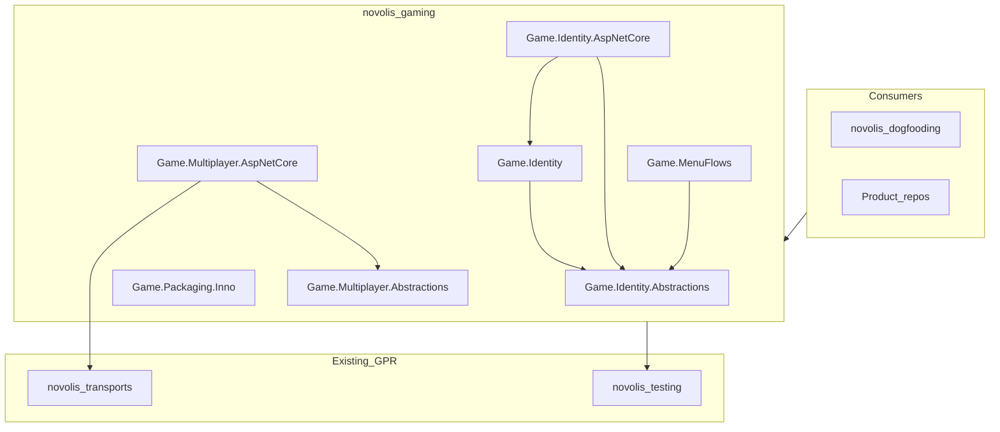

# novolis-gaming repo bootstrap and implementation

## Scope

**Repo:** `novolis-gaming` — game **authoring and shipping** libraries (menu flows, pseudonymous identity, multiplayer glue, Inno packaging helpers). Not the Math/Physics/Simulation/Rendering stack.

**Non-goals:** No `GameKit` facade, no Simulation↔Raylib references inside a single package, no game domain (GalacticSim/SCR), no SignalR in `novolis-transports`.



---

## Phase 0 — GitHub repo + bootstrap commit (do first)

### 0.1 Create org repo from template

On GitHub (or CLI):

- Source: [novolis-template-dotnet](https://github.com/Novolis-Platform/novolis-template-dotnet) — **Use this template**
- New repo: `Novolis-Platform/novolis-gaming`, public, `main` default branch

CLI equivalent (after `gh auth`):

```powershell
gh repo create Novolis-Platform/novolis-gaming --template novolis-template-dotnet --public --description "Game authoring and shipping libraries for Novolis"
```

Per [novolis-physics/AGENTS.md](d:\novolis\novolis-physics\AGENTS.md): `origin` must be `Novolis-Platform/novolis-gaming`, never a personal fork for reserved names.

### 0.2 Clone into workspace

```powershell
cd D:\novolis
git clone https://github.com/Novolis-Platform/novolis-gaming.git
```

Sibling layout: `d:\novolis\novolis-gaming` next to [novolis-governance](d:\novolis\novolis-governance), [novolis-mapping](d:\novolis\novolis-mapping), etc., so `..\novolis-governance\build\*.props` imports resolve.

### 0.3 Template → gaming identity

Update scaffold files (pattern from [novolis-mapping](d:\novolis\novolis-mapping)):

| File | Change |
|------|--------|
| [repository-policy.md](d:\novolis\novolis-governance\docs\repository-policy.md) | Add `novolis-gaming` to mental map (follow-up PR in governance) |
| `Directory.Build.props` | `NovolisGitHubRepository` → `novolis-gaming`; keep governance imports (`Novolis.GitHubPackages.props`, optional `Novolis.LocalPack.props` only if file exists locally — do not add local feed to `nuget.config`) |
| `README.md` | Purpose: authoring/shipping lane; link to `docs/design.md` |
| `docs/design.md` | Authoritative scope, package facet table, dependency firewall (below) |
| `docs/getting-started.md` | GPR restore, build solution, package list |
| `docs/release.md` | GPR publish via merge workflow (same as other libs) |
| `nuget.config` | Copy from [novolis-mapping/nuget.config](d:\novolis\novolis-mapping\nuget.config) — `nuget.org` + GitHub Packages only |
| `build/version.json` | Match [novolis-mapping/build/version.json](d:\novolis\novolis-mapping\build\version.json) (`2026.1` line) |
| Run `pwsh -File ..\novolis-governance\scripts\sync-version-props.ps1 -RepoRoot (Get-Location)` | Generate `build/version.props` |

Ensure template CI remains `workflow_call` to `novolis-workflows` ([template pull-request.yml](d:\novolis\novolis-template-dotnet\.github\workflows\pull-request.yml)).

### 0.4 Multi-package skeleton (compiling, minimal)

Follow [frank-naming-and-structure.md](d:\novolis\novolis-governance\docs\frank-naming-and-structure.md) layout:

```text
novolis-gaming/
  Novolis.Gaming.slnx
  Directory.Build.props
  Directory.Packages.props
  global.json
  nuget.config
  build/
    Novolis.Gaming.Documentation.props   # imports governance Novolis.Documentation.props
    version.json / version.props
  src/
    Directory.Build.props                # imports Documentation + PackageReadme.props
    Novolis.Game.Identity.Abstractions/
    Novolis.Game.Identity/
    Novolis.Game.Identity.AspNetCore/
    Novolis.Game.MenuFlows/
    Novolis.Game.Packaging.Inno/
    Novolis.Game.Multiplayer.Abstractions/
    Novolis.Game.Multiplayer.AspNetCore/
  tests/
    Novolis.Gaming.Unit/                 # TUnit; one folder per facet under test
```

**ProjectReference rules (same repo only):**

- `Identity` → `Identity.Abstractions`
- `Identity.AspNetCore` → `Abstractions` + `Identity`; `FrameworkReference` `Microsoft.AspNetCore.App`
- `MenuFlows` → `Identity.Abstractions` only (no Rendering/Raylib)
- `Packaging.Inno` → no Novolis deps (BCL + optional MSBuild SDK props only)
- `Multiplayer.AspNetCore` → `Multiplayer.Abstractions`; `FrameworkReference` `Microsoft.AspNetCore.App`; **no** `Novolis.Transports.*` in v1 stubs

**Directory.Packages.props** (central versions): `Microsoft.SourceLink.GitHub`, `TUnit`, `Novolis.Testing.TUnit` `2026.1.*`, `Novolis.Testing.TestBases` `2026.1.*`, ASP.NET packages as needed for AspNetCore facets.

Each **packable** project:

- `IsPackable` true, `PackageId` = project name
- Co-located `README.md` (required by [documentation-policy](d:\novolis\novolis-governance\docs\documentation-policy.md) + [packable readme plan](d:\novolis\.cursor\plans\packable_nuget_readmes_548bf171.plan.md))
- One public placeholder type per package (e.g. `PlayerRef`, `GameScreenStack`, `LobbySessionId`, `InnoScriptGenerator`) so `dotnet build` and doc-audit succeed

**Internal dependency:** `Multiplayer.Abstractions` may reference `Identity.Abstractions` for `PlayerRef` in lobby DTOs.

### 0.5 First commit and push

```powershell
cd D:\novolis\novolis-gaming
dotnet restore
dotnet build Novolis.Gaming.slnx
pwsh -File ..\novolis-governance\scripts\verify-nuget-only.ps1
git add -A
git commit -m "chore: bootstrap novolis-gaming from template-dotnet"
git push -u origin main
```

Open PR if branch protection requires it; otherwise direct push to `main` per org policy.

### 0.6 Org housekeeping (same week)

- Add `novolis-gaming` to [configure-package-publishing.ps1](d:\novolis\novolis-governance\scripts\configure-package-publishing.ps1) and [apply-pr-merge-release-workflows.ps1](d:\novolis\novolis-governance\scripts\apply-pr-merge-release-workflows.ps1) repo lists (governance PR)
- Add row to [frank-naming-and-structure.md](d:\novolis\novolis-governance\docs\frank-naming-and-structure.md) repo table
- After first GPR publish: add `novolis-registry/packages/novolis-game-*.json` entries

---

## Phase 1 — Governance boundary doc

New file: [novolis-governance/docs/gaming-layer-policy.md](d:\novolis\novolis-governance\docs\gaming-layer-policy.md) (PR to governance, linked from [library-boundaries.md](d:\novolis\novolis-governance\docs\library-boundaries.md)):

- Defines `novolis-gaming` vs `novolis-install` (platform tool) vs `novolis-templates` (dotnet new) vs `novolis-workflows` (backend orchestration)
- **Allowed:** ASP.NET + SignalR in `Novolis.Game.Multiplayer.AspNetCore` only
- **Forbidden:** PII types in public API; Simulation↔Raylib in one package; game domain models
- **PII split:** platform = opaque refs; apps = Steam/email/GDPR

---

## Phase 2 — Replace stubs with real APIs (facet by facet)

User chose **all facets as compiling stubs first** in bootstrap; Phase 2 fills them in this order:

### 2.1 `Novolis.Game.Identity.Abstractions`

- `readonly record struct PlayerRef(Guid Value)` — opaque, no display name
- `SessionRef`, `DeviceRef`
- `IPlayerDirectory` — resolve ref in-process only
- `IExternalIdentityLinker` — app implements provider linkage; platform sees `ExternalProviderRef` + hash, not raw subject

### 2.2 `Novolis.Game.Identity`

- In-memory `PlayerDirectory`, factory helpers, XML docs on GDPR posture

### 2.3 `Novolis.Game.Identity.AspNetCore`

- `ClaimsPrincipal` → `PlayerRef` extension (custom claim type documented)
- No persistence, no IdentityServer

### 2.4 `Novolis.Game.MenuFlows`

- `IGameScreen`, `GameScreenStack`, transition events
- Optional pause/settings screen base types
- No Raylib/UI framework dependency

### 2.5 `Novolis.Game.Multiplayer.Abstractions`

- `LobbyId`, `LobbyPlayerSlot` with `PlayerRef`
- `ILobbyState`, in-memory test double

### 2.6 `Novolis.Game.Multiplayer.AspNetCore`

- Hub base + DTOs using abstractions
- Reconnect/session token pattern (stubs → full in follow-up PR)

### 2.7 `Novolis.Game.Packaging.Inno`

- MSBuild targets skeleton: `GameVersion`, `PublishDir`, `.iss` template emission
- Document pairing with app publish output (Frank.SimpleInstaller ideas; stays game-scoped, not [novolis-install](d:\novolis\novolis-install))

### 2.8 Tests

- [novolis-mapping/tests pattern](d:\novolis\novolis-mapping\tests\Novolis.Mapping.Unit): TUnit per facet under `tests/Novolis.Gaming.Unit/<Facet>/`
- Identity: round-trip `PlayerRef`, directory does not persist PII
- MenuFlows: push/pop stack
- Multiplayer: in-memory lobby + hub mapping smoke (TestServer if needed)

---

## Phase 3 — Publish and dogfood

1. Merge to `main` → GPR publish `2026.1.*` for all `Novolis.Game.*` packages
2. Registry JSON in [novolis-registry](d:\novolis\novolis-registry)
3. Dogfood in [novolis-dogfooding](d:\novolis\novolis-dogfooding): small app under `apps/gaming/` using MenuFlows + in-memory lobby + fake `PlayerRef` (PackageReference only, no ProjectReference to sibling repos)
4. `verify-nuget-only.ps1` on dogfooding after bump

**Deferred (explicit backlog in `docs/design.md`):**

- `dotnet new` game templates (coordinate with [novolis-templates](d:\novolis\novolis-templates) or `Novolis.Game.Templates` facet later)
- Frank.SimpleInstaller port beyond Inno MSBuild skeleton
- Full SignalR production hardening (host migration, auth integration samples)

---

## Validation checklist (each phase)

| Check | Command / criterion |
|-------|---------------------|
| NuGet-only | `pwsh -File novolis-governance/scripts/verify-nuget-only.ps1` exit 0 |
| Build | `dotnet build Novolis.Gaming.slnx` |
| Docs | `doc-audit.ps1` (when CI enabled) — every packable project has README |
| Restore | `nuget.config` has only nuget.org + GPR; no local feed |
| Boundaries | No `Novolis.Simulation` / `Novolis.Raylib` package refs in gaming repo |

---

## Key dependency firewall (encode in `docs/design.md`)

| Package | May reference |
|---------|----------------|
| `Identity.*` | BCL; Abstractions chain |
| `MenuFlows` | `Identity.Abstractions` |
| `Multiplayer.*` | `Identity.Abstractions`; AspNetCore facet → ASP.NET only |
| `Packaging.Inno` | BCL / MSBuild only |
| **Never** | `Novolis.Simulation`, `Novolis.Raylib`, `Novolis.Rendering` |

Apps (dogfooding, SCR, GalacticSim) compose gaming packages **with** stack/render repos at the product layer.

